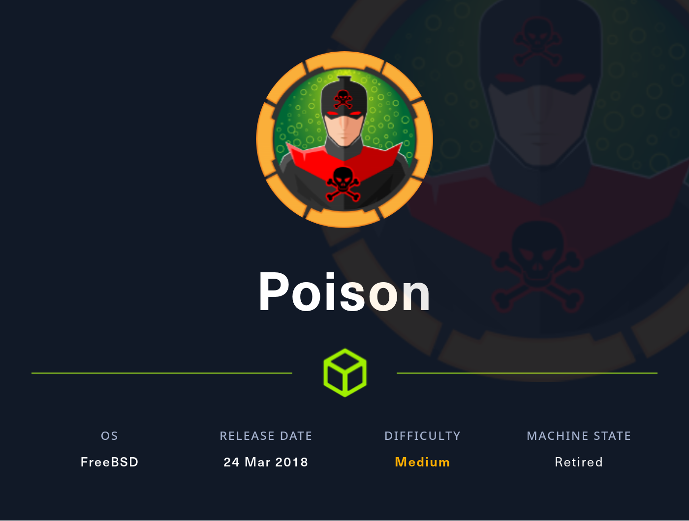
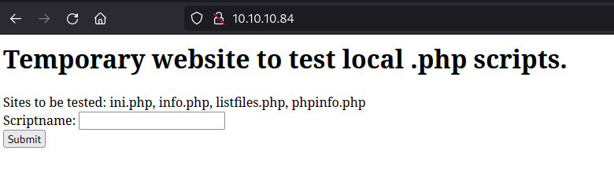
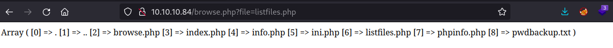
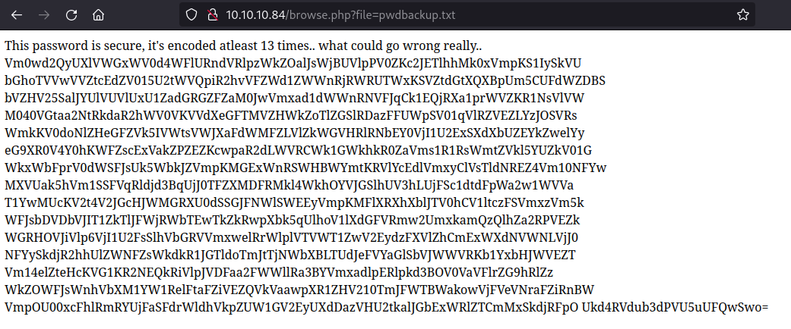
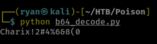
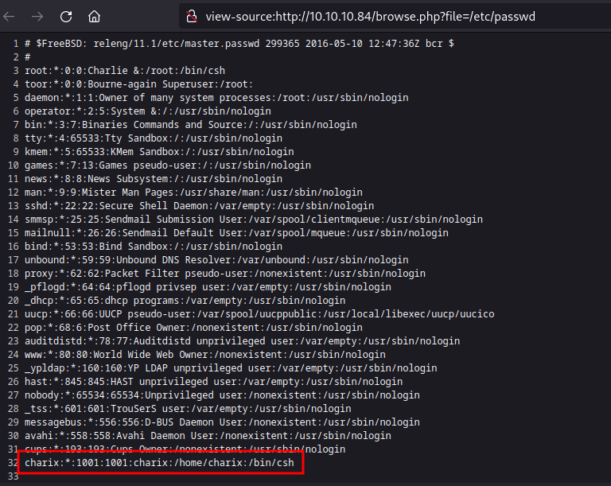
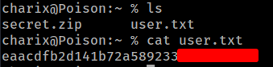
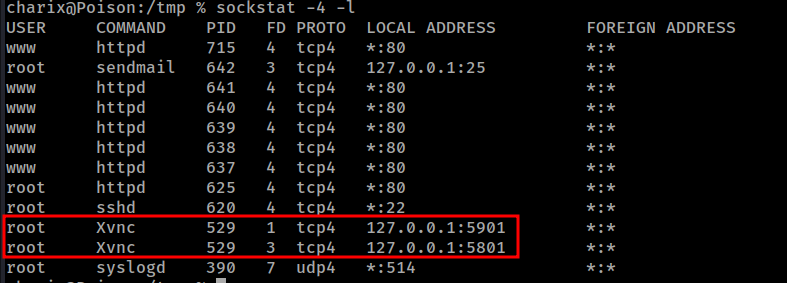
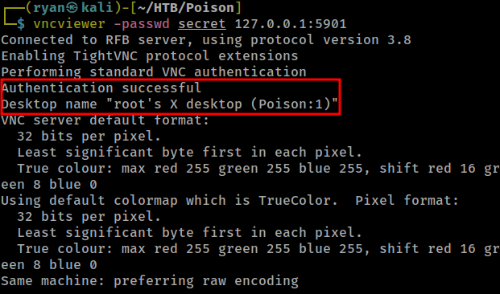
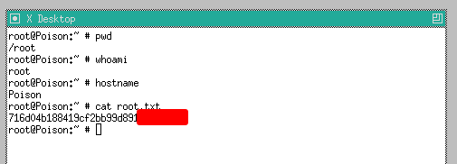

# HTB - Poison

#### Ip: 10.10.10.84
#### Name: Poison
#### Rating: Medium

----------------------------------------------------------------------



### Enumeration

Lets kick things off by scanning all TCP ports with Nmap. Here I will also use the `--min-rate 10000` flag to speed the scan up.

```text
┌──(ryan㉿kali)-[~/HTB/Poison]
└─$ sudo nmap -p-  --min-rate 10000 10.10.10.84
Starting Nmap 7.93 ( https://nmap.org ) at 2023-08-01 13:59 CDT
Warning: 10.10.10.84 giving up on port because retransmission cap hit (10).
Nmap scan report for 10.10.10.84
Host is up (0.063s latency).
Not shown: 52134 filtered tcp ports (no-response), 13399 closed tcp ports (reset)
PORT   STATE SERVICE
22/tcp open  ssh
80/tcp open  http

Nmap done: 1 IP address (1 host up) scanned in 66.48 seconds
```

We can enumerate further by scanning the open ports, but this time use the `-sC` and `-sV` flags to use basic Nmap scripts and to enumerate versions too.

```text
┌──(ryan㉿kali)-[~/HTB/Poison]
└─$ sudo nmap -sC -sV -T4 10.10.10.84 -p 22,80
Starting Nmap 7.93 ( https://nmap.org ) at 2023-08-01 14:01 CDT
Nmap scan report for 10.10.10.84
Host is up (0.065s latency).

PORT   STATE SERVICE VERSION
22/tcp open  ssh     OpenSSH 7.2 (FreeBSD 20161230; protocol 2.0)
| ssh-hostkey: 
|   2048 e33b7d3c8f4b8cf9cd7fd23ace2dffbb (RSA)
|   256 4ce8c602bdfc83ffc98001547d228172 (ECDSA)
|_  256 0b8fd57185901385618beb34135f943b (ED25519)
80/tcp open  http    Apache httpd 2.4.29 ((FreeBSD) PHP/5.6.32)
|_http-server-header: Apache/2.4.29 (FreeBSD) PHP/5.6.32
|_http-title: Site doesn't have a title (text/html; charset=UTF-8).
Service Info: OS: FreeBSD; CPE: cpe:/o:freebsd:freebsd

Service detection performed. Please report any incorrect results at https://nmap.org/submit/ .
Nmap done: 1 IP address (1 host up) scanned in 9.30 seconds
```

Cool, looks like this is a FreeBSD box.

Navigating to the site we find a place to search for files on the server. 



And even more interesting, it appears we can search files just by entering their name (browse.php?file=listfiles.php)



Hm, pwdbackup.txt definitely looks interesting, lets check that out:



Looks like a password that has been base64 encoded 13 times (for some reason?). 

Its slightly overkill, but I'm working on getting better at Python, so I quickly scripted out something to help decode this for us:

```python
import base64

b64 = "Vm0wd2QyUXlVWGxWV0d4WFlURndVRlpzWkZOalJsWjBUVlpPV0ZKc2JETlhhMk0xVmpKS1IySkVUbGhoTVVwVVZtcEdZV015U2tWVQpiR2hvVFZWd1ZWWnRjRWRUTWxKSVZtdGtXQXBpUm5CUFdWZDBSbVZHV25SalJYUlVUVlUxU1ZadGRGZFZaM0JwVmxad1dWWnRNVFJqCk1EQjRXa1prWVZKR1NsVlVWM040VGtaa2NtRkdaR2hWV0VKVVdXeGFTMVZHWkZoTlZGSlRDazFFUWpSV01qVlRZVEZLYzJOSVRsWmkKV0doNlZHeGFZVk5IVWtsVWJXaFdWMFZLVlZkWGVHRlRNbEY0VjI1U2ExSXdXbUZEYkZwelYyeG9XR0V4Y0hKWFZscExVakZPZEZKcwpaR2dLWVRCWk1GWkhkR0ZaVms1R1RsWmtZVkl5YUZkV01GWkxWbFprV0dWSFJsUk5WbkJZVmpKMGExWnRSWHBWYmtKRVlYcEdlVmxyClVsTldNREZ4Vm10NFYwMXVUak5hVm1SSFVqRldjd3BqUjJ0TFZXMDFRMkl4WkhOYVJGSlhUV3hLUjFSc1dtdFpWa2w1WVVaT1YwMUcKV2t4V2JGcHJWMGRXU0dSSGJFNWlSWEEyVmpKMFlXRXhXblJTV0hCV1ltczFSVmxzVm5kWFJsbDVDbVJIT1ZkTlJFWjRWbTEwTkZkRwpXbk5qUlhoV1lXdGFVRmw2UmxkamQzQlhZa2RPVEZkWGRHOVJiVlp6VjI1U2FsSlhVbGRVVmxwelRrWlplVTVWT1ZwV2EydzFXVlZhCmExWXdNVWNLVjJ0NFYySkdjR2hhUlZWNFZsWkdkR1JGTldoTmJtTjNWbXBLTUdJeFVYaGlSbVJWWVRKb1YxbHJWVEZTVm14elZteHcKVG1KR2NEQkRiVlpJVDFaa2FWWllRa3BYVmxadlpERlpkd3BOV0VaVFlrZG9hRlZzWkZOWFJsWnhVbXM1YW1RelFtaFZiVEZQVkVaawpXR1ZHV210TmJFWTBWakowVjFVeVNraFZiRnBWVmpOU00xcFhlRmRYUjFaSFdrWldhVkpZUW1GV2EyUXdDazVHU2tkalJGbExWRlZTCmMxSkdjRFpOUkd4RVdub3dPVU5uUFQwSwo="

for i in range(13):
    b64 = base64.b64decode(b64)

decoded = b64.decode('UTF-8')

print(decoded)
```

We can execute the script and decode the password:



That's all well and good, but we still don't have a username. Looking at the way we can search files, this is basically begging for local file inclusion. Lets see if we can grab anything else sensitive:



Nice, we can easily read the `/etc/passwd` file, and found a username! 

We can now SSH into the machine using these credentials:

```text
┌──(ryan㉿kali)-[~/HTB/Poison]
└─$ ssh charix@10.10.10.84 

<SNIP>

charix@Poison:~ % whoami
charix
charix@Poison:~ % hostname
Poison
```

We can now grab the user.txt flag:



### Privilege Escalation

Also of interest in charix's `home` directory was a secret.zip file. I was unable to unzip it on the target so I used SCP to copy it back over to my attacking machine.

```text
┌──(ryan㉿kali)-[~/HTB/Poison]
└─$ scp -P 22 charix@10.10.10.84:/home/charix/secret.zip .   
(charix@10.10.10.84) Password for charix@Poison:
secret.zip                                                                                 100%  166     1.2KB/s   00:00 
```

Cool, now that the file is back on my machine I can extract it using the same password we used for SSH:

```text
┌──(ryan㉿kali)-[~/HTB/Poison]
└─$ unzip secret.zip 
Archive:  secret.zip
[secret.zip] secret password: 
 extracting: secret
```

Taking a look at the secret file we find `½¨[|Õ–z!`. Not sure what that is really, so lets go back to the target and keep enumerating.

After not finding much on the box for a while, I decided to see if there were any other connections.



Interesting! Looks like VNC is running with root privileges. To access this we'll need to use a bit of tunneling:

```text
┌──(ryan㉿kali)-[~/HTB/Poison]
└─$ ssh -L 5901:127.0.0.1:5901 charix@10.10.10.84
```

Once the new connection is made we can open a new terminal window on our attacking machine and start vncviewer with the secret file we found earlier:



We can now access the root.txt flag as the root user.



Thanks for following along!

-Ryan

--------------------------------------------------------------------------
