# HackTheBox
------------------------------------
### IP: 10.129.89.250
### Name: Popcorn
### Difficulty: Medium
--------------------------------------------


I'll begin enumerating this box by scanning all TCP ports with Nmap and use the `--min-rate 10000` flag to speed things up. I'll also use the `-sC` and `-sV` to use basic Nmap scripts and to enumerate versions:

```
┌──(ryan㉿kali)-[~/HTB/Popcorn]
└─$ sudo nmap -p- --min-rate 10000 -sC -sV 10.129.89.250
[sudo] password for ryan: 
Starting Nmap 7.93 ( https://nmap.org ) at 2024-06-27 08:44 CDT
Nmap scan report for 10.129.89.250
Host is up (0.13s latency).
Not shown: 65533 closed tcp ports (reset)
PORT   STATE SERVICE VERSION
22/tcp open  ssh     OpenSSH 5.1p1 Debian 6ubuntu2 (Ubuntu Linux; protocol 2.0)
| ssh-hostkey: 
|   1024 3ec81b15211550ec6e63bcc56b807b38 (DSA)
|_  2048 aa1f7921b842f48a38bdb805ef1a074d (RSA)
80/tcp open  http    Apache httpd 2.2.12
|_http-title: Did not follow redirect to http://popcorn.htb/
|_http-server-header: Apache/2.2.12 (Ubuntu)
Service Info: Host: 127.0.0.1; OS: Linux; CPE: cpe:/o:linux:linux_kernel

Service detection performed. Please report any incorrect results at https://nmap.org/submit/ .
Nmap done: 1 IP address (1 host up) scanned in 15.80 seconds
```

Looks like just SSH and HTTP are open for TCP here. 

We can also see that port 80 is trying to redirect to popcorn.htb so lets add that to `/etc/hosts`.

Navigating to the webpage we find a generic "It Works" message:

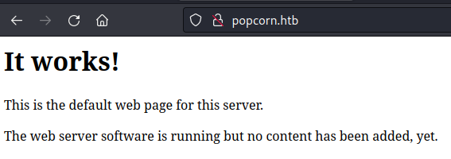

Kicking off some directory fuzzing we find several endpoints off of `/torrent`

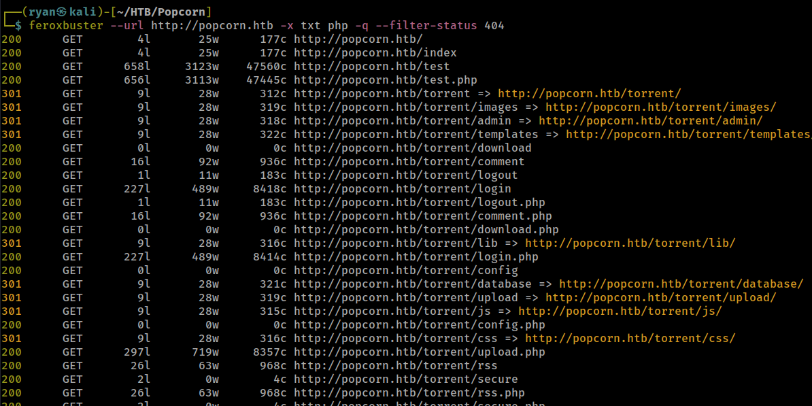

Looking at the `/torrent` page we find a torrent hosting site:

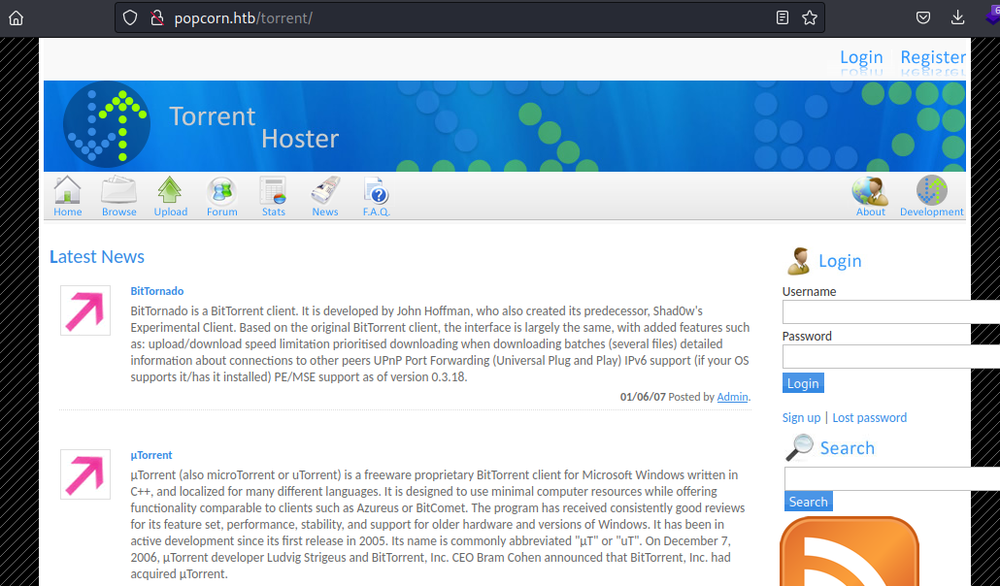

Clicking around I see I'll need to login to do much of anything. After a few unsuccessful login attempts using generic credentials, I registered my own account:

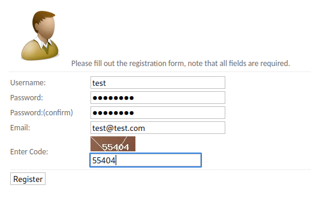

I can now login with the credentials `test:password`

Looking at the upload feature, I try loading a simple PHP web shell, but get an error:

```
 This is not a valid torrent file
```

And if I simply change the file name from cmd.php to cmd.torrent I receive the same message.

Looking around the site I see that a torrent file of kali linux has been uploaded. I can download my own kali torrent file and upload it to the site at http://popcorn.htb/torrent/torrents.php?mode=upload

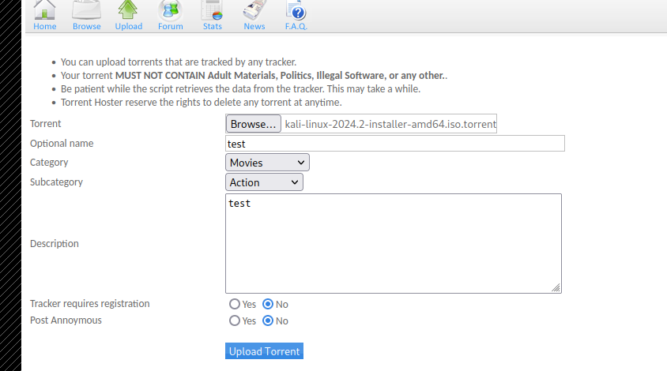

Looking at my uploaded torrent I can see we have the option to edit it and upload a screen shot for it.

We also notice there is some filtering in place, so lets rename our cmd.php script cmd.php.png and capture the upload in Burp.

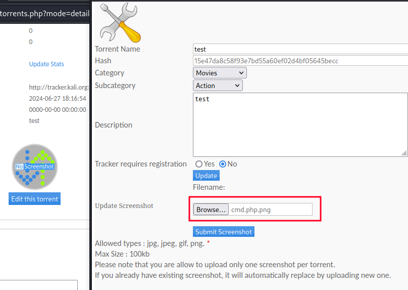

Once sent we get confirmation our "image" has been uploaded:

```
Upload: cmd.php.png
Type: image/png
Size: 0.0302734375 Kb
Upload Completed.
Please refresh to see the new screenshot.
```

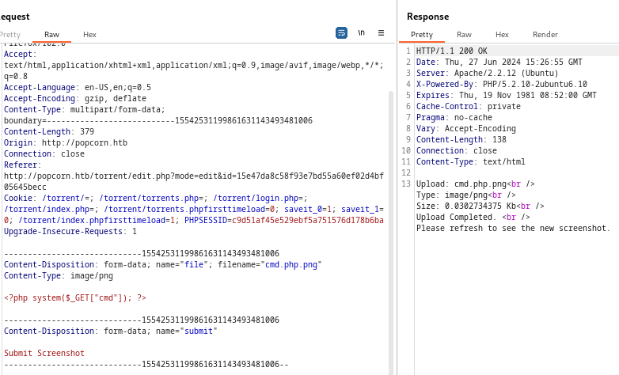

Based on our directory fuzzing we know there is an `/upload` directory, so lets look for our file there.

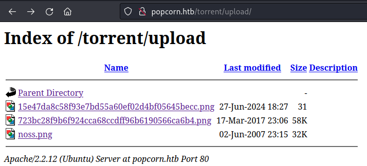

Nice, the upload worked. Lets rename the file from cmd.php.png to cmd.php in Burp and try sending it again. 

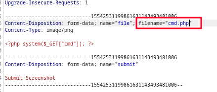

Cool, that worked.

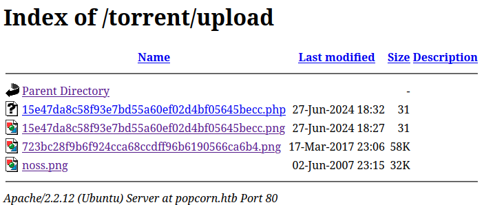

We can now confirm we have code execution:

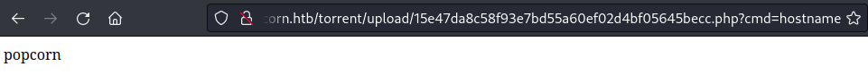

Lets grab a Python reverse shell one liner from revshells.com, URL encode it, and issue it as a cmd to catch a shell back as www-data:

```
┌──(ryan㉿kali)-[~/HTB/Popcorn]
└─$ nc -lnvp 443
listening on [any] 443 ...
connect to [10.10.14.114] from (UNKNOWN) [10.129.90.155] 36817
www-data@popcorn:/var/www/torrent/upload$ whoami
whoami
www-data
www-data@popcorn:/var/www/torrent/upload$ hostname
hostname
popcorn
```

We can now grab the user.txt flag:

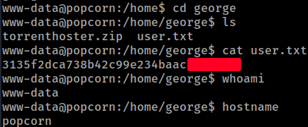

### Privilege Escalation

Loading LinPEAS to help enumerate, we see the target is likely vulnerable to the kernel exploit Dirty Cow.

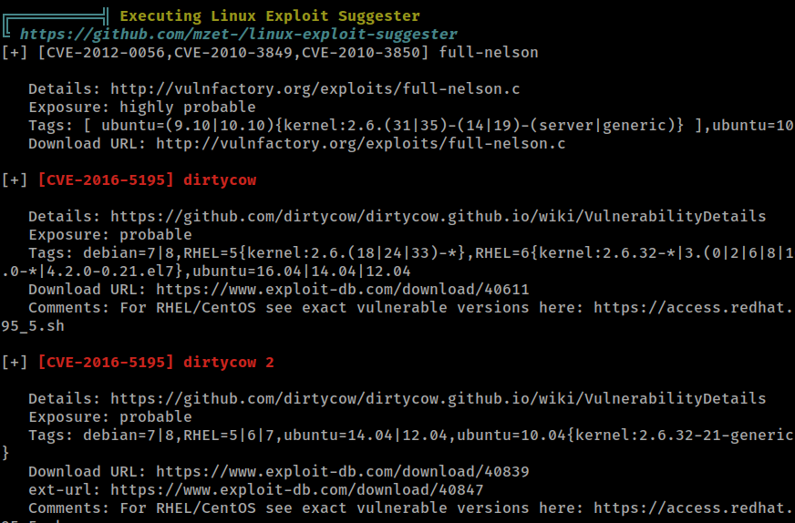

Lets transfer that over, compile it and execute it.

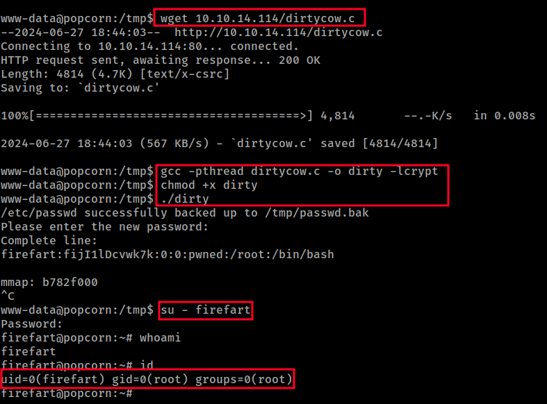

Cool that worked. We can now grab the final flag:

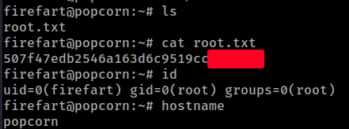

Thanks for following along!

-Ryan

-------------------------------------------------------
